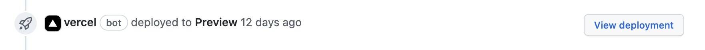

# How to contribute

We encourage contributions from the community.

Please read this guide before submitting a Pull Request.

Members of the community are encouraged to **create a [GitHub issue](https://github.com/temporalio/documentation/issues) for any changes beyond typos and small fixes prior to creating a pull request.**

We review GitHub issues on a regular schedule.

If you do create a pull request (PR), please follow our [style guidance](/STYLE.md).

To ensure that each change is relevant and properly peer reviewed, please adhere to best practices for open-source contributions.
This means that if you are outside the Temporal organization, you must fork the repository and create PRs from branches on your own fork.
The README in GitHub's [first-contributions repo](https://github.com/firstcontributions/first-contributions) provides an example.

## How to preview your changes locally

The Temporal documentation site uses [Docusaurus 2](https://v2.docusaurus.io/), which is a static website generator.

You can make changes locally without previewing them in the browser.
However, if you want to build the site and preview changes in the browser, do the following:

- Install version 16 or later of [Node.js](https://nodejs.org/en/download/).
  (On a Mac, use the command `brew install node@16`.)
- Download the repository and install dependencies with [`yarn`](https://classic.yarnpkg.com/en/docs/install#mac-stable):

  ```bash
  git clone https://github.com/temporalio/documentation.git
  cd documentation/
  yarn
  ```

- Now you can build and view the site locally:

  ```bash
  yarn start
  ```

  This command starts a local development server and opens a browser window to [localhost:3000](http://localhost:3000/).

### How to use snipsync

In the documentation files, [snipsync](https://github.com/temporalio/snipsync) snippets appear like this:

```
<!--SNIPSTART typescript-hello-client -->
<!--SNIPEND-->
```

To preview snipsync snippets, run `yarn snipsync`, which inserts the snippet contents (in this case, from [`samples-typescript`](https://github.com/temporalio/samples-typescript/blob/75bdcd613bd24f8f357cb96d1b83051353c5685a/hello-world/src/client.ts#L1)) between the `SNIPSTART` and `SNIPEND` tags.

Run `yarn snipsync --clear` to remove the snippets.

We are now committing the snippets into the docs source files.

See the [full build command](#full-build-command) section for details on how to fully assemble the docs, format them, and check for build issues.

## How to use dPrint formatter

Before submitting a PR, use dPrint to reformat.

To install:

```
yarn install
```

To reformat:

```
yarn format
```

## How to use the Assembly Workflow

If you inspect the `/docs` directory, you might notice that many of the files contain the following comment:

```
<!-- THIS FILE IS GENERATED. DO NOT EDIT THIS FILE DIRECTLY -->
```

These generated files are actually put together from many individual files, which we call Information Nodes.
Most of these Information Nodes now live in the `docs-src` directory.
The reasons for modularizing our information are many, but one of them is that it provides a fun use case for combining our pre-build processes, usually a set of independent scripts, into a Temporal Workflow.

The `assembly` directory is dedicated to the documentation site's Assembly Workflow.
In the directory are the defined Workflows, Activities, Worker, guide configurations, and an application configuration file.

Each JSON configuration file in [assembly/guide-configs](assembly/guide-configs) represents a user-facing narrative that pieces together the Information Nodes.
The Docs full assembly Workflow uses these configuration files to generate the guides, such as [Concepts](https://docs.temporal.io/temporal/#) and [Application development](https://docs.temporal.io/application-development-guide).

The Assembly Workflow can be run using a local Cluster (such as [Temporalite](https://docs.temporal.io/application-development/foundations#temporalite)) or [Temporal Cloud](https://docs.temporal.io/cloud/).

If you are running this for the first time, you need to run `yarn` directly in the `assembly` directory.

**TIP**: Make your changes in the **source files** that are named in the configuration file.
For example, if you found a typo in the Concept section _What is a Task?_, open [docs/concepts/what-is-a-task.md](docs/concepts/what-is-a-task.md) and make the edit directly there.

### Local Cluster

To run the Assembly Workflow using a local Cluster, such as Temporalite, do the following:

1. Make sure you are in the `assembly` directory and run the Worker:

```
./worker.js
```

2. In another terminal, from the root of the repo, run the following command:

```
yarn assemble
```

### Temporal Cloud

These steps assume you have a Temporal Cloud Account and have already provisioned your Namespace, including a CA certificate.

To run the Assembly Workflow using Temporal Cloud, do the following:

1. Create the directory `assembly/secure` and populate it with the following files:

- `docs-assembly.pem`: Paste and save the full CA certificate text.
- `docs-assembly.key`: Paste and save the full secret that was generated with the certificate.
- `cloud-connection.json`: Paste the following JSON, replacing the values with your own.

```
{
  "address": "your-cloud-address",
  "unique_id": "your-unique-custom-id",
  "namespace": "your-namespace"
}
```

2. Make sure you are in the `assembly` directory and run the Worker:

```
./worker.js --cloud
```

3. In another terminal, from the root of the repo, run the following command:

```
yarn assemble --cloud
```

## How to use the full build command

Run `yarn gen` or `yarn gen --cloud`.

This command runs snipsync, runs the Assembly Workflow, runs dPrint formatting, and then builds the site.

Any build issues are logged to your console.
Fix all build issues before submitting a PR.

## When you submit a Pull Request

A deployment preview is available for each build in the Pull Request.



When we merge your PR, a new build automatically occurs and your changes publish to [https://docs.temporal.io](https://docs.temporal.io).
