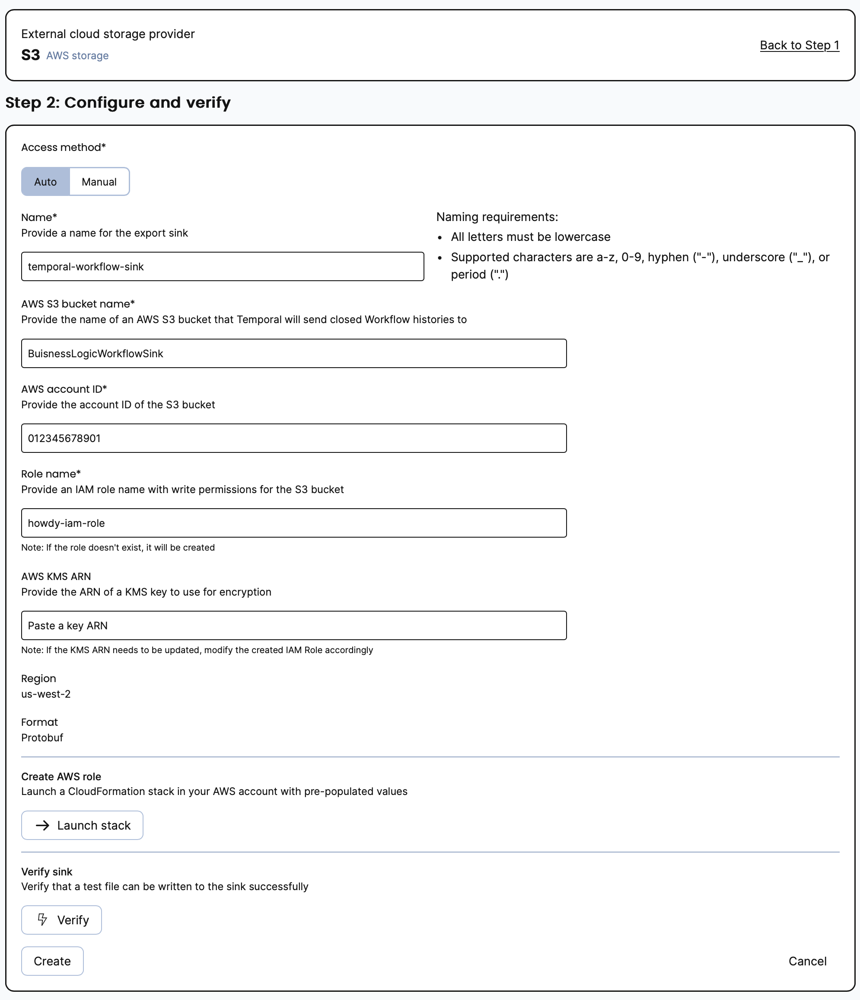

**How to configure Workflow History Export?**

You can use either use the [Temporal Cloud UI](#using-temporal-cloud-ui) or [tcld](#using-tcld) to configure the Workflow History Export.

### Using Temporal Cloud UI

The following steps guides you through setting up Workflow History Export using the Temporal Cloud UI.



The Temporal Cloud UI provides two ways for configuring Workflow History Export:

- [Automated setup](#automated-setup) (recommended): The Cloud UI launches the AWS CloudFormation Console to create a stack, with write permission to the S3 bucket.
- [Manual setup](#manual-setup): The Cloud UI provides an CloudFormation template for user’s to use to manually configure an CloudFormation stack.

#### Automated setup

The automated setup creates an CloudFormation stack with write permission to the S3 bucket.
[Verify the export setup](/cloud/how-to-verify-export) before saving the configuration.

1. Open the Temporal Cloud UI and navigate to the Namespace you want to configure.
2. Select **Configure** from the **Export** card.
3. Provide the following information to configure the export sink and then select **Create and launch stack**:
   1. Name: A name for the export sink.
   2. AWS S3 Bucket Name: the name of an the configured AWS S3 bucket to send Closed Workflow Histories to.
   3. AWS Account ID: The AWS account ID.
   4. Role Name: The name of the AWS IAM role to use for the CloudFormation stack that has write permission to the S3 bucket.
   5. KMS ARN: (optional) The ARN of the AWS KMS key to use for encryption of the exported Workflow History.
4. You will be taken to the CloudFormation Console to create the stack with pre-populated information.
   1. Review the information and then select **Create stack**.

#### Manual setup

The manual setup provides an CloudFormation template to manually configure an CloudFormation stack.

1. Open the Temporal Cloud UI and navigate to the Namespace you want to configure.
2. Select **Configure** from the **Export** card.
3. Select **Manual** from **Access method**.
   1. Enter the Template URL into your web browser to download your copy of the CloudFormation template.
   2. Configure the CloudFormation template for your export sink.
   3. Follow the steps in the [AWS documentation](https://docs.aws.amazon.com/AWSCloudFormation/latest/UserGuide/cfn-using-console-create-stack-template.html) by uploading the template to the CloudFormation console.

### Using tcld

Run the `tcld namespace export s3 create` command and provide the following information.

- `--namespace` : The Namespace to configure export for.
- `--sink-name`: The name of the export sink.
- `--role-arn`: The ARN of the AWS IAM role to use for the CloudFormation stack that has write permission to the S3 bucket.
- `--s3-bucket-name`: The name of the AWS S3 bucket.

For example:

```command
tcld namespace export s3 create --namespace "your-namespace.your-account" --sink-name "your-sink-name" --role-arn "arn:aws:iam::123456789012:role/test-sink" --s3-bucket-name "your-aws-s3-bucket-name”
```

Retrieve the status of this command by running the `tcld namespace export s3 get` following command.

For example:

```command
tcld namespace export s3 get --namespace "your-namespace.your-account" --sink-name "your-sink-name"
```

The following is an example of the output:

```json
{
  "name": "your-sink-name",
  "resourceVersion": "a6442895-1c07-4da4-aaca-58d57d338345",
  "state": "Active",
  "spec": {
    "name": "your-sink-name",
    "enabled": true,
    "destinationType": "S3",
    "s3Sink": {
      "roleName": "your-export-test",
      "bucketName": "your-export-test",
      "region": "us-east-1",
      "kmsArn": "",
      "awsAccountId": "123456789012"
    }
  },
  "health": "Ok",
  "errorMessage": "",
  "latestDataExportTime": "0001-01-01T00:00:00Z",
  "lastHealthCheckTime": "2023-08-14T21:30:02Z"
}
```
