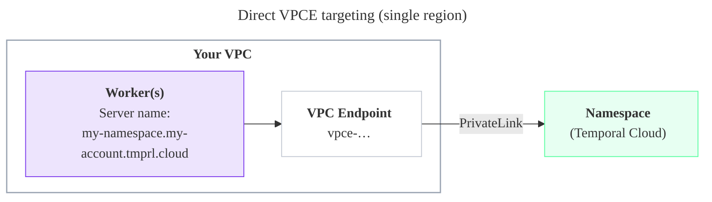
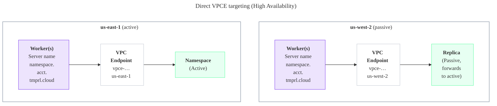

import { ToolTipTerm, DiscoverableDisclosure, CaptionedImage, JsonTable } from '@site/src/components';

<style>{`
  .docusaurus-mermaid-container .edgeLabel,
  .docusaurus-mermaid-container .edgeLabel p,
  .docusaurus-mermaid-container .edgeLabel rect,
  .docusaurus-mermaid-container .edgeLabel .labelBkg {
    background-color: var(--ifm-background-color) !important;
    fill: var(--ifm-background-color) !important;
  }
`}</style>

[AWS PrivateLink](https://aws.amazon.com/privatelink/) allows you to open a path to Temporal without opening a public egress.
It establishes a private connection between your Amazon Virtual Private Cloud (VPC) and Temporal Cloud.
This one-way connection means Temporal cannot establish a connection back to your service.
This is useful if normally you block traffic egress as part of your security protocols.
If you use a private environment that does not allow external connectivity, you will remain isolated.

After creating the PrivateLink endpoint, configure your clients to use it through either [private DNS](#configuring-private-dns-for-aws-privatelink) or [direct VPCE targeting](#direct-vpce). Direct VPCE targeting is simplest for single-region Namespaces, but also works for High Availability Namespaces with [more careful setup](#direct-vpce).

## Requirements

* Your AWS PrivateLink (PL) endpoint must be in the same region as your Temporal Cloud Namespace or one of its [High Availability](/cloud/high-availability) replicas.
  See [cross-region PrivateLink connectivity](#cross-region-privatelink) to access the Namespace from a different region.
* Your Private DNS must be configured to direct Worker / Client traffic to your VPC Endpoint, as described below.
* If the Worker / Client does not use the Namespace Endpoint as the connection string in its code, it may need to set the `server_name` config to the Namespace Endpoint string, as described below.

### Cross-region PrivateLink Connectivity {#cross-region-privatelink}

Temporal Cloud does **not** support [cross-region connectivity for AWS PrivateLink](https://aws.amazon.com/blogs/networking-and-content-delivery/introducing-cross-region-connectivity-for-aws-privatelink/) out of the box. However, if you need to reach Temporal Cloud privately from a different region than your Namespace, you can route traffic to your VPC Endpoint in the Namespace's region using [AWS's native cross-region networking features]((https://docs.aws.amazon.com/whitepapers/latest/building-scalable-secure-multi-vpc-network-infrastructure/centralized-access-to-vpc-private-endpoints.html#cross-region-endpoint-access)). 


When using High Availability on Temporal Cloud, it's best practice to have two VPC Endpoints, one in each of the Namespace's regions, to ensure at least one VPC Endpoint is accessible during a regional outage.

## Creating an AWS PrivateLink connection

Set up PrivateLink connectivity with Temporal Cloud with these steps:

1. Open the AWS console with the region you want to use to establish the PrivateLink.
2. Search for "VPC" in _Services_ and select the option.

   
3. Select _Virtual private cloud_ > _Endpoints_ from the left menu bar.
4. Click the _Create endpoint_ button to the right of the _Actions_ pulldown menu.
5. Under _Type_ category, select _Endpoint services that use NLBs and GWLBs_.
   This option lets you find services shared with you by service name.
6. Under _Service settings_, fill in the _Service name_ with the PrivateLink Service Name for the region you’re trying to connect from:

:::tip

PrivateLink endpoint services are regional.
Individual Namespaces do not use separate services.

:::

<JsonTable filename="/json/privatelink_services_aws.json" />

7. Confirm your service by clicking on the _Verify service_ button. AWS should respond "Service name verified."

   
8. Select the VPC and subnets to peer with the Temporal Cloud service endpoint.
9. Select the security group that will control traffic sources for this VPC endpoint.
   The security group must accept TCP ingress traffic to port 7233 for gRPC communication with Temporal Cloud.
10. Click the _Create endpoint_ button at the bottom of the screen.
    If successful, AWS reports "Successfully created VPC endpoint." and lists the new endpoint.
    The new endpoint appears in the Endpoints list, along with its ID.

    
11. Click on the VPC endpoint ID in the Endpoints list to check its status.
    Wait for the status to be “Available”.
    This can take up to 10 minutes.
12. Once the status is "Available", the AWS PrivateLink is ready for use.

    

The next step is to [configure private DNS](#configuring-private-dns-for-aws-privatelink) so your clients can use the PrivateLink connection. For single-region Namespaces that don't need per-Namespace DNS records, you can use [direct VPCE targeting](#direct-vpce) instead.

## Configuring Private DNS for AWS PrivateLink

### Why configure private DNS?

When you connect to Temporal Cloud through AWS PrivateLink you normally must:

1. **Point your SDKs/Workers at the PrivateLink DNS name** for the VPC Endpoint (e.g., `vpce-0123456789abcdef-abc.us-east-1.vpce.amazonaws.com`), **and**
2. **Override the Server Name Indicator (SNI)** so that the TLS handshake still presents the public Temporal Cloud hostname (e.g., `my-namespace.my-account.tmprl.cloud`).

By creating a Route 53 **private hosted zone (PHZ)** that maps the public Temporal Cloud hostname (or region hostname) to your VPC Endpoint, you can:

- Keep using the standard Temporal Cloud hostnames in code and configuration.
- Eliminate the need to set a custom SNI override.
- Make future Endpoint rotations transparent—only the PHZ record changes.

This approach is **optional**; Temporal Cloud works without it. It simply streamlines configuration and operations. If you cannot use private DNS, refer to [our guide for updating the server and TLS settings on your clients](/cloud/connectivity#update-dns-or-clients-to-use-private-connectivity).

### Prerequisites

| Requirement                                           | Notes                                                                                                                              |
| ----------------------------------------------------- | ---------------------------------------------------------------------------------------------------------------------------------- |
| AWS VPC with DNS resolution and DNS hostnames enabled | _VPC console → Edit DNS settings → enable both checkboxes._                                                                        |
| Interface VPC Endpoint for Temporal Cloud             | Subnets must be associated with the VPC and Security Group must allow TCP ingress traffic to port 7233 from the appropriate hosts. |
| Route 53 available in your AWS account                | You need permission to create Private Hosted Zones and records.                                                                    |
| Namespace details                                     | Needed to choose the correct override domain pattern below.                                                                        |

### Choose the override domain and endpoint

| Endpoint type      | PHZ domain format                  | Example                              | Use when |
| ------------------ | ---------------------------------- | ------------------------------------ | -------- |
| Namespace endpoint | `<namespace-id>.tmprl.cloud`       | `payments.abcde.tmprl.cloud`         | **Single-region Namespaces.** Simplest pattern — one record per Namespace. For [High Availability](/cloud/high-availability/ha-connectivity) Namespaces, overriding the Namespace Endpoint is nuanced — see [Connectivity for High Availability](/cloud/high-availability/ha-connectivity). |
| Regional endpoint  | `<region>.<cloud>.api.temporal.io` | `ap-northeast-2.aws.api.temporal.io` | You want to pin a client to a specific Temporal Cloud region. |

:::caution HA Namespaces need a more nuanced PHZ setup

For Namespaces with [High Availability](/cloud/high-availability/ha-connectivity), the PHZ pattern to use depends on how you want Workers to reach the active region. Overriding the Namespace Endpoint directly is read out of the PHZ before public DNS, so the regional CNAME that Temporal Cloud rewrites on failover isn't followed — which is usually not what you want, but can be the right choice in some topologies (for example, multi-cloud HA with one region per cloud, where Workers on each cloud should always reach their local region). Because the trade-offs depend on your setup, see [Connectivity for High Availability](/cloud/high-availability/ha-connectivity) before choosing a pattern.

:::

The step-by-step below walks through the **Namespace endpoint** pattern, which is the simpler single-region case. For HA, follow the [HA Connectivity guide](/cloud/high-availability/ha-connectivity) instead, which uses the same Route 53 mechanics but on the regional records.

### Step-by-step instructions

:::warning Order matters

A Route 53 private hosted zone with no records causes DNS resolution to fail (NXDOMAIN) inside any associated VPC. If you create an empty PHZ for `<account>.tmprl.cloud` and associate it with a VPC where Workers are running, **all Worker traffic to Temporal Cloud in that VPC stops** until you add the CNAME record. Follow the steps below in order to avoid this.

:::

#### 1. Collect your PrivateLink endpoint DNS name

```bash
aws ec2 describe-vpc-endpoints \
  --vpc-endpoint-ids $VPC_ENDPOINT_ID \
  --query "VpcEndpoints[0].DnsEntries[0].DnsName" \
  --output text

# Example output:
# vpce-0123456789abcdef-abc.us-east-1.vpce.amazonaws.com
```

Save the **`vpce-*.amazonaws.com`** value — you will target it in the CNAME record.

#### 2. Create a Route 53 Private Hosted Zone (do not yet attach Worker VPCs)

a. Open _Route 53 → Hosted zones → Create hosted zone_.
b. Enter the domain chosen from the table above, e.g., `payments.abcde.tmprl.cloud`.
c. Type: _Private hosted zone for Temporal Cloud_.
d. Leave VPC associations empty for now (you'll add them in step 4).
e. Create the hosted zone.

#### 3. Add a CNAME record

Inside the new PHZ:

| Field           | Value                                                                                 |
| --------------- | ------------------------------------------------------------------------------------- |
| **Record name** | the Namespace Endpoint (e.g., `payments.abcde.tmprl.cloud`).                          |
| **Record type** | `CNAME`                                                                               |
| **Value**       | Your VPC Endpoint DNS name (`vpce-0123456789abcdef-abc.us-east-1.vpce.amazonaws.com`) |
| **TTL**         | 60s is typical; 15s for Namespaces with High Availability (to minimize recovery time after failover). |

#### 4. Associate the PHZ with your Worker VPCs and verify

Now that the record exists, associate the PHZ with every VPC that contains Temporal Workers or SDK clients (Route 53 → your zone → _Edit settings_ → _Add VPC_).

:::tip Test with a non-production VPC first

We strongly recommend that you test with a non-production VPC first. Attach the PHZ to a non-production VPC, validate end-to-end resolution and connectivity from a host in that VPC, and only then attach production Worker VPCs. This catches misconfigured records before they affect production traffic.

:::

Verify DNS resolution from inside one of the associated VPCs:

```bash
dig payments.abcde.tmprl.cloud
```

If the record resolves to the VPC Endpoint, you are ready to use Temporal Cloud without SNI overrides.

### Updating your workers/clients

With private DNS in place, configure your SDKs exactly as the public-internet examples show (filling in your own namespace):

```go
clientOptions := client.Options{
    HostPort: "payments.abcde.tmprl.cloud:7233",
    Namespace: "payments",
    // No TLS SNI override needed
}
```

The DNS resolver inside your VPC returns the private endpoint, while TLS still validates the original hostname—simplifying both code and certificate management.

## Configure private DNS for Namespaces with High Availability

For Namespaces with [High Availability features](/cloud/high-availability), you need to override DNS for `region.tmprl.cloud` so each region resolves to the local VPC Endpoint, and you need to ensure Workers can reach whichever region is active. Failover is transparent to clients only when this is set up correctly.

The complete guidance — including single-cloud (AWS-only) HA, multi-cloud HA (AWS PrivateLink + GCP Private Service Connect), and a recommended failover-testing plan — lives on a single page: [Connectivity for High Availability](/cloud/high-availability/ha-connectivity).

## Direct VPCE targeting without per-Namespace DNS {/* #direct-vpce */}

You can avoid creating DNS records for each Namespace by pointing Workers directly at the VPC Endpoint and overriding the TLS Server Name Indicator (SNI):

1. Create the PrivateLink VPC Endpoint (one per region — all Namespaces in that region share it).
2. Configure each Worker with:
   - **Endpoint**: the DNS name of the VPC Endpoint in the region where the Worker runs (e.g., `vpce-0123456789abcdef-abc.us-east-1.vpce.amazonaws.com:7233`)
   - **Server name** (SNI override): the Namespace Endpoint value (e.g., `my-namespace.my-account.tmprl.cloud`)

With this approach, new Namespaces do not require new DNS records. Workers set their **Endpoint** to the VPC Endpoint DNS name and their **Server name** to the Namespace Endpoint, so the client SDK accepts the TLS handshake from Temporal Cloud.

**Single-region Namespace**



:::note Using direct VPCE targeting with High Availability Namespaces

Direct VPCE targeting also works for Namespaces with [High Availability features](/cloud/high-availability), but it takes more careful setup. Because each VPC Endpoint is pinned to its region and does not follow Temporal Cloud's active-region CNAME on failover, you cannot rely on DNS to move Workers between regions. This is the same trade-off as targeting a [Regional Endpoint](/cloud/high-availability/ha-connectivity#regional-endpoint) instead of the Namespace Endpoint.

:::

**Namespace with High Availability**

To use the Direct VPCE approach with a Namespace that has High Availability:

- Point each region's Workers at the VPC Endpoint **local to that region** — the Endpoint value differs per region.
- Set the **Server name** (SNI override) to the Namespace Endpoint value in every region — it is the same everywhere.
- **(Recommended)** To stay available during a failover, run Workers in every region the Namespace can be active in.

Workers connected to the passive region's VPC Endpoint stay productive: Temporal Cloud forwards their tasks to the active region (you can [configure this forwarding behavior](/cloud/high-availability/enable#change-forwarding-behavior)). On failover, no DNS change is needed, because Workers are already connected in both regions and the surviving region takes over.



## Adding PrivateLink from additional AWS accounts

A common pattern is to have separate AWS accounts for different lines of business, environments (staging, production), or compliance scopes (PCI vs non-PCI), each with its own VPC and Workers connecting to the same Temporal Cloud account.

You can create as many AWS PrivateLink VPC endpoints as you need to the same Temporal Cloud regional service — there is nothing to register, approve, or open a ticket for on the Temporal side.

For each additional AWS account or VPC:

1. In that account, create the AWS PrivateLink VPC endpoint targeting the regional service name from the [regions table](#available-aws-regions-privatelink-endpoints-and-dns-record-overrides) — same as in the [creation steps](#creating-an-aws-privatelink-connection) above.
2. Configure DNS in that VPC. You have two options:
   - Create a Route 53 Private Hosted Zone in that account scoped to the appropriate VPC(s), following the [private DNS steps](#configuring-private-dns-for-aws-privatelink) above. Each VPC's PHZ should point at the VPC Endpoint local to that VPC.
   - Or, use [direct VPCE targeting](#direct-vpce). For High Availability Namespaces, follow the [additional setup](#direct-vpce) so each region's Workers target their local VPC Endpoint.
3. **Optional:** if you want to enforce private-only access for a Namespace, add a Connectivity Rule for each VPC endpoint and attach all of them (plus a public rule, if needed) to the Namespace. See [Connectivity Rules](/cloud/connectivity#connectivity-rules).

There is no upper limit on the number of VPC endpoints you can connect from your side to a regional PrivateLink service. The default per-account limit on private Connectivity Rules is 50 — [contact support](/cloud/support#support-ticket) if you need to raise it.

## Available AWS regions, PrivateLink endpoints, and DNS record overrides

The following table lists the available Temporal regions, PrivateLink endpoints, and regional endpoints used for DNS record overrides:

import AWSRegions from '@site/docs/cloud/references/regions/awsregions.md';

<AWSRegions />
