

When a cloud outage strikes, a Temporal Cloud Namespace with [High Availability](/cloud/high-availability) fails over to another region automatically, providing high availability and disaster recovery for your most important Workflows. But Workers, Workflow starters, Codec Servers, databases, network load balancers, and other external systems that touch your Workflows each need their own failover story.

In a real outage, your [recovery time](/cloud/rpo-rto) depends on your **Worker deployment pattern**: where Worker fleets run, how they failover, and which region (or regions) processes Workflows at each step. This page describes the Active/Passive, Active/Hot-Passive, and Active/Active patterns for deploying Workers and the other systems in your cloud architecture to achieve your business goals for high availability and disaster recovery (HA/DR).

## Pieces of a highly available cloud architecture {/* #pieces-to-failover */}

To keep your Workflows running during a cloud outage, these components need to failover to a healthy region:

- **Temporal Cloud Namespace** - achieve this simply by enabling [High Availability](/cloud/high-availability) on the Namespace.
- **Workers** (the focus of this page) — the compute resources that execute Workflows and Activities.
- **Workflow starters and Clients** — the applications that start and Signal Workflows.
- **Codec Servers** — a critical dependency for Workers, the Web UI, and the CLI.
- **Proxies between Workers and Temporal Cloud** — any forward proxy or mTLS terminator in the connection path between Workers / Starters / Clients → Namespace.
- **Datastores** — databases, queues, and any other systems that Activities read and write.

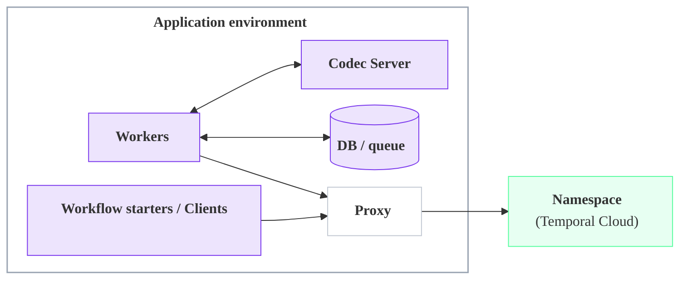

## Highly available Worker patterns {/* #ha-worker-patterns */}

A Worker deployment pattern pairs with Namespace High Availability to achieve a disaster recovery (DR) and business continuity plan for your full Temporal architecture.

This page covers three main patterns: **Active/Passive**, **Active/Hot-Passive**, and **Active/Active**.

They trade off **recovery time** after an outage, **cost during normal operation**, and **operational complexity**. They are defined by where the Workers run and where Workflows process:

- **[Active/Passive](#active-cold)** — Workflows process in one region at a time, the "active" region. The other region is "passively" waiting, without any Workers. On a failover, the passive region becomes active, and new Workers are launched (from a "cold" start) to process Workflows.
- **[Active/Hot-Passive](#active-hot)** — Workflows process in one region at a time, the "active" region. However, Workers run in **both regions** simultaneously: processing Workflows in the "active" region, and on "hot" standby in the passive region. This achieves a faster failover and lower recovery time.
- **[Active/Active](#active-active)** — Workflows process in both/multiple regions at the same time, and Workers run in all regions at all times.

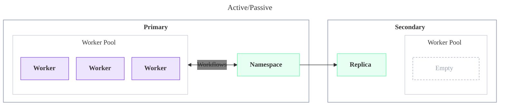

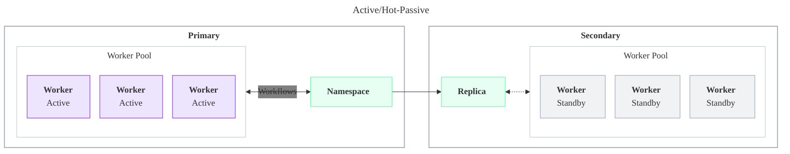

:::info

**Namespaces always have a single active region, but can support an Active/Active Worker deployment pattern.**

A Temporal Cloud Namespace with High Availability has exactly one active region at a time. The other region holds a replica that passively receives replicated state.

However, since **Workers don't need to run in the same region as the active Namespace replica**, Temporal Cloud Namespaces can still fit into an Active/Active HA/DR strategy, as described below.

:::

These patterns work across two cloud regions, which could be in the same cloud provider ("multi-region") or different cloud providers ("multi-cloud"):

- **Primary region** — the region where the Namespace is active during normal operation, also called the "preferred region."
- **Secondary region** — the region the Namespace fails over to. It can be any [Temporal Cloud region](/cloud/regions) that supports replication from the primary region. Multi-region and multi-cloud architectures use the same Worker deployment patterns.

### Compare patterns at a glance {/* #compare-at-a-glance */}

| Pattern | Where Workers run | Best for and benefits | Major tradeoffs |
| --- | --- | --- | --- |
| **[Active/Passive](#active-cold)** | One region at a time | Easy initial deployment; acts like a single region with no special setup | Failing over Workers is your responsibility; highest recovery time of the three |
| **[Active/Hot-Passive](#active-hot)** | Both regions; secondary on warm standby | Low RTO with strict single-region behavior; fast Worker failover that is guaranteed to act like a single region | More configuration and the cost of a full standby fleet |
| **[Active/Active](#active-active)** | All regions, all processing Workflows | Low RTO with Workers active in every region; fast failover that uses fleet capacity instead of a standby fleet | Cross-region requests add Workflow latency; external systems need a cross-region consistency story |

## Active/Passive {/* #active-cold */}

Workers run in only one region at a time. The secondary region stays empty until a failover, when you bring up a fresh Worker fleet there from a cold start.

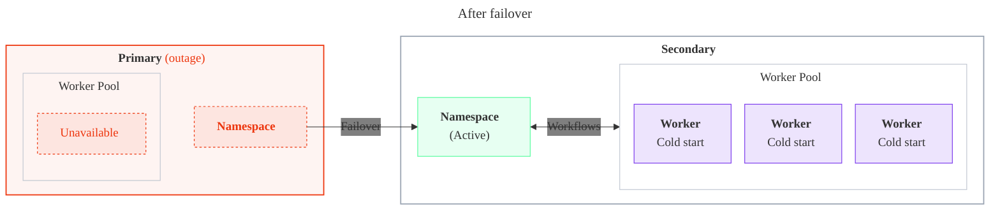

Here's how each component behaves during normal operation and after a failover:

| Component | Normal operation | On failover |
| --- | --- | --- |
| **Workers** | Run only in the primary region, processing all Workflows. No Workers run in the secondary region. | Brought up from nothing in the secondary region — a "cold" start. No Workflows progress until they're running. |
| **Namespace** | Active replica in the primary region; passive replica in the secondary region, continuously receiving replicated Workflow state. | Temporal Cloud promotes the secondary region's replica to active automatically. To trigger or test a failover yourself, see [Failovers](/cloud/high-availability/failovers). |
| **Workflow starters and Clients** | Run with the Workers in the primary region. | Brought up in the secondary region along with the Workers. |
| **Codec Servers and proxies** | Run alongside the active Workers in the primary region. | Scaled up in the secondary region as part of the failover. |
| **Databases and queues** | Replicate to the secondary region, if your Workflows depend on that data. | Promote the secondary region's copy to active, if needed, so the new Workers can read and write it. |

Setup is minimal: turn on Replication for your Namespace (see [Enable and manage High Availability](/cloud/high-availability/enable)) and enable replication on any databases or queues your Workflows use. At that point you're technically already running Active/Passive: the secondary region holds a ready replica, and failing over is a matter of bringing your Workers up there.

Recovery time is dominated by two things: how quickly you detect the outage, since Workflows make no progress until you respond (see [Detect a failover or an outage](/cloud/high-availability/monitoring#detect-failover-or-outage)), and how long the secondary-region Worker fleet takes to cold start — container or VM startup, image pulls, and application warm-up. The [Active/Hot-Passive](#active-hot) pattern removes both by keeping Workers already running and warm in the secondary region.

### Benefits {/* #active-cold-benefits */}

Active/Passive offers the simplest operational model of the three patterns:

- **Easy to reason about.**
   - Only one region is active at a time, so traffic routing and interactions with systems (such as databases and queues) are simpler to understand, and the pattern pairs naturally with other active / passive systems. Active/Active, by contrast, requires deciding how Workers reach an active database: either a local active database in each region, or a single active / passive database that some Workers must reach cross-region.
- **Simple to operate.**
   - During normal operation it resembles a single-region deployment.
- **Lowest overall architecture cost.**
   - The size of the Worker fleet is simply the capacity needed to operate in one region. There are no standby Workers during steady state.

### Tradeoffs {/* #active-cold-tradeoffs */}

That simplicity comes at the cost of recovery time:

- Highest overall recovery time of the three patterns, due to cold starting the Worker fleet after failover.
- Depends on tested automation to bring up the secondary-region fleet quickly.

### Recommendations and important constraints {/* #active-cold-recommendations */}

Keep these in mind when setting up Active/Passive:

- **Failing over the Workers is the operator's responsibility.** The Namespace fails over automatically, but bringing up the Workers in the secondary region is up to you. Plan for these sub-considerations:
   - **How do you detect an outage and decide to fail over?** Define the failover conditions and the signals (alerts, health checks) that trigger them. Because Workflows make no progress until you detect the outage and respond, detection is on the critical path of your recovery time. To monitor for an outage and a failover, see [Detect a failover or an outage](/cloud/high-availability/monitoring#detect-failover-or-outage).
   - **How do you scale up the Workers?** Bring up the secondary-region fleet, ideally with tested automation, and scale down the primary region's fleet so Workers run in only one region at a time.
   - **Do you need to enforce single-region processing?** This pattern relies on the operator to keep Workers in one region. To have Temporal enforce single-region processing instead, use the [Active/Hot-Passive](#active-hot) pattern.

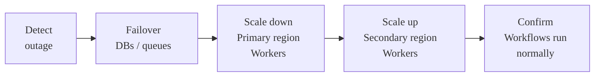

- **Use the Namespace Endpoint.**
   - Connect Workers through the [Namespace Endpoint](/cloud/namespaces#access-namespaces), which always connects to the Namespace in its active region and automatically fails over to the new region.
   - **Rationale:** If a Temporal Cloud incident requires the Namespace to fail over while the rest of the primary region is healthy, the Workers in the primary region can still connect through the Namespace Endpoint and process Workflows. If the Workers use the Regional Endpoint for the primary region, they will not reliably connect to the Namespace during a Temporal Cloud incident in the primary region.

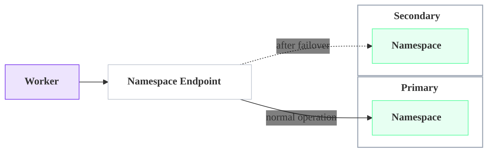

- **Set up cross-region private connectivity.**
   - If you use private connectivity, give the primary region's Workers a network route to the VPC Endpoint in the other region, so they can reach the active replica after a Namespace-only failover. If you can't provide that cross-region route, use the [Active/Hot-Passive](#active-hot) pattern instead, where each region's Workers connect to their local replica.
   - For the full setup of Regional Endpoints, VPC Endpoints, and cross-region routing, see [Connectivity for High Availability](/cloud/high-availability/ha-connectivity).

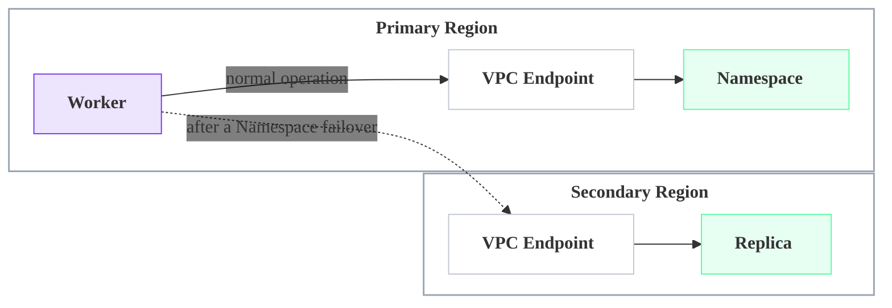

- **Route Workers to the active region's Codec Server.** Two common approaches:
   - Put DNS or a load balancer in front of the Codec Server address, and update it on failover to point at the new region's instance.
   - Pass each Worker the Codec Server address for its own region as configuration, so a Worker always uses the service local to it. This is common in Kubernetes or with service discovery.
- **Route Workers to the active region's proxy.** Two common approaches:
   - Put DNS or a load balancer in front of the proxy address, and update it on failover to point at the new region's instance.
   - Pass each Worker the proxy address for its own region as configuration, so a Worker always uses the service local to it. This is common in Kubernetes or with service discovery.

## Active/Hot-Passive {/* #active-hot */}

A full Worker fleet runs in both regions, but only the primary region's fleet processes Workflows. The secondary region's fleet stays warm on standby, ready to take over the moment a failover promotes it, with no cold start.

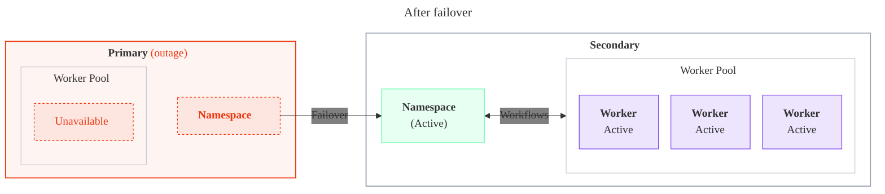

Here's how each component behaves during normal operation and after a failover:

| Component | Normal operation | On failover |
| --- | --- | --- |
| **Workers** | Run in both regions. The primary region's Workers are active and process all Workflows; the secondary region's Workers stay connected and warm on standby, doing no work. Forwarding is disabled for Worker polls, so the standby fleet adds no cross-region overhead. | The secondary region's standby Workers — already connected and warm — begin processing immediately. No cold start and no DNS wait. |
| **Namespace** | Active replica in the primary region; passive replica in the secondary region, continuously receiving replicated Workflow state. | The Namespace and Workers fail over together, automatically: Temporal Cloud promotes the secondary replica to active. |
| **Workflow starters and Clients** | Run in both regions alongside the Workers. | No changes needed — already running in both regions. |
| **Codec Servers and proxies** | Run in both regions continuously, not just after a failover. | No changes needed — already running in the secondary region. |
| **Databases and queues** | Workers in each region typically read and write only their local, active copy. | Promote the secondary region's copy to active, if needed, so the now-active Workers can read and write it. |

Because a full Worker fleet is already running and warm in the secondary region, there's nothing to start or scale up before processing resumes. Along with Active/Active, this gives Active/Hot-Passive the lowest recovery time of the three patterns; because the standby fleet is already sized for full load, failover needs no scale-up.

### Benefits {/* #active-hot-benefits */}

Active/Hot-Passive trades steady-state cost for a faster, more predictable failover:

- **Easy to reason about.**
   - Only one region is active at a time, so traffic routing and interactions with systems (such as databases and queues) are simpler to understand, and the pattern pairs naturally with other active / passive systems. Active/Active, by contrast, requires deciding how Workers reach an active database: either a local active database in each region, or a single active / passive database that some Workers must reach cross-region.
- **Lowest recovery time, tied with Active/Active.**
   - The secondary-region Workers are already connected and warm, so failover involves no cold start. Because the standby fleet is already sized for full load, it also needs no scale-up.
- **Low latency during normal operation.**
   - Tasks are processed only in the active region, with no cross-region forwarding.

### Tradeoffs {/* #active-hot-tradeoffs */}

That speed comes at a steady-state cost:

- Highest overall architecture cost: a full standby Worker fleet runs in the secondary region at all times, even during steady state.

### Recommendations and important constraints {/* #active-hot-recommendations */}

Keep this in mind when setting up Active/Hot-Passive:

- **Use Regional or VPC Endpoints and disable forwarding.**
   - Connect each Worker fleet through its region's [Regional Endpoint](/cloud/high-availability/ha-connectivity#regional-endpoint) (or VPC Endpoint) and [disable forwarding](/cloud/high-availability/enable#change-forwarding-behavior) for Worker polls. Using the Namespace Endpoint by mistake routes the standby Workers to the active region and defeats the pattern.

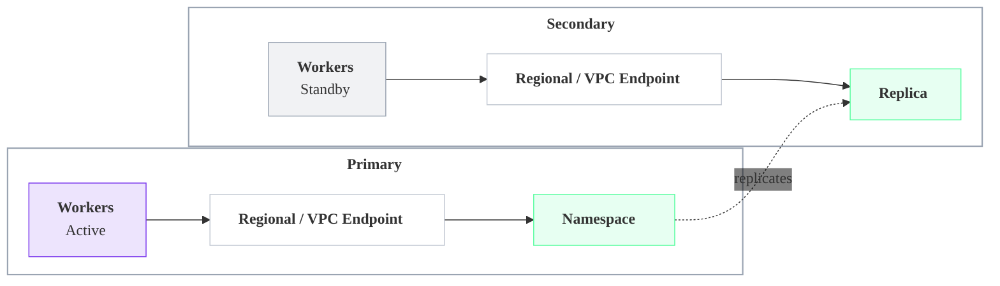

## Active/Active {/* #active-active */}

Worker fleets run in as many regions as you want, all processing Workflows against the Namespace's single active replica through the Namespace Endpoint. If one region goes down, the others keep processing without interruption.

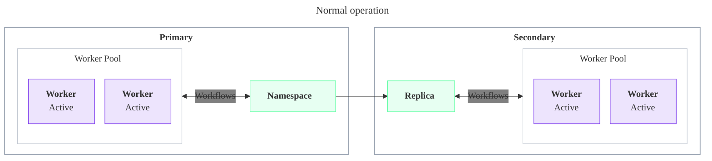

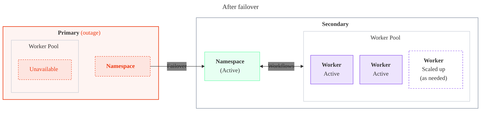

Here's how each component behaves during normal operation and after a failover:

| Component | Normal operation | On failover |
| --- | --- | --- |
| **Workers** | Run in as many regions as you want — fleets don't have to match the Namespace's regions. Every fleet connects through the Namespace Endpoint. | Fleets in unaffected regions keep processing with no cold-start gap. Scale them up if needed to carry the full load. |
| **Namespace** | One active replica; every other region holds a passive replica that receives replicated state. The Namespace Endpoint always routes to whichever region currently holds the active Namespace. | Temporal Cloud promotes a passive replica in another region to active. Every fleet follows automatically — no reconfiguration, nothing to bring up. |
| **Workflow starters and Clients** | Run wherever convenient and connect through the Namespace Endpoint, like the Workers. | Automatically follow the Namespace Endpoint to the new active region, like the Workers. |
| **Codec Servers and proxies** | Run in every region where Workers run. | Already running in every surviving region — no action needed. |
| **Databases and queues** | Accessed from every Worker region, so you need a cross-region consistency story. | Promote the active region's copy, if needed, so the Workers there can read and write it. |

Because surviving regions keep processing without a cold start, recovery time depends mainly on how quickly you can scale them up to absorb the extra load, not on starting new Workers.

### Benefits {/* #active-active-benefits */}

Active/Active spreads capacity across regions instead of parking it in a standby fleet:

- **Hands-off Worker failover.**
   - With the Namespace Endpoint, Workers in every region follow the Namespace to the new active region automatically — there's no Worker failover step to run.
- **Lowest recovery time, no standby fleet.**
   - Surviving regions keep processing, so there's no cold start, giving the same low recovery time as Active/Hot-Passive while spreading capacity across regions instead of parking it in a dedicated standby fleet. Surviving regions may need to scale up to absorb the failed region's load.
- **Resilient to losing a region.**
   - Like spreading across Availability Zones, losing one region's fleet leaves the others running.

### Tradeoffs {/* #active-active-tradeoffs */}

Running Workers active in multiple regions introduces new considerations:

- Workers outside the active region reach it across regions (directly or via forwarding), which adds latency that can matter for latency-sensitive Workflows.
- External systems are harder: Workers are active in multiple regions at once, so any databases and queues they touch need a cross-region consistency story.

### Recommendations and important constraints {/* #active-active-recommendations */}

Keep these in mind when setting up Active/Active:

- **Default to the Namespace Endpoint.**
   - All fleets, in any region, connect through the single Namespace Endpoint. It always routes to the active region and follows failovers automatically, so every fleet keeps reaching the active Namespace with no reconfiguration — it "just works," and Workers in all regions fail over automatically. One endpoint everywhere also keeps configuration and management simple.
- **Use a Regional Endpoint only when you need the lowest recovery time.**
   - Connecting each fleet to its region's [Regional Endpoint](/cloud/high-availability/ha-connectivity#regional-endpoint) (or VPC Endpoint) removes the DNS step from the connection path, which can shave time off failover for the lowest possible RTO. The tradeoffs: more setup, and a real risk of misconfiguration (such as routing a fleet to the wrong region). Reach for it only when you absolutely need low recovery time. With Regional Endpoints, keep forwarding enabled so passive-region polls still reach the active replica.

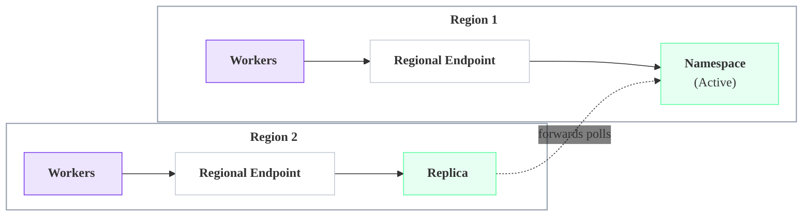

## Clients, Codec Servers, and databases {/* #clients-codec-servers-databases */}

The Worker deployment pattern sets the approach; the supporting pieces follow it.

- **Workflow starters and Clients.** Deploy these with the same regional pattern as the Workers, since a starter or Client often shares the same in-region dependencies (databases, queues, upstream services) and should fail over alongside them. Point Clients at the Namespace Endpoint so they follow the active region automatically with no configuration change on failover, and use a [Regional Endpoint](/cloud/high-availability/ha-connectivity#regional-endpoint) only when a Client must be pinned to a region.
- **Codec Servers and proxies.** Anything in the connection path between Workers and Temporal Cloud must be reachable from every region where Workers connect. In Active/Passive, scale them up in the secondary region as part of a failover; in the Active/Hot-Passive and Active/Active patterns, run them in both regions at all times.
- **Databases and queues.** These remain the application's responsibility, and the right approach depends on the Worker deployment pattern: a single-region-active datastore pairs naturally with the Active/Passive and Active/Hot-Passive patterns, while running Workers active in both regions (as in Active/Active) raises consistency questions that must be designed for. Detailed guidance is out of scope for this page.

## Frequently asked questions {/* #faq */}

### What is the difference between active-passive and active-active patterns? {/* #faq-active-passive-vs-active-active */}

Both **Active/Passive** and **Active/Hot-Passive** keep Workflows processing in one region at a time, with the other region standing by for failover. **Active/Active** runs Workers in every region and processes Workflows in all of them at once. See [Worker deployment patterns](#ha-worker-patterns) for the full comparison.

### How do I fail over Workers to another region? {/* #faq-fail-over-workers */}

A Namespace with High Availability fails over automatically, but bringing up or activating Workers in the secondary region is your responsibility. The exact steps depend on your pattern; see [Active/Passive](#active-cold), [Active/Hot-Passive](#active-hot), and [Active/Active](#active-active).

### Which pattern has the lowest recovery time (RTO)? {/* #faq-lowest-rto */}

**Active/Hot-Passive** and **Active/Active** both achieve the lowest recovery time, because neither requires a cold start after failover. In Active/Hot-Passive, a warm standby Worker fleet in the secondary region begins processing the moment it becomes active. In Active/Active, Workers are already processing in every region, so the surviving regions keep running with no gap. By contrast, **Active/Passive** must cold start a Worker fleet in the secondary region, giving it the highest recovery time. See [Active/Hot-Passive](#active-hot), [Active/Active](#active-active), and [RPO and RTO](/cloud/rpo-rto).

### Do I have to run Workers in both regions for high availability? {/* #faq-workers-both-regions */}

No. **Active/Passive** runs Workers in one region at a time and is the simplest starting point for disaster recovery. Running Workers in both regions — **Active/Hot-Passive** or **Active/Active** — lowers recovery time at higher cost.

### Does Temporal Cloud support Active/Active for HA/DR? {/* #faq-active-active */}

Yes, as a Worker deployment pattern — not as a database-level active/active. A Temporal Cloud Namespace with High Availability always has exactly one active region and one passive replica underneath, no matter which [Worker deployment pattern](#ha-worker-patterns) you choose. But because Workers in any region reach the active replica through the Namespace Endpoint, you can run Worker fleets in every region and process Workflows in all of them at once. See [Active/Active](#active-active).

### What special patterns are needed for multi-cloud HA/DR? {/* #faq-multi-cloud */}

None specific to multi-cloud. Multi-region and multi-cloud HA/DR use the same [Worker deployment patterns](#ha-worker-patterns) — the secondary region can be any [Temporal Cloud region](/cloud/regions) that supports replication from the primary, whether in the same cloud provider or a different one. The same considerations apply: route Workers through the right [endpoints and private connectivity](/cloud/high-availability/ha-connectivity), and give any databases and queues a cross-region — here, cross-cloud — consistency story.

If you use the Active/Passive pattern, it is highly recommended that you ensure Workers in the active cloud can reach the Namespace if it fails over to the passive cloud due to a Temporal-specific outage, so they can keep processing Tasks across the cross-cloud path.

### What special considerations are there for private networking? {/* #faq-private-networking */}

The patterns are the same. But if you use the Active/Passive pattern, it is highly recommended that you provide a network path for Workers in the active region to reach the VPC Endpoint in the passive region, so they can keep processing Tasks if the Namespace fails over due to a Temporal-specific outage. See [Connectivity for High Availability](/cloud/high-availability/ha-connectivity).
