<style>{`
  .docusaurus-mermaid-container .edgeLabel,
  .docusaurus-mermaid-container .edgeLabel p,
  .docusaurus-mermaid-container .edgeLabel rect,
  .docusaurus-mermaid-container .edgeLabel .labelBkg {
    background-color: var(--ifm-background-color) !important;
    fill: var(--ifm-background-color) !important;
  }
`}</style>

When a cloud outage strikes, a Temporal Cloud Namespace with [High Availability](/cloud/high-availability) fails over to another region automatically, providing high availability and disaster recovery for your most important Workflows.
But what about the rest of the architecture?

Workers, Workflow starters, Codec Servers, databases, network load balancers, and every other external systems that touch your Workflows use each need their own HA/DR failover story.

In a real outage, your [recovery time](/cloud/rpo-rto) depends on your **Worker deployment pattern**: where Worker fleets run, how they failover, and which region (or regions) processes Workflows at each step.

This page describes common Active/Passive (also written Active-Passive) and Active/Active (also written Active-Active) patterns for deploying Workers--and the other systems in your cloud architecture--to achieve your business goals for high availability and disaster recovery (HA/DR).

## Pieces of a highly available cloud architecture {/* #pieces-to-failover */}

To keep your Workflows running during a cloud outage, these components need to failover to a healthy region:

- **Temporal Cloud Namespace** - achieve this simply by enabling [High Availability](/cloud/high-availability) on the Namespace.
- **Workers** (the focus of this page) — the compute resources that execute Workflows and Activities.
- **Workflow starters and Clients** — the applications that start and signal Workflows.
- **Codec Servers** — a critical dependency for Workers, the Web UI, and the CLI.
- **Proxies between Workers and Temporal Cloud** — any forward proxy or mTLS terminator in the connection path between Workers / Starters / Clients → Namespace.
- **Datastores** — databases, queues, and any other systems that Activities read and write.

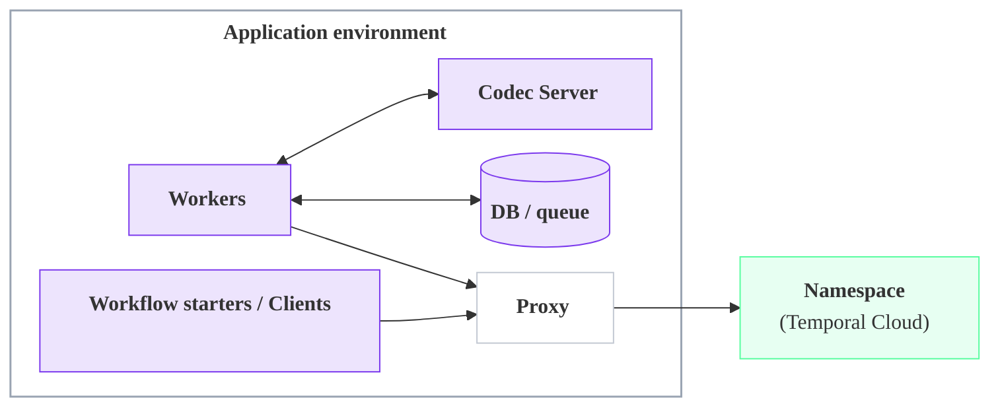

:::tip

See [High Availability for Temporal Cloud Namespaces](/cloud/high-availability) to learn more about Namespace replicas, replication, and failover.

:::

## Highly available Worker patterns {/* #ha-worker-patterns */}

A Worker deployment pattern pairs with Namespace High Availability to achieve a disaster recovery (DR) and business continuity plan for your full Temporal architecture.

This page covers three main patterns — **Active/Passive (Cold)**, **Active/Passive (Hot)**, and **Active/Active**.

They trade off **recovery time** after an outage, **cost during normal operation**, and **operational complexity**. They are defined by where the Workers run and where Workflows process:

- **[Active/Passive (Cold)](#active-cold)** (also written Active-Passive) — a.k.a. Active/Cold — Workflows process in one region at a time, the "active" region. The other region is "passively" waiting, without any Workers. On a failover, the passive region becomes active, and new Workers are launched (from a "cold" start) to process Workflows.
- **[Active/Passive (Hot)](#active-hot)** — a.k.a. Active/Hot — Workflows process in one region at a time, the "active" region. However, Workers run in **both regions** simultaneously: processing Workflows in the "active" region, and on "hot" standby in the passive region. This achieves a faster failover and lower recovery time.
- **[Active/Active](#active-active)** (also written Active-Active) — a.k.a. Multi-Active - Workflows process in both/multiple regions at the same time, and Workers run in all regions at all times.

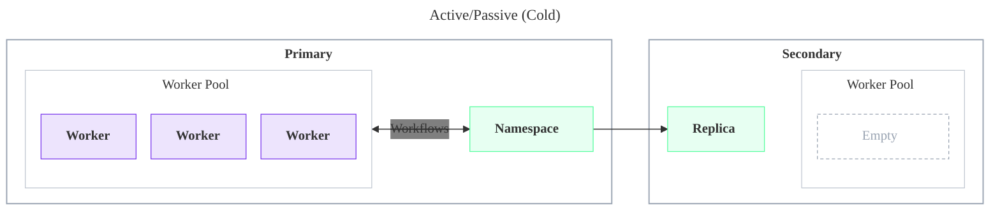

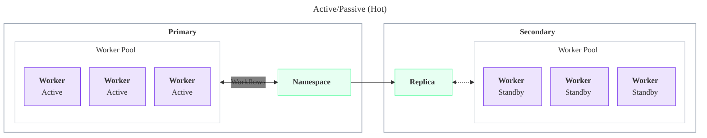


:::info

**Namespaces are always Active/Passive, but can support an Active/Active pattern.**

A Temporal Cloud Namespace with High Availability has exactly one active region at a time. The other region holds a replica that passively receives replicated state.

However, since **Workers don't need to run in the same region as the active Namespace replica**, Temporal Cloud Namespaces can still fit into an Active/Active HA/DR strategy, as described below.

:::

These patterns work across two cloud regions, which could be in the same cloud provider ("multi-region") or different cloud providers ("multi-cloud"):

- **Primary region** — the region where the Namespace is active during normal operation, also called the "preferred region."
- **Secondary region** — the region the Namespace fails over to. It can be any [Temporal Cloud region](/cloud/regions) that supports replication from the primary region. Multi-region and multi-cloud architectures use the same Worker deployment patterns.

### Compare patterns at a glance {/* #compare-at-a-glance */}

| Pattern | Where Workers run | Best for and benefits | Major tradeoffs |
| --- | --- | --- | --- |
| **[Active/Passive (Cold)](#active-cold)** | One region at a time | Easy initial deployment; acts like a single region with no special setup | Failing over Workers is your responsibility; highest recovery time of the three |
| **[Active/Passive (Hot)](#active-hot)** | Both regions; secondary on warm standby | Low RTO with strict single-region behavior; fast Worker failover that is guaranteed to act like a single region | More configuration and the cost of a full standby fleet |
| **[Active/Active](#active-active)** | All regions, all processing Workflows | Low RTO with Workers active in every region; fast failover that uses fleet capacity instead of a standby fleet | Cross-region requests add Workflow latency; external systems need a cross-region consistency story |

## Active/Passive (Cold) {/* #active-cold */}

_Also known as "Active/Cold Standby", "Active/Cold", or simply "Active/Passive"._


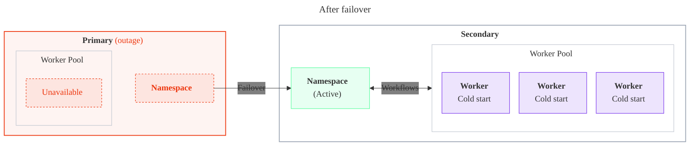

Active/Cold Pattern: **Normal operation**

- **Workers run in only one region.** A single Worker fleet runs in the primary region and processes all Workflows. No Workers run in the secondary region.
- **The Namespace replicates to the secondary region.** A Namespace with High Availability has an active replica in the primary region and a passive replica in the secondary region. Temporal Cloud continuously replicates Workflow state to the passive replica, so it stays ready to become active.
- **Your databases and queues replicate too, if needed.** Workers read and write systems such as databases and queues. If your Workflows depend on that data, replicate it to the secondary region so it's available after a failover. Workflows that don't touch external state may not need this.
- **Setup is minimal.** Turn on Replication for your Namespace (see [Enable and manage High Availability](/cloud/high-availability/enable)) and enable replication on any databases or queues your Workflows use. At that point you're technically already running Active/Passive (Cold): the secondary region holds a ready replica, and failing over is a matter of bringing your Workers up there.

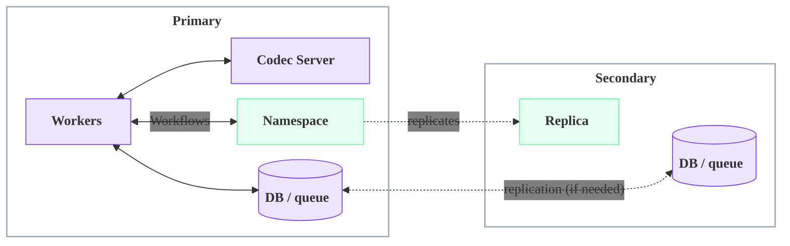

Active/Cold Pattern: **On failover**

- **You must detect the outage yourself.** With no Workers running in the secondary region, nothing begins processing until you notice the outage and respond — detection is your responsibility, not Temporal Cloud's. Until you detect it and bring up Workers, your Workflows make no progress, so any delay in detection adds directly to your recovery time. This is a key advantage of the [Active/Passive (Hot)](#active-hot) pattern: its standby Workers begin processing the moment the Namespace fails over, so Workflows keep progressing even if you are slow to notice the outage. For how to detect an outage and a failover, see [Detect a failover or an outage](/cloud/high-availability/monitoring#detect-failover-or-outage).
- **The Namespace fails over automatically.** Temporal Cloud promotes the secondary region's replica to active. No action is needed to fail over the Namespace itself. To trigger or test a failover yourself, see [Failovers](/cloud/high-availability/failovers).
- **You bring the Workers up in the secondary region.** Because no Workers were running there, they start from nothing — a "cold" start. Starting and scaling that fleet is your responsibility, ideally through tested automation. Until the Workers are running, no Workflows make progress.
- **Promote your databases and queues, if needed.** If your Workflows depend on external data, make the secondary region's copy active so the new Workers can read and write it.
- **Recovery time is dominated by Worker startup.** After Temporal detects the outage and triggers failover, the Namespace is active almost immediately, but throughput returns to normal only after container or VM startup, image pulls, and application warm-up complete.

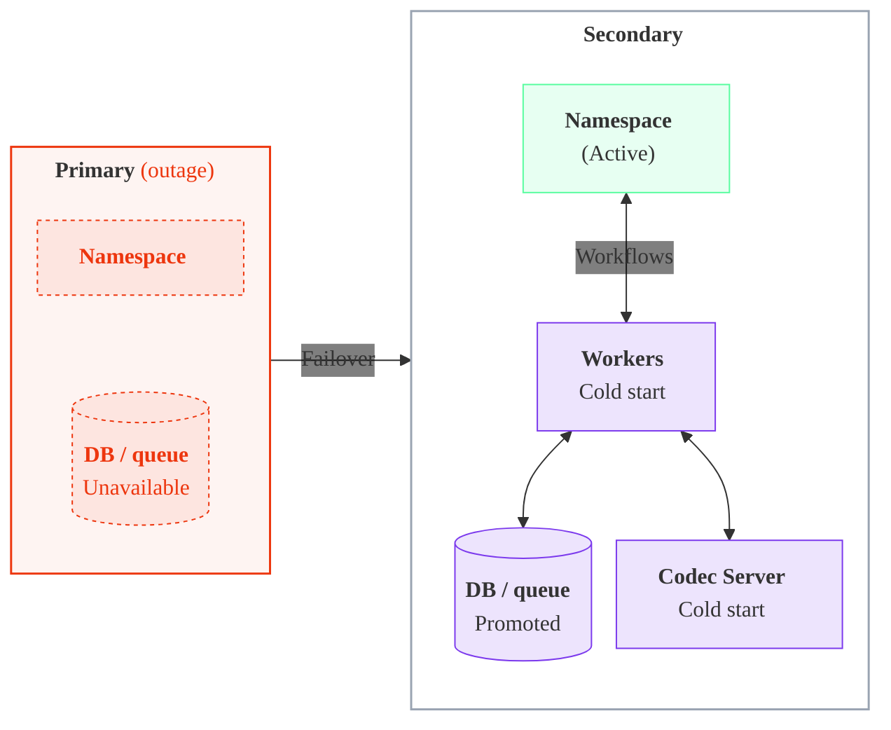

Active/Cold Pattern: **Benefits**

- **Easy to reason about.**
   - Only one region is active at a time, so traffic routing and interactions with systems (such as databases and queues) are simpler to understand, and the pattern pairs naturally with other active / passive systems. Active/Active, by contrast, requires deciding how Workers reach an active database: either a local active database in each region, or a single active / passive database that some Workers must reach cross-region.
- **Simple to operate.**
   - During normal operation it resembles a single-region deployment.
- **Lowest overall architecture cost.**
   - The size of the Worker fleet is simply the capacity needed to operate in one region. There are no standby Workers during steady state.

Active/Cold Pattern: **Tradeoffs**

- Highest overall recovery time of the three patterns, due to cold starting the Worker fleet after failover.
- Depends on tested automation to bring up the secondary-region fleet quickly.

Active/Cold Pattern: **Recommendations and important constraints**

- **Failing over the Workers is the operator's responsibility.** The Namespace fails over automatically, but bringing up the Workers in the secondary region is up to you. Plan for these sub-considerations:
   - **How do you detect an outage and decide to fail over?** Define the failover conditions and the signals (alerts, health checks) that trigger them. Because Workflows make no progress until you detect the outage and respond, detection is on the critical path of your recovery time. To monitor for an outage and a failover, see [Detect a failover or an outage](/cloud/high-availability/monitoring#detect-failover-or-outage).
   - **How do you scale up the Workers?** Bring up the secondary-region fleet, ideally with tested automation, and scale down the primary region's fleet so Workers run in only one region at a time.
   - **Do you need to enforce single-region processing?** The Cold pattern relies on the operator to keep Workers in one region. To have Temporal enforce single-region processing instead, use the [Active/Passive (Hot)](#active-hot) pattern.

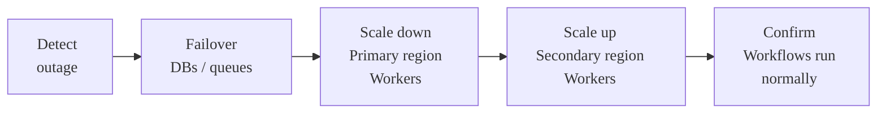

- **Use the Namespace Endpoint.**
   - Connect Workers through the [Namespace Endpoint](/cloud/namespaces#access-namespaces), which always connects to the Namespace in its active region and automatically fails over to the new region.
   - **Rationale:** If a Temporal Cloud incident requires the Namespace to fail over while the rest of the primary region is healthy, the Workers in the primary region can still connect through the Namespace Endpoint and process Workflows. If the Workers use the Regional Endpoint for the primary region, they will not reliably connect to the Namespace during a Temporal Cloud incident in the primary region.

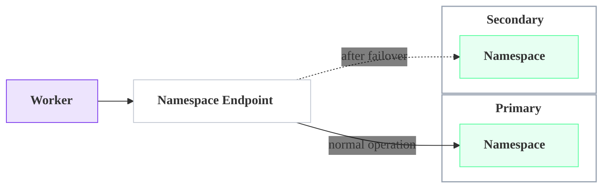

- **Set up cross-region private connectivity.**
   - If you use private connectivity, give the primary region's Workers a network route to the VPC Endpoint in the other region, so they can reach the active replica after a Namespace-only failover. If you can't provide that cross-region route, use the [Active/Passive (Hot)](#active-hot) pattern instead, where each region's Workers connect to their local replica.
   - For the full setup of Regional Endpoints, VPC Endpoints, and cross-region routing, see [Connectivity for High Availability](/cloud/high-availability/ha-connectivity).

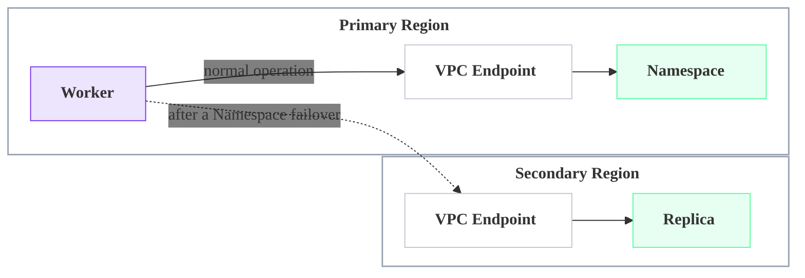

- **Route Workers to the active region's Codec Server.** Two common approaches:
   - Put DNS or a load balancer in front of the Codec Server address, and update it on failover to point at the new region's instance.
   - Pass each Worker the Codec Server address for its own region as configuration, so a Worker always uses the service local to it. This is common in Kubernetes or with service discovery.

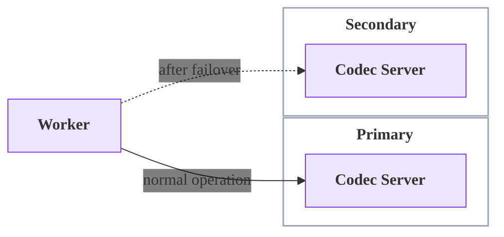

- **Route Workers to the active region's proxy.** Two common approaches:
   - Put DNS or a load balancer in front of the proxy address, and update it on failover to point at the new region's instance.
   - Pass each Worker the proxy address for its own region as configuration, so a Worker always uses the service local to it. This is common in Kubernetes or with service discovery.

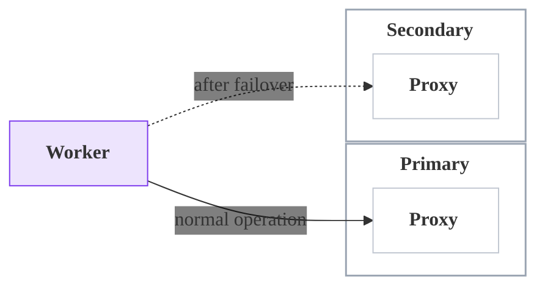

Active/Cold Pattern: **Component behavior**

- **Workers** — run only in the primary region; brought up in the secondary region during a failover.
- **Workflow starters and Clients** — run with the Workers; brought up in the secondary region during a failover.
- **Codec Servers and proxies** — run alongside the active Workers; scaled up in the secondary region as part of a failover.
- **Databases and queues** — single-region-active; fail over to the secondary region alongside the Workers.

## Active/Passive (Hot) {/* #active-hot */}

_Also known as "Active/Hot Standby" or "Active/Hot"._


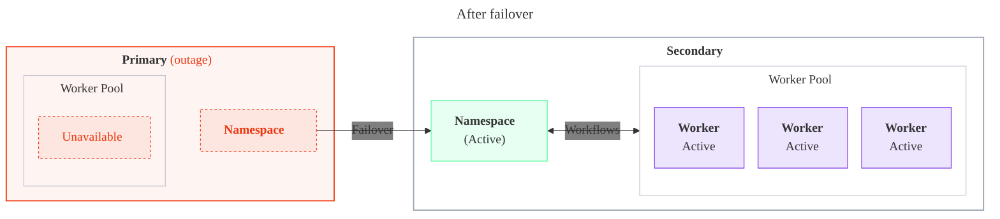

Active/Hot Pattern: **Normal operation**

- **Workers run in both regions.** A full Worker fleet runs in each region. The primary region's Workers are active and process all Workflows; the secondary region's Workers stay connected and warm, but on standby, doing no work.
- **Workflows process in only one region at a time.** The Namespace has a single active replica, so even though Workers run in both regions, Workflows execute only in the active (primary) region.
- **Forwarding is disabled for Worker polls.** Each fleet connects to its local replica through a [Regional Endpoint](/cloud/high-availability/ha-connectivity#regional-endpoint) or [VPC Endpoint](/cloud/high-availability/ha-connectivity) with forwarding off, so polls that reach the passive replica are not sent to the active region. The standby fleet does no work and adds no cross-region overhead.
- **The Namespace replicates to the secondary region.** A Namespace with High Availability keeps an active replica in the primary region and a passive replica in the secondary region, continuously replicating Workflow state so the standby is ready to take over.

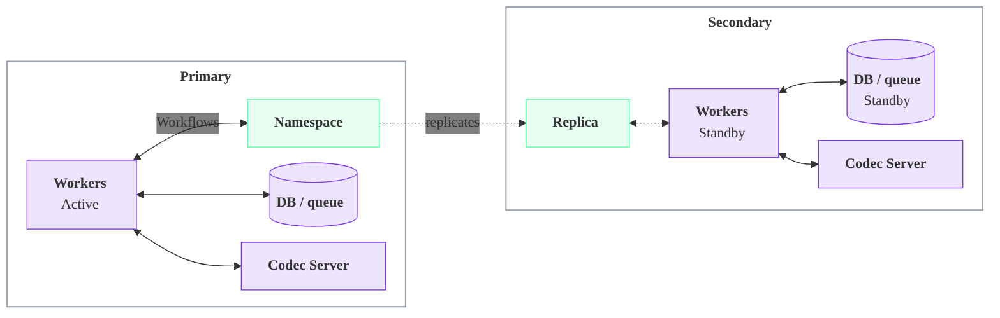

Active/Hot Pattern: **On failover**

- **The Namespace and Workers fail over together, automatically.** When the primary region fails, Temporal Cloud promotes the secondary replica to active, and the secondary region's standby Workers — already connected and warm — begin processing immediately.
- **No cold start and no DNS wait.** Because a full Worker fleet was already running in the secondary region, there's nothing to start or scale up before processing resumes. This pattern achieves the lowest recovery time of the three.
- **Promote your databases and queues, if needed.** If your Workflows depend on external data, make the secondary region's copy active so the now-active Workers can read and write it.

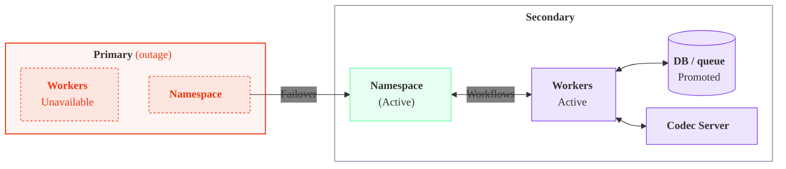

Active/Hot Pattern: **Benefits**

- **Easy to reason about.**
   - Only one region is active at a time, so traffic routing and interactions with systems (such as databases and queues) are simpler to understand, and the pattern pairs naturally with other active / passive systems. Active/Active, by contrast, requires deciding how Workers reach an active database: either a local active database in each region, or a single active / passive database that some Workers must reach cross-region.
- **Lowest overall recovery time of the three patterns.**
   - The secondary-region Workers are already connected and warm, so failover involves no cold start.
- **Low latency during normal operation.**
   - Tasks are processed only in the active region, with no cross-region forwarding.

Active/Hot Pattern: **Tradeoffs**

- Highest overall architecture cost: a full standby Worker fleet runs in the secondary region at all times, even during steady state.

Active/Hot Pattern: **Recommendations and important constraints**

- **Use Regional or VPC Endpoints and disable forwarding.**
   - Connect each Worker fleet through its region's [Regional Endpoint](/cloud/high-availability/ha-connectivity#regional-endpoint) (or VPC Endpoint) and [disable forwarding](/cloud/high-availability/enable#change-forwarding-behavior) for Worker polls. Using the Namespace Endpoint by mistake routes the standby Workers to the active region and defeats the pattern.

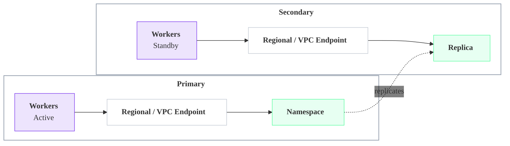

Active/Hot Pattern: **Component behavior**

- **Workers** — run in both regions; only the active region processes Workflows.
- **Workflow starters and Clients** — run in both regions alongside the Workers.
- **Codec Servers and proxies** — run in both regions continuously, not just after a failover.
- **Databases and queues** — typically single-region-active; fail over alongside the active Workers.

## Active/Active {/* #active-active */}

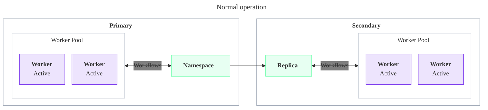

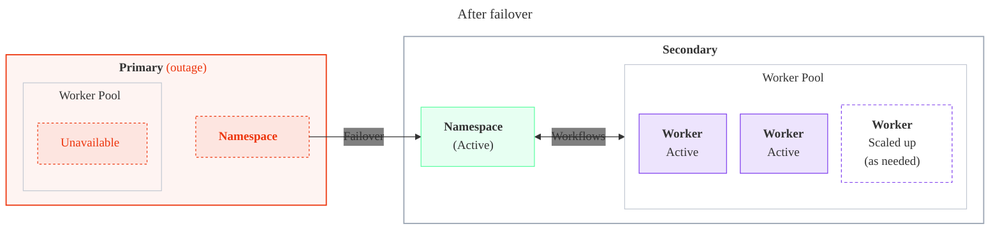

Active/Active Pattern: **Normal operation**

- **Run Workers in as many regions as you want.** A Worker fleet can run in any region — the fleets don't have to match the Namespace's regions, and you don't even need Workers in the same region as the active Namespace. Spreading fleets across regions is like spreading machines across Availability Zones: if one region's fleet goes down, the others keep processing.
- **Every fleet connects through the Namespace Endpoint.** By default, all fleets use the single Namespace Endpoint, which always routes to whichever region currently holds the active Namespace. Temporal Cloud transparently forwards any request that lands on a passive replica to the active region.
- **The Namespace has one active replica.** A Temporal Cloud Namespace is not "active/active" in the database sense — one region holds the active replica and another holds a passive replica that receives replicated state. Workflows process wherever your Workers run, all against that one active replica.

```mermaid
%%{init: {'themeVariables':{'fontFamily':'Inter, ui-sans-serif, system-ui, sans-serif','edgeLabelBackground':'transparent'},'flowchart':{'nodeSpacing':18,'rankSpacing':45,'curve':'basis','subGraphTitleMargin':{'top':6,'bottom':12}}}}%%
flowchart LR
    classDef worker fill:#7C3AED22,stroke:#7C3AED,stroke-width:1px;
    classDef ns fill:#59FDA024,stroke:#59FDA0,stroke-width:1px;
    classDef endpoint fill:transparent,stroke:#c2c8d2,stroke-width:1px;
    classDef region fill:transparent,stroke:#9aa4b2,stroke-width:1.5px;
    AANEP["<b>Namespace Endpoint</b><br/>routes to the active region"]:::endpoint
    subgraph AAR1["<b>Region 1</b>"]
      AAW1["<b>Workers</b>"]:::worker
      AANS1["<b>Namespace</b><br/>(Active)"]:::ns
    end
    subgraph AAR2["<b>Region 2</b>"]
      AAW2["<b>Workers</b>"]:::worker
      AANS2["<b>Replica</b>"]:::ns
    end
    subgraph AAR3["<b>Region 3</b>"]
      AAW3["<b>Workers</b>"]:::worker
    end
    AAW1 --> AANEP
    AAW2 --> AANEP
    AAW3 --> AANEP
    AANEP --> AANS1
    AANS1 -. replicates .-> AANS2
    class AAR1,AAR2,AAR3 region
```

Active/Active Pattern: **On failover**

- **The Namespace fails over automatically.** Temporal Cloud promotes a passive replica in another region to active.
- **Every Worker fleet follows automatically.** Because all fleets connect through the Namespace Endpoint, they immediately reach the new active region — no reconfiguration, no DNS changes to manage, nothing to bring up. It "just works."
- **Surviving fleets keep processing.** Only the fleet in the failed region is affected; fleets in every other region keep running with no cold-start gap. Scale up surviving regions if needed to carry the full load.
- **Promote your databases and queues, if needed.** If your Workflows depend on external data, make the active region's copy available to the Workers there.

```mermaid
%%{init: {'themeVariables':{'fontFamily':'Inter, ui-sans-serif, system-ui, sans-serif','edgeLabelBackground':'transparent'},'flowchart':{'nodeSpacing':18,'rankSpacing':45,'curve':'basis','subGraphTitleMargin':{'top':6,'bottom':12}}}}%%
flowchart LR
    classDef worker fill:#7C3AED22,stroke:#7C3AED,stroke-width:1px;
    classDef ns fill:#59FDA024,stroke:#59FDA0,stroke-width:1px;
    classDef endpoint fill:transparent,stroke:#c2c8d2,stroke-width:1px;
    classDef down fill:#ED360E14,stroke:#ED360E,stroke-width:1px,stroke-dasharray:3 3,color:#ED360E;
    classDef region fill:transparent,stroke:#9aa4b2,stroke-width:1.5px;
    classDef regiondown fill:#ED360E0D,stroke:#ED360E,stroke-width:1.5px;
    AANEPF["<b>Namespace Endpoint</b><br/>now routes to Region 2"]:::endpoint
    subgraph AAFR1["<b>Region 1</b> <span style='color:#ED360E'>(outage)</span>"]
      AAFW1["<b>Workers</b><br/>Unavailable"]:::down
      AAFNS1["<b>Namespace</b>"]:::down
      AAFW1 ~~~ AAFNS1
    end
    subgraph AAFR2["<b>Region 2</b>"]
      AAFW2["<b>Workers</b>"]:::worker
      AAFNS2["<b>Namespace</b><br/>(Active)"]:::ns
    end
    subgraph AAFR3["<b>Region 3</b>"]
      AAFW3["<b>Workers</b>"]:::worker
    end
    AAFW2 --> AANEPF
    AAFW3 --> AANEPF
    AANEPF --> AAFNS2
    AAFNS1 -->|"Failover"| AAFNS2
    class AAFR1 regiondown
    class AAFR2,AAFR3 region
```

Active/Active Pattern: **Benefits**

- **Hands-off Worker failover.**
   - With the Namespace Endpoint, Workers in every region follow the Namespace to the new active region automatically — there's no Worker failover step to run.
- **Low recovery time, no standby fleet.**
   - Surviving regions keep processing, so there's no cold start, and capacity is spread across regions instead of parked in a dedicated standby fleet.
- **Resilient to losing a region.**
   - Like spreading across Availability Zones, losing one region's fleet leaves the others running.

Active/Active Pattern: **Tradeoffs**

- Workers outside the active region reach it across regions (directly or via forwarding), which adds latency that can matter for latency-sensitive Workflows.
- External systems are harder: Workers are active in multiple regions at once, so any databases and queues they touch need a cross-region consistency story.

Active/Active Pattern: **Recommendations and important constraints**

- **Default to the Namespace Endpoint.**
   - All fleets, in any region, connect through the single Namespace Endpoint. It always routes to the active region and follows failovers automatically, so every fleet keeps reaching the active Namespace with no reconfiguration — it "just works," and Workers in all regions fail over automatically. One endpoint everywhere also keeps configuration and management simple.
- **Use a Regional Endpoint only when you need the lowest recovery time.**
   - Connecting each fleet to its region's [Regional Endpoint](/cloud/high-availability/ha-connectivity#regional-endpoint) (or VPC Endpoint) removes the DNS step from the connection path, which can shave time off failover for the lowest possible RTO. The tradeoffs: more setup, and a real risk of misconfiguration (such as routing a fleet to the wrong region). Reach for it only when you absolutely need low recovery time. With Regional Endpoints, keep forwarding enabled so passive-region polls still reach the active replica.

```mermaid
%%{init: {'themeVariables':{'fontFamily':'Inter, ui-sans-serif, system-ui, sans-serif','edgeLabelBackground':'transparent'},'flowchart':{'nodeSpacing':18,'rankSpacing':45,'curve':'basis','subGraphTitleMargin':{'top':6,'bottom':12}}}}%%
flowchart LR
    classDef worker fill:#7C3AED22,stroke:#7C3AED,stroke-width:1px;
    classDef ns fill:#59FDA024,stroke:#59FDA0,stroke-width:1px;
    classDef endpoint fill:transparent,stroke:#c2c8d2,stroke-width:1px;
    classDef region fill:transparent,stroke:#9aa4b2,stroke-width:1.5px;
    subgraph REPR1["<b>Region 1</b>"]
      REPW1["<b>Workers</b>"]:::worker
      REPE1["<b>Regional Endpoint</b>"]:::endpoint
      REPN1["<b>Namespace</b><br/>(Active)"]:::ns
      REPW1 --> REPE1
      REPE1 --> REPN1
    end
    subgraph REPR2["<b>Region 2</b>"]
      REPW2["<b>Workers</b>"]:::worker
      REPE2["<b>Regional Endpoint</b>"]:::endpoint
      REPN2["<b>Replica</b>"]:::ns
      REPW2 --> REPE2
      REPE2 --> REPN2
    end
    REPN2 -.->|"forwards polls"| REPN1
    class REPR1,REPR2 region
```

Active/Active Pattern: **Component behavior**

- **Workers** — run and process in any number of regions; all follow the Namespace's active region.
- **Workflow starters and Clients** — run wherever convenient and connect through the Namespace Endpoint, like the Workers.
- **Codec Servers and proxies** — run in every region where Workers run.
- **Databases and queues** — accessed from every Worker region; cross-region consistency must be designed for.

## The rest of the architecture {/* #rest-of-architecture */}

The Worker deployment pattern sets the approach; the supporting pieces follow it.

- **Workflow starters and Clients.** Deploy these with the same regional pattern as the Workers, since a starter or Client often shares the same in-region dependencies (databases, queues, upstream services) and should fail over alongside them. Point Clients at the Namespace Endpoint so they follow the active region automatically with no configuration change on failover, and use a [Regional Endpoint](/cloud/high-availability/ha-connectivity#regional-endpoint) only when a Client must be pinned to a region.
- **Codec Servers and proxies.** Anything in the connection path between Workers and Temporal Cloud must be reachable from every region where Workers connect. In Active/Passive (Cold), scale them up in the secondary region as part of a failover; in the Active/Passive (Hot) and Active/Active patterns, run them in both regions at all times.
- **Databases and queues.** These remain the application's responsibility, and the right approach depends on the Worker deployment pattern: a single-region-active datastore pairs naturally with Active/Passive, while running Workers active in both regions raises consistency questions that must be designed for. Detailed guidance is out of scope for this page.

## Frequently asked questions {/* #faq */}

### What is the difference between Active/Passive and Active/Active? {/* #faq-active-passive-vs-active-active */}

In **Active/Passive** (also written Active-Passive), Workflows process in one region at a time and the other region stands by for failover. In **Active/Active** (also written Active-Active), Workers run in both regions and process Workflows in both at once. See [Worker deployment patterns](#ha-worker-patterns) for the full comparison.

### How do I fail over Workers to another region? {/* #faq-fail-over-workers */}

A Namespace with High Availability fails over automatically, but bringing up or activating Workers in the secondary region is your responsibility. The exact steps depend on your pattern; see [Active/Passive (Cold)](#active-cold), [Active/Passive (Hot)](#active-hot), and [Active/Active](#active-active).

### Which pattern has the lowest recovery time (RTO)? {/* #faq-lowest-rto */}

**Active/Passive (Hot)** achieves the lowest recovery time, because a standby Worker fleet already runs in the secondary region and begins processing the moment it becomes active — no cold start. See [Active/Passive (Hot)](#active-hot) and [RPO and RTO](/cloud/rpo-rto).

### Do I have to run Workers in both regions for high availability? {/* #faq-workers-both-regions */}

No. **Active/Passive (Cold)** runs Workers in one region at a time and is the simplest starting point for disaster recovery. Running Workers in both regions — **Active/Passive (Hot)** or **Active/Active** — lowers recovery time at higher cost.

### Does Temporal Cloud support Active/Active for HA/DR? {/* #faq-active-active */}

Yes, as a Worker deployment pattern — not as a database-level active/active. A Temporal Cloud Namespace with High Availability always has exactly one active region and one passive replica; it is [always Active/Passive](#ha-worker-patterns) underneath. But because Workers in any region reach the active replica through the Namespace Endpoint, you can run Worker fleets in every region and process Workflows in all of them at once. See [Active/Active](#active-active).

### What special patterns are needed for multi-cloud HA/DR? {/* #faq-multi-cloud */}

None specific to multi-cloud. Multi-region and multi-cloud HA/DR use the same [Worker deployment patterns](#ha-worker-patterns) — the secondary region can be any [Temporal Cloud region](/cloud/regions) that supports replication from the primary, whether in the same cloud provider or a different one. The same considerations apply: route Workers through the right [endpoints and private connectivity](/cloud/high-availability/ha-connectivity), and give any databases and queues a cross-region — here, cross-cloud — consistency story.
