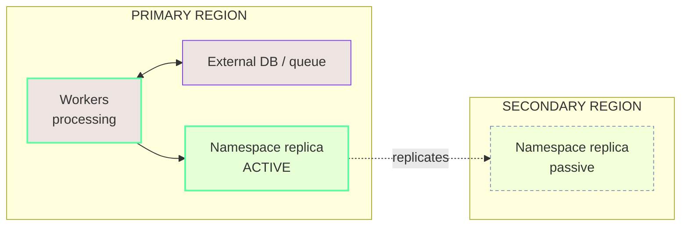
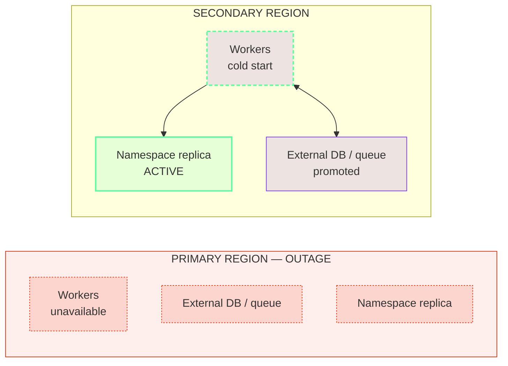
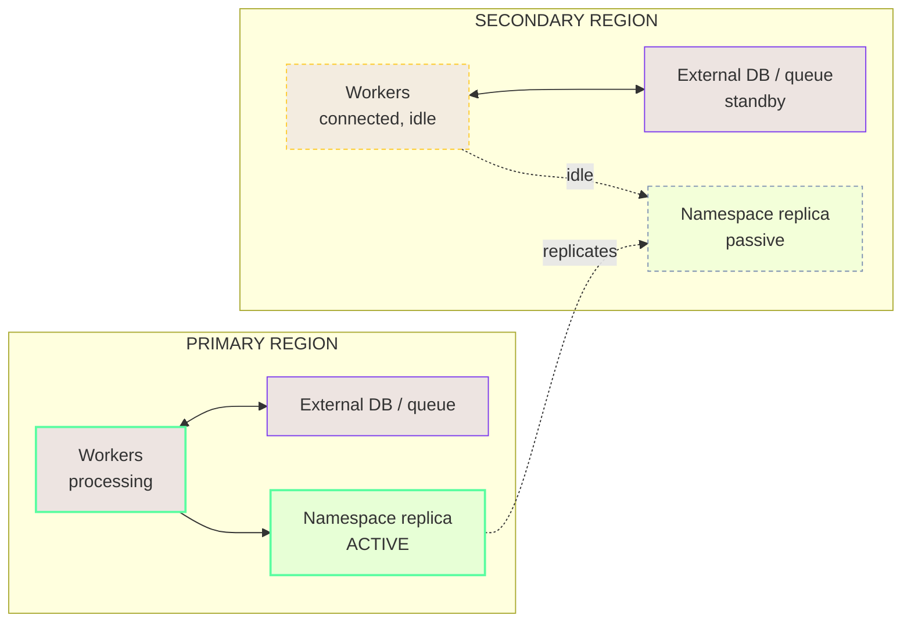
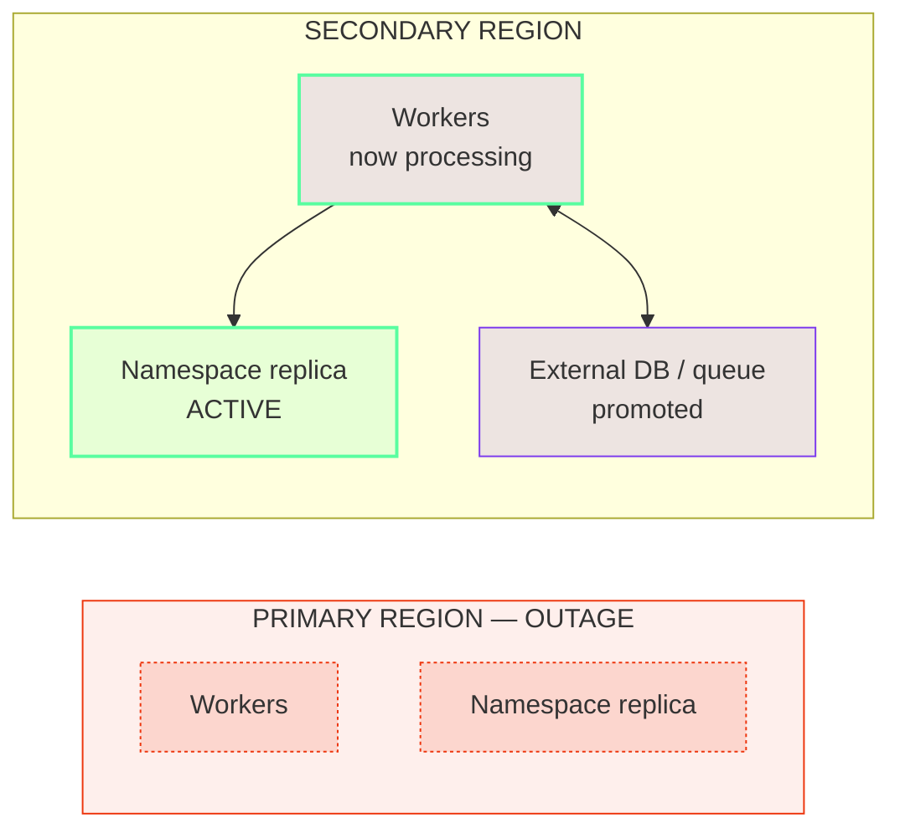
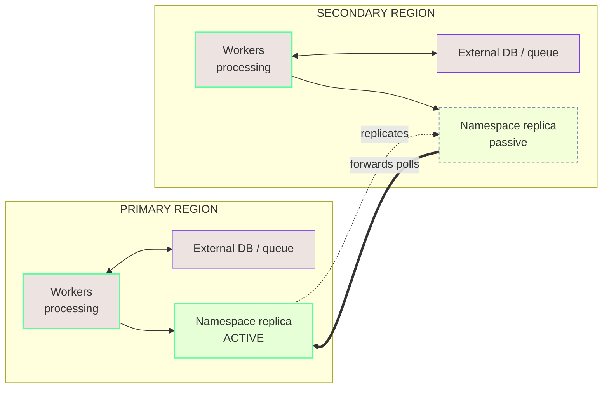
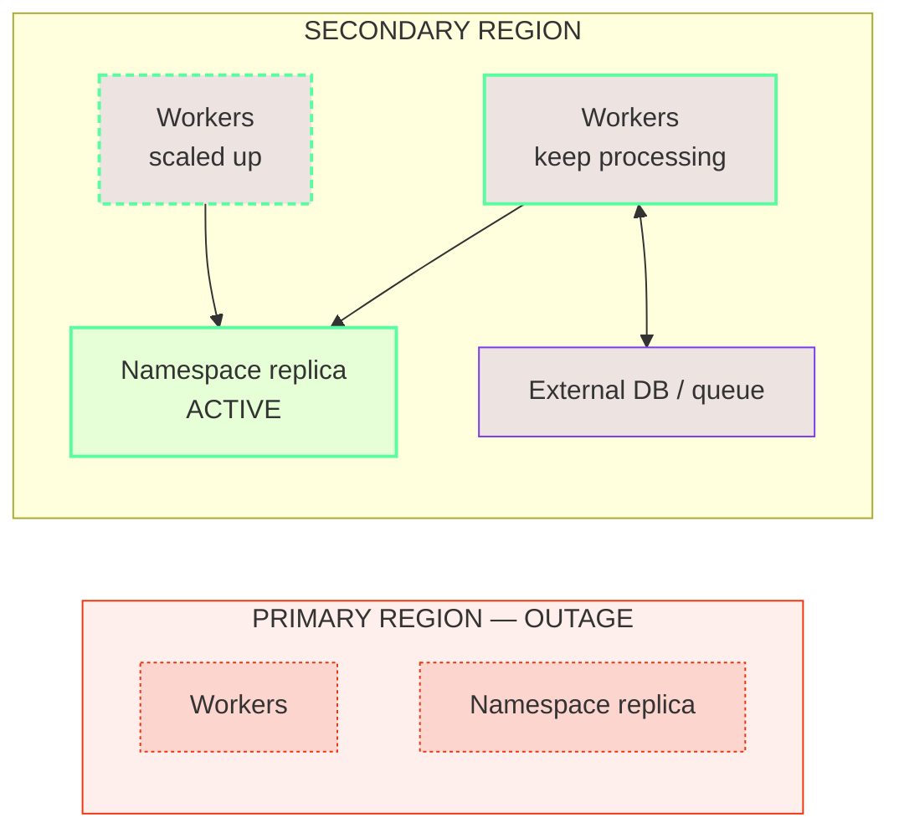
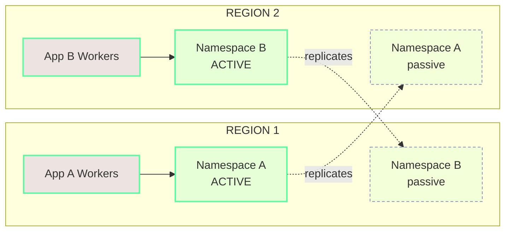
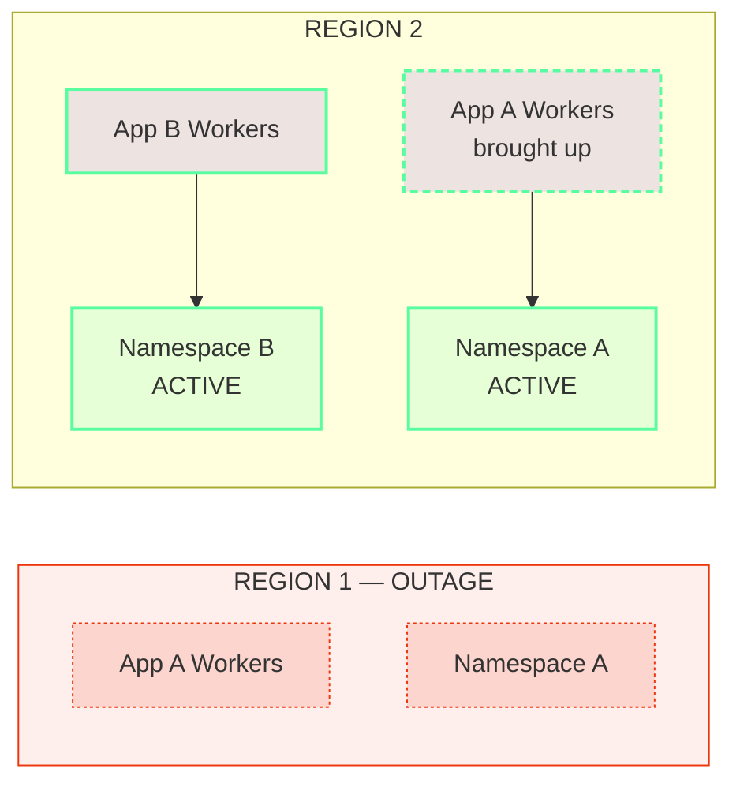

A Namespace with [High Availability features](/cloud/high-availability) fails over the Temporal Service automatically, but it does not move the rest of the architecture.
On failover, Temporal Cloud promotes the replica to active and reroutes the [Namespace Endpoint](/cloud/namespaces#access-namespaces). Workers, Workflow starters, Codec Servers, and the external systems that Workflows depend on each need their own failover story.

A critical piece of the [Recovery Time](/cloud/rpo-rto) achieved in a real-world outage is the **Worker deployment model**: where Worker fleets run and which region (or regions) processes Workflows at any given moment.
This page describes common patterns for deploying Workers and how the rest of the architecture fits into an overall High Availability strategy.

## Terminology {/* #terminology */}

This page uses two terms for the regions of a Namespace with High Availability:

- **Primary region** — the region where the Namespace is active during normal operation, also called the "preferred region."
- **Secondary region** — the region the Namespace fails over to. It holds a replica and is passive during normal operation.

:::info

**Namespaces are always active / passive, but can support an Active / Active pattern.** A Temporal Cloud Namespace with High Availability has exactly one active region at a time. The other region holds a replica that passively receives replicated state. However, Temporal Cloud Namespaces can still fit into a broader "Active / Active" strategy, as described below.

:::

A useful property to keep in mind: **Workers don't need to run in the same region as the active replica.** A Worker fleet in one region can poll a Namespace that is active in another.

## What needs a failover story {/* #what-needs-a-failover-story */}

Beyond the Namespace itself, these components live in the application environment and must be planned for:

- **Workers** — execute Workflows and Activities.
- **Workflow starters and Clients** — start and signal Workflows.
- **Codec Servers** — encode and decode payloads for Workers, the Web UI, and the CLI.
- **Proxies between Workers and Temporal Cloud** — any forward proxy or mTLS terminator in the connection path.
- **External databases and queues** — the systems that Activities read and write.

Some systems must be active wherever Workers are running (for example, Codec Servers), while others might follow a different failover sequence (for example, external databases).
The [Worker deployment patterns](#worker-deployment-patterns) below note when each piece needs to be running ahead of time versus scaled up after a failover.

## Worker deployment patterns {/* #worker-deployment-patterns */}

The models trade off three things: **Recovery Time** after an outage, **steady-state cost**, and **operational complexity**.
None is one-size-fits-all. Start with Active / Passive and move toward the others only when Recovery Time or latency requirements call for it.

The diagrams below use a shared visual language:

- A green border marks the **active** Temporal Cloud replica and the Workers processing against it.
- A muted dashed border marks the **passive** replica; a gold dashed border marks **idle** standby Workers.
- A purple fill marks application-owned systems (Workers, databases, queues).
- A red tint marks the region that is **down** during a failover.

### Active / Passive (recommended) {/* #active-passive */}

In an Active / Passive model, Workers are active in only one region at a time. This is the most common model and the recommended starting point.

It assumes the surrounding stack is also single-region-active at any moment: traffic routing, databases, and queues are all active in one region and fail over to the secondary region together with the Workers. There is no need to reason about two regions mutating the same external state at once.

Active / Passive has two flavors that trade cost against Recovery Time.

#### Active / Cold (most common) {/* #active-cold */}

Workers run **only in the primary region**. The secondary region holds the passive replica but runs none of the application's Workers.

**Steady state**

**Failover**

On failover, the Namespace is active in the secondary region immediately, but the Workers there start from nothing, a "cold" start.
Recovery Time includes container or VM startup, image pulls, and application warm-up before throughput returns to normal.

**Benefits**

- Simplest model to operate; in steady state it resembles a single-region deployment.
- Lowest steady-state cost: a single Worker fleet.

**Tradeoffs**

- Highest Recovery Time of the models here, gated by Worker startup in the secondary region.
- Depends on tested automation to bring up the secondary-region fleet quickly.

**Component behavior**

- **Workers** — run only in the primary region; brought up in the secondary region during a failover.
- **Workflow starters and Clients** — run with the Workers; brought up in the secondary region during a failover.
- **Codec Servers and proxies** — run alongside the active Workers; scaled up in the secondary region as part of a failover.
- **External databases and queues** — single-region-active; fail over to the secondary region alongside the Workers.

#### Active / Hot {/* #active-hot */}

Workers are deployed in **both regions**, but only the active region processes Workflows. The secondary-region Workers stay connected and warm, yet idle.

This is achieved by disabling forwarding for Worker polls and connecting each fleet to its local replica through a [Regional Endpoint](/cloud/high-availability/ha-connectivity#regional-endpoint) or [VPC Endpoint](/cloud/high-availability/ha-connectivity).
With forwarding disabled, polls that reach the passive replica are not sent to the active region, so the idle fleet does no work and adds no cross-region overhead.

**Steady state**

**Failover**

Failover is near-instant: the Namespace failover and the Worker "failover" happen together and automatically, with no DNS wait and no cold start. The previously idle fleet begins processing the moment the secondary region becomes active, so this model achieves the lowest Recovery Time.

**Benefits**

- Lowest Recovery Time: the secondary-region Workers are already connected and warm.
- Low steady-state latency: Tasks are processed only in the active region, with no cross-region forwarding.

**Tradeoffs**

- Highest steady-state cost: idle Worker capacity runs in the secondary region at all times.
- Requires Regional Endpoints or VPC Endpoints and the `disablePassivePollerForwarding` setting. Using the Namespace Endpoint by mistake routes the standby Workers to the active region and defeats the pattern.

**Component behavior**

- **Workers** — run in both regions; only the active region processes Workflows.
- **Workflow starters and Clients** — run in both regions alongside the Workers.
- **Codec Servers and proxies** — run in both regions continuously, not just after a failover.
- **External databases and queues** — typically single-region-active; fail over alongside the active Workers.

:::tip Disabling forwarding

To stop forwarding Worker polls to the active region, see [Change the forwarding behavior](/cloud/high-availability/enable#change-forwarding-behavior).

:::

### Active / Active {/* #active-active */}

In this model, Workers run in **both regions and process Workflows at the same time**, with forwarding left enabled (the default).

A Temporal Cloud Namespace is not "active/active" in the database sense; it still has a single active replica in one region.
Because the passive replica transparently forwards requests to and from the active region, a Worker fleet in either region can process Workflows. The secondary fleet's polls are forwarded across regions to the active replica.

**Steady state**

**Failover**

This is a practical way to reach a low Recovery Time at balanced cost. Roughly half the fleet runs in each region, and capacity is added to the surviving region during an outage to reach full throughput.
Unlike Active / Cold, Workflows keep processing in the surviving region while capacity scales up, so there is no cold-start gap.

**Benefits**

- Low Recovery Time: the surviving region keeps processing while capacity scales up.
- Balanced cost: roughly half the fleet runs in each region during normal operation.

**Tradeoffs**

- The secondary region pays cross-region latency, because its polls are forwarded to the active replica. This can be a problem for latency-sensitive Workflows.
- Synchronizing external systems is harder, because Workers are active in both regions at once.

**Component behavior**

- **Workers** — run and process in both regions; the secondary region's polls are forwarded to the active replica.
- **Workflow starters and Clients** — run in both regions.
- **Codec Servers and proxies** — run in both regions continuously.
- **External databases and queues** — accessed from both regions; cross-region consistency must be designed for.

### Dual Active (Multi-Active) {/* #dual-active */}

Some architectures need low-latency or region-bound data in *each* region at once. This can be achieved with **two Namespaces whose active and passive regions overlap**: each region holds one Namespace's active replica and the other Namespace's passive replica.

**Steady state**

**Failover (Region 1 outage)**

Each Namespace serves low-latency requests or a regionally-bound database in its own active region, and fails over to the other region during an outage. The same idea extends across more than two regions. Each Namespace fails over independently, following the Active / Passive sequence.

Workloads on Temporal rarely need this. It pays off only when a workload is *both* extremely latency-sensitive across several same-continent regions *and* needs multi-region disaster recovery, an uncommon combination.

**Benefits**

- Low-latency, region-bound data in each region during normal operation.
- Each Namespace fails over independently, like Active / Passive.

**Tradeoffs**

- Highest cost and operational complexity: two Worker fleets and two Namespaces.
- Rarely justified. Temporal recommends modeling each Namespace as an **independent Active / Passive deployment**, with its own Worker pools and failover procedures, rather than coupling them.

**Component behavior**

- **Workers** — one fleet per application, each active in its Namespace's region.
- **Workflow starters and Clients** — run with each application's Workers.
- **Codec Servers and proxies** — run in both regions, for both Namespaces.
- **External databases and queues** — region-bound per application; each fails over with its Namespace.

## Choose a deployment model {/* #choose */}

| Model | Recovery Time | Steady-state cost | Best when |
| --- | --- | --- | --- |
| **Active / Cold** | Highest (cold start in secondary) | Lowest (one fleet) | Adopting High Availability with the simplest operating model. |
| **Active / Hot** | Lowest (warm, no DNS wait) | Higher (idle fleet) | The lowest Recovery Time is required and the data plane is pinned to one region at a time. |
| **Active / Active** | Low (surviving region keeps processing) | Higher (two live fleets) | Low Recovery Time at balanced cost, where the secondary region can tolerate cross-region latency. |
| **Dual Active** | Low (per Namespace) | Highest (two fleets, two Namespaces) | Low-latency, region-bound data is genuinely required in each region. Rare. |

## The rest of the architecture {/* #rest-of-architecture */}

The Worker model sets the pattern; the supporting pieces follow it.

- **Workflow starters and Clients.** Deploy these with the same regional pattern as the Workers, since a starter or Client often shares the same in-region dependencies (databases, queues, upstream services) and should fail over alongside them. Point Clients at the Namespace Endpoint so they follow the active region automatically with no configuration change on failover, and use a [Regional Endpoint](/cloud/high-availability/ha-connectivity#regional-endpoint) only when a Client must be pinned to a region.
- **Codec Servers and proxies.** Anything in the connection path between Workers and Temporal Cloud must be reachable from every region where Workers connect. In Active / Cold, scale them up in the secondary region as part of a failover; in the hot and active/active models, run them in both regions at all times.
- **External databases and queues.** These remain the application's responsibility, and the right approach depends on the Worker model: a single-region-active datastore pairs naturally with Active / Passive, while running Workers active in both regions raises consistency questions that must be designed for. Detailed guidance is out of scope for this page.

## Related {/* #related */}

To add a replica and turn on High Availability features, see [Enable and manage High Availability](/cloud/high-availability/enable).

To choose between the Namespace Endpoint and Regional Endpoints and to set up private connectivity, see [Connectivity for High Availability](/cloud/high-availability/ha-connectivity).

To stop forwarding Worker polls to the active region for the Active / Hot model, see [Change the forwarding behavior](/cloud/high-availability/enable#change-forwarding-behavior).

To trigger and manage failovers, see [Failovers](/cloud/high-availability/failovers).

To understand the recovery objectives each model is measured against, see [RPO and RTO](/cloud/rpo-rto).
