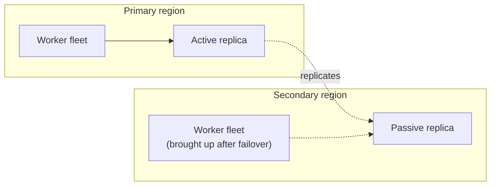
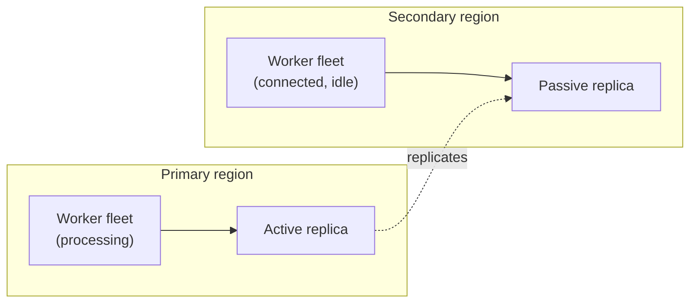
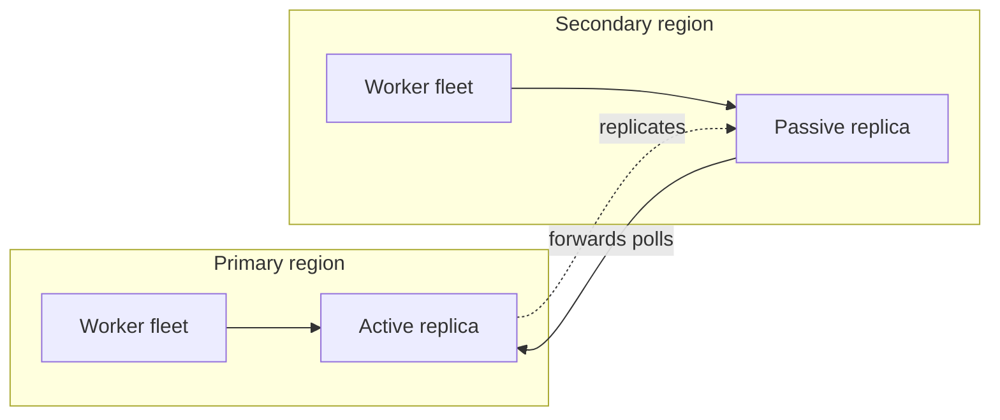
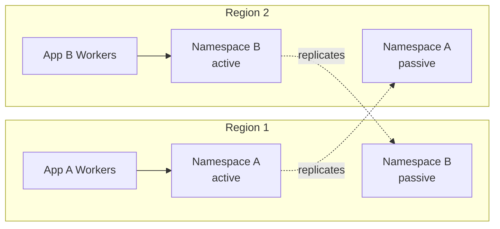

A Namespace with [High Availability features](/cloud/high-availability) fails over the Temporal Service for you, but it can't move the rest of your architecture.
On failover, Temporal Cloud promotes the replica to active and reroutes your [Namespace Endpoint](/cloud/namespaces#access-namespaces) — but your Workers, Workflow starters, Codec Servers, and the external systems your Workflows depend on each need their own failover story.

A critical piece of the [Recovery Time](/cloud/rpo-rto) achieved in a real-world outage is the **Worker deployment model**: where Worker fleets run and which region (or regions) processes Workflows at any given moment.
This page describes common patterns for deploying Workers and how the rest of your architecture fits into an overall High Availability strategy.

## Terminology {/* #terminology */}

This page uses two terms for the regions of a Namespace with High Availability:

- **Primary region** — the region where the Namespace is active during normal operation, also called the "preferred region."
- **Secondary region** — the region the Namespace fails over to. It holds a replica and is passive during normal operation.

:::info

**Namespaces are always active / passive, but can support an Active / Active pattern.** A Temporal Cloud Namespace with High Availability has exactly one active region at a time. The other region holds a replica that passively receives replicated state. However, Temporal Cloud Namespaces can still fit into a broader "Active / Active" strategy, as described below.

:::

A useful property to keep in mind: **Workers don't need to run in the same region as the active replica.** A Worker fleet in one region can poll a Namespace that is active in another.

## What needs a failover story {/* #what-needs-a-failover-story */}

Beyond the Namespace itself, these components live in your environment and have to be planned for:

- **Workers** — execute your Workflows and Activities. Covered in depth below.
- **Workflow starters and Clients** — start and signal Workflows. Point these at the Namespace Endpoint so they follow the active region automatically.
- **Codec Servers** — encode and decode payloads for the Web UI and CLI. These sit alongside the region a Worker or operator connects through.
- **Proxies between your Workers and Temporal Cloud** — any forward proxy or mTLS terminator in the connection path.
- **External databases and queues** — the systems your Activities read and write.

Codec Servers and proxies sit in the request path between your Workers and Temporal Cloud, so they must be available wherever your Workers connect from.
The rule of thumb for every model: a Codec Server and any proxy must be running in each region where Workers actively connect, and must scale with the active region.
The [Worker deployment patterns](#worker-deployment-patterns) below note when each piece needs to be running ahead of time versus scaled up after a failover.

## Worker deployment patterns {/* #worker-deployment-patterns */}

The models trade off three things: **Recovery Time** after an outage, **steady-state cost**, and **operational complexity**.
None is one-size-fits-all. Start with Active / Passive and move toward the others only when your Recovery Time or latency requirements call for it.

### Active / Passive (recommended) {/* #active-passive */}

Workers are active in only one region at a time. This is the most common model and the recommended starting point.

It assumes the rest of your stack is also single-region-active at any moment: traffic routing, databases, and queues are all active in one region and fail over to the secondary region together with your Workers.
You don't have to reason about two regions mutating the same external state at once.

Codec Servers and proxies follow the active region. They run in whichever region currently holds your active Workers and scale up in the secondary region as part of a failover.

Active / Passive comes in two flavors that trade cost against Recovery Time.

#### Active / Cold (most common) {/* #active-cold */}

Workers run **only in the primary region**. The secondary region runs the passive replica but none of your Workers.

On failover, the Namespace is ready in the secondary region immediately, but your Workers start there from nothing — a "cold" start.
Recovery Time includes container or VM startup, image pulls, and application warm-up before throughput returns to normal.
Because Workers need them, your Codec Server and any Worker proxies also have to be scaled up in the secondary region after the failover.

This is the simplest model to operate — in steady state it looks like a single-region deployment — and the cheapest, since you pay for one Worker fleet. The trade-off is the highest Recovery Time of the models here, so invest in tested automation to bring up the secondary-region fleet quickly.

#### Active / Hot {/* #active-hot */}

Workers are deployed in **both regions**, but only the active region processes Workflows. The secondary-region Workers stay connected and warm, yet idle.

You achieve this by disabling forwarding for Worker polls and connecting each fleet to its local replica through a [Regional Endpoint](/cloud/high-availability/ha-connectivity#regional-endpoint) or [VPC Endpoint](/cloud/high-availability/ha-connectivity).
With forwarding disabled, polls that reach the passive replica are not sent to the active region, so the idle fleet does no work and adds no cross-region overhead.

This makes failover a breeze: the Namespace failover and the Worker "failover" happen together and automatically, with no DNS wait and no cold start. The previously idle fleet begins processing the instant the secondary region becomes active, so this model achieves the lowest Recovery Time.

The trade-off is cost: you pay for idle Worker capacity in the secondary region at all times. For the same reason, your Codec Servers and proxies must run in **both regions continuously**, not just after a failover.

Active / Hot is recommended when you need the lowest possible Recovery Time and can absorb the cost of idle capacity.

:::tip Disabling forwarding

To stop forwarding Worker polls to the active region, see [Change the forwarding behavior](/cloud/high-availability/enable#change-forwarding-behavior).

:::

### Active / Active {/* #active-active */}

In this model, Workers run in **both regions and process Workflows at the same time**, with forwarding left enabled (the default).

A Temporal Cloud Namespace is not "active/active" in the database sense — it still has a single active replica in one region.
But because the passive replica transparently forwards requests to and from the active region, the Namespace fits into a broader active/active architecture: a Worker fleet in either region can process Workflows, and the secondary fleet's polls are forwarded across regions to the active replica.

This is a practical way to get a low Recovery Time while balancing cost. You can run roughly half your fleet in each region, then add capacity to the surviving region during an outage to reach full throughput.
Unlike Active / Cold, Workflows keep processing in the surviving region while you scale up, so there is no cold-start gap.

The trade-offs are integration and latency:

- **Synchronizing with external systems is harder.** With Workers active in both regions, external systems such as databases and queues are trickier to keep consistent than in a single-region-active model.
- **The secondary region pays cross-region latency.** Polls from the secondary-region fleet are forwarded to the active replica, so that region sees higher latency. This can be a problem for latency-sensitive Workflows.

As with the other multi-region models, Codec Servers and proxies must run in both regions at all times.

### Dual Active (Multi-Active) {/* #dual-active */}

Some architectures need low-latency or region-bound data in *each* region at once. You can achieve this with **two Namespaces whose active and passive regions overlap**: each region holds one Namespace's active replica and the other Namespace's passive replica.

Each Namespace serves low-latency requests or a regionally-bound database in its own active region, and fails over to the other region during an outage. You can extend the same idea across more than two regions.

Workloads on Temporal rarely need this. It only pays off when a workload is *both* extremely latency-sensitive across several same-continent regions *and* needs multi-region disaster recovery, which is an uncommon combination.
We recommend treating each Namespace as an **independent Active / Passive deployment**, with its own Worker pools and failover procedures, rather than coupling them.

## Choose a deployment model {/* #choose */}

| Model | Recovery Time | Steady-state cost | Best when |
| --- | --- | --- | --- |
| **Active / Cold** | Highest (cold start in secondary) | Lowest (one fleet) | You're adopting HA and want the simplest operating model. |
| **Active / Hot** | Lowest (warm, no DNS wait) | Higher (idle fleet) | You need the lowest Recovery Time and your data plane is pinned to one region at a time. |
| **Active / Active** | Low (surviving region keeps processing) | Higher (two live fleets) | You want low Recovery Time at balanced cost and can tolerate cross-region latency on the secondary region. |
| **Dual Active** | Low (per Namespace) | Highest (two fleets, two Namespaces) | You truly need low-latency, region-bound data in each region. Rare. |

## The rest of your architecture {/* #rest-of-architecture */}

The Worker model sets the pattern; these supporting pieces follow it.

- **Workflow starters and Clients.** Point Clients at the Namespace Endpoint so they follow the active region automatically with no configuration change on failover. Use a [Regional Endpoint](/cloud/high-availability/ha-connectivity#regional-endpoint) only when you deliberately need to pin a Client to a region.
- **Codec Servers and proxies.** Anything in the connection path between your Workers and Temporal Cloud must be reachable from every region where Workers connect. In Active / Cold, scale them up in the secondary region as part of a failover; in the hot and active/active models, run them in both regions at all times.
- **External databases and queues.** These remain your responsibility and the right approach depends on your Worker model: a single-region-active datastore pairs naturally with Active / Passive, while running Workers active in both regions raises consistency questions you must design for. Detailed guidance is out of scope for this page.

## Related {/* #related */}

To add a replica and turn on High Availability features, see [Enable and manage High Availability](/cloud/high-availability/enable).

To choose between the Namespace Endpoint and Regional Endpoints and to set up private connectivity, see [Connectivity for High Availability](/cloud/high-availability/ha-connectivity).

To stop forwarding Worker polls to the active region for the Active / Hot model, see [Change the forwarding behavior](/cloud/high-availability/enable#change-forwarding-behavior).

To trigger and manage failovers, see [Failovers](/cloud/high-availability/failovers).

To understand the recovery objectives each model is measured against, see [RPO and RTO](/cloud/rpo-rto).
