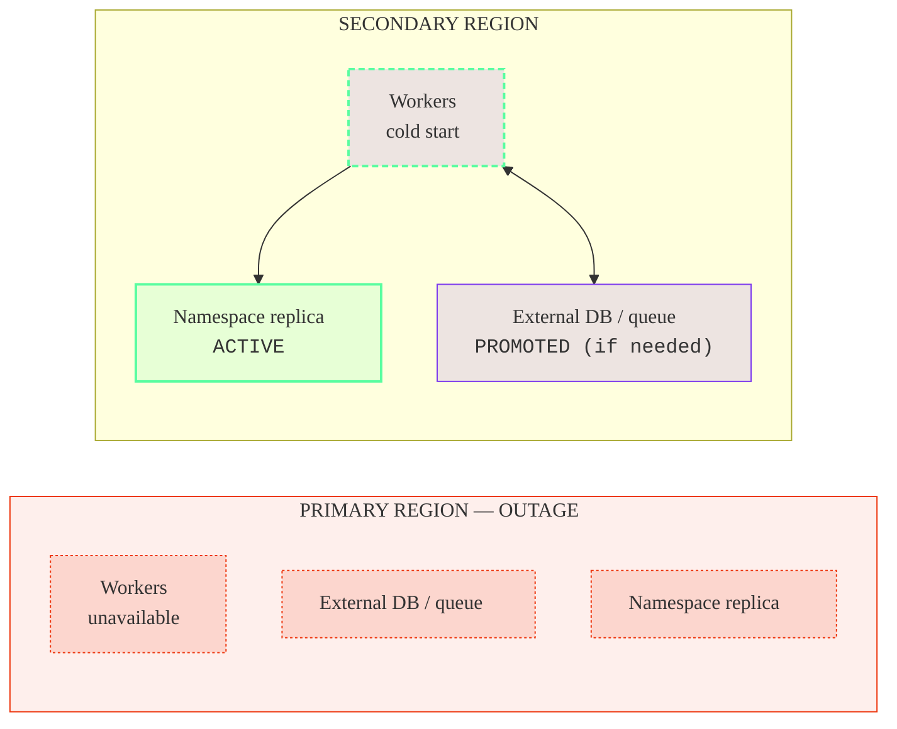
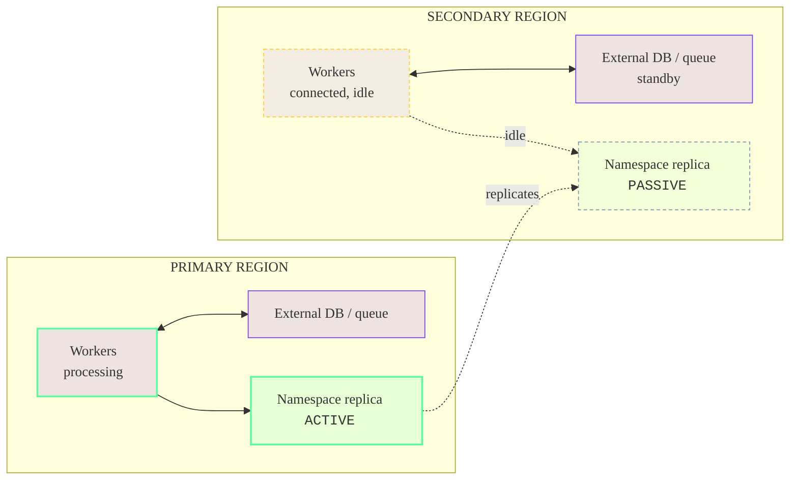
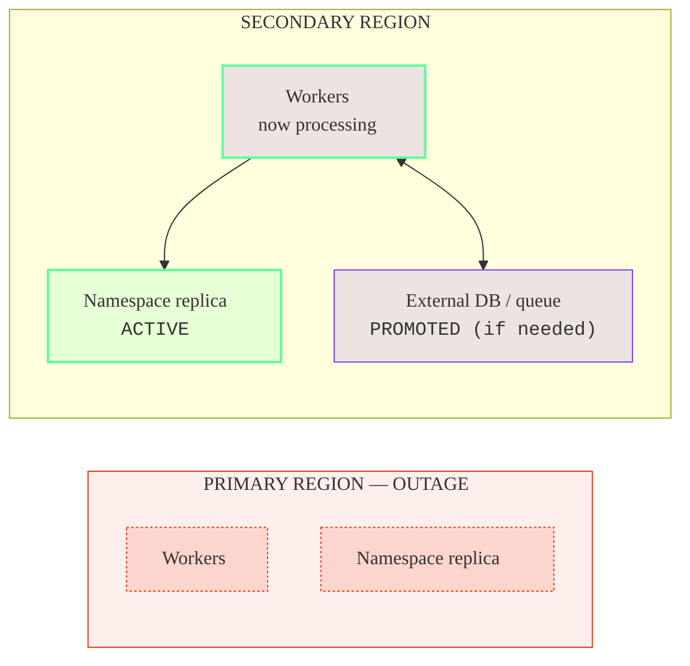
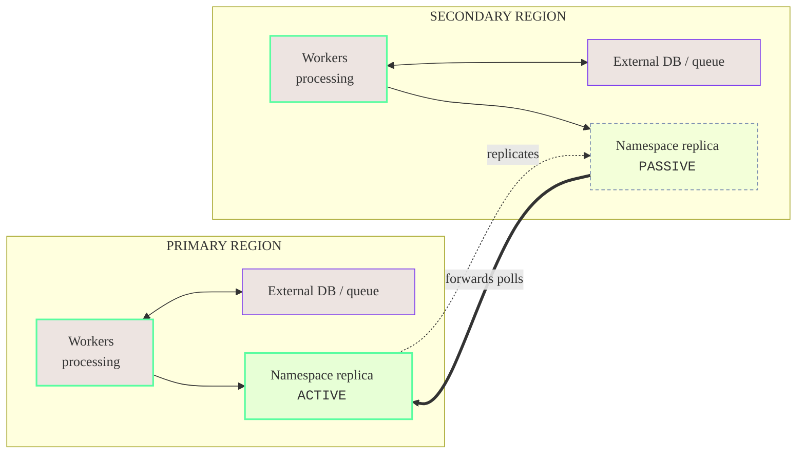
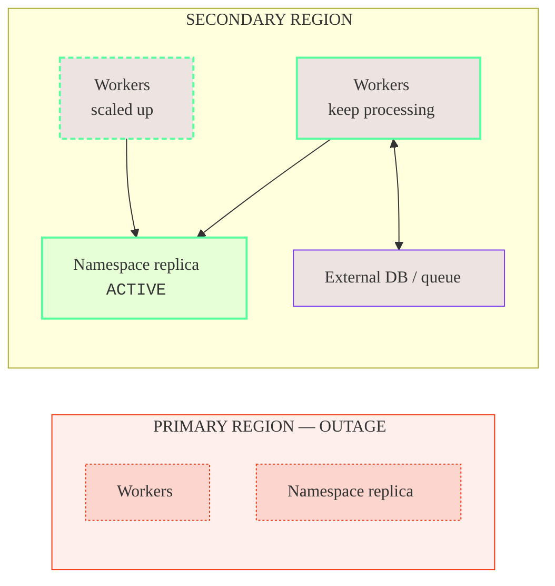
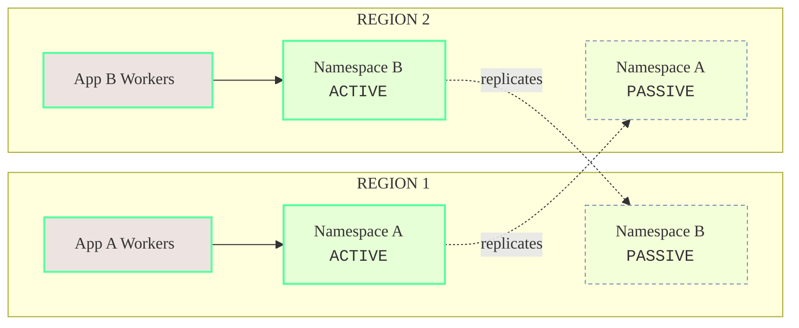
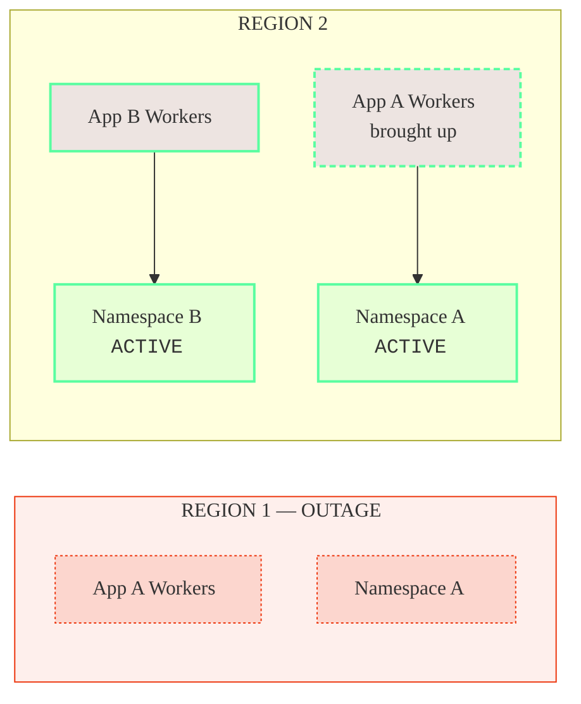

When an outage strikes, a Namespace with [High Availability](/cloud/high-availability) fails over to another region automatically, but it does not move the rest of the architecture.
Workers, Workflow starters, Codec Servers, databases, and the external systems that Workflows depend on each need their own failover story.

A critical piece of the [recovery time](/cloud/rpo-rto) achieved in a real-world outage is the **Worker deployment pattern**: where Worker fleets run and which region (or regions) processes Workflows at any given moment.
This page describes common patterns for deploying Workers and the rest of the architecture to achieve an overall High Availability strategy.

## Terminology {/* #terminology */}

This page presumes familiarity with [High Availability for Temporal Cloud Namespaces](/cloud/high-availability), including replicas, active and passive regions, replication, and failover.

It uses two terms for the regions of a Namespace with High Availability:

- **Primary region** — the region where the Namespace is active during normal operation, also called the "preferred region."
- **Secondary region** — the region the Namespace fails over to. It holds a replica and is passive during normal operation.

It also uses these names for the Worker deployment patterns, each detailed in [Worker deployment patterns](#worker-deployment-patterns):

- **Active / Passive** — Workflows process in one region at a time. It has two variants:
  - **[Active / Cold](#active-cold)** — Workers run in one region at a time and Workflows process in one region, both the user's responsibility to enforce. After a failover, Workers start in the secondary region.
  - **[Active / Hot](#active-hot)** — Workers run in both regions, but the system guarantees Workflows process in only the active region.
- **[Active / Active](#active-active)** — Workers run in both regions, and Workflows process in both regions at the same time.

:::info

**Namespaces are always Active / Passive, but can support an Active / Active pattern.** 

A Temporal Cloud Namespace with High Availability has exactly one active region at a time. The other region holds a replica that passively receives replicated state.

However, since both regions can serve requests and Worker polls, Temporal Cloud Namespaces can still fit into a broader "Active / Active" strategy, as described below.

:::

A useful property to keep in mind: **Workers don't need to run in the same region as the active replica.** A Worker fleet in one region can poll a Namespace that is active in another.

## What needs a failover story {/* #what-needs-a-failover-story */}

Beyond the Namespace itself, these components live in the application environment and must be planned for:

- **Workers** — execute Workflows and Activities.
- **Workflow starters and Clients** — start and signal Workflows.
- **Codec Servers** — encode and decode payloads for Workers, the Web UI, and the CLI.
- **Proxies between Workers and Temporal Cloud** — any forward proxy or mTLS terminator in the connection path.
- **External databases and queues** — the systems that Activities read and write.

Some systems must be active wherever Workers are running (for example, Codec Servers), while others might follow a different failover sequence (for example, external databases).
The [Worker deployment patterns](#worker-deployment-patterns) below note when each piece needs to be running ahead of time versus scaled up after a failover.

## Worker deployment patterns {/* #worker-deployment-patterns */}

This page covers three main patterns — **Active / Passive (Cold)**, **Active / Passive (Hot)**, and **Active / Active** — plus a rarely needed **Dual Active** variant.
They trade off **recovery time** after an outage, **steady-state cost**, and **operational complexity**.

Temporal recommends starting with **Active / Passive (Cold)** and shifting to another pattern when business requirements warrant it.

| Pattern | Best for | Major benefits | Major tradeoffs |
| --- | --- | --- | --- |
| **[Active / Passive (Cold)](#active-cold)** | Easy initial deployment | Acts like a single region; no special setup required | Failing over Workers is the user's responsibility |
| **[Active / Passive (Hot)](#active-hot)** | Low RTO with strict single-region behavior | Fast Worker failover; guaranteed to act like a single region | More configuration and higher cost for the Worker fleet |
| **[Active / Active](#active-active)** | Low RTO with Workers active in multiple regions | Fast Worker failover; uses Worker fleet capacity (no idle standby) | Cross-region requests add Workflow latency |

The diagrams below use a shared visual language:

- A green border marks the **active** Temporal Cloud replica and the Workers processing against it.
- A muted dashed border marks the **passive** replica; a gold dashed border marks **idle** standby Workers.
- A purple fill marks application-owned systems (Workers, databases, queues).
- A red tint marks the region that is **down** during a failover.

### Active / Passive (Cold) {/* #active-cold */}

_Also known as Active / Cold Standby, Active / Cold, or simply Active / Passive. Recommended and simplest._

Workers run **only in the primary region**. The secondary region holds the passive replica but runs none of the application's Workers.

**Steady state**

```mermaid
%%{init: {'themeVariables':{'fontFamily':'Inter, ui-sans-serif, system-ui, sans-serif'},'flowchart':{'nodeSpacing':45,'rankSpacing':70,'curve':'basis'}}}%%
flowchart LR
  classDef tcloud fill:#59FDA024,stroke:#59FDA0,stroke-width:2px;
  classDef tpassive fill:#59FDA012,stroke:#7C8FB1,stroke-width:1px,stroke-dasharray:4 3;
  classDef wactive fill:#7C3AED22,stroke:#59FDA0,stroke-width:2px;
  classDef wnew fill:#7C3AED22,stroke:#59FDA0,stroke-width:2px,stroke-dasharray:5 3;
  classDef ext fill:#7C3AED22,stroke:#7C3AED,stroke-width:1px;
  subgraph P["PRIMARY REGION"]
    direction TB
    W1["Workers<br/>processing"]:::wactive
    DB1["External DB / queue"]:::ext
    R1["Namespace replica<br/><samp>ACTIVE</samp>"]:::tcloud
  end
  subgraph S["SECONDARY REGION"]
    direction TB
    DB2["External DB / queue"]:::ext
    R2["Namespace replica<br/><samp>PASSIVE</samp>"]:::tpassive
  end
  W1 --> R1
  W1 <--> DB1
  DB1 <-->|replication (if needed)| DB2
  R1 -. replicates .-> R2
```

**Failover**



On failover, the Namespace is active in the secondary region immediately, but the Workers there start from nothing, a "cold" start.
Recovery time includes container or VM startup, image pulls, and application warm-up before throughput returns to normal.

**Benefits**

- **Easy to reason about.** Only one region is active at a time, so traffic routing and interactions with external systems (such as databases and queues) are simpler to understand, and the pattern pairs naturally with other active / passive systems. Active / Active, by contrast, requires deciding how Workers reach an active database: either a local active database in each region, or a single active / passive database that some Workers must reach cross-region.
- Simplest pattern to operate; in steady state it resembles a single-region deployment.
- Lowest steady-state cost: a single Worker fleet.

**Tradeoffs**

- Highest recovery time of the patterns here, gated by Worker startup in the secondary region.
- Depends on tested automation to bring up the secondary-region fleet quickly.

**Recommendations and important constraints**

- **Use the Namespace Endpoint.** Connect Workers through the Namespace Endpoint rather than a Regional Endpoint. If an error affects only the Namespace and the primary region's Workers stay healthy, the Namespace Endpoint follows the failover and those Workers reach the new active region cross-region. With private connectivity, the Workers need a network route to the cross-region VPC Endpoint. The alternative is to fail over the Workers and all of their dependencies whenever the Namespace fails over, so that no request crosses regions.
- **Route Workers to the active region's Codec Server and proxy.** There are two common approaches:
   1. Put DNS or a load balancer in front of the Codec Server and proxy address, and update it on failover to point at the new region's instances.
   2. Pass each Worker the Codec Server and proxy address for its own region as configuration, so a Worker always uses the service local to it. This is common in Kubernetes or with service discovery.
- **Single-region processing is the operator's responsibility.** To run Workers in only one region at a time, scale them down in the primary region before scaling them up in the secondary region. To enforce single-region processing within Temporal, use the [Active / Passive (Hot)](#active-hot) pattern instead.

**Component behavior**

- **Workers** — run only in the primary region; brought up in the secondary region during a failover.
- **Workflow starters and Clients** — run with the Workers; brought up in the secondary region during a failover.
- **Codec Servers and proxies** — run alongside the active Workers; scaled up in the secondary region as part of a failover.
- **External databases and queues** — single-region-active; fail over to the secondary region alongside the Workers.

### Active / Passive (Hot) {/* #active-hot */}

_Also known as Active / Hot Standby or Active / Hot._

Workers are deployed in **both regions**, but only the active region processes Workflows. The secondary-region Workers stay connected and warm, yet idle.

This is achieved by disabling forwarding for Worker polls and connecting each fleet to its local replica through a [Regional Endpoint](/cloud/high-availability/ha-connectivity#regional-endpoint) or [VPC Endpoint](/cloud/high-availability/ha-connectivity).
With forwarding disabled, polls that reach the passive replica are not sent to the active region, so the idle fleet does no work and adds no cross-region overhead.

**Steady state**



**Failover**



Failover is near-instant: the Namespace failover and the Worker "failover" happen together and automatically, with no DNS wait and no cold start. The previously idle fleet begins processing the moment the secondary region becomes active, so this pattern achieves the lowest recovery time.

**Benefits**

- **Easy to reason about.** Only one region is active at a time, so traffic routing and interactions with external systems (such as databases and queues) are simpler to understand, and the pattern pairs naturally with other active / passive systems. Active / Active, by contrast, requires deciding how Workers reach an active database: either a local active database in each region, or a single active / passive database that some Workers must reach cross-region.
- Lowest recovery time: the secondary-region Workers are already connected and warm.
- Low steady-state latency: Tasks are processed only in the active region, with no cross-region forwarding.

**Tradeoffs**

- Highest steady-state cost: idle Worker capacity runs in the secondary region at all times.

**Recommendations and important constraints**

- Connect each Worker fleet through its region's [Regional Endpoint](/cloud/high-availability/ha-connectivity#regional-endpoint) (or VPC Endpoint) and [disable forwarding](/cloud/high-availability/enable#change-forwarding-behavior) for Worker polls. Using the Namespace Endpoint by mistake routes the standby Workers to the active region and defeats the pattern.

**Component behavior**

- **Workers** — run in both regions; only the active region processes Workflows.
- **Workflow starters and Clients** — run in both regions alongside the Workers.
- **Codec Servers and proxies** — run in both regions continuously, not just after a failover.
- **External databases and queues** — typically single-region-active; fail over alongside the active Workers.

### Active / Active {/* #active-active */}

Workers run in **both regions and process Workflows at the same time**, with forwarding left enabled (the default).

A Temporal Cloud Namespace is not "active/active" in the database sense; it still has a single active replica in one region.
Because the passive replica transparently forwards requests to and from the active region, a Worker fleet in either region can process Workflows. The secondary fleet's polls are forwarded across regions to the active replica.

**Steady state**



**Failover**



This is a practical way to reach a low recovery time at balanced cost. Roughly half the fleet runs in each region, and capacity is added to the surviving region during an outage to reach full throughput.
Unlike Active / Passive (Cold), Workflows keep processing in the surviving region while capacity scales up, so there is no cold-start gap.

**Benefits**

- Low recovery time: the surviving region keeps processing while capacity scales up.
- Balanced cost: roughly half the fleet runs in each region during normal operation.

**Tradeoffs**

- The secondary region pays cross-region latency, because its polls are forwarded to the active replica. This can be a problem for latency-sensitive Workflows.
- Synchronizing external systems is harder, because Workers are active in both regions at once.

**Recommendations and important constraints**

- Keep forwarding enabled (the default) so the secondary-region Workers' polls reach the active replica. Do not set `disablePassivePollerForwarding`.

**Component behavior**

- **Workers** — run and process in both regions; the secondary region's polls are forwarded to the active replica.
- **Workflow starters and Clients** — run in both regions.
- **Codec Servers and proxies** — run in both regions continuously.
- **External databases and queues** — accessed from both regions; cross-region consistency must be designed for.

### Dual Active (Multi-Active) {/* #dual-active */}

Beyond the three main patterns, some architectures need low-latency or region-bound data in *each* region at once. This can be achieved with **two Namespaces whose active and passive regions overlap**: each region holds one Namespace's active replica and the other Namespace's passive replica.

**Steady state**



**Failover (Region 1 outage)**



Each Namespace serves low-latency requests or a regionally-bound database in its own active region, and fails over to the other region during an outage. The same idea extends across more than two regions. Each Namespace fails over independently, following the Active / Passive sequence.

Workloads on Temporal rarely need this. It pays off only when a workload is *both* extremely latency-sensitive across several same-continent regions *and* needs multi-region disaster recovery, an uncommon combination.

**Benefits**

- Low-latency, region-bound data in each region during normal operation.
- Each Namespace fails over independently, like Active / Passive.

**Tradeoffs**

- Highest cost and operational complexity: two Worker fleets and two Namespaces.
- Rarely justified. Temporal recommends treating each Namespace as an **independent Active / Passive deployment**, with its own Worker pools and failover procedures, rather than coupling them.

**Component behavior**

- **Workers** — one fleet per application, each active in its Namespace's region.
- **Workflow starters and Clients** — run with each application's Workers.
- **Codec Servers and proxies** — run in both regions, for both Namespaces.
- **External databases and queues** — region-bound per application; each fails over with its Namespace.

## Choose a deployment pattern {/* #choose */}

| Pattern | Recovery time | Steady-state cost | Best when |
| --- | --- | --- | --- |
| **Active / Passive (Cold)** | Highest (cold start in secondary) | Lowest (one fleet) | Adopting High Availability with the simplest operations. |
| **Active / Passive (Hot)** | Lowest (warm, no DNS wait) | Higher (idle fleet) | The lowest recovery time is required and the data plane is pinned to one region at a time. |
| **Active / Active** | Low (surviving region keeps processing) | Higher (two live fleets) | Low recovery time at balanced cost, where the secondary region can tolerate cross-region latency. |
| **Dual Active** | Low (per Namespace) | Highest (two fleets, two Namespaces) | Low-latency, region-bound data is genuinely required in each region. Rare. |

## The rest of the architecture {/* #rest-of-architecture */}

The Worker deployment pattern sets the approach; the supporting pieces follow it.

- **Workflow starters and Clients.** Deploy these with the same regional pattern as the Workers, since a starter or Client often shares the same in-region dependencies (databases, queues, upstream services) and should fail over alongside them. Point Clients at the Namespace Endpoint so they follow the active region automatically with no configuration change on failover, and use a [Regional Endpoint](/cloud/high-availability/ha-connectivity#regional-endpoint) only when a Client must be pinned to a region.
- **Codec Servers and proxies.** Anything in the connection path between Workers and Temporal Cloud must be reachable from every region where Workers connect. In Active / Passive (Cold), scale them up in the secondary region as part of a failover; in the Active / Passive (Hot) and Active / Active patterns, run them in both regions at all times.
- **External databases and queues.** These remain the application's responsibility, and the right approach depends on the Worker deployment pattern: a single-region-active datastore pairs naturally with Active / Passive, while running Workers active in both regions raises consistency questions that must be designed for. Detailed guidance is out of scope for this page.

## Related {/* #related */}

To add a replica and turn on High Availability features, see [Enable and manage High Availability](/cloud/high-availability/enable).

To choose between the Namespace Endpoint and Regional Endpoints and to set up private connectivity, see [Connectivity for High Availability](/cloud/high-availability/ha-connectivity).

To stop forwarding Worker polls to the active region for the Active / Passive (Hot) pattern, see [Change the forwarding behavior](/cloud/high-availability/enable#change-forwarding-behavior).

To trigger and manage failovers, see [Failovers](/cloud/high-availability/failovers).

To understand the recovery objectives each pattern is measured against, see [RPO and RTO](/cloud/rpo-rto).
