When an outage strikes, a Namespace with [High Availability](/cloud/high-availability) fails over to another region automatically, but it does not move the rest of the architecture.
Workers, Workflow starters, Codec Servers, databases, and the external systems that Workflows depend on each need their own failover story.

A critical piece of the [recovery time](/cloud/rpo-rto) achieved in a real-world outage is the **Worker deployment pattern**: where Worker fleets run and which region (or regions) processes Workflows at any given moment.
This page describes common patterns for deploying Workers and the rest of the architecture to achieve an overall High Availability strategy.

## What needs a failover story {/* #what-needs-a-failover-story */}

Beyond the Namespace itself, these components live in the application environment and must be planned for:

- **Workers** (the focus of this page) — execute Workflows and Activities.
- **Workflow starters and Clients** — start and signal Workflows.
- **Codec Servers** — encode and decode payloads for Workers, the Web UI, and the CLI.
- **Proxies between Workers and Temporal Cloud** — any forward proxy or mTLS terminator in the connection path between Workers / Starters / Clients → Namespace.
- **Databases and queues** — the systems that Activities read and write.

Some systems must be active wherever Workers are running (for example, Codec Servers), while others might follow a different failover sequence (for example, databases).
Because the right choice for each of these usually depends on where Workers run, **this page focuses on Worker deployment patterns**.

:::tip

See [High Availability for Temporal Cloud Namespaces](/cloud/high-availability) to learn more about Namespace replicas, replication, and failover.

:::

## Worker deployment patterns {/* #worker-deployment-patterns */}

This page covers three main patterns — **Active / Passive (Cold)**, **Active / Passive (Hot)**, and **Active / Active** — plus a rarely needed **Dual Active** variant.
They trade off **recovery time** after an outage, **cost during normal operation**, and **operational complexity**, and differ in where the Workers run and where Workflows process:

- **Active / Passive** — Workflows process in one region at a time, the "active" region. The other region is "passive" and ready for failover. This pattern has two variants:
  - **[Active / Passive (Cold)](#active-cold)** — a.k.a. Active / Cold — Workers run in only one region at a time. After a failover, Workers start in the secondary region. The region where Workers run == the region where Workflows process. To fail over, Workers need a "cold start" in the other region.
  - **[Active / Passive (Hot)](#active-hot)** — a.k.a. Active / Hot — Workers run in **both regions** simultaneously, but Workflows still process in only one region at any given time. The other region's Workers are on "hot" standby.
- **[Active / Active](#active-active)** — Workflows process in both regions at the same time. Necessarily, Workers run in both regions at all times.

:::info

**Namespaces are always Active / Passive, but can support an Active / Active pattern.**

A Temporal Cloud Namespace with High Availability has exactly one active region at a time. The other region holds a replica that passively receives replicated state.

However, since both regions can serve requests and Worker polls, **Workers don't need to run in the same region as the active replica**, and Temporal Cloud Namespaces can still fit into a broader "Active / Active" strategy, as described below.

:::

These patterns work across two cloud regions, which could be in the same cloud provider or different cloud providers:

- **Primary region** — the region where the Namespace is active during normal operation, also called the "preferred region."
- **Secondary region** — the region the Namespace fails over to. It can be any [Temporal Cloud region](/cloud/regions) that supports replication from the primary region.

:::tip

Multi-region Replication and Multi-cloud Replication generally use the same set of Worker deployment patterns, so this page will not distinguish between multi-region and multi-cloud.

:::

### Compare Worker deployment patterns at a glance (benefits and tradeoffs) {/* #compare-at-a-glance */}

| Pattern | Best for | Major benefits | Major tradeoffs |
| --- | --- | --- | --- |
| **[Active / Passive (Cold)](#active-cold)** | Easy initial deployment | Acts like a single region; no special setup required | Failing over Workers is the user's responsibility |

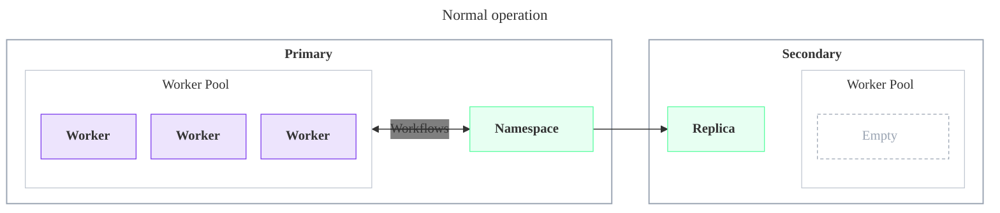

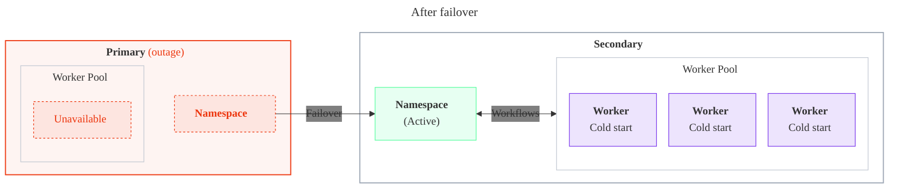

---

| Pattern | Best for | Major benefits | Major tradeoffs |
| --- | --- | --- | --- |
| **[Active / Passive (Hot)](#active-hot)** | Low RTO with strict single-region behavior | Fast Worker failover; guaranteed to act like a single region | More configuration and higher cost for the Worker fleet |

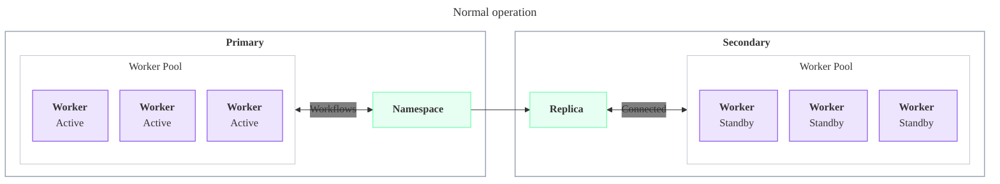

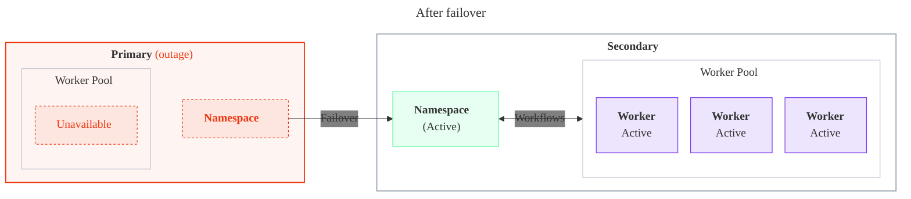

---

| Pattern | Best for | Major benefits | Major tradeoffs |
| --- | --- | --- | --- |
| **[Active / Active](#active-active)** | Low RTO with Workers active in multiple regions | Fast Worker failover; uses Worker fleet capacity (no standby Workers) | Cross-region requests add Workflow latency |

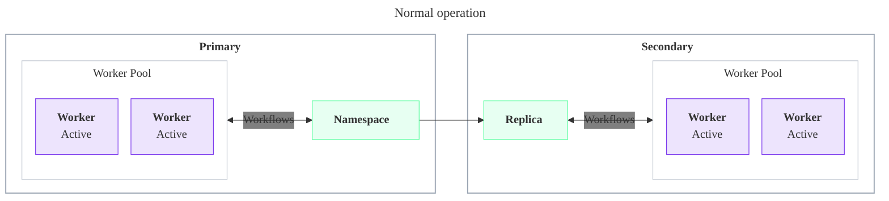

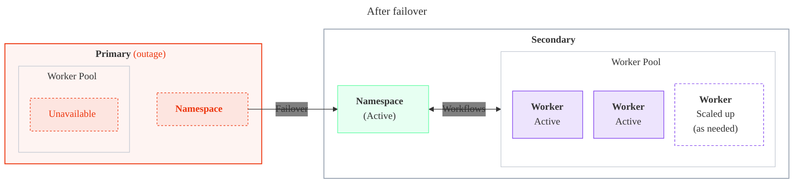

### Active / Passive (Cold) {/* #active-cold */}

_Also known as "Active / Cold Standby", "Active / Cold", or simply "Active / Passive"._

Active / Cold Pattern: **Normal operation**

- **Workers run in only one region.** A single Worker fleet runs in the primary region and processes all Workflows. No Workers run in the secondary region.
- **The Namespace replicates to the secondary region.** A Namespace with High Availability has an active replica in the primary region and a passive replica in the secondary region. Temporal Cloud continuously replicates Workflow state to the passive replica, so it stays ready to become active.
- **Your databases and queues replicate too, if needed.** Workers read and write systems such as databases and queues. If your Workflows depend on that data, replicate it to the secondary region so it's available after a failover. Workflows that don't touch external state may not need this.
- **Setup is minimal.** Turn on Replication for your Namespace (see [High Availability for Temporal Cloud Namespaces](/cloud/high-availability)) and enable replication on any databases or queues your Workflows use. At that point you're technically already running Active / Passive (Cold): the secondary region holds a ready replica, and failing over is a matter of bringing your Workers up there.

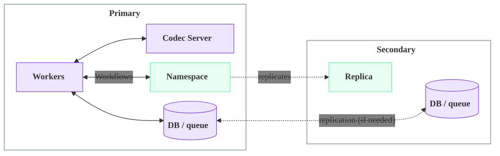

Active / Cold Pattern: **On failover**

- **The Namespace fails over automatically.** Temporal Cloud promotes the secondary region's replica to active. No action is needed to fail over the Namespace itself.
- **You bring the Workers up in the secondary region.** Because no Workers were running there, they start from nothing — a "cold" start. Starting and scaling that fleet is your responsibility, ideally through tested automation. Until the Workers are running, no Workflows make progress.
- **Promote your databases and queues, if needed.** If your Workflows depend on external data, make the secondary region's copy active so the new Workers can read and write it.
- **Recovery time is dominated by Worker startup.** After Temporal detects the outage and triggers failover, the Namespace is active almost immediately, but throughput returns to normal only after container or VM startup, image pulls, and application warm-up complete.

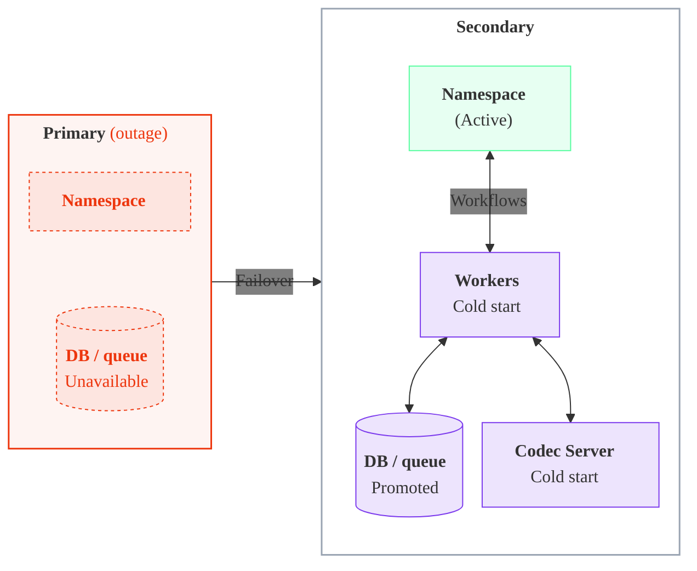

Active / Cold Pattern: **Benefits**

- **Easy to reason about.**
   - Only one region is active at a time, so traffic routing and interactions with systems (such as databases and queues) are simpler to understand, and the pattern pairs naturally with other active / passive systems. Active / Active, by contrast, requires deciding how Workers reach an active database: either a local active database in each region, or a single active / passive database that some Workers must reach cross-region.
- **Simple to operate.**
   - During normal operation it resembles a single-region deployment.
- **Lowest overall architecture cost.**
   - The size of the Worker fleet is simply the capacity needed to operate in one region. There are no standby Workers during steady state.

Active / Cold Pattern: **Tradeoffs**

- Highest overall recovery time of the three patterns, due to cold starting the Worker fleet after failover.
- Depends on tested automation to bring up the secondary-region fleet quickly.

Active / Cold Pattern: **Recommendations and important constraints**

- **Failing over the Workers is the operator's responsibility.** The Namespace fails over automatically, but bringing up the Workers in the secondary region is up to you. Plan for these sub-considerations:
   - **How do you detect an outage and decide to fail over?** Define the failover conditions and the signals (alerts, health checks) that trigger them.
   - **How do you scale up the Workers?** Bring up the secondary-region fleet, ideally with tested automation, and scale down the primary region's fleet so Workers run in only one region at a time.
   - **Do you need to enforce single-region processing?** The Cold pattern relies on the operator to keep Workers in one region. To have Temporal enforce single-region processing instead, use the [Active / Passive (Hot)](#active-hot) pattern.

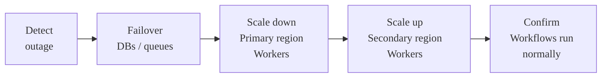

- **Use the Namespace Endpoint.**
   - Connect Workers through the Namespace Endpoint rather than a Regional Endpoint. The Namespace Endpoint always connects to the Namespace in its active region, and automatically follows the Namespace after a failover.
   - **Rationale:** If an incident requires the Namespace to fail over while the rest of the primary region is healthy, the the Workers in the primary region will still connect to the Namespace and process Workflows. (During a Namespace incident, the Regional Endpoint for the primary region may not connect to the Namespace.)

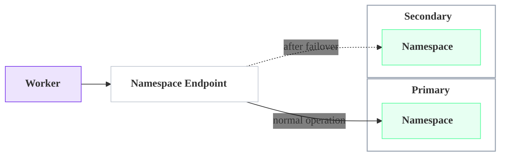

- **Set up cross-region private connectivity.**
   - If you use private connectivity, give the primary region's Workers a network route to the VPC Endpoint in the other region, so they can reach the active replica after a Namespace-only failover. If you can't provide that cross-region route, use the [Active / Passive (Hot)](#active-hot) pattern instead, where each region's Workers connect to their local replica.
   - For the full setup of Regional Endpoints, VPC Endpoints, and cross-region routing, see [Connectivity for High Availability](/cloud/high-availability/ha-connectivity).

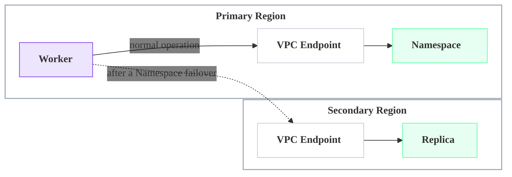

- **Route Workers to the active region's Codec Server.** Two common approaches:
   - Put DNS or a load balancer in front of the Codec Server address, and update it on failover to point at the new region's instance.
   - Pass each Worker the Codec Server address for its own region as configuration, so a Worker always uses the service local to it. This is common in Kubernetes or with service discovery.

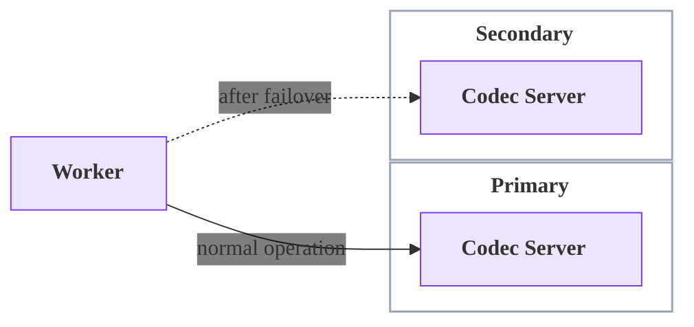

- **Route Workers to the active region's proxy.** Two common approaches:
   - Put DNS or a load balancer in front of the proxy address, and update it on failover to point at the new region's instance.
   - Pass each Worker the proxy address for its own region as configuration, so a Worker always uses the service local to it. This is common in Kubernetes or with service discovery.

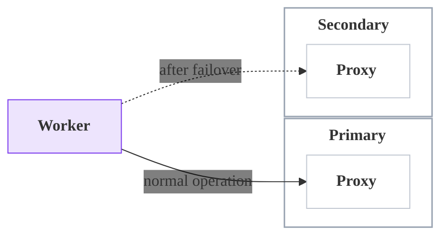

Active / Cold Pattern: **Component behavior**

- **Workers** — run only in the primary region; brought up in the secondary region during a failover.
- **Workflow starters and Clients** — run with the Workers; brought up in the secondary region during a failover.
- **Codec Servers and proxies** — run alongside the active Workers; scaled up in the secondary region as part of a failover.
- **Databases and queues** — single-region-active; fail over to the secondary region alongside the Workers.

### Active / Passive (Hot) {/* #active-hot */}

_Also known as "Active / Hot Standby" or "Active / Hot"._

Active / Hot Pattern: **Normal operation**

Workers are deployed in **both regions**, but only the active region processes Workflows. The secondary-region Workers stay connected and warm, yet on standby.

This is achieved by disabling forwarding for Worker polls and connecting each fleet to its local replica through a [Regional Endpoint](/cloud/high-availability/ha-connectivity#regional-endpoint) or [VPC Endpoint](/cloud/high-availability/ha-connectivity).
With forwarding disabled, polls that reach the passive replica are not sent to the active region, so the standby fleet does no work and adds no cross-region overhead.

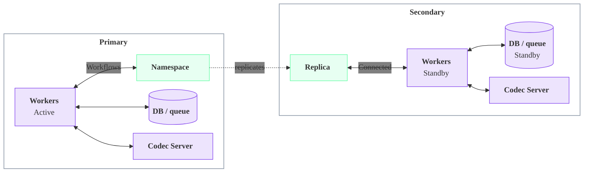

Active / Hot Pattern: **On failover**

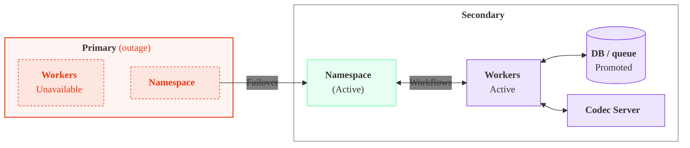

Failover is near-instant: the Namespace failover and the Worker "failover" happen together and automatically, with no DNS wait and no cold start. The previously standby fleet begins processing the moment the secondary region becomes active, so this pattern achieves the lowest recovery time.

Active / Hot Pattern: **Benefits**

- **Easy to reason about.**
   - Only one region is active at a time, so traffic routing and interactions with systems (such as databases and queues) are simpler to understand, and the pattern pairs naturally with other active / passive systems. Active / Active, by contrast, requires deciding how Workers reach an active database: either a local active database in each region, or a single active / passive database that some Workers must reach cross-region.
- **Lowest overall recovery time of the three patterns.**
   - The secondary-region Workers are already connected and warm, so failover involves no cold start.
- **Low latency during normal operation.**
   - Tasks are processed only in the active region, with no cross-region forwarding.

Active / Hot Pattern: **Tradeoffs**

- Highest overall architecture cost: a full standby Worker fleet runs in the secondary region at all times, even during steady state.

Active / Hot Pattern: **Recommendations and important constraints**

- **Use Regional or VPC Endpoints and disable forwarding.**
   - Connect each Worker fleet through its region's [Regional Endpoint](/cloud/high-availability/ha-connectivity#regional-endpoint) (or VPC Endpoint) and [disable forwarding](/cloud/high-availability/enable#change-forwarding-behavior) for Worker polls. Using the Namespace Endpoint by mistake routes the standby Workers to the active region and defeats the pattern.

Active / Hot Pattern: **Component behavior**

- **Workers** — run in both regions; only the active region processes Workflows.
- **Workflow starters and Clients** — run in both regions alongside the Workers.
- **Codec Servers and proxies** — run in both regions continuously, not just after a failover.
- **Databases and queues** — typically single-region-active; fail over alongside the active Workers.

### Active / Active {/* #active-active */}

Active / Active Pattern: **Normal operation**

Workers run in **both regions and process Workflows at the same time**, with forwarding left enabled (the default).

A Temporal Cloud Namespace is not "active/active" in the database sense; it still has a single active replica in one region.
Because the passive replica transparently forwards requests to and from the active region, a Worker fleet in either region can process Workflows. The secondary fleet's polls are forwarded across regions to the active replica.

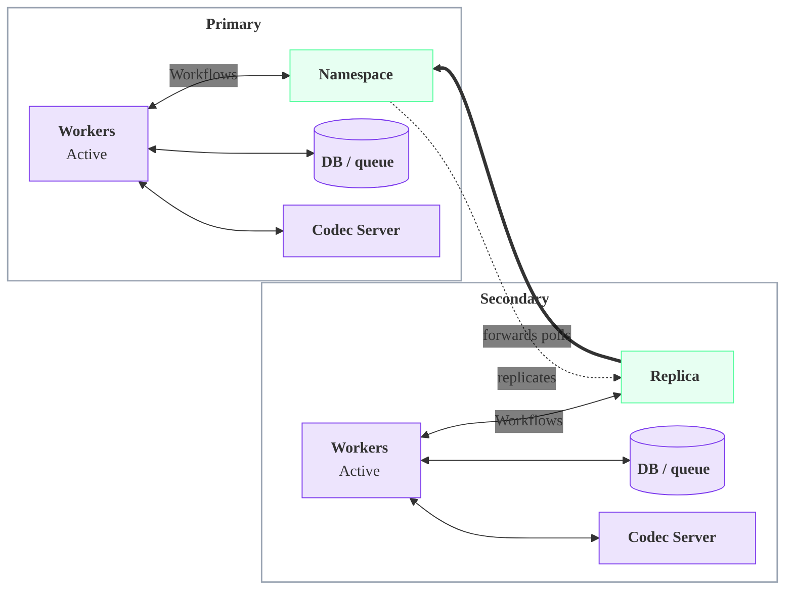

Active / Active Pattern: **On failover**

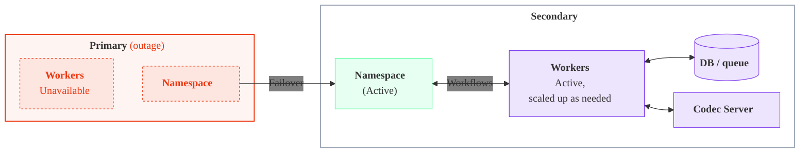

This is a practical way to reach a low recovery time at balanced cost. Roughly half the fleet runs in each region, and capacity is added to the surviving region during an outage to reach full throughput.
Unlike Active / Passive (Cold), Workflows keep processing in the surviving region while capacity scales up, so there is no cold-start gap.

Active / Active Pattern: **Benefits**

- **Low overall recovery time.**
   - The surviving region keeps processing while capacity scales up.
- **Moderate overall architecture cost.**
   - Roughly half the fleet runs in each region during steady state, with no dedicated standby fleet.

Active / Active Pattern: **Tradeoffs**

- The secondary region pays cross-region latency, because its polls are forwarded to the active replica. This can be a problem for latency-sensitive Workflows.
- Synchronizing external systems is harder, because Workers are active in both regions at once.

Active / Active Pattern: **Recommendations and important constraints**

- **Keep forwarding enabled.**
   - Leave forwarding on (the default) so the secondary-region Workers' polls reach the active replica. Do not set `disablePassivePollerForwarding`.

Active / Active Pattern: **Component behavior**

- **Workers** — run and process in both regions; the secondary region's polls are forwarded to the active replica.
- **Workflow starters and Clients** — run in both regions.
- **Codec Servers and proxies** — run in both regions continuously.
- **Databases and queues** — accessed from both regions; cross-region consistency must be designed for.

### Dual Active (Multi-Active) {/* #dual-active */}

Dual Active Pattern: **Normal operation**

Beyond the three main patterns, some architectures need low-latency or region-bound data in *each* region at once. This can be achieved with **two Namespaces whose active and passive regions overlap**: each region holds one Namespace's active replica and the other Namespace's passive replica.

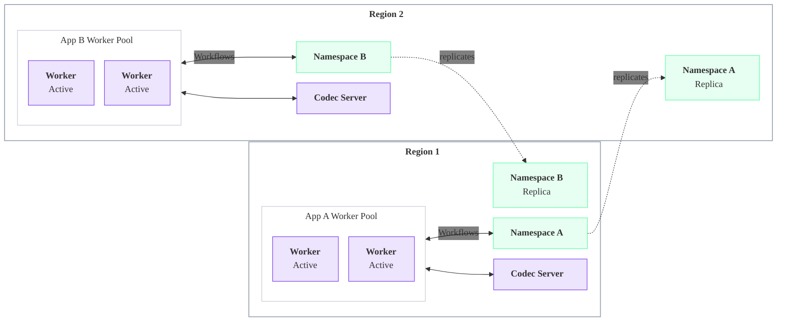

Dual Active Pattern: **On failover (Region 1 outage)**

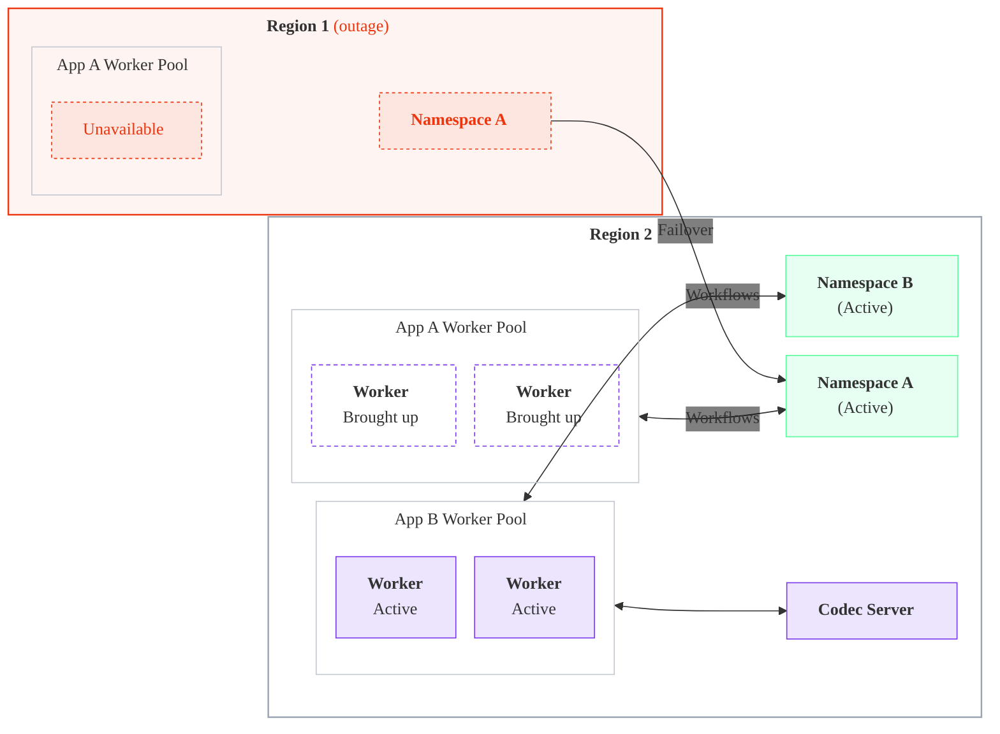

Each Namespace serves low-latency requests or a regionally-bound database in its own active region, and fails over to the other region during an outage. The same idea extends across more than two regions. Each Namespace fails over independently, following the Active / Passive sequence.

Workloads on Temporal rarely need this. It pays off only when a workload is *both* extremely latency-sensitive across several same-continent regions *and* needs multi-region disaster recovery, an uncommon combination.

Dual Active Pattern: **Benefits**

- **Low-latency, region-bound data in each region.**
   - Served from each region's active Namespace during normal operation.
- **Independent failover.**
   - Each Namespace fails over independently, like Active / Passive.

Dual Active Pattern: **Tradeoffs**

- Highest overall architecture cost and operational complexity: two Worker fleets and two Namespaces.
- Rarely justified. Temporal recommends treating each Namespace as an **independent Active / Passive deployment**, with its own Worker pools and failover procedures, rather than coupling them.

Dual Active Pattern: **Component behavior**

- **Workers** — one fleet per application, each active in its Namespace's region.
- **Workflow starters and Clients** — run with each application's Workers.
- **Codec Servers and proxies** — run in both regions, for both Namespaces.
- **Databases and queues** — region-bound per application; each fails over with its Namespace.

## Choose a deployment pattern {/* #choose */}

| Pattern | Recovery time | Normal-operation cost | Best when |
| --- | --- | --- | --- |
| **Active / Passive (Cold)** | Highest (cold start in secondary) | Lowest (one fleet) | Adopting High Availability with the simplest operations. |
| **Active / Passive (Hot)** | Lowest (warm, no DNS wait) | Higher (standby fleet) | The lowest recovery time is required and the data plane is pinned to one region at a time. |
| **Active / Active** | Low (surviving region keeps processing) | Higher (two live fleets) | Low recovery time at balanced cost, where the secondary region can tolerate cross-region latency. |
| **Dual Active** | Low (per Namespace) | Highest (two fleets, two Namespaces) | Low-latency, region-bound data is genuinely required in each region. Rare. |

## The rest of the architecture {/* #rest-of-architecture */}

The Worker deployment pattern sets the approach; the supporting pieces follow it.

- **Workflow starters and Clients.** Deploy these with the same regional pattern as the Workers, since a starter or Client often shares the same in-region dependencies (databases, queues, upstream services) and should fail over alongside them. Point Clients at the Namespace Endpoint so they follow the active region automatically with no configuration change on failover, and use a [Regional Endpoint](/cloud/high-availability/ha-connectivity#regional-endpoint) only when a Client must be pinned to a region.
- **Codec Servers and proxies.** Anything in the connection path between Workers and Temporal Cloud must be reachable from every region where Workers connect. In Active / Passive (Cold), scale them up in the secondary region as part of a failover; in the Active / Passive (Hot) and Active / Active patterns, run them in both regions at all times.
- **Databases and queues.** These remain the application's responsibility, and the right approach depends on the Worker deployment pattern: a single-region-active datastore pairs naturally with Active / Passive, while running Workers active in both regions raises consistency questions that must be designed for. Detailed guidance is out of scope for this page.

## Related {/* #related */}

To add a replica and turn on High Availability features, see [Enable and manage High Availability](/cloud/high-availability/enable).

To choose between the Namespace Endpoint and Regional Endpoints and to set up private connectivity, see [Connectivity for High Availability](/cloud/high-availability/ha-connectivity).

To stop forwarding Worker polls to the active region for the Active / Passive (Hot) pattern, see [Change the forwarding behavior](/cloud/high-availability/enable#change-forwarding-behavior).

To trigger and manage failovers, see [Failovers](/cloud/high-availability/failovers).

To understand the recovery objectives each pattern is measured against, see [RPO and RTO](/cloud/rpo-rto).
