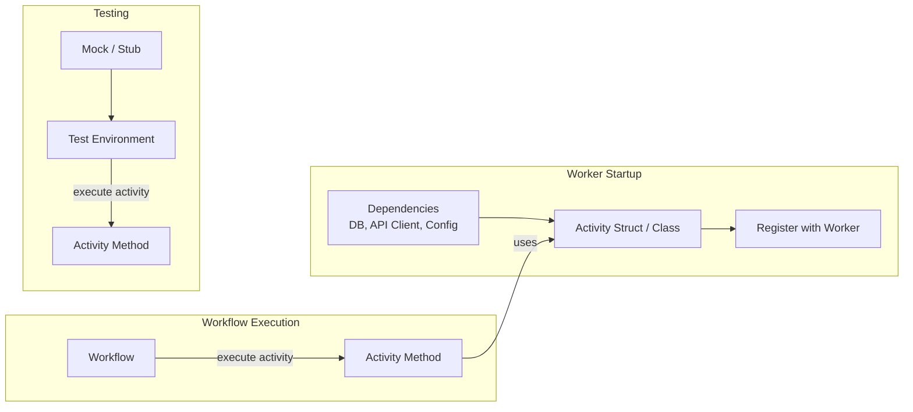

import Tabs from '@theme/Tabs';
import TabItem from '@theme/TabItem';

## Overview

The Activity Dependency Injection pattern separates the creation of external dependencies (database connections, API clients, configuration) from Activity business logic by injecting them at Worker startup.
This approach keeps Workflow code deterministic, makes Activities testable in isolation, and ensures expensive resources are initialized once per Worker process rather than once per Activity execution.

## Problem

Activities often need access to external resources such as database connection pools, HTTP clients, third-party API credentials, or shared caches.
Without a structured approach, you face several challenges:

- **Reinitializing resources per execution.** Creating a new database connection or API client on every Activity invocation wastes resources and increases latency.
- **Hardcoded dependencies.** Embedding connection logic directly inside Activity functions couples business logic to infrastructure, making it difficult to swap implementations across environments.
- **Difficult testing.** When Activities construct their own dependencies internally, you cannot substitute test doubles without modifying production code.
- **Non-determinism risk.** Passing dependencies directly into Workflow code breaks Temporal's determinism guarantees, because dependency state can change between replays.

## Solution

You define Activities as methods on a struct or class that holds dependencies as fields. At Worker startup, you instantiate the struct or class with real implementations and register it with the Worker. The Workflow references Activity methods without knowing about the underlying dependencies.



The following describes each path in the diagram:

1. At Worker startup, you create dependency instances (database pools, API clients) and inject them into an Activity struct or class, which you then register with the Worker.
2. During Workflow execution, the Workflow calls Activity methods by reference. The Temporal runtime routes the call to the registered instance on the Worker, where the method accesses the injected dependencies.
3. During testing, you substitute mock or stub implementations into the same Activity struct or class, allowing you to verify behavior without external services.

## Implementation

### Define Activities with dependencies

Define Activities as methods on a struct or class that accepts dependencies through its constructor or fields. Each method acts as a separate Activity Type.

<Tabs groupId="language" queryString>
<TabItem value="go" label="Go" default>

```go
// activities.go
package payment

import (
	"context"

	"go.temporal.io/sdk/activity"
)

type Activities struct {
	DBClient    DBClient
	EmailClient EmailClient
}

func (a *Activities) ChargeCustomer(ctx context.Context, orderID string, amount int) (string, error) {
	logger := activity.GetLogger(ctx)
	logger.Info("Charging customer", "orderID", orderID, "amount", amount)

	receiptID, err := a.DBClient.ProcessPayment(orderID, amount)
	if err != nil {
		return "", err
	}

	return receiptID, nil
}

func (a *Activities) SendReceipt(ctx context.Context, email string, receiptID string) error {
	return a.EmailClient.Send(email, "Payment Receipt", receiptID)
}
```

</TabItem>
<TabItem value="python" label="Python">

```python
# activities.py
from dataclasses import dataclass
from temporalio import activity


@dataclass
class PaymentActivities:
    db_client: DBClient
    email_client: EmailClient

    @activity.defn
    async def charge_customer(self, order_id: str, amount: int) -> str:
        activity.logger.info(
            "Charging customer", extra={"order_id": order_id, "amount": amount}
        )
        receipt_id = await self.db_client.process_payment(order_id, amount)
        return receipt_id

    @activity.defn
    async def send_receipt(self, email: str, receipt_id: str) -> None:
        await self.email_client.send(email, "Payment Receipt", receipt_id)
```

</TabItem>
<TabItem value="java" label="Java">

```java
// PaymentActivities.java
@ActivityInterface
public interface PaymentActivities {
    String chargeCustomer(String orderId, int amount);
    void sendReceipt(String email, String receiptId);
}

// PaymentActivitiesImpl.java
public class PaymentActivitiesImpl implements PaymentActivities {
    private final DBClient dbClient;
    private final EmailClient emailClient;

    public PaymentActivitiesImpl(DBClient dbClient, EmailClient emailClient) {
        this.dbClient = dbClient;
        this.emailClient = emailClient;
    }

    @Override
    public String chargeCustomer(String orderId, int amount) {
        return dbClient.processPayment(orderId, amount);
    }

    @Override
    public void sendReceipt(String email, String receiptId) {
        emailClient.send(email, "Payment Receipt", receiptId);
    }
}
```

</TabItem>
<TabItem value="typescript" label="TypeScript">

```typescript
// activities.ts
export interface DB {
  processPayment(orderId: string, amount: number): Promise<string>;
}

export interface EmailClient {
  send(to: string, subject: string, body: string): Promise<void>;
}

export const createActivities = (db: DB, emailClient: EmailClient) => ({
  async chargeCustomer(orderId: string, amount: number): Promise<string> {
    const receiptId = await db.processPayment(orderId, amount);
    return receiptId;
  },

  async sendReceipt(email: string, receiptId: string): Promise<void> {
    await emailClient.send(email, 'Payment Receipt', receiptId);
  },
});
```

</TabItem>
</Tabs>

Each SDK uses a different mechanism to group Activities with their dependencies:

- **Go**: Methods on a struct. The struct fields hold dependencies.
- **Python**: A `@dataclass` with `@activity.defn` methods. Fields hold dependencies.
- **Java**: An `@ActivityInterface` with a separate implementation class. Dependencies are passed through the constructor.
- **TypeScript**: A factory function that closes over dependencies and returns an object of Activity functions.

### Reference Activities from the Workflow

The Workflow references Activity methods without any knowledge of the injected dependencies. Each SDK provides a type-safe way to call Activities.

<Tabs groupId="language" queryString>
<TabItem value="go" label="Go" default>

```go
// workflow.go
package payment

import (
	"time"

	"go.temporal.io/sdk/workflow"
)

func PaymentWorkflow(ctx workflow.Context, orderID string, amount int, email string) error {
	ao := workflow.ActivityOptions{
		StartToCloseTimeout: 30 * time.Second,
	}
	ctx = workflow.WithActivityOptions(ctx, ao)

	// Use a nil struct pointer to reference Activity methods.
	// This provides compile-time type safety without instantiating the struct.
	var a *Activities
	var receiptID string
	err := workflow.ExecuteActivity(ctx, a.ChargeCustomer, orderID, amount).Get(ctx, &receiptID)
	if err != nil {
		return err
	}

	return workflow.ExecuteActivity(ctx, a.SendReceipt, email, receiptID).Get(ctx, nil)
}
```

</TabItem>
<TabItem value="python" label="Python">

```python
# workflows.py
from datetime import timedelta
from temporalio import workflow

with workflow.unsafe.imports_passed_through():
    from activities import PaymentActivities


@workflow.defn
class PaymentWorkflow:
    @workflow.run
    async def run(self, order_id: str, amount: int, email: str) -> None:
        receipt_id = await workflow.execute_activity_method(
            PaymentActivities.charge_customer,
            args=[order_id, amount],
            start_to_close_timeout=timedelta(seconds=30),
        )

        await workflow.execute_activity_method(
            PaymentActivities.send_receipt,
            args=[email, receipt_id],
            start_to_close_timeout=timedelta(seconds=30),
        )
```

</TabItem>
<TabItem value="java" label="Java">

```java
// PaymentWorkflowImpl.java
public class PaymentWorkflowImpl implements PaymentWorkflow {
    private final PaymentActivities activities = Workflow.newActivityStub(
        PaymentActivities.class,
        ActivityOptions.newBuilder()
            .setStartToCloseTimeout(Duration.ofSeconds(30))
            .build()
    );

    @Override
    public void processPayment(String orderId, int amount, String email) {
        String receiptId = activities.chargeCustomer(orderId, amount);
        activities.sendReceipt(email, receiptId);
    }
}
```

</TabItem>
<TabItem value="typescript" label="TypeScript">

```typescript
// workflows.ts
import { proxyActivities } from '@temporalio/workflow';
import type { createActivities } from './activities';

// Use ReturnType to extract the Activity types from the factory function
const { chargeCustomer, sendReceipt } = proxyActivities<
  ReturnType<typeof createActivities>
>({
  startToCloseTimeout: '30s',
});

export async function paymentWorkflow(
  orderId: string,
  amount: number,
  email: string
): Promise<void> {
  const receiptId = await chargeCustomer(orderId, amount);
  await sendReceipt(email, receiptId);
}
```

</TabItem>
</Tabs>

Key points for each SDK:

- **Go**: A nil pointer of the Activity struct type (`var a *Activities`) provides compile-time method references without instantiating the struct. The Temporal runtime resolves the actual registered instance at execution time.
- **Python**: `workflow.execute_activity_method` references the class method directly and resolves to the registered instance on the Worker.
- **Java**: `Workflow.newActivityStub` creates a typed proxy from the Activity interface. The Temporal runtime routes calls to the registered implementation.
- **TypeScript**: `proxyActivities<ReturnType<typeof createActivities>>` infers the Activity types from the factory function's return type. Activities are always referenced by name at runtime.

### Register Activities with the Worker

At Worker startup, you instantiate the Activity struct or class with real dependency implementations and register it.

<Tabs groupId="language" queryString>
<TabItem value="go" label="Go" default>

```go
// worker/main.go
package main

import (
	"log"

	"go.temporal.io/sdk/client"
	"go.temporal.io/sdk/worker"

	"example/payment"
)

func main() {
	c, err := client.Dial(client.Options{})
	if err != nil {
		log.Fatalln("Unable to create client", err)
	}
	defer c.Close()

	w := worker.New(c, "payment", worker.Options{})

	w.RegisterWorkflow(payment.PaymentWorkflow)

	// Inject real dependencies at Worker startup
	w.RegisterActivity(&payment.Activities{
		DBClient:    payment.NewPostgresClient("postgres://localhost:5432/payments"),
		EmailClient: payment.NewSMTPClient("smtp://mail.example.com"),
	})

	err = w.Run(worker.InterruptCh())
	if err != nil {
		log.Fatalln("Unable to start worker", err)
	}
}
```

</TabItem>
<TabItem value="python" label="Python">

```python
# worker.py
import asyncio
from temporalio.client import Client
from temporalio.worker import Worker

from activities import PaymentActivities
from workflows import PaymentWorkflow


async def main():
    client = await Client.connect("localhost:7233")

    # Inject real dependencies at Worker startup
    payment_activities = PaymentActivities(
        db_client=PostgresClient("postgres://localhost:5432/payments"),
        email_client=SMTPClient("smtp://mail.example.com"),
    )

    worker = Worker(
        client,
        task_queue="payment",
        workflows=[PaymentWorkflow],
        activities=[
            payment_activities.charge_customer,
            payment_activities.send_receipt,
        ],
    )
    await worker.run()


if __name__ == "__main__":
    asyncio.run(main())
```

</TabItem>
<TabItem value="java" label="Java">

```java
// PaymentWorker.java
public class PaymentWorker {
    public static void main(String[] args) {
        WorkflowServiceStubs service = WorkflowServiceStubs.newLocalServiceStubs();
        WorkflowClient client = WorkflowClient.newInstance(service);
        WorkerFactory factory = WorkerFactory.newInstance(client);

        Worker worker = factory.newWorker("payment");
        worker.registerWorkflowImplementationTypes(PaymentWorkflowImpl.class);

        // Inject real dependencies at Worker startup
        worker.registerActivitiesImplementations(
            new PaymentActivitiesImpl(
                new PostgresClient("postgres://localhost:5432/payments"),
                new SMTPClient("smtp://mail.example.com")
            )
        );

        factory.start();
    }
}
```

</TabItem>
<TabItem value="typescript" label="TypeScript">

```typescript
// worker.ts
import { Worker } from '@temporalio/worker';
import { createActivities } from './activities';

async function run() {
  // Initialize dependencies at Worker startup
  const db = new PostgresClient('postgres://localhost:5432/payments');
  const emailClient = new SMTPClient('smtp://mail.example.com');

  const worker = await Worker.create({
    taskQueue: 'payment',
    workflowsPath: require.resolve('./workflows'),
    // Inject dependencies through the factory function
    activities: createActivities(db, emailClient),
  });

  await worker.run();
}

run().catch((err) => {
  console.error(err);
  process.exit(1);
});
```

</TabItem>
</Tabs>

Dependencies are initialized once when the Worker process starts. All Activity executions on that Worker share the same instances, which is appropriate for thread-safe resources like connection pools and HTTP clients.

## When to use

This pattern is a good fit when your Activities access external services such as databases, message queues, or third-party APIs. It is appropriate when you want to initialize expensive resources once per Worker process, when you need to test Activity logic without connecting to real services, or when you operate in multiple environments (development, staging, production) that require different dependency configurations.

This pattern is not necessary for Activities that are pure functions with no external dependencies, or for Activities that only use Temporal-provided context like heartbeating and logging.

## Benefits and trade-offs

Injecting dependencies at the Worker level provides several advantages. Resources like connection pools are initialized once and shared across all Activity executions, reducing overhead. Substituting mock implementations in tests requires no changes to Activity or Workflow code. Switching between environments involves changing only the Worker configuration.

The trade-off is that all Activity executions on a given Worker share the same dependency instances. If an Activity requires per-execution isolation (for example, a database transaction scoped to a single Activity), you need to manage that within the Activity method itself. Dependencies must also be thread-safe, since multiple Activity executions may run concurrently on the same Worker.

## Best practices

- **Keep dependencies thread-safe.** Multiple Activity executions run concurrently on the same Worker. Use connection pools rather than single connections, and avoid mutable shared state.
- **Define dependencies as interfaces.** In Go, Python, and Java, using interfaces (or protocols in Python) for dependencies makes it possible to swap implementations for testing or different environments.
- **Do not inject dependencies into Workflows.** Workflow code must remain deterministic. If a Workflow needs configuration, retrieve it through a Local Activity so the value gets recorded in the Event History.
- **Initialize dependencies before Worker startup.** Create and validate all connections before calling `worker.Run()` or its equivalent. This ensures that the Worker does not start accepting tasks until all dependencies are ready.
- **Group related Activities on a single struct or class.** Activities that share the same dependencies belong together. If two groups of Activities have different dependencies, use separate structs or classes for each group.

## Common pitfalls

- **Constructing dependencies inside Activity methods.** Creating a new database connection or API client per execution leads to resource exhaustion and increased latency.
- **Injecting dependencies into Workflows.** This breaks determinism because dependency state can change between the original execution and a replay. The Temporal Java SDK documentation explicitly warns against this.
- **Using non-thread-safe dependencies.** A single mutable object shared across concurrent Activity executions causes race conditions. Use connection pools and ensure all injected objects are safe for concurrent use.
- **Registering class methods as static in Python.** If you register `BotService.send_message` (the unbound method) instead of `bot_service.send_message` (a method on an instance), the `self` parameter is not bound, causing a missing argument error at runtime.
- **Forgetting to bind methods in TypeScript.** When using a class instead of a factory function, class methods must be defined as arrow functions or explicitly bound in the constructor. Otherwise, `this` is `undefined` when Temporal invokes the Activity.

## Related patterns

- **[Entity Workflow](/design-patterns/entity-workflow)**: Long-lived Workflows that manage stateful entities, often using Activities with injected dependencies.
- **[Worker-Specific Task Queues](/design-patterns/worker-specific-taskqueue)**: Routing Activities to specific Workers, which can have different injected dependencies.

## Sample code

### Go
- [Greetings](https://github.com/temporalio/samples-go/tree/main/greetings) — Activities as struct methods with injected dependencies.
- [Large Payload Fixture](https://github.com/temporalio/samples-go/tree/main/temporal-fixtures/largepayload) — The reference sample using struct-based Activity dependency injection.

### Python
- [Hello Activity Method](https://github.com/temporalio/samples-python/blob/main/hello/hello_activity_method.py) — Activities defined as class methods with dependency injection.

### Java
- [Hello World](https://github.com/temporalio/hello-world-project-template-java) — Activity interface and implementation with Worker registration.

### TypeScript
- [Activities Dependency Injection](https://github.com/temporalio/samples-typescript/tree/main/activities-dependency-injection) — Factory function pattern for sharing dependencies between Activities.
