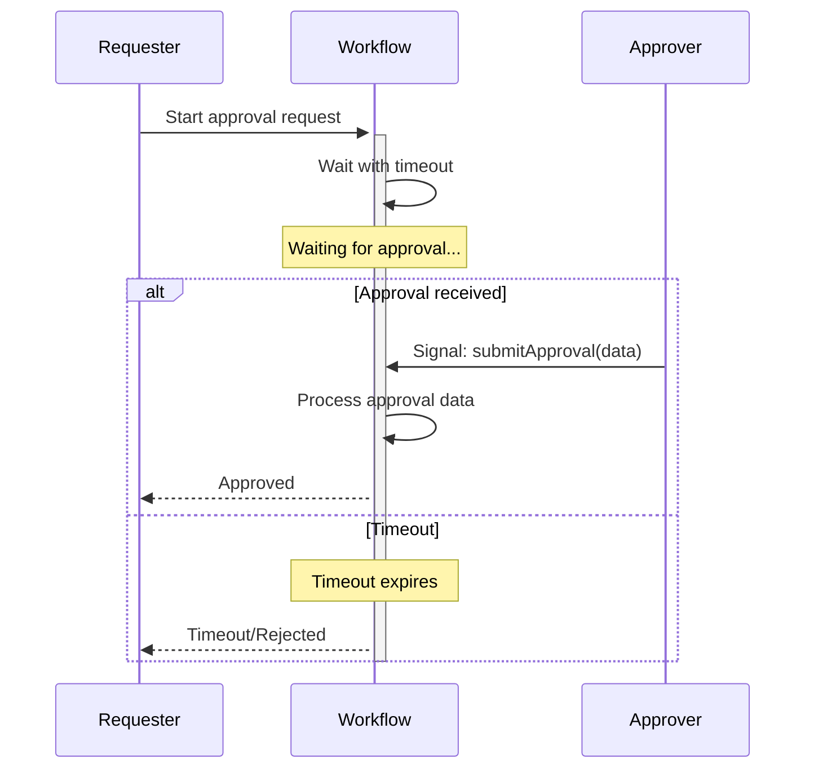

import Tabs from '@theme/Tabs';
import TabItem from '@theme/TabItem';

## Overview

The Approval pattern implements human-in-the-loop Workflows where execution blocks until an external decision is made.
It uses Workflow Signals with custom input data to unblock Workflows, enabling approval processes, manual reviews, and decision gates in automated business processes.

<video src="https://github.com/user-attachments/assets/545fae48-939e-4419-90fa-6e1a7f82098e" width="700" controls></video>

## Problem

In many business processes, you need Workflows that wait for human approval before proceeding.
These Workflows must capture approval decisions along with metadata such as the approver's identity, a reason, and a timestamp.
They must also support multiple outcomes — approval, rejection, or escalation — and handle timeout scenarios when no decision arrives.

Without a structured approval pattern, you are forced to poll external systems for approval status, implement complex state machines by hand, and manage race conditions between timeouts and incoming approvals.
You also risk losing approval context and metadata, and you must build custom audit logging to meet compliance requirements.

## Solution

The Approval pattern uses a blocking wait with timeout to pause execution until a Signal is received.
The Signal carries custom data — the approval decision, approver details, and comments — that the Workflow captures and uses to determine next steps.



The following describes each step in the diagram:

1. The requester starts the Workflow with an approval request.
2. The Workflow blocks execution with a timeout — using `Workflow.await()` in Java, `condition()` in TypeScript, `workflow.wait_condition()` in Python, or `workflow.AwaitWithTimeout()` in Go.
3. If an approver sends a Signal before the timeout expires, the Workflow receives the approval data, processes the decision, and returns the result to the requester.
4. If the timeout expires before any Signal arrives, the Workflow unblocks and follows the timeout path, which typically results in rejection or escalation.

## Implementation

### Basic approval with timeout

The basic implementation captures the approval decision in a structured data object rather than a plain boolean.
Define a type to hold the approver's identity, the decision, any comments, and a timestamp:

<Tabs groupId="language" queryString>
<TabItem value="python" label="Python">

```python
# models.py
from dataclasses import dataclass

@dataclass
class ApprovalData:
    approver: str
    decision: str  # "APPROVED", "REJECTED", "ESCALATED"
    comments: str
    timestamp: int
```

</TabItem>
<TabItem value="go" label="Go">

```go
// types.go
type ApprovalData struct {
    Approver  string
    Decision  string // "APPROVED", "REJECTED", "ESCALATED"
    Comments  string
    Timestamp int64
}
```

</TabItem>
<TabItem value="java" label="Java">

```java
// ApprovalData.java
public class ApprovalData {
  private String approver;
  private String decision; // "APPROVED", "REJECTED", "ESCALATED"
  private String comments;
  private long timestamp;

  // Constructor, getters, setters
}
```

</TabItem>
<TabItem value="typescript" label="TypeScript">

```typescript
// types.ts
export interface ApprovalData {
  approver: string;
  decision: 'APPROVED' | 'REJECTED' | 'ESCALATED';
  comments: string;
  timestamp: number;
}
```

</TabItem>
</Tabs>

This type gives you a structured way to pass rich context through the Signal rather than a plain boolean.

The implementation ties everything together.
The Workflow blocks until either the approval data arrives via Signal or the timeout expires:

<Tabs groupId="language" queryString>
<TabItem value="python" label="Python">

```python
# workflows.py
import asyncio
from datetime import timedelta
from temporalio import workflow
from models import ApprovalData

@workflow.defn
class ApprovalWorkflow:
    def __init__(self) -> None:
        self.approval_data: ApprovalData | None = None
        self.status = "PENDING"

    @workflow.run
    async def run(self, request_id: str, timeout_seconds: int) -> str:
        try:
            # Block until the Signal sets approval_data, or raise on timeout
            await workflow.wait_condition(
                lambda: self.approval_data is not None,
                timeout=timedelta(seconds=timeout_seconds),
            )
            self.status = self.approval_data.decision
            return f"Request {request_id} {self.status} by {self.approval_data.approver}"
        except asyncio.TimeoutError:
            self.status = "TIMEOUT"
            return f"Request {request_id} timed out"

    # Signal handler: an external approver submits the decision
    @workflow.signal
    def submit_approval(self, data: ApprovalData) -> None:
        self.approval_data = data

    # Query handler: read current status without mutating state
    @workflow.query
    def get_status(self) -> str:
        return self.status
```

</TabItem>
<TabItem value="go" label="Go">

```go
// workflow.go
func ApprovalWorkflow(ctx workflow.Context, requestId string, timeout time.Duration) (string, error) {
    var approvalData *ApprovalData
    status := "PENDING"

    // Query handler: expose current status without mutating state
    err := workflow.SetQueryHandler(ctx, "getStatus", func() (string, error) {
        return status, nil
    })
    if err != nil {
        return "", err
    }

    // Receive the approval signal in a goroutine
    workflow.Go(ctx, func(ctx workflow.Context) {
        signalChan := workflow.GetSignalChannel(ctx, "submitApproval")
        signalChan.Receive(ctx, &approvalData)
    })

    // Block until the signal sets approvalData, or time out (ok=false)
    approved, err := workflow.AwaitWithTimeout(ctx, timeout, func() bool {
        return approvalData != nil
    })
    if err != nil {
        return "", err
    }

    if approved {
        status = approvalData.Decision
        return fmt.Sprintf("Request %s %s by %s", requestId, status, approvalData.Approver), nil
    }
    status = "TIMEOUT"
    return fmt.Sprintf("Request %s timed out", requestId), nil
}
```

</TabItem>
<TabItem value="java" label="Java">

```java
// ApprovalWorkflowImpl.java
public class ApprovalWorkflowImpl implements ApprovalWorkflow {
  private ApprovalData approvalData;
  private String status = "PENDING";

  @Override
  public String execute(String requestId, Duration timeout) {
    // Block until the Signal sets approvalData, or time out (returns false)
    boolean approved = Workflow.await(timeout, () -> approvalData != null);

    if (approved) {
      status = approvalData.getDecision();
      return "Request " + requestId + " " + status + " by " + approvalData.getApprover();
    } else {
      status = "TIMEOUT";
      return "Request " + requestId + " timed out";
    }
  }

  // Signal handler: an external approver submits the decision
  @Override
  public void submitApproval(ApprovalData data) {
    this.approvalData = data;
  }

  // Query handler: read current status without mutating state
  @Override
  public String getStatus() {
    return status;
  }
}
```

</TabItem>
<TabItem value="typescript" label="TypeScript">

```typescript
// workflows.ts
import * as wf from '@temporalio/workflow';
import { ApprovalData } from './types';

export const submitApprovalSignal = wf.defineSignal<[ApprovalData]>('submitApproval');
export const getStatusQuery = wf.defineQuery<string>('getStatus');

export async function approvalWorkflow(
  requestId: string,
  timeout: string | number, // ms or Duration string
): Promise<string> {
  let approvalData: ApprovalData | undefined;
  let status = 'PENDING';

  // Signal handler: an external approver submits the decision
  wf.setHandler(submitApprovalSignal, (data: ApprovalData) => {
    approvalData = data;
  });

  // Query handler: read current status without mutating state
  wf.setHandler(getStatusQuery, () => status);

  // Block until the Signal sets approvalData, or time out (returns false)
  const approved = await wf.condition(() => approvalData !== undefined, timeout);

  if (approved) {
    status = approvalData!.decision;
    return `Request ${requestId} ${status} by ${approvalData!.approver}`;
  } else {
    status = 'TIMEOUT';
    return `Request ${requestId} timed out`;
  }
}
```

</TabItem>
</Tabs>

Each SDK uses a different mechanism to block with a timeout, but the core pattern is the same.
In Java, `Workflow.await()` takes a timeout and a condition lambda, returning `false` on timeout.
In TypeScript, `condition()` takes a predicate and a timeout, returning `false` on timeout.
In Python, `workflow.wait_condition()` takes a lambda and a timeout, raising `asyncio.TimeoutError` on timeout.
In Go, `workflow.AwaitWithTimeout()` takes a timeout and a condition function, returning `ok=false` on timeout.

The condition is evaluated on every state transition, so it must not call blocking operations, mutate Workflow state, or use time-based checks.
When the Signal handler sets the approval data, the condition evaluates to `true` and the Workflow unblocks.

### Multi-level approval chain

Some business processes require approvals from multiple levels of authority in sequence.
The following implementation iterates through a list of required approval levels, waiting for a Signal at each level before proceeding to the next:

<Tabs groupId="language" queryString>
<TabItem value="python" label="Python">

```python
# models.py
from dataclasses import dataclass

@dataclass
class MultiLevelApprovalData:
    level: str  # "L1", "L2", "L3"
    approver: str
    decision: str
    comments: str
```

</TabItem>
<TabItem value="go" label="Go">

```go
// types.go
type MultiLevelApprovalData struct {
    Level    string // "L1", "L2", "L3"
    Approver string
    Decision string
    Comments string
}
```

</TabItem>
<TabItem value="java" label="Java">

```java
// MultiLevelApprovalData.java
public class MultiLevelApprovalData {
  private String level; // "L1", "L2", "L3"
  private String approver;
  private String decision;
  private String comments;
}
```

</TabItem>
<TabItem value="typescript" label="TypeScript">

```typescript
// types.ts
export interface MultiLevelApprovalData {
  level: 'L1' | 'L2' | 'L3';
  approver: string;
  decision: string;
  comments: string;
}
```

</TabItem>
</Tabs>

This data type extends the basic approval data with a `level` field that identifies which approval tier the decision belongs to.

<Tabs groupId="language" queryString>
<TabItem value="python" label="Python">

```python
# workflows.py
import asyncio
from datetime import timedelta
from temporalio import workflow
from models import MultiLevelApprovalData

@workflow.defn
class MultiLevelApprovalWorkflow:
    def __init__(self) -> None:
        self.approvals: list[MultiLevelApprovalData] = []

    @workflow.run
    async def run(self, request_id: str, timeout_per_level_seconds: int) -> str:
        required_levels = ["L1", "L2", "L3"]
        timeout = timedelta(seconds=timeout_per_level_seconds)

        # Require approval at each level in sequence
        for level in required_levels:
            try:
                # Wait for a Signal carrying this level's approval
                await workflow.wait_condition(
                    lambda lv=level: any(a.level == lv for a in self.approvals),
                    timeout=timeout,
                )
            except asyncio.TimeoutError:
                return f"Timeout at {level}"

            approval = next(a for a in self.approvals if a.level == level)
            # Stop the chain early if any level rejects
            if approval.decision == "REJECTED":
                return f"Rejected at {level} by {approval.approver}"

        return "Fully approved through all levels"

    # Signal handler: collect each level's approval as it arrives
    @workflow.signal
    def submit_approval(self, data: MultiLevelApprovalData) -> None:
        self.approvals.append(data)
```

</TabItem>
<TabItem value="go" label="Go">

```go
// workflow.go
func MultiLevelApprovalWorkflow(ctx workflow.Context, requestId string, timeoutPerLevel time.Duration) (string, error) {
    var approvals []MultiLevelApprovalData
    requiredLevels := []string{"L1", "L2", "L3"}

    // Collect every approval Signal as it arrives
    workflow.Go(ctx, func(ctx workflow.Context) {
        signalChan := workflow.GetSignalChannel(ctx, "submitApproval")
        for {
            var data MultiLevelApprovalData
            signalChan.Receive(ctx, &data)
            approvals = append(approvals, data)
        }
    })

    // Require approval at each level in sequence
    for _, level := range requiredLevels {
        lv := level
        // Wait for a Signal carrying this level's approval
        ok, err := workflow.AwaitWithTimeout(ctx, timeoutPerLevel, func() bool {
            for _, a := range approvals {
                if a.Level == lv {
                    return true
                }
            }
            return false
        })
        if err != nil {
            return "", err
        }
        if !ok {
            return fmt.Sprintf("Timeout at %s", lv), nil
        }

        var approval MultiLevelApprovalData
        for _, a := range approvals {
            if a.Level == lv {
                approval = a
                break
            }
        }
        // Stop the chain early if any level rejects
        if approval.Decision == "REJECTED" {
            return fmt.Sprintf("Rejected at %s by %s", lv, approval.Approver), nil
        }
    }

    return "Fully approved through all levels", nil
}
```

</TabItem>
<TabItem value="java" label="Java">

```java
// MultiLevelApprovalWorkflowImpl.java
public class MultiLevelApprovalWorkflowImpl implements ApprovalWorkflow {
  private List<MultiLevelApprovalData> approvals = new ArrayList<>();
  private String[] requiredLevels = {"L1", "L2", "L3"};

  @Override
  public String execute(String requestId, Duration timeoutPerLevel) {
    // Require approval at each level in sequence
    for (String level : requiredLevels) {
      // Wait for a Signal carrying this level's approval
      boolean received = Workflow.await(
          timeoutPerLevel,
          () -> hasApprovalForLevel(level));

      if (!received) {
        return "Timeout at " + level;
      }

      MultiLevelApprovalData approval = getApprovalForLevel(level);
      // Stop the chain early if any level rejects
      if (approval.getDecision().equals("REJECTED")) {
        return "Rejected at " + level + " by " + approval.getApprover();
      }
    }

    return "Fully approved through all levels";
  }

  // Signal handler: collect each level's approval as it arrives
  @Override
  public void submitApproval(MultiLevelApprovalData data) {
    approvals.add(data);
  }

  private boolean hasApprovalForLevel(String level) {
    return approvals.stream().anyMatch(a -> a.getLevel().equals(level));
  }

  private MultiLevelApprovalData getApprovalForLevel(String level) {
    return approvals.stream()
        .filter(a -> a.getLevel().equals(level))
        .findFirst()
        .orElse(null);
  }
}
```

</TabItem>
<TabItem value="typescript" label="TypeScript">

```typescript
// workflows.ts
import * as wf from '@temporalio/workflow';
import { MultiLevelApprovalData } from './types';

export const submitApprovalSignal = wf.defineSignal<[MultiLevelApprovalData]>('submitApproval');

export async function multiLevelApprovalWorkflow(
  requestId: string,
  timeoutPerLevelMs: number,
): Promise<string> {
  const approvals: MultiLevelApprovalData[] = [];
  const requiredLevels = ['L1', 'L2', 'L3'] as const;

  // Signal handler: collect each level's approval as it arrives
  wf.setHandler(submitApprovalSignal, (data: MultiLevelApprovalData) => {
    approvals.push(data);
  });

  // Require approval at each level in sequence
  for (const level of requiredLevels) {
    // Wait for a Signal carrying this level's approval
    const received = await wf.condition(
      () => approvals.some((a) => a.level === level),
      timeoutPerLevelMs,
    );

    if (!received) {
      return `Timeout at ${level}`;
    }

    const approval = approvals.find((a) => a.level === level)!;
    // Stop the chain early if any level rejects
    if (approval.decision === 'REJECTED') {
      return `Rejected at ${level} by ${approval.approver}`;
    }
  }

  return 'Fully approved through all levels';
}
```

</TabItem>
</Tabs>

The Workflow loops through each required level and waits with a per-level timeout.
The helper logic checks whether a Signal has arrived for the current level.
If a timeout occurs at any level, the Workflow exits with a timeout result.
If any level returns a rejection, the Workflow exits immediately without proceeding to subsequent levels.

### Approval with escalation

When an initial approval times out, you may want to escalate the request to a manager rather than rejecting it outright.
The following implementation adds an escalation step with an extended timeout:

<Tabs groupId="language" queryString>
<TabItem value="python" label="Python">

```python
# workflows.py
import asyncio
from datetime import timedelta
from temporalio import workflow
from models import ApprovalData

with workflow.unsafe.imports_passed_through():
    from activities import send_escalation_email

@workflow.defn
class EscalatingApprovalWorkflow:
    def __init__(self) -> None:
        self.approval_data: ApprovalData | None = None
        self.escalated = False

    @workflow.run
    async def run(self, request_id: str, initial_timeout_seconds: int) -> str:
        try:
            # Wait for the first approval within the initial timeout
            await workflow.wait_condition(
                lambda: self.approval_data is not None,
                timeout=timedelta(seconds=initial_timeout_seconds),
            )
        except asyncio.TimeoutError:
            # No response in time: escalate to a manager, then wait longer
            self.escalated = True
            await workflow.execute_activity(
                send_escalation_email,
                start_to_close_timeout=timedelta(seconds=10),
            )

            try:
                # Extended wait for the escalated approval
                await workflow.wait_condition(
                    lambda: self.approval_data is not None,
                    timeout=timedelta(hours=24),
                )
            except asyncio.TimeoutError:
                return "Escalation timeout - auto-rejected"

        decision = self.approval_data.decision
        approver = self.approval_data.approver
        escalation_note = " (escalated)" if self.escalated else ""

        return f"{decision} by {approver}{escalation_note}"

    @workflow.signal
    def submit_approval(self, data: ApprovalData) -> None:
        self.approval_data = data
```

</TabItem>
<TabItem value="go" label="Go">

```go
// workflow.go
func EscalatingApprovalWorkflow(ctx workflow.Context, requestId string, initialTimeout time.Duration) (string, error) {
    var approvalData *ApprovalData
    escalated := false

    workflow.Go(ctx, func(ctx workflow.Context) {
        signalChan := workflow.GetSignalChannel(ctx, "submitApproval")
        signalChan.Receive(ctx, &approvalData)
    })

    // Wait for the first approval within the initial timeout
    ok, err := workflow.AwaitWithTimeout(ctx, initialTimeout, func() bool {
        return approvalData != nil
    })
    if err != nil {
        return "", err
    }

    if !ok {
        // No response in time: escalate to a manager, then wait longer
        escalated = true

        ao := workflow.ActivityOptions{
            StartToCloseTimeout: 10 * time.Second,
        }
        actCtx := workflow.WithActivityOptions(ctx, ao)
        // Notify the manager via an Activity
        err = workflow.ExecuteActivity(actCtx, SendEscalationEmail).Get(ctx, nil)
        if err != nil {
            return "", err
        }

        // Extended wait for the escalated approval
        ok, err = workflow.AwaitWithTimeout(ctx, 24*time.Hour, func() bool {
            return approvalData != nil
        })
        if err != nil {
            return "", err
        }
        if !ok {
            return "Escalation timeout - auto-rejected", nil
        }
    }

    escalationNote := ""
    if escalated {
        escalationNote = " (escalated)"
    }

    return fmt.Sprintf("%s by %s%s", approvalData.Decision, approvalData.Approver, escalationNote), nil
}
```

</TabItem>
<TabItem value="java" label="Java">

```java
// EscalatingApprovalWorkflowImpl.java
public class EscalatingApprovalWorkflowImpl implements ApprovalWorkflow {
  private ApprovalData approvalData;
  private boolean escalated = false;

  @Override
  public String execute(String requestId, Duration initialTimeout) {
    // Wait for the first approval within the initial timeout
    boolean received = Workflow.await(initialTimeout, () -> approvalData != null);

    if (!received) {
      // No response in time: escalate to a manager, then wait longer
      escalated = true;
      sendEscalationNotification();

      // Extended wait for the escalated approval
      received = Workflow.await(
          Duration.ofHours(24),
          () -> approvalData != null);

      if (!received) {
        return "Escalation timeout - auto-rejected";
      }
    }

    String decision = approvalData.getDecision();
    String approver = approvalData.getApprover();
    String escalationNote = escalated ? " (escalated)" : "";

    return decision + " by " + approver + escalationNote;
  }

  @Override
  public void submitApproval(ApprovalData data) {
    this.approvalData = data;
  }

  private void sendEscalationNotification() {
    ActivityOptions options = ActivityOptions.newBuilder()
        .setStartToCloseTimeout(Duration.ofSeconds(10))
        .build();
    NotificationActivities activities =
        Workflow.newActivityStub(NotificationActivities.class, options);
    activities.sendEscalationEmail();
  }
}
```

</TabItem>
<TabItem value="typescript" label="TypeScript">

```typescript
// workflows.ts
import * as wf from '@temporalio/workflow';
import type * as activities from './activities';
import { ApprovalData } from './types';

const { sendEscalationEmail } = wf.proxyActivities<typeof activities>({
  startToCloseTimeout: '10 seconds',
});

export const submitApprovalSignal = wf.defineSignal<[ApprovalData]>('submitApproval');

export async function escalatingApprovalWorkflow(
  requestId: string,
  initialTimeoutMs: number,
): Promise<string> {
  let approvalData: ApprovalData | undefined;
  let escalated = false;

  wf.setHandler(submitApprovalSignal, (data: ApprovalData) => {
    approvalData = data;
  });

  // Wait for the first approval within the initial timeout
  let received = await wf.condition(
    () => approvalData !== undefined,
    initialTimeoutMs,
  );

  if (!received) {
    // No response in time: escalate to a manager, then wait longer
    escalated = true;
    await sendEscalationEmail();

    // Extended wait for the escalated approval
    received = await wf.condition(
      () => approvalData !== undefined,
      '24 hours',
    );

    if (!received) {
      return 'Escalation timeout - auto-rejected';
    }
  }

  const { decision, approver } = approvalData!;
  const escalationNote = escalated ? ' (escalated)' : '';

  return `${decision} by ${approver}${escalationNote}`;
}
```

</TabItem>
</Tabs>

The Workflow first waits for the initial timeout.
If no Signal arrives, it sets the `escalated` flag, executes a notification Activity to alert the manager, and then waits again with a 24-hour extended timeout.
The notification Activity uses a short start-to-close timeout, since sending an email should complete quickly.
The final result includes an escalation note so the caller knows the request was escalated before approval.

## When to use

The Approval pattern is a good fit for purchase order approvals, expense report reviews, code deployment gates, contract signing Workflows, manual quality checks, compliance reviews, budget authorization, and access request approvals.

It is not a good fit for fully automated processes that require no human input, real-time decisions that need synchronous API responses, or processes that require sub-second response times.
If you only need a boolean yes/no without any context, a plain boolean Signal may be sufficient.

## Benefits and trade-offs

The Approval pattern captures rich context — approver identity, reasons, and timestamps — alongside each decision.
All approval data is recorded in the Workflow history as Signal events, giving you a built-in audit trail.
Timeout handling is automatic: you define the maximum wait time and the Workflow handles the fallback.
The pattern supports multi-level, conditional, and escalating approval chains, and you can check approval status at any time through Query methods without modifying Workflow state.
Because all decisions are recorded in the event history, the Workflow is deterministic and replay-safe.

The trade-offs to consider are that the pattern requires an external system to send approval Signals, which means you need a separate approval interface.
The Workflow blocks until the approval arrives or the timeout expires, so you must define a maximum wait time.
Large approval data objects increase the size of the Workflow history.

## Comparison with alternatives

| Approach | Rich data | Built-in wait | Caller gets result | Complexity | Use case |
| :--- | :--- | :--- | :--- | :--- | :--- |
| Signal with data | Yes | Yes | No | Low | Approval Workflows |
| Update | Yes | No | Yes | Low | Synchronous validation with immediate confirmation |
| Boolean Signal | No | Yes | No | Low | Yes/no decisions |
| Polling Activity | Yes | Yes | Yes | High | External approval systems |

Signals are fire-and-forget: the caller receives an acknowledgement from the server but cannot wait for the Workflow to process the Signal or receive a result.
Updates are synchronous: the caller blocks until the handler completes and can receive a return value or error.
If the approver's interface needs immediate confirmation that the approval was accepted and valid, consider using an Update with a validator instead of a Signal.

## Best practices

- **Use custom data objects.** Capture rich approval context — approver identity, comments, timestamps — rather than a plain boolean.
- **Set reasonable timeouts.** Balance responsiveness with the time approvers realistically need to respond.
- **Add Query methods.** Expose the current approval status so external systems can check progress without sending a Signal.
- **Validate Signal data.** Verify approver permissions and data completeness before accepting an approval.
- **Log approval events.** Record each decision for audit trails and compliance.
- **Handle timeouts gracefully.** Define clear timeout behavior such as rejection, escalation, or notification.
- **Support cancellation.** Allow Workflows to be cancelled if the request is withdrawn.
- **Ensure idempotency.** Handle duplicate approval Signals safely so that re-delivery does not corrupt state. Signals [may be duplicated in rare cases](/handling-messages#exactly-once-message-processing), so use idempotency keys when necessary.
- **Include timestamps.** Record when each approval was submitted to support time-based auditing.
- **Expose approval history.** Provide a Query method that returns all approval attempts, not only the final decision.

## Common pitfalls

- **No timeout.** Without a timeout, the Workflow waits indefinitely for an approval that may never arrive.
- **Missing validation.** Accepting approvals from unauthorized users compromises the integrity of the process.
- **Lost context.** Failing to capture the approver's identity or reason makes audit trails incomplete.
- **Assuming non-deterministic races.** Temporal processes events in a deterministic, single-threaded order, so a Signal and a timer cannot truly "race." However, if the Signal arrives after the timer fires in the event history, the wait will have already returned with a timeout result. Design your timeout path to account for late-arriving Signals.
- **No audit trail.** Skipping approval logging makes it difficult to meet compliance requirements.
- **Tight timeouts.** Setting the timeout too short causes legitimate approvals to be rejected.
- **Boolean-only Signals.** Using a plain boolean instead of a rich data object limits your ability to capture decision context.
- **No status Query.** Without a Query method, external systems have no way to check approval progress.
- **No duplicate handling.** Receiving multiple approval Signals without deduplication can overwrite earlier decisions.
- **No escalation path.** Without a fallback when the initial approval times out, requests stall or are silently rejected.

## Related patterns

- [Signal-Based Event Handling](/design-patterns/signal-with-start): Receiving external events through Signals.
- [Updatable Timer](/design-patterns/updatable-timer): Extending approval deadlines dynamically.
- [Saga Pattern](/design-patterns/saga-pattern): Executing compensating actions on rejection.

## Sample code

**Java**
- [Hello Signal](https://github.com/temporalio/samples-java/tree/main/core/src/main/java/io/temporal/samples/hello/HelloSignal.java) — Basic Signal handling in a Workflow.
- [Safe Message Passing](https://github.com/temporalio/samples-java/tree/main/core/src/main/java/io/temporal/samples/safemessagepassing) — Concurrent Signal handling with validation.

**TypeScript**
- [Signals and Queries](https://github.com/temporalio/samples-typescript/tree/main/signals-queries) — Signal and Query usage in a Workflow.
- [Message Passing](https://github.com/temporalio/samples-typescript/tree/main/message-passing) — Introduction to message passing with Signals, Queries, and Updates.

**Python**
- [Hello Signal](https://github.com/temporalio/samples-python/tree/main/hello/hello_signal.py) — Basic Signal handling in a Workflow.
- [Message Passing](https://github.com/temporalio/samples-python/tree/main/message_passing/introduction) — Introduction to message passing with Signals, Queries, and Updates.

**Go**
- [Await Signals](https://github.com/temporalio/samples-go/tree/main/await-signals) — Waiting for Signals with timeout using `AwaitWithTimeout`.
- [Message Passing](https://github.com/temporalio/samples-go/tree/message-passing/message-passing-intro) — Introduction to message passing with Signals, Queries, and Updates.
