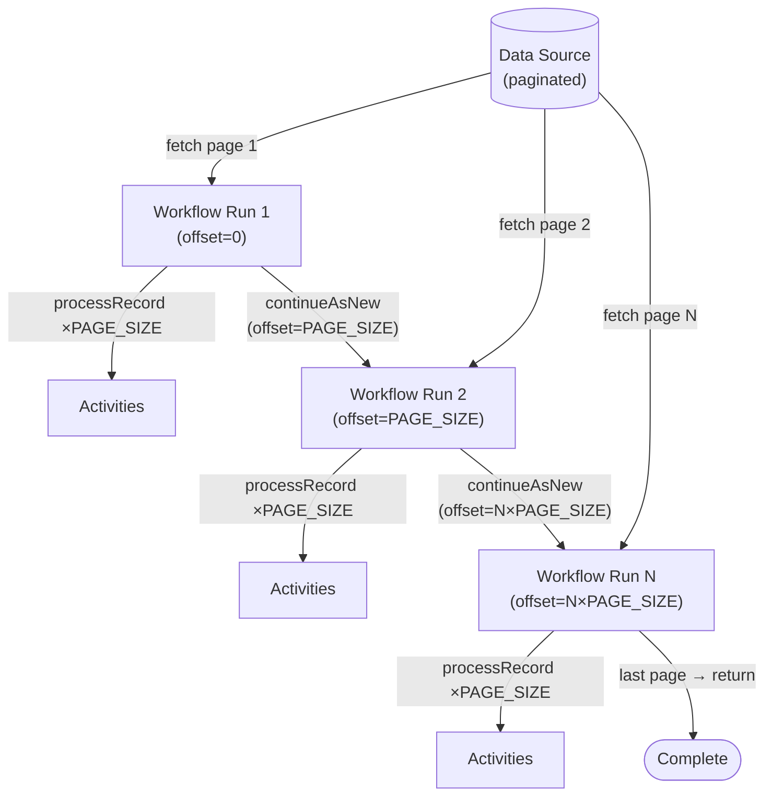

import Tabs from '@theme/Tabs';
import TabItem from '@theme/TabItem';

:::info[TLDR]
**Process one page at a time** and call Continue-as-New with the next offset after each page so the Workflow's event history never grows without bound. With this method you can process infinite pages. Use this when your record set is arbitrarily large, you need a durable checkpoint after every page, and sequential page-by-page throughput is acceptable.
:::

## Overview

The Batch Iterator pattern processes a large record set one page at a time. Each Workflow run processes a single page and then calls Continue-as-New with the next offset, producing a chain of short-lived runs that together cover the entire record set without accumulating unbounded event history.

## Problem

A single Workflow run is limited to 50,000 history events (aim for 2,000) and 2,000 in-flight Activities. Processing millions of records in one run is not possible within these bounds.

You need a way to process an arbitrarily large record set reliably, with the ability to resume from a checkpoint if the Workflow is interrupted, and without overwhelming downstream systems with a burst of concurrent requests.

## Solution

Each Workflow run fetches one page of records using a persistent `offset` parameter, processes each record sequentially, and then calls `continueAsNew` with the incremented offset. The next run picks up exactly where the previous one left off.

Because each run processes only a bounded number of records, history stays well within limits. The offset acts as a durable checkpoint: if the Workflow is interrupted mid-page, the next run replays only from the start of the current page.



The following describes each step in the diagram:

1. The Workflow starts with `offset=0` and calls `fetchPage(offset, pageSize)` to retrieve the first page of records.
2. It processes each record in the page by executing the `processRecord` Activity.
3. After the page is fully processed, it calls `continueAsNew` with `offset + pageSize`, passing the updated offset to the next run.
4. The next run begins with a clean history and repeats the same steps for the next page.
5. When `fetchPage` returns fewer records than `pageSize`, the Workflow knows it has reached the last page and returns normally.

## Implementation

The following examples show how each SDK implements the Batch Iterator pattern.

<Tabs groupId="language" queryString>
<TabItem value="typescript" label="TypeScript">

```typescript
// workflows.ts
import { continueAsNew, log, proxyActivities } from "@temporalio/workflow";
import type * as activities from "./activities";
import { PAGE_SIZE } from "./shared";

const { fetchPage, processRecord } = proxyActivities<typeof activities>({
  startToCloseTimeout: "10 seconds",
});

export async function batchIteratorWorkflow(
  offset: number = 0,
  totalProcessed: number = 0
): Promise<number> {
  const page = await fetchPage(offset, PAGE_SIZE);

  for (const record of page) {
    await processRecord(record);
    totalProcessed++;
  }

  log.info(`Processed page at offset ${offset} (${page.length} records, running total: ${totalProcessed})`);

  if (page.length === PAGE_SIZE) {
    await continueAsNew<typeof batchIteratorWorkflow>(offset + PAGE_SIZE, totalProcessed);
  }

  return totalProcessed;
}
```

</TabItem>
<TabItem value="python" label="Python">

```python
# workflows.py
from temporalio import workflow
from temporalio.workflow import continue_as_new
from datetime import timedelta
from activities import fetch_page, process_record
from shared import PAGE_SIZE


@workflow.defn
class BatchIteratorWorkflow:
    @workflow.run
    async def run(self, offset: int = 0, total_processed: int = 0) -> int:
        page = await workflow.execute_activity(
            fetch_page,
            args=[offset, PAGE_SIZE],
            start_to_close_timeout=timedelta(seconds=10),
        )

        for record in page:
            await workflow.execute_activity(
                process_record,
                record,
                start_to_close_timeout=timedelta(seconds=10),
            )
            total_processed += 1

        workflow.logger.info(
            f"Processed page at offset {offset} ({len(page)} records, running total: {total_processed})"
        )

        if len(page) == PAGE_SIZE:
            continue_as_new(args=[offset + PAGE_SIZE, total_processed])

        return total_processed
```

</TabItem>
<TabItem value="go" label="Go">

```go
// workflows.go
package main

import (
	"time"

	"go.temporal.io/sdk/workflow"
)

func BatchIteratorWorkflow(ctx workflow.Context, offset int, totalProcessed int) (int, error) {
	ao := workflow.ActivityOptions{
		StartToCloseTimeout: 10 * time.Second,
	}
	ctx = workflow.WithActivityOptions(ctx, ao)

	var page []Record
	if err := workflow.ExecuteActivity(ctx, FetchPage, offset, PageSize).Get(ctx, &page); err != nil {
		return totalProcessed, err
	}

	for _, record := range page {
		if err := workflow.ExecuteActivity(ctx, ProcessRecord, record).Get(ctx, nil); err != nil {
			return totalProcessed, err
		}
		totalProcessed++
	}

	workflow.GetLogger(ctx).Info("Processed page",
		"offset", offset,
		"pageSize", len(page),
		"totalProcessed", totalProcessed)

	if len(page) == PageSize {
		return totalProcessed, workflow.NewContinueAsNewError(ctx, BatchIteratorWorkflow, offset+PageSize, totalProcessed)
	}

	return totalProcessed, nil
}
```

</TabItem>
<TabItem value="java" label="Java">

```java
// BatchIteratorWorkflow.java
import io.temporal.activity.ActivityOptions;
import io.temporal.workflow.*;
import java.time.Duration;
import java.util.List;

@WorkflowInterface
public interface BatchIteratorWorkflow {
    @WorkflowMethod
    int run(int offset, int totalProcessed);
}

// BatchIteratorWorkflowImpl.java
public class BatchIteratorWorkflowImpl implements BatchIteratorWorkflow {
    private final Activities activities = Workflow.newActivityStub(
        Activities.class,
        ActivityOptions.newBuilder()
            .setStartToCloseTimeout(Duration.ofSeconds(10))
            .build()
    );

    @Override
    public int run(int offset, int totalProcessed) {
        List<Record> page = activities.fetchPage(offset, Shared.PAGE_SIZE);

        for (Record record : page) {
            activities.processRecord(record);
            totalProcessed++;
        }

        Workflow.getLogger(BatchIteratorWorkflowImpl.class).info(
            "Processed page at offset " + offset + " (" + page.size() + " records, total: " + totalProcessed + ")"
        );

        if (page.size() == Shared.PAGE_SIZE) {
            BatchIteratorWorkflow next = Workflow.newContinueAsNewStub(BatchIteratorWorkflow.class);
            next.run(offset + Shared.PAGE_SIZE, totalProcessed);
        }

        return totalProcessed;
    }
}
```

</TabItem>
</Tabs>

## Best practices

- **Choose a page size that keeps history under 2,000 events.** Each page produces roughly `3 × pageSize` history events (`ActivityTaskScheduled` + `ActivityTaskStarted` + `ActivityTaskCompleted`). A page size of 500–800 records is a safe target.
- **Include `totalProcessed` (or a similar counter) in the `continueAsNew` args.** This lets you observe overall progress via the Workflow input visible in the UI without querying internal state.
- **Fetch inside an Activity, not the Workflow.** The `fetchPage` call must be an Activity — not inline Workflow code — so it can interact with external systems and be retried independently.
- **Make `processRecord` idempotent.** Activities have at-least-once execution semantics. If a worker crashes after an Activity completes externally but before the completion is recorded in history, Temporal will retry it. Your downstream system must tolerate receiving the same record more than once.
- **Avoid accumulating large local state between pages.** `continueAsNew` does not carry over in-memory state; only the arguments you pass are available in the next run.

## Common pitfalls

- **Forgetting `continueAsNew` on the last page.** If you call `continueAsNew` unconditionally, the Workflow loops forever even when the data source is exhausted. Check whether the returned page is shorter than `pageSize` before continuing.
- **Passing unnecessary state into `continueAsNew`.** All arguments are serialized and stored in history. Pass only the minimal state needed (offset, counters) — not accumulated result lists or large collections that grow with each page.
- **Sequential processing bottlenecks.** The default implementation processes one record at a time per page. You can fan out Activities concurrently within a page using the SDK's async primitives for higher per-page throughput — note this increases per-page event count accordingly. If record-set-wide throughput matters more than rate limiting, consider [Sliding Window](/design-patterns/sliding-window) or [MapReduce Tree](/design-patterns/mapreduce-tree).

## Related resources

- [Continue-as-New pattern](/design-patterns/continue-as-new) — core concepts for history management via `continueAsNew`
- [Sliding Window](/design-patterns/sliding-window) — bounded concurrency that progresses at the rate of the fastest processor
- [MapReduce Tree](/design-patterns/mapreduce-tree) — fully parallel processing for maximum speed
- [Temporal limits reference](/cloud/limits)
- [Batch samples (Java)](https://github.com/temporalio/samples-java/tree/main/core/src/main/java/io/temporal/samples/batch/iterator)
