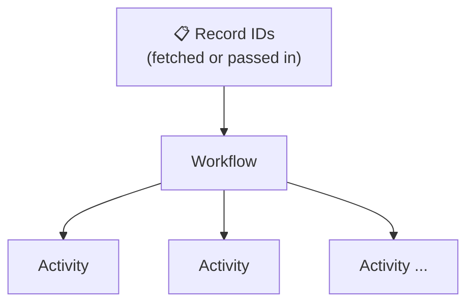

import PatternCards from '@site/src/components/PatternCards';

Patterns for processing large volumes of records reliably, at scale, and without overwhelming downstream systems.

Choose based on your throughput requirements, record set size, and whether you need rate limiting or maximum parallelism.

## When to use which pattern

| Pattern | Record set size | Parallelism model | Workflow-based rate control |
|---|---|---|---|
| [Basic Workflow](#basic-workflow-single-tier-fan-out) | Small (up to a few hundred records) | Sequential or parallel activities in one Workflow | No |
| [Fan-Out with Child Workflows](/design-patterns/fanout-child-workflows) | Up to ~4M records | Fixed concurrency (one child per chunk) | No |
| [Batch Iterator](/design-patterns/batch-iterator) | Unlimited | Limited (activities per page) | Yes — fixed page rate |
| [Sliding Window](/design-patterns/sliding-window) | Unlimited | Bounded window of concurrent children | Yes — configurable window |
| [MapReduce Tree](/design-patterns/mapreduce-tree) | Unlimited | Fully parallel recursive tree | No — maximum speed |

<PatternCards items={[
  {
    href: "/design-patterns/fanout-child-workflows",
    title: "Fan-Out with Child Workflows",
    description: "Splits a record set into fixed-size chunks and assigns each to an independent child Workflow. Simple to reason about; best for record sets up to ~4M items.",
  },
  {
    href: "/design-patterns/batch-iterator",
    title: "Batch Iterator",
    description: "Processes one page of records per Workflow run and continues as new with the next page offset. Handles unlimited record sets while controlling downstream traffic.",
  },
  {
    href: "/design-patterns/sliding-window",
    title: "Sliding Window",
    description: "Maintains a fixed-size window of concurrent child Workflows. As each child completes it signals the parent, which immediately starts a replacement — maximizing throughput within a concurrency budget.",
  },
  {
    href: "/design-patterns/mapreduce-tree",
    title: "MapReduce Tree",
    description: "Recursively splits a record set into chunks, fans out to leaf Workflows for parallel processing, and signals results back up the tree. Maximizes speed for embarrassingly parallel workloads.",
  },
]} />

---

## Schedules

Schedules allow Workflows to be executed on a recurring basis — think of them as a more powerful cron.

- Supports `start` / `pause` / `stop` / `update` / `backfill` of scheduled Workflow executions
- Configurable **Overlap Policies** control what happens when the previous run is still running
- Full execution history visibility in the Temporal UI
- Schedules can be created via the UI, CLI, or SDK

```bash
temporal schedule create \
  --schedule-id 'your-schedule-id' \
  --workflow-id 'your-workflow-id' \
  --task-queue 'your-task-queue' \
  --workflow-type 'YourWorkflowType'
```

**References:**
- [Temporal Schedules](https://docs.temporal.io/workflows#schedule)
- [CLI schedule commands](https://docs.temporal.io/cli/schedule)

---

## Basic Workflow (single-tier fan-out)

The simplest form of batch processing: the Workflow fetches or receives record IDs and executes one Activity per record.

- Activities can be executed sequentially or concurrently (using the SDK's async primitives)
- **Limit: 2,000 in-flight Activities per Workflow run** (aim for 500)
- If total event count is likely to exceed 2,000 (hard limit: 50,000), use the [Batch Iterator](/design-patterns/batch-iterator) instead

**Pros:** Simple
**Cons:** Hard cap on concurrent Activities; all-or-nothing failure model; can overwhelm downstream systems



---

## Batch Signalling

The Temporal CLI lets you signal, reset, cancel, or terminate multiple Workflows with a single command using a visibility query.

- 1 running batch job per namespace
- 50 Workflows per second per batch

```bash
# Signal all running Workflows of a given type
temporal workflow signal \
  --name MySignal \
  --input '{"Input": "As-JSON"}' \
  --query 'ExecutionStatus = "Running" AND WorkflowType="YourWorkflow"' \
  --reason "Testing"

# Terminate all running Workflows of a given type
temporal workflow terminate \
  --query 'ExecutionStatus = "Running" AND WorkflowType="SomeWorkflowType"' \
  --reason "Terminate Test Workflows"
```

**Reference:** [CLI batch commands](https://docs.temporal.io/cli/batch)

---

## Key Limits

Full reference: [Temporal Cloud limits](https://docs.temporal.io/cloud/limits)

| Limit | Value |
|---|---|
| Unfinished actions per Workflow | 2,000 max (aim for 500). Includes Activities, Signals, Child Workflows, cancellation requests |
| Events per Workflow history | 50,000 events max (aim for 2,000) **or** 50 MB total history size |
| Signals per Workflow | 10,000 |
| Updates per Workflow | 10 in-flight, 2,000 total |
| Batch Signalling | 1 batch job per namespace; 50 Workflows/sec per batch |
