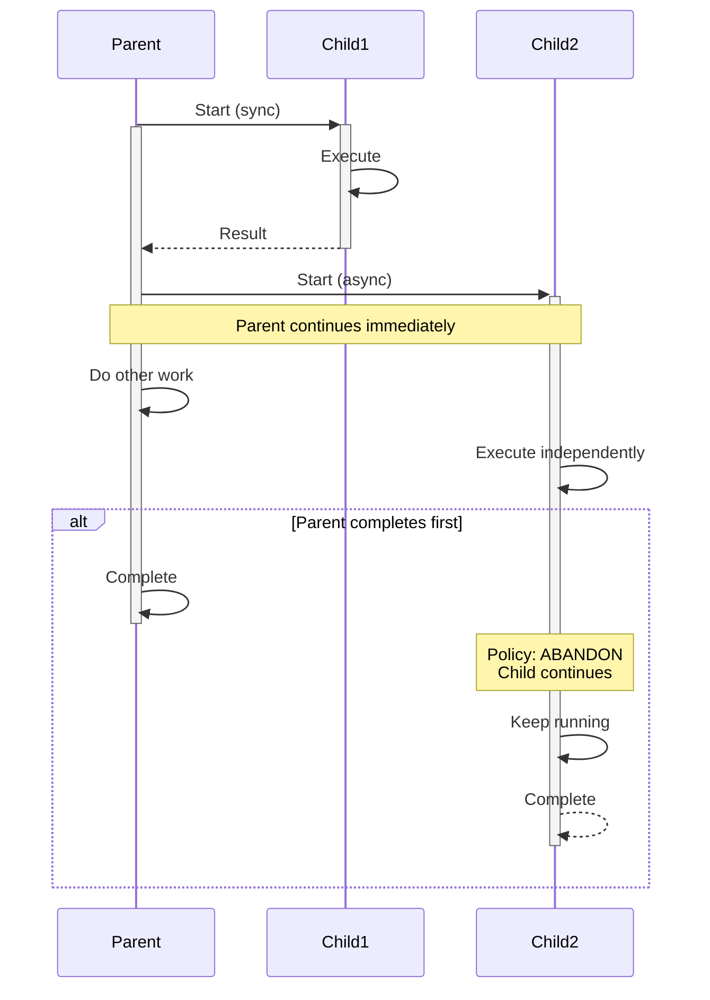

import Tabs from '@theme/Tabs';
import TabItem from '@theme/TabItem';

## Overview

Child Workflows enable decomposition of complex business logic into smaller, reusable Workflow units.
Each child executes as an independent Workflow with its own Workflow ID, event history (50K event limit), and lifecycle.
Unlike Activities which execute code, Child Workflows orchestrate processes and provide Workflow-level semantics: independent tracking, querying, timeouts, and the ability to outlive the parent.

Key capabilities:

- **Independent identity**: Each child has a unique Workflow ID visible in the UI for tracking and querying.
- **Separate history**: Each child maintains its own event history, preventing parent history bloat.
- **Flexible invocation**: Synchronous (blocking) or asynchronous (non-blocking) execution.
- **Lifecycle control**: Parent close policies (TERMINATE, ABANDON, REQUEST_CANCEL) determine child behavior when the parent completes.
- **Task Queue routing**: Children can execute on different Task Queues with specialized Workers.
- **Reusability**: The same Child Workflow logic can be invoked by multiple different parent Workflows.

## Problem

In distributed systems, you often need Workflows that break down complex processes into modular, reusable components, execute sub-processes that may outlive the parent Workflow, coordinate multiple independent Workflows with different lifecycles, isolate failure domains while maintaining orchestration control, and reuse Workflow logic across different parent Workflows.

Without Child Workflows, you must implement all logic in a single monolithic Workflow, manually coordinate separate Workflows via Signals and Queries, duplicate Workflow logic across multiple implementations, and manage complex state machines for sub-process coordination.

## Solution

You invoke Child Workflows from within parent Workflows using the SDK's Child Workflow API.
You can call them synchronously (blocking until completion) or asynchronously (fire-and-forget).
The `ParentClosePolicy` determines what happens to children when the parent completes.



The following describes each step in the diagram:

1. The parent starts Child 1 synchronously and blocks until it completes.
2. The parent starts Child 2 asynchronously and continues doing other work immediately.
3. If the parent completes before Child 2, the ABANDON policy allows Child 2 to continue running independently.

### Synchronous Child Workflow

The following example creates a Child Workflow and calls it synchronously.
The parent blocks until the child completes and returns a result:

<Tabs groupId="language" queryString>
<TabItem value="python" label="Python">

```python
# workflows.py
from temporalio import workflow

from child_workflows import ChildWorkflow

@workflow.defn
class ParentWorkflow:
    @workflow.run
    async def run(self, input: str) -> str:
        # Synchronous call - awaits until child completes
        result = await workflow.execute_child_workflow(
            ChildWorkflow.run,
            input,
            id=f"child-{workflow.uuid4()}",
        )

        return f"Parent received: {result}"
```

</TabItem>
<TabItem value="go" label="Go">

```go
// parent_workflow.go
func ParentWorkflow(ctx workflow.Context, input string) (string, error) {
    cwo := workflow.ChildWorkflowOptions{}
    ctx = workflow.WithChildOptions(ctx, cwo)

    // Synchronous call - blocks until child completes
    var result string
    err := workflow.ExecuteChildWorkflow(ctx, ChildWorkflow, input).Get(ctx, &result)
    if err != nil {
        return "", err
    }

    return "Parent received: " + result, nil
}
```

</TabItem>
<TabItem value="java" label="Java">

```java
// ParentWorkflowImpl.java
@WorkflowInterface
public interface ParentWorkflow {
  @WorkflowMethod
  String execute(String input);
}

public class ParentWorkflowImpl implements ParentWorkflow {
  @Override
  public String execute(String input) {
    ChildWorkflow child = Workflow.newChildWorkflowStub(ChildWorkflow.class);

    // Synchronous call - blocks until child completes
    String result = child.processData(input);

    return "Parent received: " + result;
  }
}
```

</TabItem>
<TabItem value="typescript" label="TypeScript">

```typescript
// workflows.ts
import { executeChild } from '@temporalio/workflow';
import { childWorkflow } from './child-workflows';

export async function parentWorkflow(input: string): Promise<string> {
  // Synchronous call - awaits until child completes
  const result = await executeChild(childWorkflow, {
    args: [input],
  });

  return `Parent received: ${result}`;
}
```

</TabItem>
</Tabs>

In Java, `Workflow.newChildWorkflowStub()` creates a typed stub and calling a method on it blocks the parent.
In TypeScript, `executeChild()` starts the child and awaits its completion.
In Python, `workflow.execute_child_workflow()` starts the child and awaits its completion.
In Go, `workflow.ExecuteChildWorkflow()` returns a `ChildWorkflowFuture`, and calling `.Get()` blocks until the child completes.

### Asynchronous Child Workflow

The following example starts a Child Workflow asynchronously with an ABANDON policy.
The parent receives the child's execution info without waiting for completion:

<Tabs groupId="language" queryString>
<TabItem value="python" label="Python">

```python
# workflows.py
from temporalio import workflow
from temporalio.workflow import ParentClosePolicy

from child_workflows import ChildWorkflow

@workflow.defn
class ParentWorkflow:
    @workflow.run
    async def run(self, input: str) -> str:
        # Async call - returns handle once child starts
        handle = await workflow.start_child_workflow(
            ChildWorkflow.run,
            input,
            id=f"child-{workflow.uuid4()}",
            parent_close_policy=ParentClosePolicy.ABANDON,
        )

        # Parent continues without waiting for child completion
        return handle.id
```

</TabItem>
<TabItem value="go" label="Go">

```go
// parent_workflow.go
import (
    enumspb "go.temporal.io/api/enums/v1"
    "go.temporal.io/sdk/workflow"
)

func ParentWorkflow(ctx workflow.Context, input string) (string, error) {
    cwo := workflow.ChildWorkflowOptions{
        ParentClosePolicy: enumspb.PARENT_CLOSE_POLICY_ABANDON,
    }
    ctx = workflow.WithChildOptions(ctx, cwo)

    childFuture := workflow.ExecuteChildWorkflow(ctx, ChildWorkflow, input)

    // Wait for child to start, not complete
    var childWE workflow.Execution
    if err := childFuture.GetChildWorkflowExecution().Get(ctx, &childWE); err != nil {
        return "", err
    }

    // Parent continues without waiting for child completion
    return childWE.ID, nil
}
```

</TabItem>
<TabItem value="java" label="Java">

```java
// ParentWorkflowImpl.java
public class ParentWorkflowImpl implements ParentWorkflow {
  @Override
  public WorkflowExecution execute(String input) {
    ChildWorkflowOptions options = ChildWorkflowOptions.newBuilder()
        .setWorkflowId("child-" + Workflow.randomUUID())
        .setParentClosePolicy(ParentClosePolicy.PARENT_CLOSE_POLICY_ABANDON)
        .build();

    ChildWorkflow child = Workflow.newChildWorkflowStub(ChildWorkflow.class, options);

    // Async call - returns immediately
    Async.function(child::processData, input);

    // Get child execution info without waiting for completion
    Promise<WorkflowExecution> childExecution = Workflow.getWorkflowExecution(child);
    return childExecution.get(); // Blocks only until child starts
  }
}
```

</TabItem>
<TabItem value="typescript" label="TypeScript">

```typescript
// workflows.ts
import { startChild, ParentClosePolicy } from '@temporalio/workflow';
import { childWorkflow } from './child-workflows';

export async function parentWorkflow(input: string): Promise<string> {
  const childHandle = await startChild(childWorkflow, {
    args: [input],
    parentClosePolicy: ParentClosePolicy.PARENT_CLOSE_POLICY_ABANDON,
  });

  // Parent continues without waiting for child completion
  // childHandle.workflowId and childHandle.firstExecutionRunId are available
  return childHandle.workflowId;
}
```

</TabItem>
</Tabs>

In Java, `Async.function()` starts the child asynchronously.
`Workflow.getWorkflowExecution(child)` returns a Promise that resolves when the child starts (not when it completes).
In TypeScript, `startChild()` returns a handle once the child has started.
In Python, `workflow.start_child_workflow()` returns a handle once the child has started, without waiting for completion.
In Go, `childFuture.GetChildWorkflowExecution().Get()` blocks until the child has started.
The ABANDON policy ensures the child continues running even if the parent completes first.

## Parent close policy

The `ParentClosePolicy` determines Child Workflow behavior when the parent closes:

| Policy | Behavior | Use case |
| :--- | :--- | :--- |
| `TERMINATE` | Child is terminated when parent closes | Tightly coupled processes |
| `ABANDON` | Child continues independently | Fire-and-forget, long-running tasks |
| `REQUEST_CANCEL` | Child receives cancellation request | Graceful cleanup |

## Implementation

### Parallel Child Workflows

The following example starts multiple Child Workflows in parallel and waits for all of them to complete:

<Tabs groupId="language" queryString>
<TabItem value="python" label="Python">

```python
# workflows.py
import asyncio
from temporalio import workflow

from child_workflows import ChildWorkflow

@workflow.defn
class ParallelParentWorkflow:
    @workflow.run
    async def run(self, items: list[str]) -> str:
        # Start all children concurrently using asyncio.gather
        results = await asyncio.gather(
            *[
                workflow.execute_child_workflow(
                    ChildWorkflow.run,
                    item,
                    id=f"child-{workflow.uuid4()}",
                )
                for item in items
            ]
        )

        return ", ".join(results)
```

</TabItem>
<TabItem value="go" label="Go">

```go
// parallel_parent_workflow.go
func ParallelParentWorkflow(ctx workflow.Context, items []string) (string, error) {
    cwo := workflow.ChildWorkflowOptions{}
    ctx = workflow.WithChildOptions(ctx, cwo)

    // Start all children - ExecuteChildWorkflow returns immediately
    var futures []workflow.ChildWorkflowFuture
    for _, item := range items {
        futures = append(futures, workflow.ExecuteChildWorkflow(ctx, ChildWorkflow, item))
    }

    // Wait for all children to complete
    var results []string
    for _, future := range futures {
        var result string
        if err := future.Get(ctx, &result); err != nil {
            return "", err
        }
        results = append(results, result)
    }

    return strings.Join(results, ", "), nil
}
```

</TabItem>
<TabItem value="java" label="Java">

```java
// ParallelParentWorkflowImpl.java
public class ParallelParentWorkflowImpl implements ParentWorkflow {
  @Override
  public String execute(List<String> items) {
    List<Promise<String>> promises = new ArrayList<>();

    for (String item : items) {
      ChildWorkflow child = Workflow.newChildWorkflowStub(ChildWorkflow.class);
      promises.add(Async.function(child::process, item));
    }

    // Wait for all children to complete
    Promise.allOf(promises).get();

    return promises.stream()
        .map(Promise::get)
        .collect(Collectors.joining(", "));
  }
}
```

</TabItem>
<TabItem value="typescript" label="TypeScript">

```typescript
// workflows.ts
import { executeChild } from '@temporalio/workflow';
import { childWorkflow } from './child-workflows';

export async function parallelParentWorkflow(items: string[]): Promise<string> {
  // Start all children concurrently using Promise.all
  const results = await Promise.all(
    items.map((item) =>
      executeChild(childWorkflow, {
        args: [item],
      })
    )
  );

  return results.join(', ');
}
```

</TabItem>
</Tabs>

In Java, each child starts asynchronously via `Async.function()`, and `Promise.allOf(promises).get()` blocks until every child completes.
In TypeScript, `Promise.all()` starts all children concurrently and awaits all results.
In Python, `asyncio.gather()` starts all children concurrently and awaits all results.
In Go, `workflow.ExecuteChildWorkflow()` returns a Future immediately without blocking, so starting all children in a loop launches them in parallel. Calling `.Get()` on each Future afterward collects the results.

### Fire-and-forget

The following example starts a Child Workflow with the ABANDON policy and returns immediately without waiting:

<Tabs groupId="language" queryString>
<TabItem value="python" label="Python">

```python
# workflows.py
from temporalio import workflow
from temporalio.workflow import ParentClosePolicy

from child_workflows import LongRunningChildWorkflow

@workflow.defn
class FireAndForgetParentWorkflow:
    @workflow.run
    async def run(self, data: str) -> None:
        # Start child with ABANDON policy - child survives parent completion
        await workflow.start_child_workflow(
            LongRunningChildWorkflow.run,
            data,
            id=f"child-{workflow.uuid4()}",
            parent_close_policy=ParentClosePolicy.ABANDON,
        )

        # start_child_workflow resolves once the child has started
        # Parent completes, child continues independently
```

</TabItem>
<TabItem value="go" label="Go">

```go
// fire_and_forget_workflow.go
import (
    enumspb "go.temporal.io/api/enums/v1"
    "go.temporal.io/sdk/workflow"
)

func FireAndForgetParentWorkflow(ctx workflow.Context, data string) error {
    cwo := workflow.ChildWorkflowOptions{
        ParentClosePolicy: enumspb.PARENT_CLOSE_POLICY_ABANDON,
    }
    ctx = workflow.WithChildOptions(ctx, cwo)

    childFuture := workflow.ExecuteChildWorkflow(ctx, LongRunningChildWorkflow, data)

    // Wait for child to start before parent completes
    if err := childFuture.GetChildWorkflowExecution().Get(ctx, nil); err != nil {
        return err
    }

    // Parent completes, child continues independently
    return nil
}
```

</TabItem>
<TabItem value="java" label="Java">

```java
// FireAndForgetParentWorkflowImpl.java
public class FireAndForgetParentWorkflowImpl implements ParentWorkflow {
  @Override
  public void execute(String data) {
    ChildWorkflowOptions options = ChildWorkflowOptions.newBuilder()
        .setParentClosePolicy(ParentClosePolicy.PARENT_CLOSE_POLICY_ABANDON)
        .build();

    ChildWorkflow child = Workflow.newChildWorkflowStub(ChildWorkflow.class, options);

    // Start child and don't wait for completion
    Async.function(child::longRunningProcess, data);

    // Wait for child to start before parent completes
    Workflow.getWorkflowExecution(child).get();

    // Parent completes, child continues independently
  }
}
```

</TabItem>
<TabItem value="typescript" label="TypeScript">

```typescript
// workflows.ts
import { startChild, ParentClosePolicy } from '@temporalio/workflow';
import { longRunningChildWorkflow } from './child-workflows';

export async function fireAndForgetParentWorkflow(data: string): Promise<void> {
  // Start child with ABANDON policy - child survives parent completion
  await startChild(longRunningChildWorkflow, {
    args: [data],
    parentClosePolicy: ParentClosePolicy.PARENT_CLOSE_POLICY_ABANDON,
  });

  // startChild resolves once the child has started
  // Parent completes, child continues independently
}
```

</TabItem>
</Tabs>

You must wait for the child to start before the parent completes.
Without this, the parent could complete before the child is scheduled, and the child would never execute.
The ABANDON policy ensures the child continues running after the parent completes.

### Conditional child execution

The following example conditionally starts different Child Workflows based on business logic:

<Tabs groupId="language" queryString>
<TabItem value="python" label="Python">

```python
# workflows.py
from temporalio import workflow

from child_workflows import ApprovalWorkflow, FulfillmentWorkflow

@workflow.defn
class ConditionalParentWorkflow:
    @workflow.run
    async def run(self, order: Order) -> str:
        if order.requires_approval:
            approved = await workflow.execute_child_workflow(
                ApprovalWorkflow.run,
                order,
                id=f"approval-{order.id}",
            )

            if not approved:
                return "Order rejected"

        return await workflow.execute_child_workflow(
            FulfillmentWorkflow.run,
            order,
            id=f"fulfillment-{order.id}",
        )
```

</TabItem>
<TabItem value="go" label="Go">

```go
// conditional_parent_workflow.go
func ConditionalParentWorkflow(ctx workflow.Context, order Order) (string, error) {
    cwo := workflow.ChildWorkflowOptions{}
    ctx = workflow.WithChildOptions(ctx, cwo)

    if order.RequiresApproval {
        var approved bool
        err := workflow.ExecuteChildWorkflow(ctx, ApprovalWorkflow, order).Get(ctx, &approved)
        if err != nil {
            return "", err
        }

        if !approved {
            return "Order rejected", nil
        }
    }

    var result string
    err := workflow.ExecuteChildWorkflow(ctx, FulfillmentWorkflow, order).Get(ctx, &result)
    if err != nil {
        return "", err
    }

    return result, nil
}
```

</TabItem>
<TabItem value="java" label="Java">

```java
// ConditionalParentWorkflowImpl.java
public class ConditionalParentWorkflowImpl implements ParentWorkflow {
  @Override
  public String execute(Order order) {
    if (order.requiresApproval()) {
      ApprovalWorkflow approval = Workflow.newChildWorkflowStub(ApprovalWorkflow.class);
      boolean approved = approval.requestApproval(order);

      if (!approved) {
        return "Order rejected";
      }
    }

    FulfillmentWorkflow fulfillment = Workflow.newChildWorkflowStub(FulfillmentWorkflow.class);
    return fulfillment.fulfill(order);
  }
}
```

</TabItem>
<TabItem value="typescript" label="TypeScript">

```typescript
// workflows.ts
import { executeChild } from '@temporalio/workflow';
import { approvalWorkflow, fulfillmentWorkflow } from './child-workflows';

export async function conditionalParentWorkflow(order: Order): Promise<string> {
  if (order.requiresApproval) {
    const approved = await executeChild(approvalWorkflow, {
      args: [order],
    });

    if (!approved) {
      return 'Order rejected';
    }
  }

  return await executeChild(fulfillmentWorkflow, {
    args: [order],
  });
}
```

</TabItem>
</Tabs>

The parent checks whether the order requires approval and only starts the approval Child Workflow when needed.

## When to use

Child Workflows and Activities serve different purposes.

Use Child Workflows when:

- You need a separate Workflow ID for tracking and querying.
- The operation may outlive the parent Workflow.
- You need to reuse Workflow logic across multiple parents.
- You want to execute Workflows on different Task Queues.
- You need independent history and event limits.
- You want to apply different timeouts or retry policies at the Workflow level.

Use Activities when:

- You are executing external operations (API calls, database queries).
- The operation is short-lived.
- You do not need independent Workflow tracking.
- The operation is tightly coupled to the parent Workflow lifecycle.
- Lower overhead is important.

The key distinction is that Activities are for executing code (especially external operations), while Child Workflows are for orchestrating processes that benefit from independent Workflow semantics.

## Benefits and trade-offs

Child Workflows provide modularity by breaking complex logic into reusable units.
Each child is a first-class Workflow with its own ID for tracking, its own 50K event history limit, and its own execution timeout configuration.
Children can outlive parents with the ABANDON policy, and you can start multiple children concurrently.
Child failures do not automatically fail the parent, and the same Child Workflow can be reused by multiple parents.

The trade-offs to consider are that each child is a separate Workflow execution with its own history (overhead).
There are more moving parts than a single Workflow.
Child execution details are not in the parent history (but are queryable independently).
Async children require explicit synchronization if needed.
More Workflow executions mean higher resource usage.
Starting a Child Workflow has more overhead than starting an Activity.

## Comparison with alternatives

| Approach | Modularity | Independent history | Can outlive parent | Overhead | Separate Workflow ID |
| :--- | :--- | :--- | :--- | :--- | :--- |
| Child Workflow | High | Yes | Yes (ABANDON) | Medium | Yes |
| Activity | Medium | No | No | Low | No |
| Separate Workflow + Signals | High | Yes | Yes | High | Yes |
| Async Lambda | Low | No | No | Very Low | No |

## Best practices

- **Use unique Workflow IDs.** Generate unique IDs for Child Workflows to avoid conflicts.
- **Choose the appropriate policy.** Use TERMINATE for tightly coupled children, ABANDON for independent children.
- **Handle child failures.** Catch and handle Child Workflow exceptions appropriately.
- **Limit parallelism.** Do not spawn unlimited children; use batch patterns for large datasets.
- **Consider Activities first.** Use Activities for operations that do not need independent Workflow tracking.
- **Set timeouts.** Configure appropriate Workflow execution timeouts for children.
- **Use typed stubs.** Prefer typed stubs over untyped for compile-time safety.
- **Monitor child executions.** Track Child Workflow IDs for observability and debugging.

## Common pitfalls

- **Treating Child Workflows like Activities.** Child Workflows are for orchestration, not for executing external code. If you only need to call an API or run a function, use an Activity instead.
- **Spawning unbounded children in a loop.** Starting thousands of Child Workflows without batching can overwhelm the Temporal Service and bloat the parent's event history. Use fixed-size batches or a sliding window.
- **Ignoring the Parent Close Policy.** The default policy is TERMINATE, which kills children when the parent closes. If children must outlive the parent, set the policy to ABANDON explicitly.
- **Using synchronous calls when async is needed.** Calling a Child Workflow synchronously blocks the parent until the child completes. For long-running children, use the async API (`Async.function()` in Java, `startChild()` in TypeScript, `start_child_workflow()` in Python, or collect Futures without calling `.Get()` in Go) to avoid stalling the parent.
- **Omitting Workflow IDs.** Without explicit Workflow IDs, you lose the ability to deduplicate or look up Child Workflows by a meaningful identifier. Generate deterministic IDs based on business keys.
- **Not handling child failures.** Child Workflow failures propagate to the parent as a Child Workflow Failure (`ChildWorkflowFailure` in TypeScript and Java, `ChildWorkflowError` in Python, `ChildWorkflowExecutionError` in Go), with the underlying cause in its `cause` field. If you do not catch and handle them, the parent Workflow fails as well.

## Related patterns

- **[Parallel Execution](/design-patterns/parallel-execution)**: Running multiple children concurrently.
- **[Continue-As-New](/design-patterns/continue-as-new)**: Child Workflows can use Continue-As-New independently.
- **[Saga Pattern](/design-patterns/saga-pattern)**: Children as compensatable transactions.

## Sample code

**Java:**
- [HelloChild](https://github.com/temporalio/samples-java/tree/main/core/src/main/java/io/temporal/samples/hello/HelloChild.java) — Basic synchronous Child Workflow.
- [Async Child Workflow](https://github.com/temporalio/samples-java/tree/main/core/src/main/java/io/temporal/samples/asyncchild) — Asynchronous child with ABANDON policy.
- [Async Untyped Child](https://github.com/temporalio/samples-java/tree/main/core/src/main/java/io/temporal/samples/asyncuntypedchild) — Untyped async Child Workflow.

**TypeScript:**
- [Child Workflows](https://github.com/temporalio/samples-typescript/tree/main/child-workflows) — Parent and child Workflow using `executeChild` and `startChild`.

**Python:**
- [Child Workflows](https://github.com/temporalio/samples-python/tree/main/hello/hello_child_workflow.py) — Basic Child Workflow using `execute_child_workflow`.

**Go:**
- [Child Workflow](https://github.com/temporalio/samples-go/tree/main/child-workflow) — Synchronous and async Child Workflow patterns.
