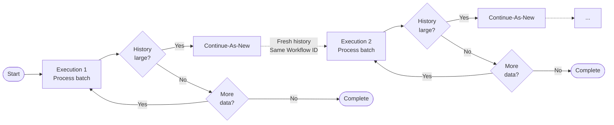

import Tabs from '@theme/Tabs';
import TabItem from '@theme/TabItem';

## Overview

The Continue-As-New pattern allows long-running Workflows to reset their event history by completing the current execution and immediately starting a new one with fresh state.
This prevents Workflows from hitting Temporal's event history limits while maintaining logical continuity, making it essential for periodic tasks, infinite loops, and Workflows that process unbounded data streams.
By archiving old event history and starting fresh, Continue-As-New also reduces active storage costs — only the current execution's history remains in active storage while previous runs are moved to cheaper archived storage.

## Problem

In long-running Workflows, you often need to execute periodic tasks indefinitely, process unbounded streams of data without accumulating history, implement infinite loops that run for months or years, avoid hitting the 50,000 event history limit, and maintain Workflow state across logical restarts.

Without Continue-As-New, you must manually stop and restart Workflows (losing continuity), risk hitting history limits and Workflow failures, implement external orchestration to manage Workflow lifecycle, and accept degraded performance as history grows large.

## Solution

Continue-As-New completes the current Workflow execution and atomically starts a new one with the same Workflow ID.
The new execution begins with a fresh event history while preserving logical continuity.
You pass state as arguments to the new execution.



The following describes each step in the diagram:

1. The Workflow starts Execution 1 and processes a batch of data.
2. After each batch, the Workflow checks whether the history is getting large.
3. If the history is large, the Workflow calls Continue-As-New, which starts Execution 2 with a fresh history and the same Workflow ID.
4. If the history is not large and more data remains, the Workflow loops and processes the next batch.
5. If no more data remains, the Workflow completes normally.

The following implementation shows a data processor that passes a cursor and a running total across executions.
When the batch is full (indicating more data to process), the Workflow calls Continue-As-New with the updated state:

<Tabs groupId="language" queryString>
<TabItem value="python" label="Python" default>

```python
# workflows.py
from datetime import timedelta
from temporalio import workflow

with workflow.unsafe.imports_passed_through():
    from activities import fetchBatch, process

BATCH_SIZE = 100

@workflow.defn
class DataProcessorWorkflow:
    @workflow.run
    async def run(self, cursor: str, total_processed: int = 0) -> None:
        batch = await workflow.execute_activity(
            fetchBatch, args=[cursor, BATCH_SIZE],
            start_to_close_timeout=timedelta(seconds=60),
        )

        for record in batch:
            await workflow.execute_activity(
                process, record,
                start_to_close_timeout=timedelta(seconds=60),
            )
            total_processed += 1
            cursor = record.id

        if len(batch) == BATCH_SIZE:
            # More data to process - continue as new with updated state
            workflow.continue_as_new(cursor, total_processed)
        # Otherwise complete normally
```

</TabItem>
<TabItem value="go" label="Go">

```go
// data_processor_workflow.go
const BatchSize = 100

func DataProcessorWorkflow(ctx workflow.Context, cursor string, totalProcessed int) error {
    ao := workflow.ActivityOptions{StartToCloseTimeout: time.Minute}
    ctx = workflow.WithActivityOptions(ctx, ao)

    var batch []Record
    err := workflow.ExecuteActivity(ctx, FetchBatch, cursor, BatchSize).Get(ctx, &batch)
    if err != nil {
        return err
    }

    for _, record := range batch {
        err = workflow.ExecuteActivity(ctx, Process, record).Get(ctx, nil)
        if err != nil {
            return err
        }
        totalProcessed++
        cursor = record.ID
    }

    if len(batch) == BatchSize {
        // More data to process - continue as new with updated state
        return workflow.NewContinueAsNewError(ctx, DataProcessorWorkflow, cursor, totalProcessed)
    }
    // Otherwise complete normally
    return nil
}
```

</TabItem>
<TabItem value="java" label="Java">

```java
// DataProcessorWorkflowImpl.java
@WorkflowInterface
public interface DataProcessorWorkflow {
  @WorkflowMethod
  void processData(String cursor, int totalProcessed);
}

public class DataProcessorWorkflowImpl implements DataProcessorWorkflow {
  private static final int BATCH_SIZE = 100;

  @Override
  public void processData(String cursor, int totalProcessed) {
    List<Record> batch = activities.fetchBatch(cursor, BATCH_SIZE);

    for (Record record : batch) {
      activities.process(record);
      totalProcessed++;
      cursor = record.getId();
    }

    if (batch.size() == BATCH_SIZE) {
      // More data to process - continue as new with updated state
      DataProcessorWorkflow continueAsNew =
          Workflow.newContinueAsNewStub(DataProcessorWorkflow.class);
      continueAsNew.processData(cursor, totalProcessed);
    }
    // Otherwise complete normally
  }
}
```

</TabItem>
<TabItem value="typescript" label="TypeScript">

```typescript
// workflows.ts
import { continueAsNew, proxyActivities } from '@temporalio/workflow';
import type * as activities from './activities';

const { fetchBatch, process } = proxyActivities<typeof activities>({
  startToCloseTimeout: '1 minute',
});

const BATCH_SIZE = 100;

export async function dataProcessorWorkflow(
  cursor: string,
  totalProcessed: number = 0
): Promise<void> {
  const batch = await fetchBatch(cursor, BATCH_SIZE);

  for (const record of batch) {
    await process(record);
    totalProcessed++;
    cursor = record.id;
  }

  if (batch.length === BATCH_SIZE) {
    // More data to process - continue as new with updated state
    await continueAsNew<typeof dataProcessorWorkflow>(cursor, totalProcessed);
  }
  // Otherwise complete normally
}
```

</TabItem>
</Tabs>

The Workflow fetches a batch of records, processes each one, and updates the cursor.
If the batch is full, the Workflow triggers Continue-As-New with the updated cursor and total.
In Java, `Workflow.newContinueAsNewStub()` creates a typed stub.
In TypeScript, `continueAsNew()` throws a special error that the runtime intercepts.
In Python, `workflow.continue_as_new()` immediately stops the current execution and starts a new one.
In Go, `workflow.NewContinueAsNewError()` returns a special error that signals the runtime to continue as new.
If the batch is smaller than `BATCH_SIZE`, no more data remains and the Workflow completes.

## Implementation

### Using the continue-as-new suggestion

Instead of tracking iteration counts manually, you can use the SDK's built-in suggestion to let Temporal tell you when the history is getting large:


<Tabs groupId="language" queryString>
<TabItem value="python" label="Python" default>

```python
# workflows.py
from datetime import timedelta
from temporalio import workflow

@workflow.defn
class DataProcessorWorkflow:
    @workflow.run
    async def run(self, cursor: str, total_processed: int = 0) -> None:
        batch = await workflow.execute_activity(
            fetchBatch, args=[cursor, BATCH_SIZE],
            start_to_close_timeout=timedelta(seconds=60),
        )

        for record in batch:
            await workflow.execute_activity(
                process, record,
                start_to_close_timeout=timedelta(seconds=60),
            )
            total_processed += 1
            cursor = record.id

            # Check if history is getting large
            if workflow.info().is_continue_as_new_suggested():
                workflow.continue_as_new(cursor, total_processed)

        # Continue processing or complete
```

</TabItem>
<TabItem value="go" label="Go">

```go
// data_processor_workflow.go
func DataProcessorWorkflow(ctx workflow.Context, cursor string, totalProcessed int) error {
    ao := workflow.ActivityOptions{StartToCloseTimeout: time.Minute}
    ctx = workflow.WithActivityOptions(ctx, ao)

    var batch []Record
    err := workflow.ExecuteActivity(ctx, FetchBatch, cursor, BatchSize).Get(ctx, &batch)
    if err != nil {
        return err
    }

    for _, record := range batch {
        err = workflow.ExecuteActivity(ctx, Process, record).Get(ctx, nil)
        if err != nil {
            return err
        }
        totalProcessed++
        cursor = record.ID

        // Check if history is getting large
        if workflow.GetInfo(ctx).GetContinueAsNewSuggested() {
            return workflow.NewContinueAsNewError(ctx, DataProcessorWorkflow, cursor, totalProcessed)
        }
    }

    // Continue processing or complete
    return nil
}
```

</TabItem>
<TabItem value="java" label="Java">

```java
// DataProcessorWorkflowImpl.java
public class DataProcessorWorkflowImpl implements DataProcessorWorkflow {

  @Override
  public void processData(String cursor, int totalProcessed) {
    List<Record> batch = activities.fetchBatch(cursor, BATCH_SIZE);

    for (Record record : batch) {
      activities.process(record);
      totalProcessed++;
      cursor = record.getId();

      // Check if history is getting large
      if (Workflow.getInfo().shouldContinueAsNew()) {
        DataProcessorWorkflow continueAsNew =
            Workflow.newContinueAsNewStub(DataProcessorWorkflow.class);
        continueAsNew.processData(cursor, totalProcessed);
        return;
      }
    }

    // Continue processing or complete
  }
}
```

</TabItem>
<TabItem value="typescript" label="TypeScript">

```typescript
// workflows.ts
import { continueAsNew, workflowInfo, proxyActivities } from '@temporalio/workflow';
import type * as activities from './activities';

const { fetchBatch, process } = proxyActivities<typeof activities>({
  startToCloseTimeout: '1 minute',
});

export async function dataProcessorWorkflow(
  cursor: string,
  totalProcessed: number = 0
): Promise<void> {
  const batch = await fetchBatch(cursor, BATCH_SIZE);

  for (const record of batch) {
    await process(record);
    totalProcessed++;
    cursor = record.id;

    // Check if history is getting large
    if (workflowInfo().continueAsNewSuggested) {
      await continueAsNew<typeof dataProcessorWorkflow>(cursor, totalProcessed);
    }
  }

  // Continue processing or complete
}
```

</TabItem>
</Tabs>

Each SDK provides a method to check if the history is approaching the limit:
- Java: `Workflow.getInfo().shouldContinueAsNew()`
- TypeScript: `workflowInfo().continueAsNewSuggested`
- Python: `workflow.info().is_continue_as_new_suggested()`
- Go: `workflow.GetInfo(ctx).GetContinueAsNewSuggested()`

This approach is more reliable than a fixed iteration count because it accounts for the actual number of events generated per iteration.

## When to use

The Continue-As-New pattern is a good fit for periodic Workflows running indefinitely (cron-like behavior), processing unbounded data streams, long-running Workflows with repetitive patterns, Workflows that accumulate state over many iterations, and preventing event history from growing too large.

It is not a good fit for short-lived Workflows (under 1000 events), Workflows that naturally complete, one-time batch processing, or Workflows that require full history for audit purposes.

## Benefits and trade-offs

Continue-As-New allows you to run Workflows indefinitely without history limits.
Fresh history keeps Workflow execution fast.
It reduces active storage costs by archiving old event history — more aggressive iteration limits mean more frequent archiving, keeping active storage minimal.
The transition is atomic with no gap between old and new execution.
You pass state as arguments to the new execution, and the Workflow ID remains the same, maintaining logical continuity for Queries and Signals.

The trade-offs to consider are that previous execution history is archived separately.
You must explicitly pass state as arguments (manual state management).
Queries only see the current execution's state.
Debugging requires tracing across multiple execution runs.
You cannot undo Continue-As-New once triggered.

## Comparison with alternatives

| Approach | History reset | State continuity | Use case |
| :--- | :--- | :--- | :--- |
| Continue-As-New | Yes | Manual | Long-running periodic |
| Child Workflows | Per child | Automatic | Parallel processing |
| Cron Schedule | Yes | None | Fixed schedule tasks |
| Manual Restart | Yes | None | One-time Workflows |

## Best practices

- **Use the continue-as-new suggestion.** Check the SDK's built-in suggestion (`shouldContinueAsNew()` in Java, `continueAsNewSuggested` in TypeScript, `is_continue_as_new_suggested()` in Python, `GetContinueAsNewSuggested()` in Go) to automatically detect when history is large.
- **Set aggressive iteration limits.** Continue as new every 100–1000 iterations to prevent history buildup and reduce storage costs. Balance frequency with the overhead of creating new executions.
- **Pass minimal state.** Only pass necessary state to keep arguments small.
- **Add exit Signals.** Allow graceful termination via Signals.
- **Log transitions.** Log when continuing as new for observability.
- **Version carefully.** Ensure new code can handle state from old executions.
- **Monitor history size.** Track event count and continue before hitting limits.
- **Use typed APIs.** In Java, prefer `newContinueAsNewStub()` over untyped `continueAsNew()`. In TypeScript, use the generic `continueAsNew<typeof myWorkflow>()` for type safety.
- **Consider cron.** For fixed Schedules, use Temporal Schedules instead.
- **Test state transfer.** Verify state correctly passes between executions.

## Common pitfalls

- **Passing too much state.** Continue-As-New arguments are serialized into the first event of the new execution. Large payloads slow down startup and increase storage costs. Pass only the minimal state needed.
- **Forgetting to drain Signals before continuing.** Any Signals received but not yet processed are lost when Continue-As-New starts a fresh execution. Drain your Signal channel and carry pending Signals forward as arguments.
- **Using a fixed iteration count instead of the built-in suggestion.** Different Workflow paths generate different numbers of events per iteration. A fixed count may continue too early or too late. Use the SDK's built-in continue-as-new suggestion for accurate detection.
- **Not versioning state arguments.** When you change the Workflow method signature or state shape, in-flight executions may continue as new into code that cannot deserialize the old arguments. Use versioning or backward-compatible argument types.
- **Calling Continue-As-New from a Signal handler.** Triggering Continue-As-New inside a Signal handler can cause Signal loss because the handler may preempt other pending Signals. Always set a flag in the Signal handler and call Continue-As-New from the main Workflow thread, where all Signal handlers are guaranteed to have run first.
- **Not accounting for Child Workflows.** Continue-As-New closes the current Workflow Execution, which triggers the Parent Close Policy on all Child Workflows. By default, children are terminated. If children must survive, set `ParentClosePolicy` to `ABANDON` and pass their Workflow IDs to the new execution so you can interact with them via external handles.
- **Caching Run IDs for external interaction.** Continue-As-New creates a new Run ID. If external callers cache the old Run ID for Signals or Queries, they will get a "workflow execution already completed" error. Always use Workflow ID without a Run ID (or an empty Run ID) so the request routes to the currently running execution.
- **Catching the Continue-As-New exception.** In TypeScript and Python, Continue-As-New is implemented by throwing a special exception. Wrapping it in a try-catch or try-except can suppress the transition and cause unexpected behavior. Let the exception propagate unhandled. In Go, return the `ContinueAsNewError` from the Workflow function without wrapping it.

## Related patterns

- **[Entity Workflow](/design-patterns/entity-workflow)**: Long-lived Workflows that model business entities, relying on Continue-As-New to prevent unbounded history.
- **[Child Workflows](/design-patterns/child-workflows)**: Decomposing work into sub-Workflows. Consider Parent Close Policy when combining with Continue-As-New.
- **[Signal with Start](/design-patterns/signal-with-start)**: Idempotent Workflow start with an initial Signal — use Workflow ID without Run ID to interact with continued executions.

## Sample code

**Java:**
- [Cron Workflow](https://github.com/temporalio/samples-java/tree/main/core/src/main/java/io/temporal/samples/hello/HelloCron.java) — Periodic Workflow using Continue-As-New.
- [Heartbeating Activity Batch](https://github.com/temporalio/samples-java/tree/main/core/src/main/java/io/temporal/samples/batch/heartbeatingactivity) — Batch processing with Continue-As-New for large datasets.

**TypeScript:**
- [Continue-As-New](https://github.com/temporalio/samples-typescript/tree/main/continue-as-new) — Basic Continue-As-New with `continueAsNew()`.
- [Safe Message Handlers](https://github.com/temporalio/samples-typescript/tree/main/message-passing/safe-message-handlers) — Entity Workflow with Continue-As-New and `continueAsNewSuggested`.

**Python:**
- [Safe Message Handlers](https://github.com/temporalio/samples-python/tree/main/message_passing/safe_message_handlers) — Entity Workflow with Continue-As-New and `is_continue_as_new_suggested()`.

**Go:**
- [Safe Message Handlers](https://github.com/temporalio/samples-go/tree/main/safe_message_handler) — Entity Workflow with Continue-As-New and `GetContinueAsNewSuggested()`.

## References

- [Temporal Docs: Continue-As-New](https://docs.temporal.io/workflow-execution/continue-as-new) — Official documentation on the Continue-As-New mechanism.
- [Temporal Blog: How to Keep a Workflow Running Indefinitely Long](https://temporal.io/blog/very-long-running-workflows) — Detailed guidance on managing Workflows that run forever.
- [Temporal Blog: Workflows as Actors](https://temporal.io/blog/workflows-as-actors-is-it-really-possible) — Using Continue-As-New with the Entity Workflow / Actor pattern.
