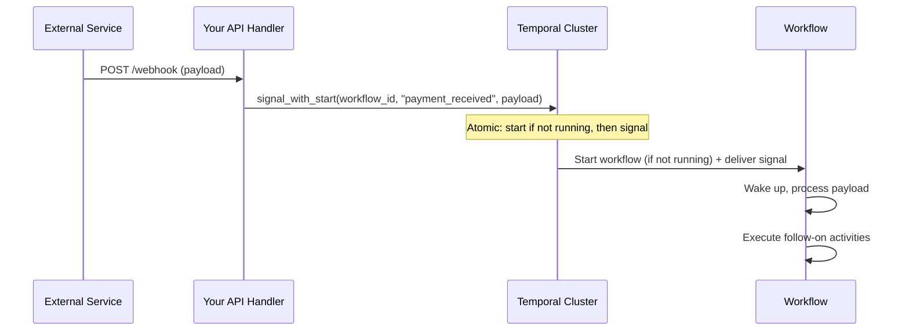
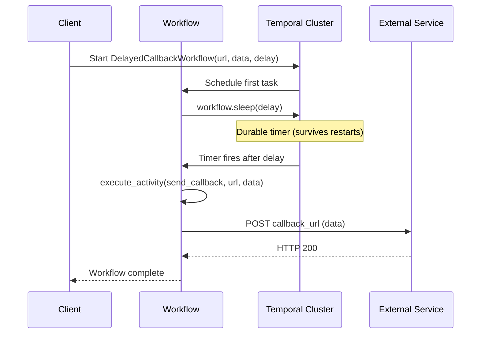
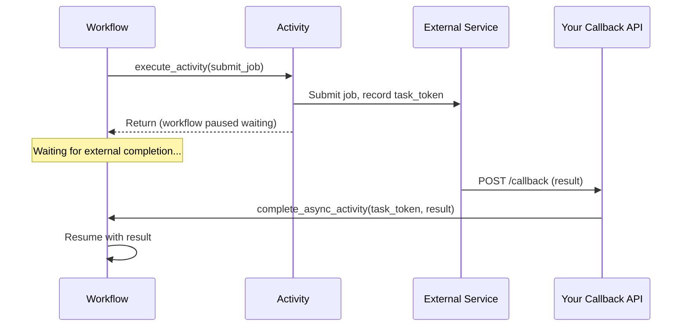

import Tabs from '@theme/Tabs';
import TabItem from '@theme/TabItem';

## Overview
Delayed Callback patterns in Temporal are exactly what they sound like: manage delayed completion notification between two systems. They leverage durable timers to make this extremely simple and defined only in code.

### Webhooks
[Webhooks](https://www.redhat.com/en/topics/automation/what-is-a-webhook) are easy to build and configure with the Delayed Callback patterns. There are two recommended patterns  for integrating Temporal Workflows to communicate through HTTP callbacks: 
- waiting and receiving inbound webhooks
- firing delayed outbound callbacks

Included is a pattern for completing activities asynchronously via a callback token and some guidance on when to use it.

Temporal lets you build durable, observable webhook-based integrations without ad-hoc queues, cron jobs, or fragile state machines.


## Problem

Waiting for another system without Durable Execution is hard. You must implement your own:
- durable timers (e.g. with a cron per timer)
- retry queues
- state stores
- reconciliation jobs 

All just for a simple elayed callback.

Webhook-based integrations have several failure modes that are difficult to handle without durable infrastructure:

- An inbound message fires before the target system is ready or at the proper state, causing the message to be ignored or lost.
- An outbound HTTP callback fails midway through a multi-step cross-system process, and there is no record of what was sent, retried, or skipped.
- An external job (payment processor, ML pipeline, etc.) completes and calls back, but the in-process state that was waiting for the callback has been lost to a poor state management or application restart.
- A delayed callback is scheduled via a cron job or message queue, but the scheduling system and the application process have no shared recovery mechanism.


## Solution

Temporal makes solving these problems simple with the use of [durable timers](https://docs.temporal.io/workflow-execution/timers-delays) in a workflow. [Signals or Updates](https://docs.temporal.io/encyclopedia/workflow-message-passing/) are used to send events to a Workflow. All of these are just Temporal code - no extra infrastructure to deploy or manage.

- **Pattern 1 — Inbound Callback:** Route the incoming HTTP request to a Temporal Signal-with-Start. The Workflow is the durable recipient; if it is not running yet, Temporal creates it and delivers the Signal atomically.
- **Pattern 2 — Delayed Outbound Callbacks:** Use a durable `workflow.sleep()` to set the proper delay before executing the outbound HTTP activity. The sleep timer survives worker and server restarts; the activity retries automatically on failure.
- **Pattern 3 — Async Activity Completion:** The activity records a task token before returning, and your callback endpoint uses that token to complete the activity from the outside. The Workflow resumes with the result as if the activity had returned normally.

### Pattern 1 — Inbound Webhooks



The following describes each step in the diagram:

1. An external service sends an HTTP POST to your API handler — this is the inbound webhook.
2. Your handler calls `signal_with_start` on the Temporal client with the Workflow ID and payload. The handler can return an HTTP 200 immediately after this call; Temporal takes responsibility for delivery.
3. Temporal atomically starts the Workflow if it is not already running, then delivers the Signal — no race condition between "start" and "signal."
4. The Workflow wakes up exactly where it was blocked waiting (or begins execution if newly created) and processes the payload.

### Pattern 2 — Delayed Outbound Callbacks



The following describes each step in the diagram:

1. The client starts the Workflow with a target URL, payload, and delay duration.
2. The Workflow calls `workflow.sleep()`. This stores a durable timer in the Temporal cluster — not in process memory.
3. If any worker restarts during the delay, the timer continues. When it fires, Temporal schedules the next Workflow Task on a healthy worker.
4. The Workflow executes an activity that performs the outbound HTTP POST. If the POST fails, Temporal retries it with the configured retry policy.

### Pattern 3 — Async Activity Completion



The following describes each step in the diagram:

1. The Workflow executes an activity that submits a job to an external system.
2. The activity records its task token (an opaque handle Temporal provides) alongside the submitted job ID — for example, in a database row.
3. The activity returns without waiting; the Workflow is now paused waiting for the activity to complete externally.
4. When the external system finishes, it calls your callback endpoint with the result.
5. Your callback handler retrieves the task token from the database and calls `complete_async_activity` on the Temporal client. The Workflow resumes immediately with the result.

## Implementation


### Pattern 1 — Inbound Webhooks via Signal-with-Start

The following examples show an `OrderWorkflow` that waits for a `payment_received` Signal. The starter uses Signal-with-Start to atomically create the Workflow and deliver the payment signal in one call — exactly what your HTTP handler would do on a real POST.

<Tabs groupId="language" queryString>
<TabItem value="python" label="Python" default>

```python
# workflows.py
import asyncio
from dataclasses import dataclass
from datetime import timedelta
from typing import Optional

from temporalio import workflow

with workflow.unsafe.imports_passed_through():
    from activities import process_payment
    from shared import OrderInput, PaymentPayload


@workflow.defn
class OrderWorkflow:
    def __init__(self) -> None:
        self._payment: Optional[PaymentPayload] = None

    @workflow.run
    async def run(self, order: OrderInput) -> str:
        workflow.logger.info(f"Order {order.order_id}: waiting for payment webhook")

        # Block until the inbound webhook signal arrives (or timeout after 24 hours)
        await workflow.wait_condition(
            lambda: self._payment is not None,
            timeout=timedelta(hours=24),
        )

        if self._payment is None:
            return f"Order {order.order_id}: timed out waiting for payment"

        result = await workflow.execute_activity(
            process_payment,
            self._payment,
            start_to_close_timeout=timedelta(seconds=30),
        )
        return result

    @workflow.signal
    async def payment_received(self, payload: PaymentPayload) -> None:
        workflow.logger.info(f"Payment signal received: {payload.payment_id}")
        self._payment = payload
```

</TabItem>
<TabItem value="java" label="Java">

```java
// OrderWorkflow.java
import io.temporal.activity.ActivityOptions;
import io.temporal.workflow.SignalMethod;
import io.temporal.workflow.Workflow;
import io.temporal.workflow.WorkflowInterface;
import io.temporal.workflow.WorkflowMethod;

import java.time.Duration;

@WorkflowInterface
public interface OrderWorkflow {
    @WorkflowMethod
    String run(Shared.OrderInput order);

    @SignalMethod
    void paymentReceived(Shared.PaymentPayload payload);

    final class Impl implements OrderWorkflow {
        private final Activities activities = Workflow.newActivityStub(
                Activities.class,
                ActivityOptions.newBuilder()
                        .setStartToCloseTimeout(Duration.ofSeconds(30))
                        .build());

        private Shared.PaymentPayload payment = null;

        @Override
        public String run(Shared.OrderInput order) {
            System.out.println("Order " + order.orderId() + ": waiting for payment webhook");

            // Block until the inbound webhook signal arrives (or timeout after 24 hours)
            boolean received = Workflow.await(Duration.ofHours(24), () -> payment != null);
            if (!received) {
                return "Order " + order.orderId() + ": timed out waiting for payment";
            }

            return activities.processPayment(payment);
        }

        @Override
        public void paymentReceived(Shared.PaymentPayload payload) {
            System.out.println("Payment signal received: " + payload.paymentId());
            this.payment = payload;
        }
    }
}
```

</TabItem>
<TabItem value="go" label="Go">

```go
// workflows.go
package main

import (
	"time"

	"go.temporal.io/sdk/workflow"
)

func OrderWorkflow(ctx workflow.Context, order OrderInput) (string, error) {
	workflow.GetLogger(ctx).Info("Order waiting for payment webhook", "order_id", order.OrderID)

	var payment *PaymentPayload

	// Block until the inbound webhook signal arrives (or timeout after 24 hours)
	selector := workflow.NewSelector(ctx)
	timerFired := false

	timerCtx, cancelTimer := workflow.WithCancel(ctx)
	timer := workflow.NewTimer(timerCtx, 24*time.Hour)

	signalCh := workflow.GetSignalChannel(ctx, SignalName)
	selector.AddReceive(signalCh, func(ch workflow.ReceiveChannel, more bool) {
		ch.Receive(ctx, &payment)
		cancelTimer()
	})
	selector.AddFuture(timer, func(f workflow.Future) {
		if err := f.Get(ctx, nil); err == nil {
			timerFired = true
		}
	})

	selector.Select(ctx)

	if timerFired || payment == nil {
		return "Order " + order.OrderID + ": timed out waiting for payment", nil
	}

	ao := workflow.WithActivityOptions(ctx, workflow.ActivityOptions{
		StartToCloseTimeout: 30 * time.Second,
	})

	var result string
	err := workflow.ExecuteActivity(ao, ProcessPayment, payment).Get(ao, &result)
	return result, err
}
```

</TabItem>
</Tabs>

The Starter uses Signal-with-Start to atomically create the Workflow (if needed) and deliver the simulated webhook payload:

<Tabs groupId="language" queryString>
<TabItem value="python" label="Python" default>

```python
# starter.py
import asyncio
import time

from temporalio.client import Client

from shared import TASK_QUEUE, OrderInput, PaymentPayload
from workflows import OrderWorkflow


async def main() -> None:
    client = await Client.connect("localhost:7233")

    order_id = f"order-{int(time.time() * 1000)}"
    order = OrderInput(order_id=order_id, amount=99.99)
    payment = PaymentPayload(payment_id=f"pay-{int(time.time() * 1000)}", amount=99.99)

    print(f"Sending webhook for order {order_id}")

    # Signal-with-Start: atomically starts the workflow (if not running) and
    # delivers the payment signal — this is exactly what your HTTP handler would do.
    handle = await client.start_workflow(
        OrderWorkflow.run,
        order,
        id=f"order-{order_id}",
        task_queue=TASK_QUEUE,
        start_signal="payment_received",
        start_signal_args=[payment],
    )
    print(f"Webhook signal sent: {payment.payment_id}")

    result = await handle.result()
    print(f"Order completed: {result}")


if __name__ == "__main__":
    asyncio.run(main())
```

</TabItem>
<TabItem value="java" label="Java">

```java
// Starter.java
import io.temporal.client.BatchRequest;
import io.temporal.client.WorkflowClient;
import io.temporal.client.WorkflowOptions;
import io.temporal.client.WorkflowStub;
import io.temporal.serviceclient.WorkflowServiceStubs;

public class Starter {
    public static void main(String[] args) throws Exception {
        WorkflowServiceStubs service = WorkflowServiceStubs.newLocalServiceStubs();
        WorkflowClient client = WorkflowClient.newInstance(service);

        String orderId = "order-" + System.currentTimeMillis();
        Shared.PaymentPayload payment = new Shared.PaymentPayload(
                "pay-" + System.currentTimeMillis(), 99.99);

        OrderWorkflow workflow = client.newWorkflowStub(
                OrderWorkflow.class,
                WorkflowOptions.newBuilder()
                        .setTaskQueue(Shared.TASK_QUEUE)
                        .setWorkflowId("order-" + orderId)
                        .build());

        System.out.println("Sending webhook for order " + orderId);

        // Signal-with-Start: atomically starts the workflow (if not running) and
        // delivers the payment signal — this is exactly what your HTTP handler would do.
        BatchRequest request = client.newSignalWithStartRequest();
        request.add(workflow::run, new Shared.OrderInput(orderId, 99.99));
        request.add(workflow::paymentReceived, payment);
        client.signalWithStart(request);
        System.out.println("Webhook signal sent: " + payment.paymentId());

        // Wait for the workflow to complete
        String result = WorkflowStub.fromTyped(workflow).getResult(String.class);
        System.out.println("Order completed: " + result);

        System.exit(0);
    }
}
```

</TabItem>
<TabItem value="go" label="Go">

```go
// starter.go
package main

import (
	"context"
	"fmt"
	"log"
	"time"

	"go.temporal.io/sdk/client"
)

func main() {
	c, err := client.Dial(client.Options{HostPort: "localhost:7233"})
	if err != nil {
		log.Fatalln("Unable to create client:", err)
	}
	defer c.Close()

	ctx := context.Background()
	orderID := fmt.Sprintf("order-%d", time.Now().UnixMilli())
	workflowID := "order-" + orderID

	order := OrderInput{OrderID: orderID, Amount: 99.99}
	payment := PaymentPayload{
		PaymentID: fmt.Sprintf("pay-%d", time.Now().UnixMilli()),
		Amount:    99.99,
	}

	fmt.Printf("Sending webhook for order %s\n", orderID)

	// Signal-with-Start: atomically starts the workflow (if not running) and
	// delivers the payment signal — this is exactly what your HTTP handler would do.
	we, err := c.SignalWithStartWorkflow(
		ctx,
		workflowID,
		SignalName,
		payment,
		client.StartWorkflowOptions{
			ID:        workflowID,
			TaskQueue: TaskQueue,
		},
		OrderWorkflow,
		order,
	)
	if err != nil {
		log.Fatalln("SignalWithStart failed:", err)
	}
	fmt.Printf("Webhook signal sent: %s\n", payment.PaymentID)

	var result string
	if err := we.Get(ctx, &result); err != nil {
		log.Fatalln("Workflow result failed:", err)
	}
	fmt.Printf("Order completed: %s\n", result)
}
```

</TabItem>
</Tabs>

### Pattern 2 — Delayed Outbound Callbacks

Use a durable `workflow.sleep()` before the outbound activity. The timer is stored in the Temporal cluster, not in process memory — it survives any number of worker restarts.

<Tabs groupId="language" queryString>
<TabItem value="python" label="Python" default>

```python
# delayed_callback_workflow.py
from datetime import timedelta

from temporalio import workflow

with workflow.unsafe.imports_passed_through():
    from activities import send_webhook_callback
    from shared import CallbackInput


@workflow.defn
class DelayedCallbackWorkflow:
    @workflow.run
    async def run(self, input: CallbackInput) -> str:
        workflow.logger.info(
            f"Sleeping {input.delay_seconds}s before calling {input.callback_url}"
        )

        # Durable sleep — survives worker restarts, server restarts, everything
        await workflow.sleep(timedelta(seconds=input.delay_seconds))

        # Fire the outbound callback; Temporal retries on HTTP failure
        result = await workflow.execute_activity(
            send_webhook_callback,
            input,
            start_to_close_timeout=timedelta(minutes=5),
        )
        workflow.logger.info(f"Callback delivered to {input.callback_url}")
        return result
```

</TabItem>
<TabItem value="java" label="Java">

```java
// DelayedCallbackWorkflow.java
import io.temporal.activity.ActivityOptions;
import io.temporal.workflow.Workflow;
import io.temporal.workflow.WorkflowInterface;
import io.temporal.workflow.WorkflowMethod;

import java.time.Duration;

@WorkflowInterface
public interface DelayedCallbackWorkflow {
    @WorkflowMethod
    void run(Shared.CallbackInput input);

    final class Impl implements DelayedCallbackWorkflow {
        private final Activities activities = Workflow.newActivityStub(
                Activities.class,
                ActivityOptions.newBuilder()
                        .setStartToCloseTimeout(Duration.ofMinutes(5))
                        .build());

        @Override
        public void run(Shared.CallbackInput input) {
            System.out.println("Sleeping " + input.delaySeconds() + "s before calling " + input.callbackUrl());

            // Durable sleep — survives worker restarts, server restarts, everything
            Workflow.sleep(Duration.ofSeconds(input.delaySeconds()));

            // Fire the outbound callback; Temporal retries on HTTP failure
            activities.sendWebhookCallback(input);
            System.out.println("Callback delivered to " + input.callbackUrl());
        }
    }
}
```

</TabItem>
<TabItem value="go" label="Go">

```go
// delayed_callback.go (add to workflows.go)
package main

import (
	"time"

	"go.temporal.io/sdk/workflow"
)

func DelayedCallbackWorkflow(ctx workflow.Context, input CallbackInput) error {
	workflow.GetLogger(ctx).Info("Sleeping before callback",
		"delay", input.DelaySeconds, "url", input.CallbackURL)

	// Durable sleep — survives worker restarts, server restarts, everything
	if err := workflow.Sleep(ctx, time.Duration(input.DelaySeconds)*time.Second); err != nil {
		return err
	}

	// Fire the outbound callback; Temporal retries on HTTP failure
	ao := workflow.WithActivityOptions(ctx, workflow.ActivityOptions{
		StartToCloseTimeout: 5 * time.Minute,
	})
	return workflow.ExecuteActivity(ao, SendWebhookCallback, input).Get(ao, nil)
}
```

</TabItem>
</Tabs>

### Pattern 3 — Async Activity Completion

The activity records a task token before returning. Your callback endpoint later uses that token to complete the activity and unblock the Workflow.

<Tabs groupId="language" queryString>
<TabItem value="python" label="Python" default>

```python
# async_completion_activities.py
import asyncio
from temporalio import activity
from temporalio.client import Client

from shared import JobInput, JobResult


@activity.defn
async def submit_job(input: JobInput) -> str:
    """Submit job to external system and return immediately.
    The activity completes asynchronously when the callback arrives."""

    # Get the task token — this is the claim ticket
    task_token = activity.info().task_token

    # Submit the job to the external system, persisting the task token
    # so your callback handler can retrieve it later
    job_id = await external_service.submit(
        payload=input.payload,
        callback_url=f"https://your-api.example.com/callback",
        task_token_hex=task_token.hex(),  # store alongside job_id
    )
    activity.logger.info(f"Job {job_id} submitted; waiting for async callback")

    # Raise ApplicationError to tell Temporal not to mark the activity complete yet
    raise activity.CompleteAsyncError()


# In your webhook callback handler (e.g., FastAPI route):
async def handle_callback(job_id: str, result: str, task_token_hex: str) -> None:
    token = bytes.fromhex(task_token_hex)
    client = await Client.connect("localhost:7233")
    await client.complete_async_activity_with_id(job_id, result)
    # Workflow resumes with `result` immediately
```

</TabItem>
<TabItem value="java" label="Java">

```java
// AsyncCompletionActivity.java — submit side
import io.temporal.activity.Activity;
import io.temporal.activity.ActivityExecutionContext;
import io.temporal.activity.ActivityInterface;
import io.temporal.activity.ActivityMethod;
import io.temporal.client.ActivityCompletionClient;

@ActivityInterface
public interface AsyncJobActivity {
    @ActivityMethod
    String submitJob(Shared.JobInput input);
}

public class AsyncJobActivityImpl implements AsyncJobActivity {
    private final ActivityCompletionClient completionClient;

    public AsyncJobActivityImpl(ActivityCompletionClient completionClient) {
        this.completionClient = completionClient;
    }

    @Override
    public String submitJob(Shared.JobInput input) {
        ActivityExecutionContext context = Activity.getExecutionContext();

        // Get the task token — this is the claim ticket
        byte[] taskToken = context.getTaskToken();

        // Submit to external system, persisting the task token so the callback can retrieve it
        String jobId = ExternalService.submit(input.payload(), taskToken);
        System.out.println("Job " + jobId + " submitted; waiting for async callback");

        // Tell Temporal not to mark the activity complete yet
        context.doNotCompleteOnReturn();
        return null; // ignored
    }
}

// In your callback handler:
// completionClient.complete(taskToken, result);
```

</TabItem>
<TabItem value="go" label="Go">

```go
// async_completion.go
package main

import (
	"context"
	"encoding/hex"
	"fmt"

	"go.temporal.io/sdk/activity"
	"go.temporal.io/sdk/client"
	"go.temporal.io/sdk/temporal"
)

// SubmitJob submits a job and returns immediately; the activity completes
// when the external callback arrives and calls CompleteAsyncActivity.
func SubmitJob(ctx context.Context, input JobInput) (string, error) {
	info := activity.GetInfo(ctx)

	// Persist the task token so the callback handler can retrieve it by job ID
	taskToken := info.TaskToken
	jobID := fmt.Sprintf("job-%d", info.StartedTime.UnixMilli())

	if err := persistTaskToken(jobID, hex.EncodeToString(taskToken)); err != nil {
		return "", err
	}

	fmt.Printf("Job %s submitted; waiting for async callback\n", jobID)

	// Return ErrResultPending to tell Temporal not to mark the activity complete yet
	return "", temporal.NewApplicationError("async", "AsyncCompletion")
}

// CompleteJob is called by your webhook callback handler to unblock the workflow.
func CompleteJob(ctx context.Context, c client.Client, jobID string, result string) error {
	tokenHex, err := loadTaskToken(jobID)
	if err != nil {
		return err
	}
	taskToken, _ := hex.DecodeString(tokenHex)
	return c.CompleteActivity(ctx, taskToken, result, nil)
}
```

</TabItem>
</Tabs>

## When to use

| Scenario | Pattern |
| :--- | :--- |
| External service POSTs a webhook (Workflow may or may not be running) | Signal-with-Start (Pattern 1) |
| Fire an outbound HTTP callback after a delay (seconds to years) | `workflow.sleep()` + activity (Pattern 2) |
| Submit a job to an external system; wait for its completion webhook | Async activity completion (Pattern 3) |
| Poll an external system that does not support webhooks | [Polling External Services](/design-patterns/polling) pattern |

**Do not use** Pattern 2 for delays shorter than one second as you should not rely on (sub-second accuracy for timers)[https://docs.temporal.io/workflow-execution/timers-delays]. 

## Benefits and trade-offs

**Benefits**

- Retries and backoff on outbound HTTP calls come for free via Temporal's retry policy — no custom retry queues needed.
- Workflow state survives worker restarts, deploys, and infrastructure failures; durable timers continue without a running process.
- Every in-flight delayed callback is visible in the Temporal UI with its scheduled time, payload, and retry count.
- Signal-with-Start eliminates the race condition between "does the Workflow exist?" and "deliver the event."
- Async activity completion decouples job submission from job completion without polling.

**Trade-offs**

- Your inbound webhook handler requires a Temporal client; you need the client library in the service receiving webhooks.
- Task tokens for async completion must be persisted outside Temporal (e.g., in a database); if that store is unavailable the callback cannot complete.
- Workflow IDs must be deterministic and stable across webhook deliveries (order ID, user ID, etc.) so that Signal-with-Start routes to the correct instance.

## Comparison with alternatives

| Approach | Durability | Retries | Observability | Complexity |
| :--- | :--- | :--- | :--- | :--- |
| Temporal Signals + Workflows | Durable — survives restarts | Built-in, configurable | Full Temporal UI | Low — primitives compose naturally |
| Message queue (SQS, Kafka) | Durable (queue level) | Limited, manual DLQ | Requires external tooling | Medium — must handle ordering, DLQ |
| Redis `SET` + cron job | In-memory/volatile | Manual | None | High — cron + polling + error handling |
| Direct HTTP retry loops | Process lifetime only | Manual with `time.sleep` | None | High — fragile without process supervisor |

## Best practices

- Use stable, business-meaningful Workflow IDs (for example, `order-{order_id}`) so that Signal-with-Start and queries always route to the right Workflow.
- Return HTTP 200 from your inbound webhook handler as soon as you have called `signal_with_start`; do not wait for the Workflow to process the payload.
- Set a realistic `start_to_close_timeout` on outbound callback activities — long enough for the destination to respond, short enough to surface failures quickly.
- For async activity completion, persist the task token in a transactional write alongside the job submission so you never lose the token.
- Add a timeout to the `workflow.wait_condition` / `Workflow.await` call in inbound webhook Workflows so they do not wait indefinitely if the webhook is never delivered.
- For Pattern 3, use `heartbeat` if the external job takes longer than the activity heartbeat timeout to report back — heartbeating keeps the activity lease alive.

## Common pitfalls

- **Sending a plain Signal to a Workflow that does not exist** causes an error. Use Signal-with-Start when the Workflow may not be running.
- **Using `time.sleep()` (non-durable)** in Pattern 2 instead of `workflow.sleep()`. A process sleep disappears on restart; only Temporal's timer is durable.
- **Non-deterministic Workflow IDs** — generating IDs from timestamps or random values means Signal-with-Start creates a new Workflow on every webhook delivery instead of routing to the existing one.
- **Losing the task token** in Pattern 3. If the service storing task tokens is unavailable when the callback arrives, the activity can never complete. Store the token durably (database, not in-process cache).
- **Forgetting `doNotCompleteOnReturn()` / `CompleteAsyncError`** in Pattern 3. Without this, Temporal marks the activity as completed immediately when the function returns, before the external callback arrives.

## Related patterns

- [Signal with Start](/design-patterns/signal-with-start) — deeper coverage of the Signal-with-Start API for entity Workflows
- [Approval](/design-patterns/approval) — blocking wait for an external human decision using Signals
- [Polling External Services](/design-patterns/polling) — alternative to callbacks when the external system does not support webhooks
- [Delayed Start](/design-patterns/delayed-start) — defer Workflow execution to a future time without `workflow.sleep()`
- [Long-Running Activity](/design-patterns/long-running-activity) — heartbeating pattern for activities that run for extended periods
- **In the future** - Org-to-Org Nexus, stay tuned.
