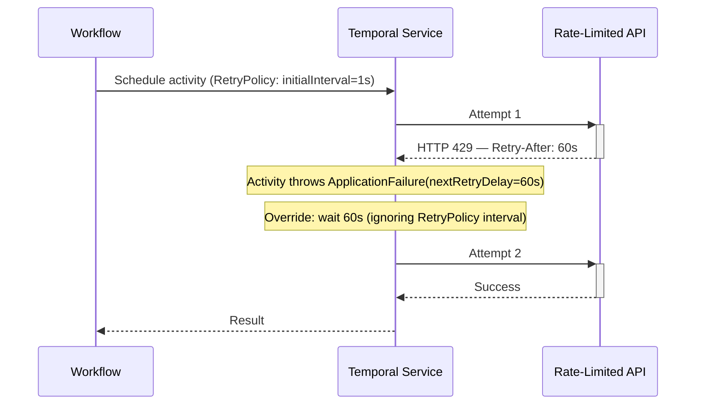

import Tabs from '@theme/Tabs';
import TabItem from '@theme/TabItem';

:::info[TLDR]
Throw an `ApplicationFailure` with `nextRetryDelay` set inside the Activity to **delay the next retry for a fixed time.** Use this when an error carries its own timing information — such as an HTTP 429 `Retry-After` header or a known maintenance window — so Temporal waits exactly as long as needed instead of following the generic backoff schedule.
:::

## Overview

The Delayed Retry pattern overrides the next retry interval for a specific failure by throwing an `ApplicationFailure` with a `nextRetryDelay` field set from inside the Activity.
Use it when a particular error carries information about how long to wait before retrying — such as a rate-limit response with a `Retry-After` header, or a known maintenance window with a fixed end time.

## Problem

A `RetryPolicy` applies a single backoff schedule to all failures from an Activity.
This works well for generic transient errors, but some errors carry specific information about how long the caller must wait:

- An HTTP 429 response includes a `Retry-After: 60` header telling you exactly when the quota resets.
- A downstream system returns an error message saying "maintenance until 02:00 UTC" — a precise, known delay.
- A database error includes a lock timeout duration that indicates when the resource will be available.

With a global `RetryPolicy`, you have two options, neither of which is what you need: set a short interval and retry too early (wasting quota and adding load), or set a long interval and wait longer than necessary.
What you need is to set the next retry delay *specific to this failure*, based on the information the error itself provides.

## Solution

Throw an `ApplicationFailure` with the `nextRetryDelay` field set from inside the Activity.
Temporal replaces the RetryPolicy-calculated interval for that single retry with the value you specify.
Subsequent retries (if the next attempt also fails) return to the normal RetryPolicy schedule unless you set `nextRetryDelay` again.



The following describes each step:

1. The Activity calls the API. It receives an HTTP 429 with a `Retry-After: 60` header.
2. The Activity extracts the retry delay from the response and throws `ApplicationFailure` with `nextRetryDelay=60s`.
3. Temporal ignores the RetryPolicy's calculated interval for this retry and waits exactly 60 seconds instead.
4. The next attempt succeeds and Temporal delivers the result to the Workflow.

## Implementation

### Override the retry delay from the response

Extract the wait duration from the error or response and pass it to `ApplicationFailure`.
The RetryPolicy's `MaximumAttempts` and `ScheduleToCloseTimeout` still apply — only the interval for the next retry is overridden.

<Tabs groupId="language" queryString>
<TabItem value="java" label="Java">

```java
// RateLimitedActivityImpl.java
import io.temporal.activity.Activity;
import io.temporal.failure.ApplicationFailure;
import java.time.Duration;

public class RateLimitedActivityImpl implements RateLimitedActivity {
    @Override
    public String callApi(String endpoint) {
        ApiResponse response = httpClient.get(endpoint);

        if (response.getStatusCode() == 429) {
            int retryAfterSeconds = response.getHeaderInt("Retry-After", 0);
            if (retryAfterSeconds > 0) {
                throw ApplicationFailure.newFailureWithCauseAndDelay(
                    "Rate limited — retrying after " + retryAfterSeconds + "s",
                    "RateLimitError",
                    null,
                    Duration.ofSeconds(retryAfterSeconds)
                );
            }
            throw ApplicationFailure.newFailure("Rate limited — retrying per RetryPolicy", "RateLimitError");
        }

        return response.getBody();
    }
}
```

</TabItem>
<TabItem value="typescript" label="TypeScript">

```typescript
// activities.ts
import { ApplicationFailure } from '@temporalio/activity';

export async function callApi(endpoint: string): Promise<string> {
    const response = await fetch(endpoint);

    if (response.status === 429) {
        const retryAfterHeader = response.headers.get('Retry-After');
        const retryAfterSeconds = retryAfterHeader != null ? parseInt(retryAfterHeader, 10) : undefined;
        throw ApplicationFailure.create({
            message: retryAfterSeconds != null
                ? `Rate limited — retrying after ${retryAfterSeconds}s`
                : 'Rate limited — retrying per RetryPolicy',
            type: 'RateLimitError',
            // Only override the interval when the header is present; fall back to RetryPolicy otherwise
            nextRetryDelay: retryAfterSeconds != null ? `${retryAfterSeconds}s` : undefined,
        });
    }

    return response.text();
}
```

</TabItem>
</Tabs>

### Attempt-proportional delay

You can also set the delay dynamically based on the attempt number — for example, to implement a custom backoff that differs from exponential, or to add a known base delay on top of the standard backoff.

<Tabs groupId="language" queryString>
<TabItem value="java" label="Java">

```java
// BackoffActivityImpl.java
import io.temporal.activity.Activity;
import io.temporal.failure.ApplicationFailure;
import java.time.Duration;

public class BackoffActivityImpl implements BackoffActivity {
    @Override
    public String process(String input) {
        int attempt = Activity.getExecutionContext().getInfo().getAttempt();

        try {
            return downstreamService.call(input);
        } catch (ServiceUnavailableException e) {
            // Custom delay: 3 seconds × attempt number (3s, 6s, 9s, …)
            throw ApplicationFailure.newFailureWithCauseAndDelay(
                "Service unavailable on attempt " + attempt,
                "ServiceUnavailable",
                e,
                Duration.ofSeconds(3L * attempt)
            );
        }
    }
}
```

</TabItem>
<TabItem value="typescript" label="TypeScript">

```typescript
// activities.ts
import { ApplicationFailure, activityInfo } from '@temporalio/activity';

export async function process(input: string): Promise<string> {
    const { attempt } = activityInfo();

    try {
        return await downstreamService.call(input);
    } catch (e) {
        // Custom delay: 3 seconds × attempt number (3s, 6s, 9s, …)
        throw ApplicationFailure.create({
            message: `Service unavailable on attempt ${attempt}`,
            type: 'ServiceUnavailable',
            cause: e as Error,
            nextRetryDelay: `${3 * attempt}s`,
        });
    }
}
```

</TabItem>
</Tabs>

### Workflow configuration

The Workflow sets a normal `RetryPolicy`.
The `nextRetryDelay` set in the Activity overrides the interval only for the retry following that specific failure — subsequent attempts fall back to the RetryPolicy schedule if `nextRetryDelay` is not set again.

<Tabs groupId="language" queryString>
<TabItem value="java" label="Java">

```java
// ApiWorkflowImpl.java
public class ApiWorkflowImpl implements ApiWorkflow {
    private final RateLimitedActivity activities = Workflow.newActivityStub(
        RateLimitedActivity.class,
        ActivityOptions.newBuilder()
            .setStartToCloseTimeout(Duration.ofSeconds(10))
            .setRetryOptions(RetryOptions.newBuilder()
                .setInitialInterval(Duration.ofSeconds(1))
                .setBackoffCoefficient(2.0)
                .setMaximumAttempts(10)
                .build())
            .build()
    );

    @Override
    public String run(String endpoint) {
        return activities.callApi(endpoint);
    }
}
```

</TabItem>
<TabItem value="typescript" label="TypeScript">

```typescript
// workflows.ts
import * as wf from '@temporalio/workflow';
import type * as activities from './activities';

const { callApi } = wf.proxyActivities<typeof activities>({
    startToCloseTimeout: '10s',
    retry: {
        initialInterval: '1s',
        backoffCoefficient: 2,
        maximumAttempts: 10,
    },
});

export async function apiWorkflow(endpoint: string): Promise<string> {
    return await callApi(endpoint);
}
```

</TabItem>
</Tabs>

## Best practices

- **Use the error's own delay information when available.** HTTP 429 `Retry-After`, database lock timeouts, and API-provided backoff hints are more accurate than any value you could configure statically.
- **Fall back to the RetryPolicy for unknown errors.** Only set `nextRetryDelay` for error types where you have reliable delay information. Let the RetryPolicy handle all other failures normally.
- **Still set a meaningful RetryPolicy.** `nextRetryDelay` overrides the interval for a single retry; the RetryPolicy still governs maximum attempts and the intervals for attempts where `nextRetryDelay` is not set. Also ensure `scheduleToCloseTimeout` is long enough to accommodate the maximum possible `nextRetryDelay` value — a tight budget can cause the Activity to expire before the delayed retry executes.
- **Surface the delay in the failure message.** Include the delay value and its source in the `ApplicationFailure` message (for example, `"Rate limited — retrying after 60s (Retry-After header)"`) so it appears directly in the Workflow history - Activity failure details. This makes it clear why the Activity waited an unusual amount of time without requiring separate log correlation.

## Common pitfalls

- **Assuming `nextRetryDelay` persists across all retries.** It only applies to the immediate next retry. If the following attempt also fails without setting `nextRetryDelay`, the RetryPolicy interval resumes.
- **Setting `nextRetryDelay` longer than `ScheduleToCloseTimeout`.** If the override delay exceeds the remaining `ScheduleToCloseTimeout` budget, the retry will never execute — Temporal will expire the Activity before the delay elapses.

## Related patterns

- [Fixed Count of Retries](/design-patterns/fixed-count-retries): Cap total attempts to prevent unbounded retry cost.
- [Fixed Wall-Time Retries](/design-patterns/fixed-wall-time-retries): Enforce a total elapsed time budget across all attempts.
- [Fast/Slow Retries](/design-patterns/fast-slow-retries): Shift from a fast retry cadence to a slow one after initial attempts are exhausted.
- [Error Handling & Retry Patterns](/design-patterns/error-handling-patterns): Overview and decision tree for all retry patterns.

## References

- [Per-error next Retry delay](https://docs.temporal.io/encyclopedia/retry-policies#per-error-next-retry-delay)
