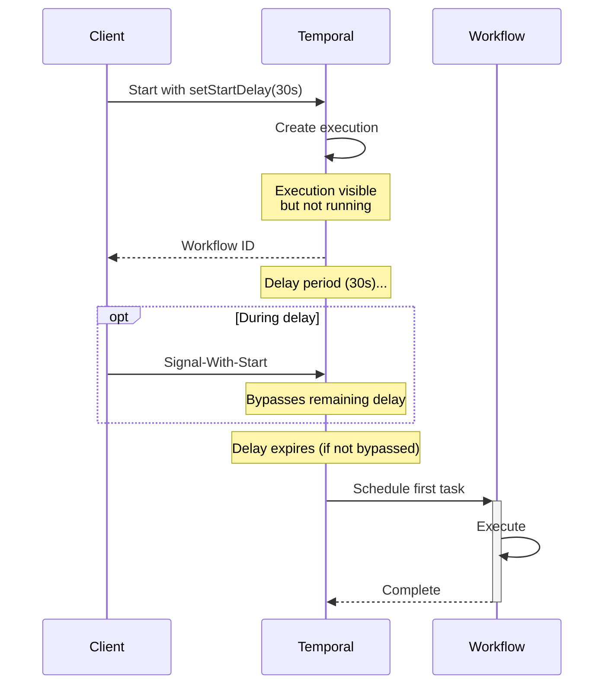

import Tabs from '@theme/Tabs';
import TabItem from '@theme/TabItem';

## Overview

The Delayed Start pattern enables Workflows to be created immediately but begin execution after a specified delay.
The Workflow execution is registered in Temporal right away, but the first Workflow Task is scheduled to run only after the delay period expires, making it suitable for scheduled operations, grace periods, and deferred processing.

## Problem

In business processes, you often need Workflows that start execution at a future time, are created immediately for tracking but execute later, avoid external scheduling systems or cron jobs for one-time delays, and maintain Workflow identity and queryability before execution begins.

Without delayed start, you must use external schedulers to trigger Workflow creation later, start Workflows immediately and sleep as the first operation (which wastes resources), implement complex queueing systems for deferred execution, or use Temporal Schedules for one-time delays (which is more than you need).

## Solution

The Delayed Start uses a start delay option in WorkflowOptions to defer the first Workflow Task.
The Workflow execution is created immediately with a `firstWorkflowTaskBackoff` set to the delay duration, but no Workflow code runs until the delay expires.



The following describes each step in the diagram:

1. The client starts the Workflow with a 30-second delay. Temporal creates the execution immediately.
2. The execution is visible and queryable, but no Workflow code runs during the delay.
3. If the client sends a Signal-With-Start or Update-With-Start during the delay, the remaining delay is bypassed and a Workflow Task is dispatched immediately. Regular Signals do not interrupt the delay.
4. After the delay expires, Temporal schedules the first Workflow Task and the Workflow begins execution.

The following example creates a Workflow with a 30-second start delay:

<Tabs groupId="language" queryString>
<TabItem value="python" label="Python">

```python
# client.py
from datetime import timedelta

handle = await client.start_workflow(
    DelayedStartWorkflow.run,
    id=WORKFLOW_ID,
    task_queue=TASK_QUEUE,
    start_delay=timedelta(seconds=30),
)
# Created now, executes in 30 seconds
```

</TabItem>
<TabItem value="go" label="Go">

```go
// starter/main.go
workflowOptions := client.StartWorkflowOptions{
    ID:         WorkflowID,
    TaskQueue:  TaskQueue,
    StartDelay: 30 * time.Second,
}

we, err := c.ExecuteWorkflow(context.Background(), workflowOptions, DelayedStartWorkflow)
// Created now, executes in 30 seconds
```

</TabItem>
<TabItem value="java" label="Java">

```java
// Client.java
DelayedStartWorkflow workflow = client.newWorkflowStub(
    DelayedStartWorkflow.class,
    WorkflowOptions.newBuilder()
        .setWorkflowId(WORKFLOW_ID)
        .setTaskQueue(TASK_QUEUE)
        .setStartDelay(Duration.ofSeconds(30))
        .build());

workflow.start(); // Created now, executes in 30 seconds
```

</TabItem>
<TabItem value="typescript" label="TypeScript">

```typescript
// client.ts
const handle = await client.workflow.start(delayedStartWorkflow, {
  workflowId: WORKFLOW_ID,
  taskQueue: TASK_QUEUE,
  startDelay: '30 seconds',
});
// Created now, executes in 30 seconds
```

</TabItem>
</Tabs>

The start delay option sets the `firstWorkflowTaskBackoff` on the execution.
The Workflow is created and visible in the UI immediately, but the Worker does not receive a Task until the delay expires.

## Implementation

### Basic delayed notification

The following implementation sends a notification after a one-hour delay.
The Workflow code runs only after the delay expires:

<Tabs groupId="language" queryString>
<TabItem value="python" label="Python">

```python
# workflows.py
from temporalio import workflow

@workflow.defn
class NotificationWorkflow:
    @workflow.run
    async def run(self, message: str) -> None:
        workflow.logger.info(f"Sending notification: {message}")

# client.py
from datetime import timedelta

handle = await client.start_workflow(
    NotificationWorkflow.run,
    "Your trial expires soon",
    task_queue=TASK_QUEUE,
    start_delay=timedelta(hours=1),
)
```

</TabItem>
<TabItem value="go" label="Go">

```go
// workflow.go
func NotificationWorkflow(ctx workflow.Context, message string) error {
    logger := workflow.GetLogger(ctx)
    logger.Info("Sending notification: " + message)
    return nil
}

// starter/main.go
workflowOptions := client.StartWorkflowOptions{
    TaskQueue:  TaskQueue,
    StartDelay: 1 * time.Hour,
}

we, err := c.ExecuteWorkflow(
    context.Background(), workflowOptions, NotificationWorkflow, "Your trial expires soon",
)
```

</TabItem>
<TabItem value="java" label="Java">

```java
// NotificationWorkflowImpl.java
@WorkflowInterface
public interface NotificationWorkflow {
  @WorkflowMethod
  void sendNotification(String message);
}

public class NotificationWorkflowImpl implements NotificationWorkflow {
  @Override
  public void sendNotification(String message) {
    Workflow.getLogger(NotificationWorkflowImpl.class)
        .info("Sending notification: " + message);
  }
}

// Client.java
NotificationWorkflow workflow = client.newWorkflowStub(
    NotificationWorkflow.class,
    WorkflowOptions.newBuilder()
        .setTaskQueue(TASK_QUEUE)
        .setStartDelay(Duration.ofHours(1))
        .build());

workflow.sendNotification("Your trial expires soon");
```

</TabItem>
<TabItem value="typescript" label="TypeScript">

```typescript
// workflows.ts
import * as wf from '@temporalio/workflow';

export async function notificationWorkflow(message: string): Promise<void> {
  wf.log.info(`Sending notification: ${message}`);
}

// client.ts
const handle = await client.workflow.start(notificationWorkflow, {
  args: ['Your trial expires soon'],
  taskQueue: TASK_QUEUE,
  startDelay: '1 hour',
});
```

</TabItem>
</Tabs>

The Workflow is created immediately, but the notification logic does not execute until one hour later.

### Cancellable delayed execution

The following implementation adds Signal handlers for cancellation and a Query for status.
You can cancel the Workflow before it runs or check its status during the delay:

<Tabs groupId="language" queryString>
<TabItem value="python" label="Python">

```python
# workflows.py
from temporalio import workflow

@workflow.defn
class DelayedOrderWorkflow:
    def __init__(self) -> None:
        self._cancelled = False
        self._status = "SCHEDULED"

    @workflow.run
    async def run(self, order_id: str) -> None:
        if self._cancelled:
            self._status = "CANCELLED"
            return

        self._status = "PROCESSING"
        # Process order logic
        self._status = "COMPLETED"

    @workflow.signal
    async def cancel(self) -> None:
        self._cancelled = True

    @workflow.query
    def get_status(self) -> str:
        return self._status
```

</TabItem>
<TabItem value="go" label="Go">

```go
// workflow.go
func DelayedOrderWorkflow(ctx workflow.Context, orderID string) error {
    logger := workflow.GetLogger(ctx)
    cancelled := false
    status := "SCHEDULED"

    // Register Signal handler for cancellation
    cancelCh := workflow.GetSignalChannel(ctx, "cancel")
    // Drain any pending signals without blocking
    for {
        var signal interface{}
        ok := cancelCh.ReceiveAsync(&signal)
        if !ok {
            break
        }
        cancelled = true
    }

    // Register Query handler for status
    err := workflow.SetQueryHandler(ctx, "getStatus", func() (string, error) {
        return status, nil
    })
    if err != nil {
        return err
    }

    if cancelled {
        logger.Info("Order cancelled before processing", "orderId", orderID)
        return nil
    }

    status = "PROCESSING"
    // Process order logic
    status = "COMPLETED"
    return nil
}
```

</TabItem>
<TabItem value="java" label="Java">

```java
// DelayedOrderWorkflowImpl.java
@WorkflowInterface
public interface DelayedOrderWorkflow {
  @WorkflowMethod
  void processOrder(String orderId);

  @SignalMethod
  void cancel();

  @QueryMethod
  String getStatus();
}

public class DelayedOrderWorkflowImpl implements DelayedOrderWorkflow {
  private boolean cancelled = false;
  private String status = "SCHEDULED";

  @Override
  public void processOrder(String orderId) {
    if (cancelled) {
      status = "CANCELLED";
      return;
    }

    status = "PROCESSING";
    // Process order logic
    status = "COMPLETED";
  }

  @Override
  public void cancel() {
    cancelled = true;
  }

  @Override
  public String getStatus() {
    return status;
  }
}
```

</TabItem>
<TabItem value="typescript" label="TypeScript">

```typescript
// workflows.ts
import * as wf from '@temporalio/workflow';

const cancelSignal = wf.defineSignal('cancel');
const getStatusQuery = wf.defineQuery<string>('getStatus');

export async function delayedOrderWorkflow(orderId: string): Promise<void> {
  let cancelled = false;
  let status = 'SCHEDULED';

  wf.setHandler(cancelSignal, () => {
    cancelled = true;
  });

  wf.setHandler(getStatusQuery, () => status);

  if (cancelled) {
    status = 'CANCELLED';
    return;
  }

  status = 'PROCESSING';
  // Process order logic
  status = 'COMPLETED';
}
```

</TabItem>
</Tabs>

The `cancel` Signal handler sets a flag that the Workflow checks when it starts executing.
Note that Signal handlers and Query handlers only run after the delay expires and the first Workflow Task is dispatched.
To cancel before execution, use `Signal-With-Start` to bypass the delay, or cancel the Workflow Execution directly.

## When to use

The Delayed Start pattern is a good fit for scheduled one-time operations (send a reminder in 24 hours), grace periods before processing (cancel a subscription in 7 days), delayed notifications and alerts, deferred batch processing, and trial expiration Workflows.

It is not a good fit for recurring Schedules (use Temporal Schedules), immediate execution with internal delays (use Workflow sleep — `Workflow.sleep()` in Java, `wf.sleep()` in TypeScript, `workflow.sleep()` in Python, `workflow.Sleep()` in Go), complex scheduling logic (use Schedules with cron), or sub-second delays (minimal benefit).

## Benefits and trade-offs

The Workflow is queryable before execution starts (immediate visibility).
No Worker resources are consumed during the delay.
You can cancel the Workflow Execution before it runs.
A Signal-With-Start or Update-With-Start bypasses the remaining delay.
Regular Signals sent during the delay do not interrupt it.
The API is a single configuration option with no external schedulers needed.
The delay is managed by Temporal, ensuring deterministic behavior.

The trade-offs to consider are that you cannot dynamically adjust the delay after creation (use the Updatable Timer pattern for that).
The pattern is for one-time delays only — for recurring Schedules, use Temporal Schedules.
Very short delays (sub-second) provide minimal benefit — Temporal does not guarantee sub-second timer accuracy, and the delay is rounded up to account for scheduling latency.
The delay is time-based only, not condition-based.
Regular Signals sent during the delay are not delivered until the first Workflow Task fires, so Query and Signal handlers are not available until execution begins.

## Comparison with alternatives

| Approach | Immediate visibility | Resource usage | Cancellable | Use case |
| :--- | :--- | :--- | :--- | :--- |
| Delayed Start | Yes | None during delay | Yes | One-time future execution |
| Workflow sleep | Yes | Worker resources | Yes | Internal delays |
| Temporal Schedules | Yes | None | Yes | Recurring Schedules |
| External Scheduler | No | External system | Depends | Complex scheduling |

## Best practices

- **Use for one-time delays.** For recurring Schedules, use Temporal Schedules instead.
- **Set Workflow ID.** Always set an explicit Workflow ID for tracking and cancellation.
- **Add Query methods.** Expose status via Queries to check state during the delay.
- **Enable cancellation.** Add Signal handlers to cancel before execution.
- **Validate delay duration.** Ensure the delay is reasonable (not too short or too long).
- **Monitor backoff.** Check `firstWorkflowTaskBackoff` in history for verification.
- **Consider time zones.** Use absolute timestamps if the delay depends on a specific time.
- **Document behavior.** Clearly indicate that the Workflow does not execute immediately.

## Common pitfalls

- **Using Signals during the delay.** Regular Signals do not interrupt the Start Delay. Only Signal-With-Start or Update-With-Start bypass the delay. Signals sent to a delayed Workflow are buffered but the Workflow code has not started, so there is no handler to process them until the delay expires.
- **Querying before the Workflow starts.** Queries have no state to return during the delay because no Workflow code has executed yet. Clients may receive errors or empty results.
- **Relying on sub-second delays.** Temporal does not guarantee sub-second timer accuracy, and the delay is rounded up due to scheduling latency. Treat the configured duration as a minimum, not an exact value.
- **Forgetting that the Workflow ID is reserved.** A delayed Workflow reserves its Workflow ID immediately. Starting another Workflow with the same ID will fail depending on the ID reuse policy.

## Related patterns

- **Temporal Schedules**: For recurring Workflow execution.
- **[Updatable Timer](/design-patterns/updatable-timer)**: For dynamically adjustable delays within Workflows.
- **[Signal with Start](/design-patterns/signal-with-start)**: Interacting with Workflows before execution.

## Sample code

- [Java Sample](https://github.com/temporalio/samples-java/tree/main/core/src/main/java/io/temporal/samples/hello/HelloDelayedStart.java) — Delayed start with `setStartDelay()`.
- [TypeScript Sample](https://github.com/temporalio/samples-typescript/tree/main/start-delay) — Delayed start with `startDelay` option.
- [Python Sample](https://github.com/temporalio/samples-python/tree/main/start_delay) — Delayed start with `start_delay` parameter.
- [Go Sample](https://github.com/temporalio/samples-go/tree/main/start-delay) — Delayed start with `StartDelay` option.
