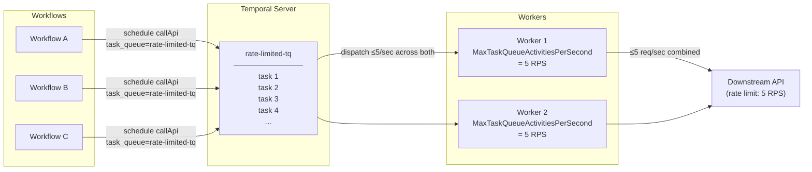

import Tabs from '@theme/Tabs';
import TabItem from '@theme/TabItem';

:::info[TLDR]
Used to **rate limit outbound requests to a downstream service**. Use this to limit the rate of requests, such as to a third-party API, or payment processor, or other external system, that concurrent Workflows would otherwise exceed.
:::

## Overview

The Downstream Rate Limiting pattern, also known as Task Queue rate limiting, caps how many Activities execute per second against a downstream service.
You place throttled Activities on a dedicated Task Queue backed by Workers configured with `MaxTaskQueueActivitiesPerSecond`.
The Temporal matching service enforces this limit before dispatching tasks, so the downstream service receives a controlled request rate regardless of how many Worker instances or Workflow executions are running concurrently.

## Problem

Many downstream systems — LLM providers, payment processors, third-party REST APIs — enforce requests-per-second limits. Some systems cannot handle more than a defined level of requests per second.
When many Temporal Workflows schedule Activities concurrently, the resulting burst can saturate those limits, causing request failures, cascading retries, and increased latency for all callers.

Without centralized throttling, each Activity implementation must manage backpressure independently, which scatters policy across the codebase and provides no enforcement at the Temporal scheduling layer.

## Solution

You assign rate-limited Activities to a dedicated Task Queue and Worker set and configure the Workers on that queue with a throughput cap.
Because the limit applies to the Task Queue, it is enforced before any Worker executes an Activity, and it holds across all Worker replicas without coordination.

The Workflow routes the throttled Activity to the dedicated queue by specifying an explicit `task_queue` override in the Activity options.



The following describes each step in the diagram:

1. Any number of Workflows schedule `callApi` Activities to the dedicated `rate-limited-tq` Task Queue via an explicit `task_queue` override in their Activity options.
2. The Temporal server holds tasks in `rate-limited-tq`. The queue depth grows if submission rate exceeds dispatch capacity.
3. Two Workers poll the queue. Each is configured with `MaxTaskQueueActivitiesPerSecond = 5`, so together they dispatch at most 5 Activity tasks per second — matching the downstream API's rate limit.
4. The downstream API receives a steady, controlled request rate regardless of how many Workflows are running concurrently.

## Implementation

### Worker configured with a throughput cap

<Tabs groupId="language" queryString>
<TabItem value="python" label="Python">

```python
# worker.py
# This is a dedicated worker for rate-limited activities.
# You will also need a separate worker registered on your workflow task queue.
from temporalio.worker import Worker
from activities import call_api

async def run_worker(client):
    worker = Worker(
        client,
        task_queue="rate-limited-tq",
        activities=[call_api],
        max_task_queue_activities_per_second=5.0,
    )
    await worker.run()
```

</TabItem>
<TabItem value="go" label="Go">

```go
// main.go
// This is a dedicated worker for rate-limited activities.
// You will also need a separate worker registered on your workflow task queue.
w := worker.New(c, "rate-limited-tq", worker.Options{
    TaskQueueActivitiesPerSecond: 5.0,
})
w.RegisterActivity(CallApi)
if err := w.Run(worker.InterruptCh()); err != nil {
    log.Fatalf("worker error: %v", err)
}
```

</TabItem>
<TabItem value="java" label="Java">

```java
// WorkerSetup.java
// This is a dedicated worker for rate-limited activities.
// You will also need a separate worker registered on your workflow task queue.
WorkerOptions rateLimitedOptions = WorkerOptions.newBuilder()
        .setMaxTaskQueueActivitiesPerSecond(5.0)
        .build();

Worker rateLimitedWorker = factory.newWorker("rate-limited-tq", rateLimitedOptions);
rateLimitedWorker.registerActivitiesImplementations(new RateLimitedActivitiesImpl());
factory.start();
```

</TabItem>
</Tabs>

### Activity Definition

<Tabs groupId="language" queryString>
<TabItem value="python" label="Python">

```python
# activities.py
from temporalio import activity

@activity.defn
async def call_api(input: str) -> str:
    return await downstream_api.call(input)
```

</TabItem>
<TabItem value="go" label="Go">

```go
// activities.go
func CallApi(ctx context.Context, input string) (string, error) {
    return downstreamApi.Call(input)
}
```

</TabItem>
<TabItem value="java" label="Java">

```java
// RateLimitedActivities.java
@ActivityInterface
public interface RateLimitedActivities {
    @ActivityMethod
    String callApi(String input);
}

public class RateLimitedActivitiesImpl implements RateLimitedActivities {
    @Override
    public String callApi(String input) {
        return downstreamApi.call(input);
    }
}
```

</TabItem>
</Tabs>

### Workflow routing to the rate-limited queue

<Tabs groupId="language" queryString>
<TabItem value="python" label="Python">

```python
# workflows.py
from datetime import timedelta
from temporalio import workflow
from activities import call_api

@workflow.defn
class MyWorkflow:
    @workflow.run
    async def run(self, input: str) -> str:
        return await workflow.execute_activity(
            call_api,
            input,
            task_queue="rate-limited-tq",
            start_to_close_timeout=timedelta(seconds=30),
        )
```

</TabItem>
<TabItem value="go" label="Go">

```go
// workflow.go
func MyWorkflow(ctx workflow.Context, input string) (string, error) {
    ao := workflow.ActivityOptions{
        TaskQueue:           "rate-limited-tq",
        StartToCloseTimeout: 30 * time.Second,
    }
    ctx = workflow.WithActivityOptions(ctx, ao)

    var result string
    err := workflow.ExecuteActivity(ctx, CallApi, input).Get(ctx, &result)
    return result, err
}
```

</TabItem>
<TabItem value="java" label="Java">

```java
// MyWorkflowImpl.java
public class MyWorkflowImpl implements MyWorkflow {
    private final RateLimitedActivities rateLimitedActivities =
        Workflow.newActivityStub(RateLimitedActivities.class,
            ActivityOptions.newBuilder()
                .setTaskQueue("rate-limited-tq")
                .setStartToCloseTimeout(Duration.ofSeconds(30))
                .build()
        );

    @Override
    public String run(String input) {
        return rateLimitedActivities.callApi(input);
    }
}
```

</TabItem>
</Tabs>

## When to use

This pattern is a good fit when your Workflow calls a downstream service with explicit requests-per-second limits, when you need throughput enforcement that holds across many concurrent Workflow instances without per-Activity logic, and when only a subset of Activity types require throttling and others should run without restriction.

It is not a good fit when you need concurrency limits rather than throughput limits (see [Priority Task Queues](/design-patterns/priority-task-queues)), when the downstream system has no rate limit and throughput is bounded only by Workflow logic, or when all Activities require the same limit and a single shared queue suffices.

## Benefits and trade-offs

Centralizing rate limiting at the Task Queue ensures enforcement even when any number of Workflow instances run in parallel.
Because the Temporal server controls dispatch, the limit holds regardless of how many Worker replicas are running — provided you account for Worker count when setting the per-worker cap.

Dedicated Task Queues require operating additional Workers.
If the throughput cap is set too low relative to demand, the queue depth grows and scheduling latency increases.
You must size the Worker pool so that slot availability does not become the bottleneck before the rate limit is reached.

## Comparison with alternatives

| Approach | Enforcement point | Works across Workers | Runtime adjustable | Complexity |
| :--- | :--- | :--- | :--- | :--- |
| `MaxTaskQueueActivitiesPerSecond` | Temporal matching service (server-side) | Yes | No (requires redeploy) | Low |
| `MaxWorkerActivitiesPerSecond` | Worker SDK poller (worker-side) | No — per-worker only | No (requires redeploy) | Low |
| Concurrency slots (`MaxConcurrentActivityExecutionSize`, `MaxConcurrentWorkflowTaskExecutionSize`, `MaxConcurrentLocalActivityExecutionSize`) | Worker executor | No — per-worker only | No (requires redeploy) | Low |
| Sleep-based throttle in Workflow | Workflow scheduler | No | Via signal | Low |
| Client-side token bucket in Activity | Activity execution | Per-worker only | No | Medium |
| API gateway rate limiting | Network layer | Yes | Yes | High |

Three distinct layers of worker-side control exist alongside the server-side queue limit. `MaxWorkerActivitiesPerSecond` instructs the SDK to self-throttle its polling — the Worker will not request a new Activity task if doing so would push it over this rate. Because the limit is per-process, multiple Workers on the same queue each apply it independently, so the effective queue throughput is the per-worker cap multiplied by Worker count. By contrast, `MaxTaskQueueActivitiesPerSecond` is a server-side instruction: the Temporal matching service slows dispatch for the entire queue regardless of how many Workers are polling, making it the correct tool for protecting a shared downstream service.

The concurrency slots (`MaxConcurrentActivityExecutionSize`, `MaxConcurrentWorkflowTaskExecutionSize`, `MaxConcurrentLocalActivityExecutionSize`) are not throughput limits but define the number of execution slots available on a Worker. A Worker will not accept more tasks than it has open slots, so a low slot count acts as an indirect throughput ceiling. 

## Best practices

- **Use a separate Task Queue for each rate limit.** `MaxTaskQueueActivitiesPerSecond` applies to every Activity on the queue. Mixing rate-limited and unrestricted Activities on the same queue will throttle the unrestricted ones too.
- **Run at least two Worker processes per queue for availability.** A single Worker process is a single point of failure. Because `MaxTaskQueueActivitiesPerSecond` is a server-side per-queue limit rather than a per-worker one, set the same value on every Worker that polls the queue. Set each Worker to the target RPS — for example, 5 on each of two Workers yields a combined queue limit of 5, not 10. If Workers report different values, the server applies the value from the last Worker that polled.
- **Monitor queue depth and schedule latency.** Track the `temporal_activity_schedule_to_start_latency` metric on the rate-limited queue; sustained growth signals that demand consistently exceeds the configured cap. You can also query the Task Queue's `ApproximateBacklogCount` via the `DescribeTaskQueue` API — a steadily growing backlog count is a direct indicator that the configured RPS cap is too low for the current submission rate.

## Common pitfalls

- **Forgetting to override the task queue in Activity options.** If the Workflow does not explicitly specify `task_queue` in the Activity options, the Activity runs on the Workflow's default queue and bypasses the rate-limited Worker entirely.
- **Setting conflicting MaxTaskQueueActivitiesPerSecond limits in workers.** This setting is set in Workers and sent to the Task Queue when a Worker polls. If you have multiple Workers with conflicting settings, the Workers will overwrite each other as they poll.
- **Confusing throughput limits with concurrency limits.** `MaxTaskQueueActivitiesPerSecond` controls starts per second; `MaxConcurrentActivityExecutionSize` controls simultaneous executions. Long-running Activities that hold slots for minutes may exhaust concurrency before the RPS cap applies.
- **Setting the cap far below actual demand.** A cap much lower than actual submission rate causes the queue to grow unboundedly. Monitor queue depth and raise the cap or add more Workers when throughput requirements grow.
- **Expecting a perfectly even per-second rate.** The limit is enforced across the queue's partitions, default four. The server maintains the configured rate as an average over time but can dispatch a short burst above it, up to roughly the rate divided across partitions. If the downstream service rejects any momentary overshoot, set the cap below the hard limit to leave headroom, or reduce the partition count for the queue.

## Related patterns

- **[Priority Task Queues](/design-patterns/priority-task-queues)**: Route work to separate queues by urgency, with different concurrency budgets per tier.
- **[Fairness](/design-patterns/fairness)**: Give each tenant an equal throughput share when multiple tenants share capacity.
- **[Worker-Specific Task Queues](/design-patterns/worker-specific-taskqueue)**: Route Activities to a specific Worker host for resource or data affinity.

## References

- **Python** — [`max_task_queue_activities_per_second`](https://python.temporal.io/temporalio.worker.WorkerConfig.html#max_task_queue_activities_per_second) on [`Worker`](https://python.temporal.io/temporalio.worker.Worker.html)
- **Go** — [`TaskQueueActivitiesPerSecond`](https://pkg.go.dev/go.temporal.io/sdk/internal#WorkerOptions) in [`worker.Options`](https://pkg.go.dev/go.temporal.io/sdk/worker#Options)
- **Java** — [`setMaxTaskQueueActivitiesPerSecond`](https://www.javadoc.io/doc/io.temporal/temporal-sdk/latest/io/temporal/worker/WorkerOptions.Builder.html) on `WorkerOptions.Builder`
- **Temporal Community** — [Rate limit configuration and best practices](https://community.temporal.io/t/rate-limit-configuration-and-best-practices/5498)
