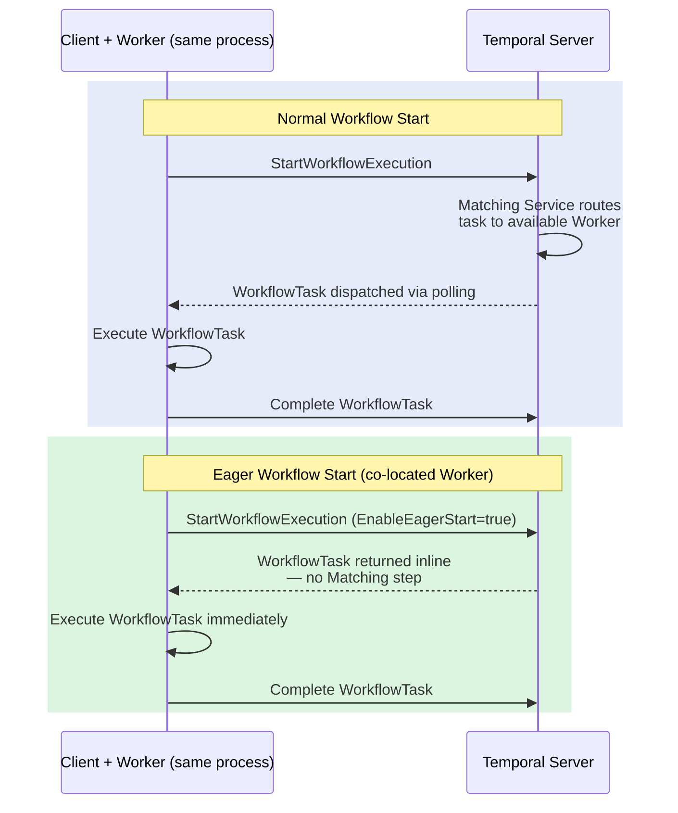

import Tabs from '@theme/Tabs';
import TabItem from '@theme/TabItem';

:::info[TLDR]
**Bypass the Temporal Matching Service by dispatching the first Workflow Task directly to a co-located Worker.** The Worker and the client that starts the Workflow must share the same process and server connection. Eager Workflow Start eliminates the Matching Service round-trip, saving approximately 30–50 ms per Workflow start. When combined with Local Activities, this pattern achieves ~265 ms total-workflow latency (vs ~850 ms baseline). Supported by the Go, Java, Python, TypeScript, and .NET SDKs.
:::

## Overview

When you call `ExecuteWorkflow`, the Temporal server normally stores the new Workflow execution, then routes the first Workflow Task through its Matching Service to an available Worker. **Eager Workflow Start** short-circuits this routing: the server returns the first Workflow Task inline in the `StartWorkflowExecution` response, and the co-located Worker processes it immediately—without a separate polling round-trip.


```mermaid
sequenceDiagram
    participant CW as Client + Worker (same process)
    participant S as Temporal Server

    rect rgb(230, 235, 250)
        Note over CW,S: Normal Workflow Start
        CW->>S: StartWorkflowExecution
        S->>S: Matching Service routes<br/>task to available Worker
        S-->>CW: WorkflowTask dispatched via polling
        CW->>CW: Execute WorkflowTask
        CW->>S: Complete WorkflowTask
    end

    rect rgb(220, 245, 225)
        Note over CW,S: Eager Workflow Start (co-located Worker)
        CW->>S: StartWorkflowExecution (EnableEagerStart=true)
        S-->>CW: WorkflowTask returned inline<br/>— no Matching step
        CW->>CW: Execute WorkflowTask immediately
        CW->>S: Complete WorkflowTask
    end
```

**Numbered walkthrough:**

1. In a normal start, the server queues the Workflow execution and the Matching Service waits for an available Worker slot. The Worker polls, picks up the task, runs it, and reports back—adding an extra server round-trip.
2. With Eager Workflow Start enabled, the server detects that the requesting client has a co-located Worker with an available slot. Instead of queuing the task, the server attaches the first Workflow Task to the `StartWorkflowExecution` response.
3. The Worker processes the Workflow Task immediately upon receiving the response. No separate poll is required.
4. If the server cannot fulfill the eager request (for example, no local slot is available), it falls back silently to normal dispatch. Your code does not need to handle this case explicitly.

## Problem

Even with Local Activities eliminating per-Activity server round-trips, the Workflow's first Workflow Task still requires a scheduling round-trip through the Temporal Matching Service. This adds latency that is unavoidable in a distributed deployment where Workers are separate from the caller.

For applications where the starter and Worker share the same deployment unit—such as a request-handling service that also runs Workers—this Matching overhead can be eliminated.

## Solution

Start a Worker in the same process as the workflow starter, using the same client connection. Set `EnableEagerStart: true` (Go), `setDisableEagerExecution(false)` (Java), `request_eager_start=True` (Python), `requestEagerStart: true` (TypeScript, on a `NativeConnection` shared between Worker and Client), or `RequestEagerStart` (.NET) on the workflow start options. The SDK signals to the server that a local Worker is available, and the server returns the first Workflow Task inline.

Eager Workflow Start is enabled by default in Temporal Cloud and in self-hosted Temporal Server 1.29.0 and later — no additional server configuration or access request is needed. On self-hosted Temporal Server, an operator can disable it with the dynamic config flag `system.enableEagerWorkflowStart` set to `false`; if you don't observe the expected latency improvement, confirm that flag hasn't been turned off. See [Eager Workflow Start](/develop/worker-performance#eager-workflow-start) for the canonical server-side reference.

<Tabs groupId="language" queryString>
<TabItem value="python" label="Python">

```python
# starter.py — starts the Worker in the same process, then executes the Workflow eagerly
import asyncio
from temporalio.client import Client
from temporalio.worker import Worker
from workflows import TransactionWorkflow
from activities import validate_transaction, settle_transaction
from shared import TASK_QUEUE, TransactionRequest

async def main():
    client = await Client.connect("localhost:7233")

    # The Worker must share this process and client for eager dispatch to work.
    async with Worker(
        client,
        task_queue=TASK_QUEUE,
        workflows=[TransactionWorkflow],
        activities=[validate_transaction, settle_transaction],
    ):
        result = await client.execute_workflow(
            TransactionWorkflow.run,
            TransactionRequest(amount=100.00, currency="USD"),
            id="eager-workflow-start-demo",
            task_queue=TASK_QUEUE,
            request_eager_start=True,  # Dispatch first WorkflowTask inline
        )
        print(f"Transaction complete: ID={result.id} Status={result.status}")

if __name__ == "__main__":
    asyncio.run(main())
```

</TabItem>
<TabItem value="go" label="Go">

```go
// starter.go — starts the Worker in the same process, then executes the Workflow eagerly
func main() {
    c, err := client.Dial(client.Options{})
    if err != nil {
        log.Fatalln("Unable to create Temporal client:", err)
    }
    defer c.Close()

    // Start the Worker non-blocking — it must share this process and client.
    w := worker.New(c, TaskQueue, worker.Options{})
    w.RegisterWorkflow(TransactionWorkflow)
    w.RegisterActivity(ValidateTransaction)
    w.RegisterActivity(SettleTransaction)
    if err := w.Start(); err != nil {
        log.Fatalln("Unable to start worker:", err)
    }
    defer w.Stop()

    run, err := c.ExecuteWorkflow(context.Background(), client.StartWorkflowOptions{
        ID:               "eager-workflow-start-demo",
        TaskQueue:        TaskQueue,
        EnableEagerStart: true, // Dispatch first WorkflowTask inline
    }, TransactionWorkflow, TransactionRequest{Amount: 100.00, Currency: "USD"})
    if err != nil {
        log.Fatalln("Failed to start workflow:", err)
    }

    var result Transaction
    if err := run.Get(context.Background(), &result); err != nil {
        log.Fatalln("Workflow failed:", err)
    }
    fmt.Printf("Transaction complete: ID=%s Status=%s\n", result.ID, result.Status)
}
```

</TabItem>
<TabItem value="java" label="Java">

```java
// Starter.java — starts the Worker in the same process, then executes the Workflow eagerly
public class Starter {
    public static void main(String[] args) {
        WorkflowServiceStubs service = WorkflowServiceStubs.newLocalServiceStubs();
        WorkflowClient client = WorkflowClient.newInstance(service);

        // The Worker must share this process and client for eager dispatch.
        WorkerFactory factory = WorkerFactory.newInstance(client);
        io.temporal.worker.Worker worker = factory.newWorker(Shared.TASK_QUEUE);
        worker.registerWorkflowImplementationTypes(TransactionWorkflow.Impl.class);
        worker.registerActivitiesImplementations(new Activities.Impl());
        factory.start();

        TransactionWorkflow workflow = client.newWorkflowStub(
            TransactionWorkflow.class,
            WorkflowOptions.newBuilder()
                .setTaskQueue(Shared.TASK_QUEUE)
                .setWorkflowId("eager-workflow-start-demo")
                .setDisableEagerExecution(false) // false = enable eager dispatch
                .build()
        );

        Shared.Transaction result = workflow.processTransaction(
            new Shared.TransactionRequest(100.00, "USD"));
        System.out.printf("Transaction complete: ID=%s Status=%s%n",
            result.id(), result.status());

        factory.shutdown();
    }
}
```

</TabItem>
<TabItem value="typescript" label="TypeScript">

```typescript
// starter.ts — starts the Worker in the same process, then executes the Workflow eagerly
import { NativeConnection, Worker } from '@temporalio/worker';
import { Client } from '@temporalio/client';
import { transactionWorkflow } from './workflows';
import { TASK_QUEUE, TransactionRequest } from './shared';

async function run() {
  // The Client and the Worker must share this NativeConnection for eager dispatch to work.
  const connection = await NativeConnection.connect({ address: 'localhost:7233' });

  const worker = await Worker.create({
    connection,
    taskQueue: TASK_QUEUE,
    workflowsPath: require.resolve('./workflows'),
    activities: { validateTransaction, settleTransaction },
  });

  const client = new Client({ connection });

  await worker.runUntil(async () => {
    const handle = await client.workflow.start(transactionWorkflow, {
      args: [{ amount: 100.0, currency: 'USD' } satisfies TransactionRequest],
      workflowId: 'eager-workflow-start-demo',
      taskQueue: TASK_QUEUE,
      requestEagerStart: true, // Dispatch first WorkflowTask inline
    });

    const result = await handle.result();
    console.log(`Transaction complete: ID=${result.id} Status=${result.status}`);
  });
}

run().catch((err) => {
  console.error(err);
  process.exit(1);
});
```

</TabItem>
</Tabs>

:::info[.NET SDK]
The .NET SDK also supports Eager Workflow Start: set `RequestEagerStart = true` on `WorkflowOptions` when starting the Workflow, with the Worker and Client sharing the same connection.
:::

## When to use

**Good fit:**

- The workflow starter and Worker run in the same deployment unit (for example, a single service that both handles API requests and runs Workers)
- You need the absolute minimum total-workflow latency and are already using Local Activities
- Any of the Go, Java, Python, TypeScript, or .NET SDKs

**Poor fit:**

- Workers are deployed independently from starters (the eager request falls back to normal dispatch, which is harmless but provides no benefit)
- First-response latency matters more than total latency—combine with [Early Return](/design-patterns/early-return) or [Early Return + Local Activities](/design-patterns/early-return-local-activities) for that use case

## Benefits and trade-offs

| | Normal Start | Eager Workflow Start |
|---|---|---|
| Matching Service round-trip | Yes (~30–50 ms) | No (eliminated) |
| Worker co-location required | No | Yes (same process + client) |
| Fallback behavior | N/A | Graceful fallback to normal dispatch |
| SDK support | All | Go, Java, Python, TypeScript, .NET |
| Configuration required | None | `EnableEagerStart`/`request_eager_start`/`setDisableEagerExecution(false)`/`requestEagerStart`/`RequestEagerStart` |
| Self-hosted server flag | N/A | On by default (Server 1.29.0+); disable via `system.enableEagerWorkflowStart=false` |

## Best practices

- **Combine with Local Activities.** Eager Workflow Start eliminates the Matching overhead on the first Workflow Task; Local Activities eliminate server round-trips within each Workflow Task. Together they provide the greatest total latency reduction.
- **Use a non-blocking Worker start.** Start the Worker before executing the Workflow so it has an available slot. In Go, use `w.Start()` and defer `w.Stop()`. In Python, use `async with Worker(...)`. In Java, call `factory.start()` before creating the workflow stub.
- **Do not rely on eager dispatch always firing.** The server falls back to normal dispatch if no local slot is available (for example, the Worker is at capacity). Design the Workflow to work correctly in both cases.
- **Share the same client and connection.** The Worker and the workflow starter must use the same `WorkflowClient` instance (Java), `client.Client` (Go), `Client` (Python), or `NativeConnection` (TypeScript). A Worker using a different connection cannot receive eager tasks from another client.
- **Be mindful of resource sharing in co-located deployments.** When a Worker runs in the same process as a request handler, they share CPU, memory, and failure domains. A spike in activity execution can slow request handling, and vice versa. Monitor Worker CPU, Workflow Task execution latency, and task queue depth to ensure Worker load does not affect client-facing latency.

## Common pitfalls

- **Starting the Worker after `ExecuteWorkflow`.** If the Worker is not registered and running before the eager start call, no local slot exists and the request falls back to normal dispatch.
- **Expecting eager dispatch in distributed deployments.** If the process that calls `ExecuteWorkflow` is not the same process running the Worker, eager dispatch will never succeed. The call still works, but it provides no latency benefit.
- **Assuming the self-hosted server flag is off.** Eager Workflow Start ships enabled by default (Server 1.29.0+). If you don't observe the expected latency improvement, check whether an operator explicitly disabled `system.enableEagerWorkflowStart`, rather than assuming it needs to be turned on.
- **Using a Connection instead of a NativeConnection in TypeScript.** The high-level `Client` and the `Worker` must share a `NativeConnection` object, not just the same server address. A `Worker` created from a separate connection cannot receive eager tasks.

## Related

### Patterns

- [Local Activities](/design-patterns/local-activities) — eliminates per-Activity server round-trips; pairs naturally with Eager Workflow Start
- [Early Return + Local Activities](/design-patterns/early-return-local-activities) — minimum first-response latency via Update-with-Start plus Local Activities
- [Early Return](/design-patterns/early-return) — returns early to the client via Update-with-Start

### References

- [Eager Workflow Start](/develop/worker-performance#eager-workflow-start) — canonical server-side reference, including Eager Activity Start
