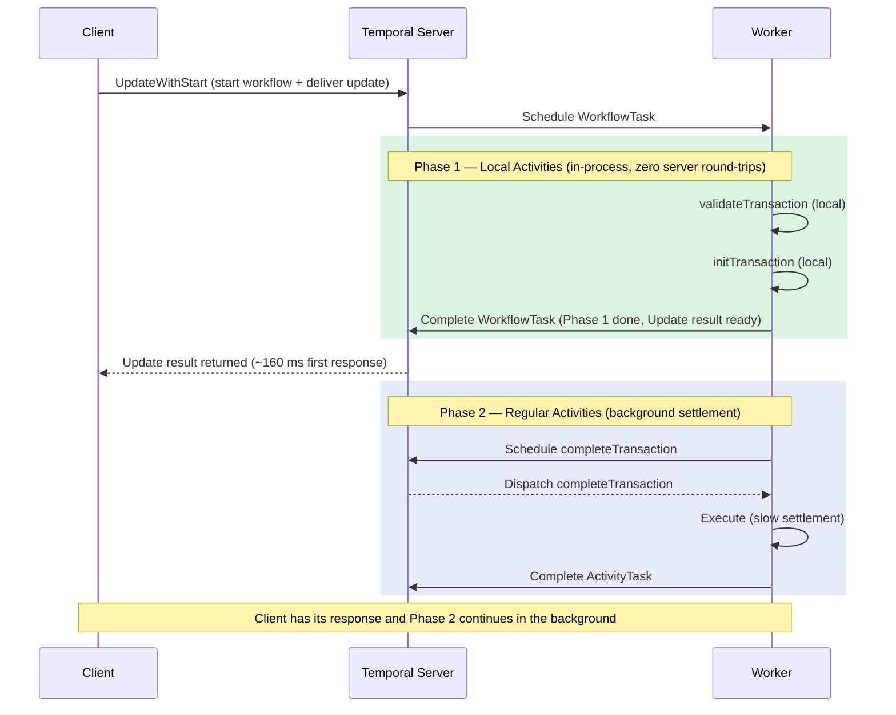

import Tabs from '@theme/Tabs';
import TabItem from '@theme/TabItem';

:::info[TLDR]
**Combine Update-with-Start with Local Activities in the synchronous Phase 1 to reduce first-response latency from ~265 ms to ~160 ms.** Phase 1 (initialization) runs as Local Activities with no server round-trips. Phase 2 (settlement) runs as regular Activities in the background. The client receives its response as soon as Phase 1 completes, so the in-process execution speed of Local Activities directly improves the time-to-first-byte.
:::

## Overview

The [Early Return](/design-patterns/early-return) pattern uses Update-with-Start to send the client an early response after a fast Phase 1 completes, while slow Phase 2 work continues in the background. This pattern extends Early Return by running Phase 1 Activities as **Local Activities**, eliminating all server round-trips on the synchronous hot path.

Because the client waits only for Phase 1, and Phase 1 now runs entirely in-process, the end-to-end first-response time drops from approximately 265 ms (Early Return with regular Activities) to approximately 160 ms.



**Numbered walkthrough:**

1. The client sends a single `UpdateWithStart` RPC, which atomically starts the Workflow and delivers the Update in one server call.
2. The Worker picks up the first Workflow Task and executes Phase 1. Because all Phase 1 Activities are Local Activities, they run in-process with no additional server calls. The entire phase completes inside a single Workflow Task.
3. When the Workflow Task completes, the server marks the Update as fulfilled and returns the result to the waiting client. This happens as soon as Phase 1 finishes—approximately 160 ms after the initial request.
4. The Workflow continues in a new Workflow Task to execute Phase 2 using regular Activities. These run in the background. The client is not blocked by this work.

## Problem

The plain Early Return pattern reduces first-response latency significantly compared to waiting for the full Workflow. However, if Phase 1 uses regular Activities, each Activity still incurs server scheduling overhead (~50 ms per call on Temporal Cloud). With two or three Phase 1 Activities, this overhead alone can account for 100–150 ms of the first-response time.

## Solution

Run all Phase 1 Activities as Local Activities. They execute in-process within the first Workflow Task, so their results are available to the Update handler as soon as the task completes—with no additional server calls. Phase 2 Activities remain regular Activities, which is acceptable because Phase 2 runs in the background after the client has already received its response.

<Tabs groupId="language" queryString>
<TabItem value="python" label="Python">

```python
# workflows.py
from temporalio import workflow
from datetime import timedelta
from activities import validate_transaction, init_transaction, complete_transaction, cancel_transaction

LOCAL_TIMEOUT = timedelta(seconds=5)
ACTIVITY_TIMEOUT = timedelta(seconds=30)

@workflow.defn
class TransactionWorkflow:
    def __init__(self) -> None:
        self._tx: Transaction | None = None
        self._phase1_done = False
        self._phase1_error: Exception | None = None

    @workflow.update
    async def get_result(self, req: TransactionRequest) -> Transaction:
        # Wait for Phase 1 to finish before returning to the caller.
        await workflow.wait_condition(lambda: self._phase1_done)
        if self._phase1_error:
            raise self._phase1_error
        return self._tx

    @workflow.run
    async def run(self, req: TransactionRequest) -> None:
        try:
            # Phase 1: Local Activities — zero server round-trips on the hot path.
            tx = await workflow.execute_local_activity(
                validate_transaction, req,
                schedule_to_close_timeout=LOCAL_TIMEOUT,
            )
            self._tx = await workflow.execute_local_activity(
                init_transaction, tx,
                schedule_to_close_timeout=LOCAL_TIMEOUT,
            )
        except Exception as e:
            self._phase1_error = e
        finally:
            self._phase1_done = True

        if self._phase1_error:
            if self._tx is not None:
                await workflow.execute_activity(
                    cancel_transaction, self._tx,
                    start_to_close_timeout=ACTIVITY_TIMEOUT,
                )
            return

        # Phase 2: Regular Activities — background settlement (client already has response).
        await workflow.execute_activity(
            complete_transaction, self._tx,
            start_to_close_timeout=ACTIVITY_TIMEOUT,
        )
```

</TabItem>
<TabItem value="typescript" label="TypeScript">

```typescript
// workflows.ts
import { proxyLocalActivities, proxyActivities, defineUpdate, setHandler, condition } from "@temporalio/workflow";
import type * as activities from "./activities";
import type { TransactionRequest, Transaction } from "./shared";

// Phase 1: local activities — no server round-trips on the hot path.
const { validateTransaction, initTransaction } =
  proxyLocalActivities<typeof activities>({ scheduleToCloseTimeout: "5s" });

// Phase 2: regular activities — background settlement.
const { completeTransaction, cancelTransaction } =
  proxyActivities<typeof activities>({ startToCloseTimeout: "30s" });

export const getResultUpdate = defineUpdate<Transaction, [TransactionRequest]>("getResult");

export async function transactionWorkflow(req: TransactionRequest): Promise<void> {
  let tx: Transaction | undefined;
  let phase1Done = false;
  let phase1Error: unknown;

  setHandler(getResultUpdate, async () => {
    // The Update handler waits for Phase 1 before returning.
    await condition(() => phase1Done);
    if (phase1Error) throw phase1Error;
    return tx!;
  });

  try {
    // Phase 1: Local Activities run in-process.
    tx = await validateTransaction(req);
    tx = await initTransaction(tx);
  } catch (err) {
    phase1Error = err;
  } finally {
    phase1Done = true;
  }

  if (phase1Error) {
    if (tx !== undefined) {
      await cancelTransaction(tx);
    }
    return;
  }

  // Phase 2: Regular Activity runs in the background.
  await completeTransaction(tx!);
}
```

</TabItem>
<TabItem value="go" label="Go">

```go
// workflows.go
func TransactionWorkflow(ctx workflow.Context, req TransactionRequest) error {
    var tx Transaction
    var initDone bool
    var initErr error

    // Register Update handler — returns to the client as soon as Phase 1 is done.
    if err := workflow.SetUpdateHandler(ctx, "getResult",
        func(ctx workflow.Context, r TransactionRequest) (Transaction, error) {
            _ = workflow.Await(ctx, func() bool { return initDone })
            return tx, initErr
        }); err != nil {
        return err
    }

    // Phase 1: Local Activities — in-process, zero server round-trips.
    localCtx := workflow.WithLocalActivityOptions(ctx, workflow.LocalActivityOptions{
        ScheduleToCloseTimeout: 5 * time.Second,
    })
    if err := workflow.ExecuteLocalActivity(localCtx, ValidateTransaction, req).Get(localCtx, &tx); err == nil {
        initErr = workflow.ExecuteLocalActivity(localCtx, InitTransaction, tx).Get(localCtx, &tx)
    } else {
        initErr = err
    }
    initDone = true

    activityCtx := workflow.WithActivityOptions(ctx, workflow.ActivityOptions{
        StartToCloseTimeout: 30 * time.Second,
    })
    if initErr != nil {
        // Phase 2 (cancel): regular Activity runs in the background.
        return workflow.ExecuteActivity(activityCtx, CancelTransaction, tx).Get(activityCtx, nil)
    }
    // Phase 2 (complete): regular Activity runs in the background.
    return workflow.ExecuteActivity(activityCtx, CompleteTransaction, tx).Get(activityCtx, nil)
}
```

</TabItem>
<TabItem value="java" label="Java">

```java
// TransactionWorkflow.java
public class Impl implements TransactionWorkflow {
    // Phase 1: local activities — zero server round-trips on the hot path.
    private final Activities localActivities = Workflow.newLocalActivityStub(
        Activities.class,
        LocalActivityOptions.newBuilder()
            .setScheduleToCloseTimeout(Duration.ofSeconds(5))
            .build()
    );
    // Phase 2: regular activities — background settlement.
    private final Activities activities = Workflow.newActivityStub(
        Activities.class,
        ActivityOptions.newBuilder()
            .setStartToCloseTimeout(Duration.ofSeconds(30))
            .build()
    );

    private Shared.Transaction tx;
    private boolean phase1Done = false;
    private RuntimeException phase1Error = null;

    @Override
    public Shared.Transaction getResult(Shared.TransactionRequest req) {
        // Update handler: wait for Phase 1 before returning.
        Workflow.await(() -> phase1Done);
        if (phase1Error != null) throw phase1Error;
        return tx;
    }

    @Override
    public void processTransaction(Shared.TransactionRequest req) {
        try {
            tx = localActivities.validateTransaction(req);
            tx = localActivities.initTransaction(tx);
        } catch (RuntimeException e) {
            phase1Error = e;
        } finally {
            phase1Done = true;
        }

        if (phase1Error != null) {
            activities.cancelTransaction(tx);
            return;
        }
        // Phase 2: regular activity in the background.
        activities.completeTransaction(tx);
    }
}
```

</TabItem>
</Tabs>

## When to use

**Good fit:**

- User-facing workflows where the first response is more latency-critical than total execution time
- Phase 1 consists of short, idempotent validation and initialization steps that fit naturally as Local Activities
- Phase 2 is slow (network I/O, external systems) and does not need to be on the client's critical path
- You already use or plan to use the Early Return pattern

**Poor fit:**

- Phase 1 Activities are long-running or require heartbeating—Local Activities cannot heartbeat
- The Workflow's total latency matters more than first-response latency
- Phase 1 and Phase 2 cannot be cleanly separated

## Benefits and trade-offs

| Pattern | First Response | Total Latency | Complexity |
|---|---|---|---|
| Synchronous workflow | Same as total | ~850 ms | Low |
| Early Return (regular activities) | ~265 ms | ~850 ms | Medium |
| Local Activities only | Same as total | ~275 ms | Medium |
| **Early Return + Local Activities** | **~160 ms** | **~275 ms** | **Medium** |
| Eager Workflow Start + Local Activities | ~160 ms | ~265 ms | High |

## Best practices

- **Keep Phase 1 Local Activities short.** Each must complete well within the Workflow Task timeout (default 10 seconds). Aim for under 5 seconds total for all Phase 1 work.
- **Design Phase 1 for at-least-once execution.** If the Workflow Task that runs Phase 1 fails and retries, all Phase 1 Local Activities re-execute. Phase 1 operations must be idempotent.
- **Separate Phase 1 and Phase 2 concerns cleanly.** The Update handler should wait only on the Phase 1 sentinel flag, not on any Phase 2 state. Phase 2 should be independent enough to proceed without client involvement.
- **Set appropriate timeouts for Phase 2.** Phase 2 regular Activities run in the background and should have a `startToCloseTimeout` that reflects the maximum acceptable settlement time.

## Common pitfalls

- **Putting slow operations in Phase 1.** If any Phase 1 Local Activity takes too long, the Workflow Task times out and retries. The client also waits longer for its early response, defeating the purpose of the pattern.
- **Non-idempotent Phase 1.** A retried Workflow Task re-executes all Local Activities in that task. Ensure Phase 1 operations (e.g., creating a record in an external system) are safe to re-run.
- **Ignoring Phase 1 errors in Phase 2.** Always check Phase 1 error state before proceeding to Phase 2. If Phase 1 failed, Phase 2 should run a compensating Activity (cancel, rollback) rather than complete.
- **Mixing Local and regular Activity stubs incorrectly.** In Java, `Workflow.newLocalActivityStub` and `Workflow.newActivityStub` return distinct objects. Make sure Phase 1 uses the local stub and Phase 2 uses the regular stub.

## Related patterns

- [Early Return](/design-patterns/early-return) — the baseline Update-with-Start pattern without Local Activity optimization
- [Local Activities](/design-patterns/local-activities) — using Local Activities for full-workflow latency reduction without early return
- [Eager Workflow Start](/design-patterns/eager-workflow-start) — eliminates the Matching step when starting the Workflow for additional total latency improvement
