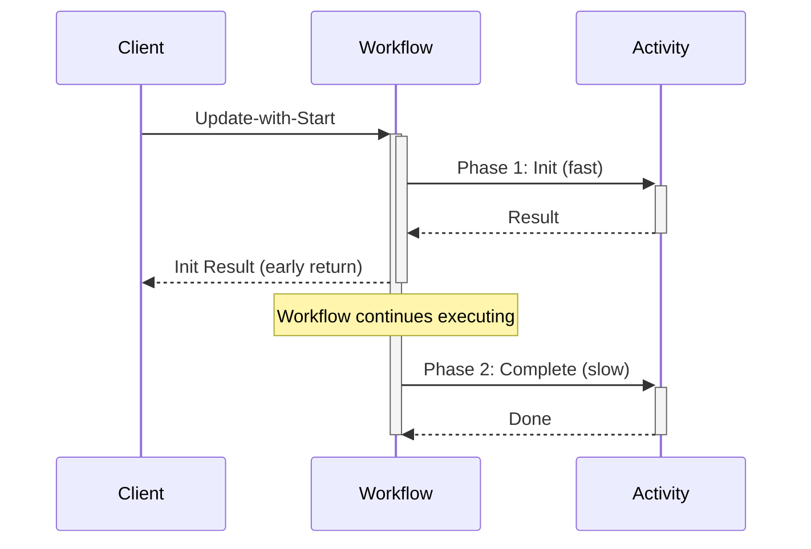

import Tabs from '@theme/Tabs';
import TabItem from '@theme/TabItem';

## Overview

The Early Return pattern returns initialization results to the caller immediately while continuing asynchronous processing in the background.

## Problem

Clients need immediate feedback on whether an operation can proceed, but the full operation takes significant time to complete.
Blocking the client for the entire operation duration creates a poor user experience and ties up resources.

## Solution

You use Update-with-Start to split operations into two phases: a fast synchronous initialization phase that validates and returns results immediately, and a slower asynchronous completion phase that runs in the background.
The Workflow uses local Activities for quick initialization, Signals completion via Update handlers, then either completes or cancels the operation based on initialization success.



The following describes each step in the diagram:

1. The client sends an Update-with-Start request to the Workflow.
2. The Workflow executes a fast initialization Activity (Phase 1) and returns the result to the client immediately.
3. The client receives the initialization result while the Workflow continues executing.
4. The Workflow executes the slower completion Activity (Phase 2) in the background.

## Implementation

The following examples show how each SDK implements this pattern.
The Workflow registers an Update handler that blocks until initialization completes, then returns the result to the caller.
The client receives the initialization result in a single round trip while the Workflow continues processing.


<Tabs groupId="language" queryString>
<TabItem value="python" label="Python" default>

```python
# workflow.py
from dataclasses import dataclass
from datetime import timedelta

from temporalio import workflow

with workflow.unsafe.imports_passed_through():
    from activities import init_transaction, complete_transaction, cancel_transaction


@dataclass
class TransactionRequest:
    amount: float
    currency: str


@dataclass
class Transaction:
    id: str
    status: str


@workflow.defn
class TransactionWorkflow:
    def __init__(self) -> None:
        self.tx: Transaction | None = None
        self.init_done = False
        self.init_err: Exception | None = None

    @workflow.run
    async def run(self, tx_request: TransactionRequest) -> Transaction | None:
        # Phase 1: Fast synchronous initialization (local activity)
        try:
            self.tx = await workflow.execute_local_activity(
                init_transaction,
                tx_request,
                schedule_to_close_timeout=timedelta(seconds=5),
            )
        except Exception as e:
            self.init_err = e
        finally:
            self.init_done = True  # Signal update handler

        # Phase 2: Slow asynchronous completion
        if self.init_err is not None:
            await workflow.execute_activity(
                cancel_transaction,
                self.tx,
                start_to_close_timeout=timedelta(seconds=30),
            )
            return None

        await workflow.execute_activity(
            complete_transaction,
            self.tx,
            start_to_close_timeout=timedelta(seconds=30),
        )
        return self.tx

    @workflow.update
    async def return_init_result(self) -> Transaction:
        await workflow.wait_condition(lambda: self.init_done)
        if self.init_err is not None:
            raise self.init_err
        return self.tx


# client.py
from temporalio.client import (
    Client,
    WithStartWorkflowOperation,
    WorkflowUpdateStage,
)

client = await Client.connect("localhost:7233")

start_op = WithStartWorkflowOperation(
    TransactionWorkflow.run,
    tx_request,
    id="transaction-123",
    task_queue="transactions",
    id_conflict_policy=common_pb2.WORKFLOW_ID_CONFLICT_POLICY_FAIL,
)

update_handle = await client.start_update_with_start_workflow(
    TransactionWorkflow.return_init_result,
    wait_for_stage=WorkflowUpdateStage.COMPLETED,
    start_workflow_operation=start_op,
)

# Get initialization result immediately
tx = await update_handle.result()

# Use transaction ID immediately while workflow continues
print(f"Transaction initialized: {tx.id}")
```

</TabItem>
<TabItem value="go" label="Go">

```go
// workflow.go
func Workflow(ctx workflow.Context, txRequest TransactionRequest) (*Transaction, error) {
    var tx *Transaction
    var initDone bool
    var initErr error

    // Register update handler that waits for initialization
    workflow.SetUpdateHandler(ctx, UpdateName,
        func(ctx workflow.Context) (*Transaction, error) {
            workflow.Await(ctx, func() bool { return initDone })
            return tx, initErr
        },
    )

    // Phase 1: Fast synchronous initialization (local activity)
    localOpts := workflow.WithLocalActivityOptions(ctx, workflow.LocalActivityOptions{
        ScheduleToCloseTimeout: 5 * time.Second,
    })
    initErr = workflow.ExecuteLocalActivity(localOpts, txRequest.Init).Get(ctx, &tx)
    initDone = true // Signal update handler

    // Phase 2: Slow asynchronous completion
    activityCtx := workflow.WithActivityOptions(ctx, workflow.ActivityOptions{
        StartToCloseTimeout: 30 * time.Second,
    })

    if initErr != nil {
        // Cancel on initialization failure
        return nil, workflow.ExecuteActivity(activityCtx, CancelTransaction, tx).Get(ctx, nil)
    }

    // Complete on initialization success
    return tx, workflow.ExecuteActivity(activityCtx, CompleteTransaction, tx).Get(ctx, nil)
}

// client.go
startOp := client.NewWithStartWorkflowOperation(
    client.StartWorkflowOptions{
        ID:                       "transaction-123",
        TaskQueue:                "transactions",
        WorkflowIDConflictPolicy: enumspb.WORKFLOW_ID_CONFLICT_POLICY_FAIL,
    },
    Workflow,
    txRequest,
)

updateHandle, err := client.UpdateWithStartWorkflow(ctx,
    client.UpdateWithStartWorkflowOptions{
        StartWorkflowOperation: startOp,
        UpdateOptions: client.UpdateWorkflowOptions{
            UpdateName:   UpdateName,
            WaitForStage: client.WorkflowUpdateStageCompleted,
        },
    },
)

// Get initialization result immediately
var tx Transaction
err = updateHandle.Get(ctx, &tx)
if err != nil {
    return err
}

// Use transaction ID immediately while workflow continues
fmt.Printf("Transaction initialized: %s\n", tx.ID)
```

</TabItem>
<TabItem value="java" label="Java">

```java
// TransactionWorkflowImpl.java
public class TransactionWorkflowImpl implements TransactionWorkflow {
    private boolean initDone = false;
    private Transaction tx;
    private Exception initError = null;

    @Override
    public TxResult processTransaction(TransactionRequest txRequest) {
        this.tx = activities.mintTransactionId(txRequest);

        // Phase 1: Fast synchronous initialization
        try {
            this.tx = activities.initTransaction(this.tx);
        } catch (Exception e) {
            initError = e;
        } finally {
            initDone = true; // Signal update handler
        }

        // Phase 2: Slow asynchronous completion
        if (initError != null) {
            activities.cancelTransaction(this.tx);
            return new TxResult("", "Transaction cancelled.");
        } else {
            activities.completeTransaction(this.tx);
            return new TxResult(this.tx.getId(), "Transaction completed successfully.");
        }
    }

    @Override
    public TxResult returnInitResult() {
        Workflow.await(() -> initDone); // Wait for initialization
        if (initError != null) {
            throw Workflow.wrap(initError);
        }
        return new TxResult(tx.getId(), "Initialization successful");
    }
}

// Client.java
TransactionWorkflow workflow = client.newWorkflowStub(
    TransactionWorkflow.class,
    WorkflowOptions.newBuilder()
        .setWorkflowId("transaction-123")
        .setTaskQueue("transactions")
        .setWorkflowIdConflictPolicy(
            WorkflowIdConflictPolicy.WORKFLOW_ID_CONFLICT_POLICY_FAIL)
        .build());

WorkflowUpdateHandle<TxResult> updateHandle =
    WorkflowClient.startUpdateWithStart(
        workflow::returnInitResult,
        UpdateOptions.<TxResult>newBuilder().build(),
        new WithStartWorkflowOperation<>(workflow::processTransaction, txRequest));

// Get initialization result immediately
TxResult result = updateHandle.getResultAsync().get();

// Use transaction ID immediately while workflow continues
System.out.println("Transaction initialized: " + result.getId());
```

</TabItem>
<TabItem value="typescript" label="TypeScript">

```typescript
// workflow.ts
import { defineUpdate, setHandler, condition } from '@temporalio/workflow';
import * as activities from './activities';

const { initTransaction, completeTransaction, cancelTransaction } =
  proxyLocalActivities<typeof activities>({
    scheduleToCloseTimeout: '5s',
  });

export const returnInitResultUpdate = defineUpdate<Transaction>('returnInitResult');

export async function transactionWorkflow(txRequest: TransactionRequest): Promise<Transaction> {
  let tx: Transaction | undefined;
  let initDone = false;
  let initError: Error | undefined;

  // Register update handler that waits for initialization
  setHandler(returnInitResultUpdate, async () => {
    await condition(() => initDone);
    if (initError) {
      throw initError;
    }
    return tx!;
  });

  // Phase 1: Fast synchronous initialization (local activity)
  try {
    tx = await initTransaction(txRequest);
  } catch (err) {
    initError = err as Error;
  } finally {
    initDone = true; // Signal update handler
  }

  // Phase 2: Slow asynchronous completion
  if (initError) {
    await cancelTransaction(tx!);
    throw initError;
  }

  await completeTransaction(tx);
  return tx;
}

// client.ts
const startWorkflowOperation = new WithStartWorkflowOperation(
  transactionWorkflow,
  {
    workflowId: 'transaction-123',
    args: [txRequest],
    taskQueue: 'transactions',
    workflowIdConflictPolicy: 'FAIL',
  },
);

const tx = await client.workflow.executeUpdateWithStart(
  returnInitResultUpdate,
  { startWorkflowOperation },
);

const wfHandle = await startWorkflowOperation.workflowHandle();

// Use transaction ID immediately while workflow continues
console.log(`Transaction initialized: ${tx.id}`);

// Optionally wait for the workflow to complete
const finalResult = await wfHandle.result();
```

</TabItem>
</Tabs>

The key points across all SDKs are:

- **Update-with-Start** is a single API call that starts the Workflow and returns the initialization result.
- The Workflow uses an Update handler with a condition/await to block until initialization completes.
- The client receives the result immediately while the Workflow continues executing in the background.
- A `WorkflowIdConflictPolicy` must be specified. For early return, use `FAIL` to assert a new Workflow is created.
- Update-with-Start is **not atomic**. If the Update cannot be delivered (for example, no Worker is available), the Workflow Execution will still start. The SDKs will retry the Update request, but there is no guarantee the Update will succeed.

## When to use

The Early Return pattern is a good fit when clients need immediate feedback but operations take time to complete, validation or initialization can be done quickly (under 5 seconds), the operation can be safely cancelled if initialization fails, and the initialization result determines whether to proceed or abort.
Common use cases include e-commerce payment processing (immediate authorization while settlement runs in the background), user onboarding and KYC verification (quick user ID return while background checks continue), resource provisioning (fast validation results while infrastructure is set up), document processing (immediate receipt confirmation while OCR and content analysis continue), and order processing (fast inventory check while fulfillment runs in the background).

It is not a good fit for fully automated processes that require no intermediate feedback, operations that cannot be split into fast and slow phases, or fire-and-forget operations where no immediate response is needed (use Signals).

## Benefits and trade-offs

The Early Return pattern provides immediate client feedback via Update-with-Start in a single round trip.
Clients do not wait for full operation completion.
Local Activities avoid extra server roundtrips during initialization, and there is a clear separation between validation and execution phases.
Automatic cancellation handling runs on initialization failure.

The trade-offs to consider are that you must tune timeouts carefully for local Activities.
There is a concurrent Update limit (10 per Workflow) that can bottleneck high-throughput scenarios requiring multiple simultaneous Updates.
Clients must handle asynchronous completion separately, and initialization must complete within a single Workflow Task.
The pattern is limited to operations that you can split into fast and slow phases.

## Comparison with alternatives

| Approach | Immediate response | Consistency | Complexity | Use case |
| :--- | :--- | :--- | :--- | :--- |
| Early Return (Update-with-Start) | Yes (typed) | Strong | Medium | Synchronous init + async completion |
| Signal + Query polling | Yes (eventual) | Eventual | High | Fire-and-forget with status checks |
| Child Workflow split | Yes (Workflow ID) | Strong | High | Separate init and completion Workflows |
| Blocking until completion | Yes (final) | Strong | Low | Short operations only |

## Best practices

- **Set WorkflowIdConflictPolicy to FAIL.** For early return, use `FAIL` to assert a new Workflow is created per request. Use `USE_EXISTING` only for lazy initialization patterns.
- **Use Workflow.await in the Update handler.** Keep the Update handler lightweight — block on a condition flag (`workflow.Await` in Go, `Workflow.await` in Java, `condition` in TypeScript, `workflow.wait_condition` in Python) and let the main Workflow method do the real work.
- **Use local Activities for initialization.** Local Activities avoid extra server roundtrips, keeping the synchronous phase fast (under 5 seconds).
- **Handle Update-with-Start non-atomicity.** Update-with-Start is not atomic. The Workflow may start even if the Update fails. Ensure Workers are running and handle the case where the Update is not delivered.
- **Set a timeout on the Update result.** Use a timeout when waiting for the Update result to avoid blocking the client indefinitely if the Worker is unavailable.
- **Be aware of the concurrent Update limit.** The default `maxInFlightUpdates` is 10 per Workflow. If you expect high concurrency, design accordingly or use separate Workflows.
- **Provide a unique Update ID.** Use a unique Update ID for idempotency so retried requests attach to the same Update rather than creating duplicates.
- **Avoid Workflow timeouts.** Do not set Workflow Execution timeouts when using early return, as the background phase may take longer than expected.

## Common pitfalls

- **Assuming Update-with-Start is atomic.** Unlike Signal-with-Start, Update-with-Start is not atomic. The Workflow may start even if the Update fails (for example, if no Worker is available). Handle this by checking Workflow state after the call.
- **Missing WorkflowIdConflictPolicy.** Update-with-Start requires a `WorkflowIdConflictPolicy`. Omitting it causes an error. Use `FAIL` for early return (one Workflow per request) or `USE_EXISTING` for lazy initialization.
- **Blocking too long in the Update handler.** The Update handler should return quickly. Perform long-running work in the main Workflow method and use `Workflow.await` in the Update handler to wait for a result.
- **Swallowing the ContinueAsNew exception.** In TypeScript, `continueAsNew` throws a special exception. Catching it in a try-catch without re-throwing (or returning in a `finally` block) silently prevents Continue-As-New.

## Related patterns

- **[Saga Pattern](/design-patterns/saga-pattern)**: You can combine this with the Saga pattern to add compensation for failed completions.
- **[Signal with Start](/design-patterns/signal-with-start)**: For fire-and-forget operations that do not need an immediate response.
- **[Request-Response via Updates](/design-patterns/request-response-via-updates)**: For synchronous state modifications on already-running Workflows.

## Sample code

- [Python Sample](https://github.com/temporalio/samples-python/tree/main/early_return) — Early return with Update-with-Start.
- [Go Sample](https://github.com/temporalio/samples-go/tree/main/early-return) — Early return with Update-with-Start.
- [TypeScript Sample](https://github.com/temporalio/samples-typescript/tree/main/early-return) — Early return with local Activities.
- [Java Sample](https://github.com/temporalio/samples-java/tree/main/core/src/main/java/io/temporal/samples/earlyreturn) — Early return with Update handler.
