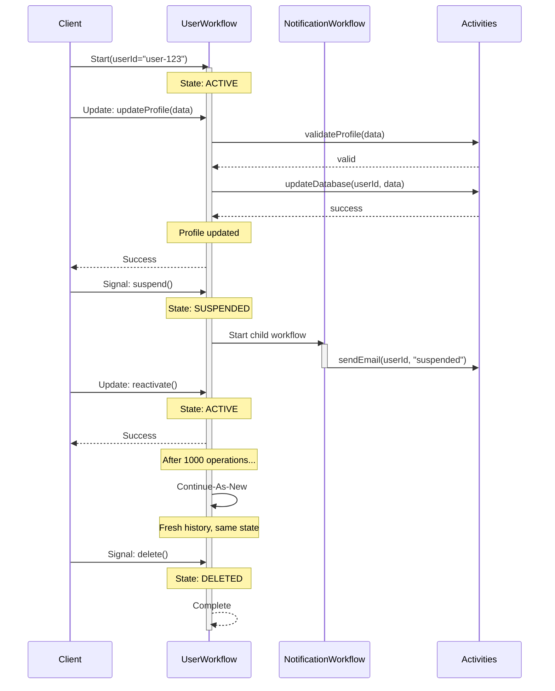

import Tabs from '@theme/Tabs';
import TabItem from '@theme/TabItem';

## Overview

The Entity Workflow pattern models long-lived business entities (users, accounts, devices, orders) as individual Workflows that persist for the entity's entire lifetime — potentially months or years.
Each entity gets its own Workflow instance identified by the entity ID, handling all state transitions and operations through Signals and Updates.

## Problem

Many business domains have entities that exist for extended periods, undergo multiple state transitions over their lifetime, need to maintain consistent state across operations, require audit trails of all changes, and must handle concurrent operations safely.

Traditional approaches struggle with these requirements:

- **Database-centric**: Complex locking, race conditions, scattered business logic.
- **Event Sourcing**: Requires rebuilding state from events, complex infrastructure.
- **Stateless Services**: No built-in consistency, must coordinate state externally.
- **Short-lived Workflows**: Do not model the full entity lifecycle.

## Solution

You create one Workflow per entity, using the entity ID as the Workflow ID.
The Workflow runs for the entity's entire lifetime, maintaining state in Workflow variables and handling operations via Signals and Updates.
You use Continue-As-New periodically to prevent unbounded history growth.



The following describes each step in the diagram:

1. The client starts the Workflow with a user ID. The Workflow initializes in the ACTIVE state.
2. The client sends an Update to modify the profile. The Workflow validates the data via an Activity, persists the change, and returns success.
3. The client sends a Signal to suspend the account. The Workflow transitions to SUSPENDED and starts a Child Workflow to send a notification email.
4. The client sends an Update to reactivate the account. The Workflow transitions back to ACTIVE.
5. After 1000 operations, the Workflow calls Continue-As-New to reset its history while preserving state.
6. The client sends a Signal to delete the account. The Workflow transitions to DELETED and completes.

## Implementation

The following examples show how each SDK implements the Entity Workflow pattern.
Each implementation defines Update handlers for synchronous operations, Signal handlers for asynchronous events, and Query handlers for state inspection.

<Tabs groupId="language" queryString>
<TabItem value="python" label="Python">

```python
# workflows.py
from dataclasses import dataclass
from datetime import datetime, timedelta
from temporalio import workflow

with workflow.unsafe.imports_passed_through():
    from activities import validate_profile

@dataclass
class UserState:
    status: str = "ACTIVE"
    profile: ProfileData | None = None
    pending_email: str | None = None
    created_at: datetime | None = None
    updated_at: datetime | None = None

@dataclass
class UserAccountInput:
    user_id: str
    # Unset for the original caller; carries state across Continue-As-New
    state: UserState | None = None

@workflow.defn
class UserAccountWorkflow:
    def __init__(self) -> None:
        self.state = UserState(created_at=datetime.utcnow())
        self.deleted = False
        self.operation_count = 0

    @workflow.run
    async def run(self, input: UserAccountInput) -> None:
        # On Continue-As-New, restore the state carried from the previous run
        if input.state is not None:
            self.state = input.state

        # Block until deleted or Continue-As-New is suggested
        await workflow.wait_condition(
            lambda: self.deleted or workflow.info().is_continue_as_new_suggested()
        )

        if not self.deleted and workflow.info().is_continue_as_new_suggested():
            await workflow.wait_condition(workflow.all_handlers_finished)
            # Carry current state forward so it is not reset on the new run
            workflow.continue_as_new(
                UserAccountInput(user_id=input.user_id, state=self.state)
            )

        self.state.status = "DELETED"

    @workflow.update
    async def update_profile(self, data: ProfileData) -> None:
        if self.deleted:
            raise ValueError("User account is deleted")

        await workflow.execute_activity(
            validate_profile, data,
            start_to_close_timeout=timedelta(seconds=30),
        )

        self.state.profile = data
        self.state.updated_at = datetime.utcnow()
        self.operation_count += 1

    @workflow.update
    async def suspend(self) -> None:
        if not self.deleted and self.state.status != "SUSPENDED":
            self.state.status = "SUSPENDED"
            self.state.updated_at = datetime.utcnow()
            self.operation_count += 1

    @workflow.update
    async def reactivate(self) -> None:
        if not self.deleted and self.state.status == "SUSPENDED":
            self.state.status = "ACTIVE"
            self.state.updated_at = datetime.utcnow()
            self.operation_count += 1

    @workflow.signal
    def delete(self) -> None:
        self.deleted = True

    @workflow.query
    def get_state(self) -> UserState:
        return self.state
```

</TabItem>
<TabItem value="go" label="Go">

```go
// workflow.go
type UserAccountWorkflow struct{}

type UserState struct {
	Status      string
	Profile     ProfileData
	PendingEmail string
	CreatedAt   time.Time
	UpdatedAt   time.Time
}

type UserAccountInput struct {
	UserID string
	// Nil for the original caller; carries state across Continue-As-New
	State *UserState
}

func (w *UserAccountWorkflow) Run(ctx workflow.Context, input UserAccountInput) error {
	// On Continue-As-New, restore the state carried from the previous run
	var state UserState
	if input.State != nil {
		state = *input.State
	} else {
		state = UserState{
			Status:    "ACTIVE",
			CreatedAt: workflow.Now(ctx),
		}
	}
	deleted := false
	operationCount := 0

	err := workflow.SetUpdateHandler(ctx, "updateProfile", func(ctx workflow.Context, data ProfileData) error {
		if deleted {
			return errors.New("user account is deleted")
		}

		if err := workflow.ExecuteActivity(ctx, ValidateProfile, data).Get(ctx, nil); err != nil {
			return err
		}

		state.Profile = data
		state.UpdatedAt = workflow.Now(ctx)
		operationCount++

		return nil
	})
	if err != nil {
		return err
	}

	err = workflow.SetUpdateHandler(ctx, "suspend", func(ctx workflow.Context) error {
		if !deleted && state.Status != "SUSPENDED" {
			state.Status = "SUSPENDED"
			state.UpdatedAt = workflow.Now(ctx)
			operationCount++
		}
		return nil
	})
	if err != nil {
		return err
	}

	// Block until deleted or Continue-As-New is suggested
	for {
		selector := workflow.NewSelector(ctx)
		selector.AddReceive(workflow.GetSignalChannel(ctx, "delete"), func(c workflow.ReceiveChannel, more bool) {
			c.Receive(ctx, nil)
			deleted = true
		})
		selector.Select(ctx)

		if deleted {
			state.Status = "DELETED"
			return nil
		}
		if workflow.GetInfo(ctx).GetContinueAsNewSuggested() {
			// Carry current state forward so it is not reset on the new run
			return workflow.NewContinueAsNewError(ctx, w.Run, UserAccountInput{UserID: input.UserID, State: &state})
		}
	}
}
```

</TabItem>
<TabItem value="java" label="Java">

```java
// UserAccountWorkflow.java

// userId is always set; state is empty for the original caller and
// carries state across Continue-As-New.
public record UserAccountInput(String userId, Optional<UserState> state) {}

@WorkflowInterface
public interface UserAccountWorkflow {
  @WorkflowMethod
  void run(UserAccountInput input);

  @UpdateMethod
  void updateProfile(ProfileData data);

  @UpdateMethod
  void changeEmail(String newEmail);

  @SignalMethod
  void suspend();

  @SignalMethod
  void reactivate();

  @SignalMethod
  void delete();

  @QueryMethod
  UserState getState();
}

public class UserAccountWorkflowImpl implements UserAccountWorkflow {
  private String userId;
  private UserState state = new UserState();
  private boolean deleted = false;
  private int operationCount = 0;
  private static final int CONTINUE_AS_NEW_THRESHOLD = 1000;

  @Override
  public void run(UserAccountInput input) {
    this.userId = input.userId();
    // On Continue-As-New, restore the state carried from the previous run
    if (input.state().isPresent()) {
      this.state = input.state().get();
    } else {
      state.setStatus("ACTIVE");
      state.setCreatedAt(Workflow.currentTimeMillis());
    }

    // Run until deleted or Continue-As-New is needed
    Workflow.await(() -> deleted || Workflow.getInfo().isContinueAsNewSuggested());

    if (!deleted && Workflow.getInfo().isContinueAsNewSuggested()) {
      // Carry current state forward so it is not reset on the new run
      Workflow.continueAsNew(new UserAccountInput(userId, Optional.of(state)));
    }

    state.setStatus("DELETED");
    state.setDeletedAt(Workflow.currentTimeMillis());
  }

  @Override
  public void updateProfile(ProfileData data) {
    validateNotDeleted();
    Activities.validateProfile(data);
    state.setProfile(data);
    state.setUpdatedAt(Workflow.currentTimeMillis());
    incrementOperationCount();
  }

  @Override
  public void changeEmail(String newEmail) {
    validateNotDeleted();
    Activities.sendVerificationEmail(userId, newEmail);
    state.setPendingEmail(newEmail);
    state.setUpdatedAt(Workflow.currentTimeMillis());
    incrementOperationCount();
  }

  @Override
  public void suspend() {
    if (!deleted && !"SUSPENDED".equals(state.getStatus())) {
      state.setStatus("SUSPENDED");
      state.setUpdatedAt(Workflow.currentTimeMillis());
      incrementOperationCount();
    }
  }

  @Override
  public void reactivate() {
    if (!deleted && "SUSPENDED".equals(state.getStatus())) {
      state.setStatus("ACTIVE");
      state.setUpdatedAt(Workflow.currentTimeMillis());
      incrementOperationCount();
    }
  }

  @Override
  public void delete() {
    deleted = true;
  }

  @Override
  public UserState getState() {
    return state;
  }

  private void validateNotDeleted() {
    if (deleted) {
      throw new IllegalStateException("User account is deleted");
    }
  }

  private void incrementOperationCount() {
    operationCount++;
  }
}
```

</TabItem>
<TabItem value="typescript" label="TypeScript">

```typescript
// workflow.ts
import { condition, allHandlersFinished, defineUpdate, defineSignal, defineQuery, setHandler, continueAsNew, workflowInfo, proxyActivities } from '@temporalio/workflow';
import type * as activities from './activities';

const { validateProfile } = proxyActivities<typeof activities>({
  startToCloseTimeout: '30s',
});

interface UserState {
  status: string;
  profile?: ProfileData;
  pendingEmail?: string;
  createdAt: number;
  updatedAt: number;
}

interface UserAccountInput {
  userId: string;
  // Unset for the original caller; carries state across Continue-As-New
  state?: UserState;
}

export const updateProfileUpdate = defineUpdate<void, [ProfileData]>('updateProfile');
export const suspendSignal = defineSignal('suspend');
export const deleteSignal = defineSignal('delete');
export const getStateQuery = defineQuery<UserState>('getState');

export async function userAccountWorkflow(input: UserAccountInput): Promise<void> {
  // On Continue-As-New, restore the state carried from the previous run
  const state: UserState = input.state ?? {
    status: 'ACTIVE',
    createdAt: Date.now(),
    updatedAt: Date.now(),
  };
  
  let deleted = false;
  let operationCount = 0;
  
  setHandler(updateProfileUpdate, async (data: ProfileData) => {
    if (deleted) {
      throw new Error('User account is deleted');
    }
    
    await validateProfile(data);
    
    state.profile = data;
    state.updatedAt = Date.now();
    operationCount++;
    

  });
  
  setHandler(suspendSignal, () => {
    if (!deleted && state.status !== 'SUSPENDED') {
      state.status = 'SUSPENDED';
      state.updatedAt = Date.now();
      operationCount++;
    }
  });
  
  setHandler(deleteSignal, () => {
    deleted = true;
  });
  
  setHandler(getStateQuery, () => state);
  
  // Block until deleted or Continue-As-New is suggested
  await condition(() => deleted || workflowInfo().continueAsNewSuggested);
  
  if (!deleted && workflowInfo().continueAsNewSuggested) {
    await condition(allHandlersFinished);
    // Carry current state forward so it is not reset on the new run
    await continueAsNew<typeof userAccountWorkflow>({ userId: input.userId, state });
  }
  
  state.status = 'DELETED';
}
```

</TabItem>
</Tabs>

The Workflow blocks on `Workflow.await(() -> deleted)` (Java), `condition(() => deleted)` (TypeScript), `workflow.wait_condition(lambda: self.deleted)` (Python), or `selector.Select(ctx)` (Go) until the delete Signal arrives.
All state transitions happen through Signal and Update handlers, ensuring that every operation on the entity goes through a single Workflow with no race conditions.
Continue-As-New is triggered from the main Workflow method (not from handlers) when `isContinueAsNewSuggested()` returns true.
The Workflow takes a single input object that carries both the entity ID and the current state, so state is passed forward on Continue-As-New rather than reset. The state field is unset for the original caller and populated only on continuation; the new run restores it before processing further operations.
All SDK docs explicitly warn: do not call Continue-As-New from Update or Signal handlers.
Instead, handlers set state, and the main Workflow method checks whether to Continue-As-New.

## When to use

The Entity Workflow pattern is a good fit for user accounts and profiles, IoT devices and sensors, customer relationships (CRM), shopping carts and orders, financial accounts, subscription management, device provisioning and lifecycle, and multi-tenant resources.

It is not a good fit for short-lived processes (use regular Workflows), stateless operations (use Activities), high-frequency updates (more than 100 per second per entity), or entities with only CRUD operations (use a database).

## Benefits and trade-offs

Benefits:

- All operations on an entity go through a single Workflow, eliminating race conditions.
- The Workflow history provides a complete audit trail of all state changes.
- All entity logic lives in one place, and state survives process crashes and restarts.
- Temporal provides exactly-once execution and automatic retries.
- You can inspect current state through Queries without side effects.

Trade-offs:

- You must use Continue-As-New to prevent unbounded history growth.
- A single Workflow handles all operations for one entity, which limits throughput.
- State is kept in Workflow memory, so you should use Activities for large data.
- One Workflow per entity means you should consider costs at scale.
- The first operation after an idle period may have latency.

## Comparison with alternatives

| Approach | Consistency | Audit trail | Complexity | Scalability |
| :--- | :--- | :--- | :--- | :--- |
| Entity Workflow | Strong | Complete | Low | High (per entity) |
| Database + Locks | Eventual | Manual | High | Very High |
| Event Sourcing | Strong | Complete | High | High |
| Stateless Service | Weak | Manual | Medium | Very High |

## Best practices

- **Use entity ID as Workflow ID.** This ensures uniqueness and idempotent starts.
- **Implement Continue-As-New.** Use `isContinueAsNewSuggested()` to check when to continue. Always call Continue-As-New from the main Workflow method, never from handlers. Wait for all handlers to finish before continuing.
- **Validate in Updates.** Use Updates for operations that require validation and a return value.
- **Use Signals for events.** Use Signals for asynchronous notifications that do not need responses.
- **Keep state minimal.** Store large data externally and reference it in the Workflow.
- **Add Queries.** Expose state for monitoring and debugging.
- **Handle deletion.** Implement an explicit deletion or decommission Signal.
- **Version carefully.** Use Worker versioning for Workflow code changes.
- **Set timeouts.** Use Workflow execution timeout as a safety net.
- **Monitor history size.** Alert when approaching the Continue-As-New threshold.

## Common pitfalls

- **Calling Continue-As-New from Signal or Update handlers.** Continue-As-New must be called from the main Workflow method, never from inside a handler. Calling it from a handler causes non-determinism errors.
- **Not waiting for handlers to finish before Continue-As-New.** Use `allHandlersFinished` (TypeScript), `Workflow.isEveryHandlerFinished()` (Java), or `workflow.all_handlers_finished()` (Python) to ensure in-flight handlers complete before transitioning.
- **Losing Update ID deduplication across Continue-As-New.** Update IDs are scoped to a single Workflow Execution. After Continue-As-New, the same Update ID can be accepted again. Carry processed IDs in the Continue-As-New input if deduplication is needed.
- **Exceeding the 2 MB payload limit on Continue-As-New input.** State passed to Continue-As-New is subject to the same 2 MB blob size limit as Workflow inputs. Use external storage for large state.
- **Using a hardcoded counter instead of `isContinueAsNewSuggested`.** The SDK provides `isContinueAsNewSuggested()` which accounts for actual history size. Hardcoded thresholds may be too aggressive or too lenient.

## Related patterns

- **[Continue-As-New](/design-patterns/continue-as-new)**: Essential for preventing unbounded history.
- **[Request-Response via Updates](/design-patterns/request-response-via-updates)**: Synchronous operations with validation.
- **[Signal with Start](/design-patterns/signal-with-start)**: Idempotent Workflow start with an initial Signal.

## Sample code

**Python:**
- [Safe Message Handlers](https://github.com/temporalio/samples-python/tree/main/message_passing/safe_message_handlers) — Entity Workflow with Updates, Signals, and Continue-As-New.

**Go:**
- [Safe Message Handlers](https://github.com/temporalio/samples-go/tree/main/safe_message_handler) — Entity Workflow with Updates, Signals, and Continue-As-New.

**Java:**
- [Safe Message Handlers](https://github.com/temporalio/samples-java/tree/main/core/src/main/java/io/temporal/samples/safemessagehandler) — Entity Workflow with Updates, Signals, and Continue-As-New.

**TypeScript:**
- [Safe Message Handlers](https://github.com/temporalio/samples-typescript/tree/main/message-passing/safe-message-handlers) — Entity Workflow with Updates, Signals, and Continue-As-New.

## References

- [Temporal Blog: Very Long-Running Workflows](https://temporal.io/blog/very-long-running-workflows) — Guidance on managing Workflows that run for extended periods.
- [Continue-As-New](/workflow-execution/continue-as-new) — Concept reference for the Continue-As-New mechanism.
