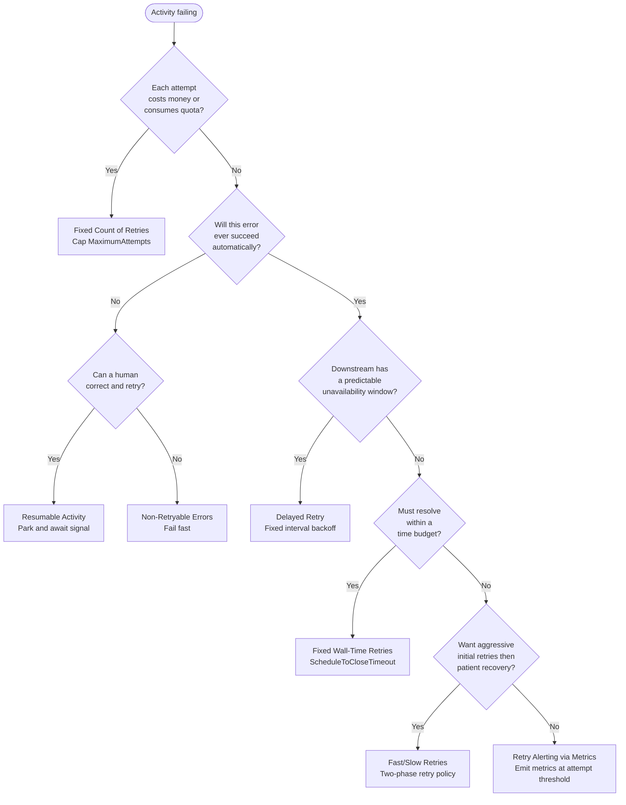

import PatternCards from '@site/src/components/PatternCards';

These patterns control how Temporal retries Activities, surfaces persistent failures, and recovers from errors that require human intervention.

## Patterns in this section

<PatternCards items={[
  {
    href: "/design-patterns/fixed-count-retries",
    icon: "fixed-count-retries-icon.svg",
    title: "Fixed Count of Retries",
    description: "Caps the number of Activity retry attempts to control cost when each attempt consumes a paid or limited resource.",
  },
  {
    href: "/design-patterns/fixed-wall-time-retries",
    icon: "fixed-wall-time-retries-icon.svg",
    title: "Fixed Wall-Time Retries",
    description: "Bounds the total elapsed time across all retry attempts to enforce a business SLA, regardless of how many attempts occur.",
  },
  {
    href: "/design-patterns/non-retryable-errors",
    icon: "non-retryable-errors-icon.svg",
    title: "Non-Retryable Errors",
    description: "Marks error types that will never succeed — such as validation failures or missing records — so Temporal fails fast instead of retrying.",
  },
  {
    href: "/design-patterns/delayed-retry",
    icon: "delayed-retry-icon.svg",
    title: "Delayed Retry",
    description: "Override the next retry interval for a specific failure using nextRetryDelay on ApplicationFailure. Use when an error carries information about how long to wait before retrying.",
  },
  {
    href: "/design-patterns/fast-slow-retries",
    icon: "fast-slow-retries-icon.svg",
    title: "Fast/Slow Retries",
    description: "Retries aggressively with a short interval first, then shifts to a long interval when fast retries are exhausted, keeping the Workflow alive until the downstream system recovers.",
  },
  {
    href: "/design-patterns/retry-metrics",
    icon: "retry-metrics-icon.svg",
    title: "Retry Alerting via Metrics",
    description: "Emits a custom metric from inside the Activity when the attempt count crosses a threshold, surfacing silent persistent failures to on-call teams before an SLA breach.",
  },
  {
    href: "/design-patterns/resumable-activity",
    icon: "resumable-activity-icon.svg",
    title: "Resumable Activity",
    description: "Parks the Workflow after retries are exhausted and waits for a human to correct the data or approve continuing, then resumes from where it left off.",
  },
]} />

## Choosing a pattern

The following decision tree helps you select the appropriate retry strategy for your use case.

The following describes each decision point:

1. If each attempt consumes a paid API call, a rate-limited token, or another scarce resource, use **Fixed Count of Retries** to cap total consumption.
2. If the error is structural — a missing record, invalid input, or authorization failure — and cannot be corrected automatically, ask whether a human can fix it: if so, use **Resumable Activity** to park the Workflow and await a correction signal; otherwise use **Non-Retryable Errors** to fail fast.
3. If the downstream system has a scheduled maintenance window and you know approximately how long it will be unavailable, use **Delayed Retry** with a fixed interval.
4. If the process must resolve (one way or another) within a business SLA window such as 24 hours, use **Fixed Wall-Time Retries** with `ScheduleToCloseTimeout`.
5. If you want to recover from transient errors quickly but also wait indefinitely for the downstream system to come back, use **Fast/Slow Retries**.
6. For any long-running retry scenario, add **Retry Alerting via Metrics** to surface persistent failures before they breach an SLA.

## How Temporal retries work

Temporal's default `RetryPolicy` retries Activities indefinitely with exponential backoff.
Unless you configure a policy, a failing Activity will keep retrying until the `ScheduleToCloseTimeout` or the Workflow itself completes.

The key `RetryPolicy` fields are:

| Field | Default | Effect |
| :--- | :--- | :--- |
| `MaximumAttempts` | 0 (unlimited) | Caps total attempts including the first |
| `InitialInterval` | 1 second | Delay before the first retry |
| `BackoffCoefficient` | 2.0 | Multiplier applied after each retry |
| `MaximumInterval` | 100× InitialInterval | Upper bound on the backoff delay |
| `NonRetryableErrorTypes` | `[]` | Error types that skip retries entirely |

`ScheduleToCloseTimeout` is set on the Activity call options, not in `RetryPolicy`.
It caps the total wall-clock time from when the Activity is first scheduled to when it must complete — across all retry attempts.

## Related sections

- [External Interaction Patterns](/design-patterns/external-interaction-patterns) — heartbeating, polling, and approval gates for the external calls that fail
- [Distributed Transaction Patterns](/design-patterns/distributed-transaction-patterns) — compensate completed steps when retries finally give up
- [Performance & Latency Patterns](/design-patterns/performance-latency-patterns) — where retry configuration fits in the latency budget

## References

- [Temporal Retry Policies](https://docs.temporal.io/encyclopedia/retry-policies)
- [Understanding Workflow Retries and Failures](https://community.temporal.io/t/understanding-workflow-retries-and-failures/122)
- [Failure Handling in Practice](https://temporal.io/blog/failure-handling-in-practice)
