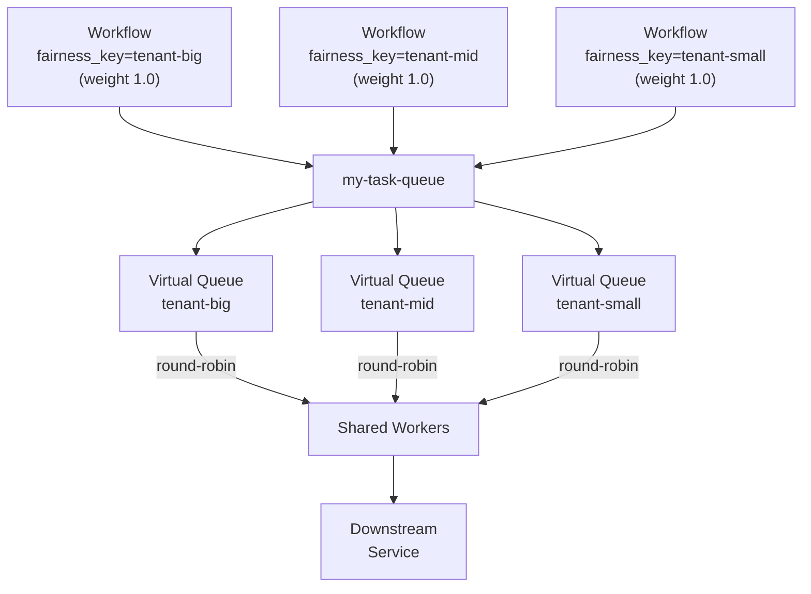

import Tabs from '@theme/Tabs';
import TabItem from '@theme/TabItem';

:::info[TLDR]
Assign a `FairnessKey` and weight to Workflows and Activities so each tenant or group receives the **correct proportional share of Worker capacity** on a shared Task Queue. Use this when a high-volume caller would otherwise starve other tenants without requiring separate queues per tenant.
:::

## Overview

The Fairness pattern distributes Worker capacity proportionally across tenants or user groups within a single Task Queue so that a burst from one caller cannot starve others. Each group is assigned a fairness key and an optional weight; the Temporal matching service dispatches tasks in weighted round-robin order across all keys.

## Problem

When multiple tenants (e.g. customers) share a single Task Queue, a high-volume tenant can fill the queue and occupy all Worker slots. Other tenants receive no service until the dominant tenant's backlog drains. This starvation violates throughput guarantees and makes latency for lower-volume tenants unpredictable under burst conditions.

The classic workaround—assigning one Task Queue per tenant—scales poorly: each new tenant requires a new Worker deployment, idle capacity on low-traffic tenants cannot be used by busy ones, and queue management complexity grows with tenant count.

## Solution

Temporal's native Fairness feature lets you assign a `FairnessKey` (a string identifier such as a tenant name or tier) and an optional `FairnessWeight` (a positive float, default 1.0) to Workflows, Activities, and Child Workflows. The Temporal matching service creates a virtual queue for each key and dispatches tasks in proportion to their weights. A single shared Worker pool serves all keys; no extra queues or routing logic is required.

For example, assigning weights of 5.0, 3.0, and 2.0 to `premium`, `basic`, and `free` tiers causes 50% of dispatched tasks to come from `premium`, 30% from `basic`, and 20% from `free`—regardless of backlog depth. Within a single fairness key, tasks are dispatched in FIFO order.



The following describes each step in the diagram:

1. Workflows start with a `FairnessKey` matching the tenant or group identity.
2. The Temporal matching service routes each task to the corresponding virtual queue inside the single Task Queue.
3. Workers poll the Task Queue and receive tasks in weighted round-robin order across all fairness keys.
4. Tenant-big's large backlog does not prevent tenant-mid or tenant-small from receiving service.

## Implementation

### Enable fairness

**Temporal Cloud:** Navigate to the Namespace's Overview page in the UI and activate the Fairness toggle. Fairness is a paid feature in Temporal Cloud.

**Self-hosted Temporal:** Set `matching.enableFairness` to `true` in the [dynamic config](https://docs.temporal.io/temporal-service/configuration#dynamic-configuration) for the relevant Task Queues or Namespaces.

### Set fairness key and weight at Workflow start

<Tabs groupId="language" queryString>
<TabItem value="python" label="Python">

```python
from temporalio.common import Priority

handle = await client.start_workflow(
    ProcessOrder.run,
    id="process-order-wf",
    task_queue="my-task-queue",
    priority=Priority(
        fairness_key="tenant-a",
        fairness_weight=2.0,
    ),
)
```

</TabItem>
<TabItem value="go" label="Go">

```go
we, err := c.ExecuteWorkflow(
    context.Background(),
    client.StartWorkflowOptions{
        ID:        "process-order-wf",
        TaskQueue: "my-task-queue",
        Priority: temporal.Priority{
            FairnessKey:    "tenant-a",
            FairnessWeight: 2.0,
        },
    },
    ProcessOrder,
)
```

</TabItem>
<TabItem value="java" label="Java">

```java
WorkflowOptions options = WorkflowOptions.newBuilder()
    .setWorkflowId("process-order-wf")
    .setTaskQueue("my-task-queue")
    .setPriority(Priority.newBuilder()
        .setFairnessKey("tenant-a")
        .setFairnessWeight(2.0f)
        .build())
    .build();
ProcessOrder workflow = client.newWorkflowStub(ProcessOrder.class, options);
WorkflowClient.start(workflow::run);
```

</TabItem>
</Tabs>

### Set fairness key and weight on Activities

Activities inherit the parent Workflow's fairness key and weight. Override them in `ActivityOptions` when an Activity should belong to a different fairness group than its Workflow. Each field (`priority_key`, `fairness_key`, `fairness_weight`) is resolved independently in this order: Task Queue weight overrides (highest precedence), value set explicitly in the options, value inherited from the calling Workflow, then the default. Workflows started with Continue-As-New inherit the current execution's priority values unless you pass explicit values. See [Inheritance](https://docs.temporal.io/develop/task-queue-priority-fairness#inheritance) in the Temporal docs for the full resolution diagram.

<Tabs groupId="language" queryString>
<TabItem value="python" label="Python">

```python
from temporalio.common import Priority

# inside the workflow
result = await workflow.execute_activity(
    process_for_tenant,
    tenant_request,
    start_to_close_timeout=timedelta(minutes=1),
    priority=Priority(
        fairness_key="tenant-a",
        fairness_weight=2.0,
    ),
)
```

</TabItem>
<TabItem value="go" label="Go">

```go
ao := workflow.ActivityOptions{
    StartToCloseTimeout: time.Minute,
    Priority: temporal.Priority{
        FairnessKey:    "tenant-a",
        FairnessWeight: 2.0,
    },
}
ctx = workflow.WithActivityOptions(ctx, ao)
err := workflow.ExecuteActivity(ctx, ProcessForTenant, req).Get(ctx, nil)
```

</TabItem>
<TabItem value="java" label="Java">

```java
ActivityOptions options = ActivityOptions.newBuilder()
    .setStartToCloseTimeout(Duration.ofMinutes(1))
    .setPriority(Priority.newBuilder()
        .setFairnessKey("tenant-a")
        .setFairnessWeight(2.0f)
        .build())
    .build();
TenantActivity activity = Workflow.newActivityStub(TenantActivity.class, options);
activity.processForTenant(request);
```

</TabItem>
</Tabs>

### Set queue-level and per-key rate limits via CLI

You can rate-limit the entire Task Queue and set a default per-fairness-key limit. The per-key limit is scaled by the fairness weight for that key, so a key with weight 2.5 and a default per-key limit of 10 gets an effective limit of 25 tasks/second.

```sh
temporal task-queue config set \
  --task-queue my-task-queue \
  --task-queue-type activity \
  --namespace my-namespace \
  --queue-rps-limit 500 \
  --queue-rps-limit-reason "overall limit" \
  --fairness-key-rps-limit-default 33.3 \
  --fairness-key-rps-limit-reason "per-key limit"
```

### Override fairness weights via CLI

When it is more convenient to manage weights through configuration than to embed them in client code, you can override weights for up to 1000 keys per Task Queue. Overrides take precedence over the weight attached to a task's options and can be updated without a code deploy.

```sh
temporal task-queue config set \
  --task-queue my-task-queue \
  --task-queue-type workflow \
  --namespace my-namespace \
  --fairness-key-weight premium=5.0 \
  --fairness-key-weight basic=3.0 \
  --fairness-key-weight free=2.0
```

### Use priority and fairness together

Priority and Fairness can be combined. Priority determines which sub-queue (1–5) a task enters; Fairness determines the dispatch order within each priority level. Set both `PriorityKey` and `FairnessKey` on the same options object.

<Tabs groupId="language" queryString>
<TabItem value="python" label="Python">

```python
from temporalio.common import Priority

handle = await client.start_workflow(
    ChargeCustomer.run,
    id="charge-customer-wf",
    task_queue="my-task-queue",
    priority=Priority(
        priority_key=1,
        fairness_key="tenant-a",
        fairness_weight=2.0,
    ),
)
```

</TabItem>
<TabItem value="go" label="Go">

```go
we, err := c.ExecuteWorkflow(
    context.Background(),
    client.StartWorkflowOptions{
        ID:        "charge-customer-wf",
        TaskQueue: "my-task-queue",
        Priority: temporal.Priority{
            PriorityKey:    1,
            FairnessKey:    "tenant-a",
            FairnessWeight: 2.0,
        },
    },
    ChargeCustomer,
)
```

</TabItem>
<TabItem value="java" label="Java">

```java
WorkflowOptions options = WorkflowOptions.newBuilder()
    .setWorkflowId("charge-customer-wf")
    .setTaskQueue("my-task-queue")
    .setPriority(Priority.newBuilder()
        .setPriorityKey(1)
        .setFairnessKey("tenant-a")
        .setFairnessWeight(2.0f)
        .build())
    .build();
```

</TabItem>
</Tabs>

## When to use

This pattern is a good fit for multi-tenant applications where large tenants should not block small tenants, for workloads that need proportional capacity allocation across groups without hard rate limits, and when the set of tenants or groups is dynamic (new keys can be introduced without deploying new Workers). For a broader look at multi-tenancy strategies in Temporal, see [Multi-Tenant Patterns](https://docs.temporal.io/production-deployment/multi-tenant-patterns).

It is not a good fit when absolute throughput isolation is required (dedicated queues per tenant remain or [task queue priorities](/design-patterns/priority-task-queues) are the appropriate choice).

## Benefits and trade-offs

A single Worker pool serves all tenants; idle capacity from a low-traffic tenant automatically benefits high-traffic tenants rather than going to waste. New tenants require no Worker deployment—add a fairness key and Temporal starts dispatching their tasks immediately. Weights can be updated via CLI without redeploying application code.

Fairness requires explicit enablement on Temporal Cloud and self-hosted deployments. Accuracy can degrade with a very large number of fairness keys. Fairness weight applies at schedule time, not dispatch time: changing a weight does not retroactively reorder tasks already in the backlog.

## Comparison with alternatives

| Approach | Tenant isolation | Dynamic tenants | Shares idle capacity | Complexity |
| :--- | :--- | :--- | :--- | :--- |
| Temporal FairnessKey (native) | Soft | Yes | Yes | Low |
| Dedicated queue per tenant | Hard | No | No | Medium |
| Single shared queue (no control) | None | Yes | Yes | Lowest |
| External queue with per-tenant consumer groups | Hard | Yes | No | High |

## Best practices

- **Use stable, consistent naming for fairness keys.** Use account IDs or tenant slugs rather than display names. Key names cannot be changed retroactively on tasks already in the backlog.
- **Combine Priority and Fairness for multi-class, multi-tenant workloads.** Priority separates urgent from batch work; Fairness prevents any single tenant from dominating within each priority level.
- **Monitor queue depth by fairness key.** Sustained backlog growth for a particular key means its weight fraction of Worker capacity cannot drain its submission rate.

## Common pitfalls

- **Expecting Fairness to reorder the existing backlog.** Fairness weight is evaluated at schedule time. Enabling Fairness on a Namespace with an existing backlog drains that backlog in its original order first; the fairness-aware dispatch mode takes effect only for newly submitted tasks.
- **Using Fairness as a hard rate limiter.** Fairness controls proportional dispatch but does not cap the absolute throughput of any one key. For hard throughput caps, combine Fairness with per-fairness-key RPS limits via the CLI.
- **Unkeyed tasks bypassing Fairness.** Tasks without a `FairnessKey` are grouped under an implicit empty-string key and participate in round-robin dispatch alongside named keys with a weight of 1.0. They do not bypass Fairness and compete as one group.
- **Task Queue partitioning reducing accuracy.** Task Queues are internally partitioned and tasks are distributed to partitions randomly, which can interfere with fair dispatch proportions. If your workload requires higher accuracy, contact Temporal Support to configure a single-partition Task Queue.
- **Assuming Fairness applies across Worker Versioning boundaries.** When using Worker Versioning and moving Workflows between versions, Priority still applies across versions but Fairness is only guaranteed within tasks originally queued on the same Worker version. Tasks moved from one version to another may not dispatch in fairness order relative to tasks on the destination version.
- **Expecting consistent fairness immediately after a server restart.** Fairness ordering is preserved across restarts for the most active keys. Less active keys may briefly dispatch new tasks ahead of their existing backlog until ordering normalizes.
- **Expecting the running task mix to immediately reflect fair dispatch.** Fairness governs which task is dispatched next; it does not account for tasks already running on Workers. The mix of in-flight tasks at any moment may not match the configured weight ratios.

## Related patterns

- **[Priority Task Queues](/design-patterns/priority-task-queues)**: Order tasks by urgency level within the same Task Queue using `PriorityKey`.
- **[Downstream Rate Limiting](/design-patterns/downstream-rate-limiting)**: Cap absolute throughput to a downstream service with a queue RPS setting.
- **[Worker-Specific Task Queues](/design-patterns/worker-specific-taskqueue)**: Route Activities to a specific Worker host for resource or data affinity.
