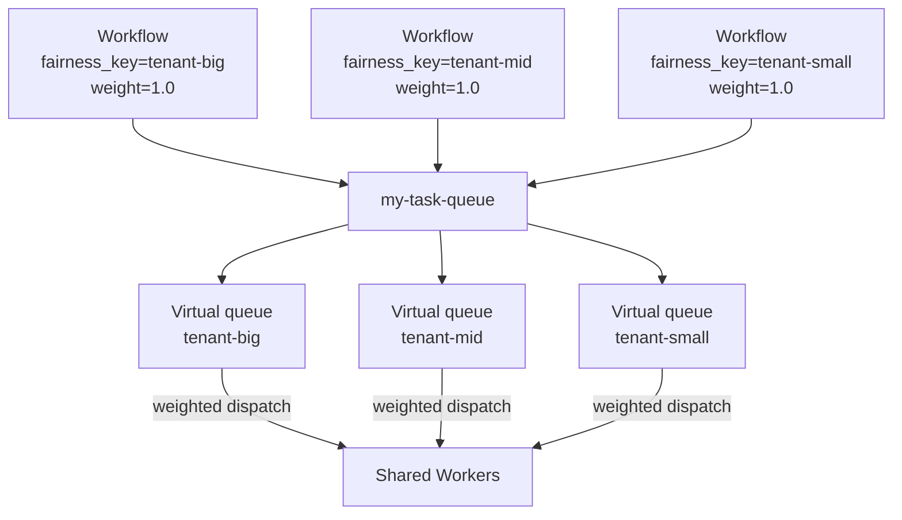

:::info[TLDR]
Assign a Fairness key and weight to Workflows and Activities so each tenant or group receives a proportional share of Task dispatches on a shared Task Queue. Use this when a high-volume caller would otherwise starve other tenants, without requiring a separate Task Queue per tenant.
:::

## Overview

The Fairness pattern distributes Task dispatches proportionally across tenants or user groups within a shared Task Queue so that a burst from one caller cannot starve others. Each group has a Fairness key and an optional weight. The Matching Service uses weighted fair dispatch to select the next Task within a Priority level.

Fairness applies only to Task dispatch. It does not account for Task duration or resource use.

## Problem

When multiple tenants, such as customers, share a Task Queue, a high-volume tenant can fill the backlog and dominate dispatch. Tasks from other tenants can wait behind that backlog, making their latency unpredictable during bursts.

The classic workaround is one Task Queue per tenant. This adds Task Queue, Worker, and routing configuration for every tenant. It can also strand idle capacity when Workers are dedicated to individual tenants.

## Solution

Temporal's Fairness feature lets you assign a Fairness key, such as a tenant name or tier, and an optional Fairness weight to Workflows, Activities, and Child Workflows. A useful mental model is one virtual queue per Fairness key, with weighted round-robin dispatch across the queues. Temporal approximates this model with stride scheduling and a count-min sketch for larger key sets. A single shared Worker pool serves all keys, with no extra queues or routing logic.

For example, assigning weights of 5.0, 3.0, and 2.0 causes approximately 50% of dispatched Tasks to come from `premium`, 30% from `basic`, and 20% from `free` when all three groups have backlogged Tasks. Within a Fairness key, Tasks at the same priority are dispatched in first-in-first-out (FIFO) order.

```mermaid
flowchart TD
    WA["Workflow\nfairness_key=tenant-big\nweight=1.0"] --> TQ["my-task-queue"]
    WB["Workflow\nfairness_key=tenant-mid\nweight=1.0"] --> TQ
    WC["Workflow\nfairness_key=tenant-small\nweight=1.0"] --> TQ
    TQ --> VQ1["Virtual queue\ntenant-big"]
    TQ --> VQ2["Virtual queue\ntenant-mid"]
    TQ --> VQ3["Virtual queue\ntenant-small"]
    VQ1 -->|weighted dispatch| W["Shared Workers"]
    VQ2 -->|weighted dispatch| W
    VQ3 -->|weighted dispatch| W
```

The following describes each step in the diagram:

1. Workflows start with a Fairness key that identifies their tenant or group.
2. Tasks with the same Fairness key enter the same virtual queue.
3. When multiple virtual queues have backlogged Tasks, the Matching Service uses weighted round robin to choose between them.
4. One virtual queue can use all available dispatches when the others have no backlogged Tasks.

## Implementation

Fairness must be enabled for the Namespace. Set Fairness keys and weights on Workflows, Activities, or Child Workflows. Activities and Child Workflows inherit these values unless you override them.

See [Task Queue Priority and Fairness](/develop/task-queue-priority-fairness#task-queue-fairness) for setup, SDK examples, inheritance, Task Queue configuration, and limitations.

## When to use

This pattern is a good fit for multi-tenant applications where large tenants should not block small tenants, for workloads that need proportional Task dispatch across groups without hard rate limits, and when the set of tenants or groups is dynamic. New Fairness keys can be introduced without deploying new Workers. For a broader look at multi-tenancy strategies in Temporal, see [Multi-Tenant Patterns](/best-practices/multi-tenant-patterns).

Fairness does not provide exact dispatch ratios, concurrency limits, or compute isolation. Use Activity Task Queue rate limits for throughput caps. Use separate Task Queues with dedicated Worker pools and compute resources for hard isolation. Use Priority to order urgent work ahead of less urgent work.

## Benefits and trade-offs

A single Worker pool serves all tenants, so idle capacity from a low-traffic tenant is available to high-traffic tenants. New tenants require no Worker deployment. Add a Fairness key and Temporal starts dispatching their Tasks. Fairness weights can be updated through Task Queue configuration without redeploying application code.

Fairness is best effort. Dispatch ratios can vary across Task Queue partitions, Worker Versioning, and short time windows. Accuracy can degrade with a large number of Fairness keys. Fairness weights apply when Tasks are scheduled, so changing a weight does not reorder Tasks already in the backlog. Tasks with different runtimes can consume different amounts of Worker capacity even when their dispatch shares match their weights.

## Comparison with alternatives

| Approach | Per-tenant dispatch | Dynamic tenants | Shares idle capacity | Complexity |
| :--- | :--- | :--- | :--- | :--- |
| Temporal Fairness (native) | Weighted fair dispatch | Yes | Yes | Low |
| Dedicated Task Queue per tenant | Separate | No | No | Medium |
| Single shared Task Queue (no control) | None | Yes | Yes | Lowest |
| External queue with per-tenant consumer groups | Separate | Yes | No | High |

## Best practices

- **Use stable, consistent Fairness keys.** Use account identifiers or tenant slugs instead of display names. Key changes do not reorder Tasks already in the backlog.
- **Combine Priority and Fairness for multi-class, multi-tenant workloads.** Priority separates urgent work from batch work. Fairness prevents a single tenant from dominating within each Priority level.

## Common pitfalls

- **Expecting exact ratios.** Weights shape dispatch proportions over time when multiple groups have backlogs. Results vary across partitions and short time windows.
- **Expecting Fairness to reorder the backlog.** Temporal records each Task's Fairness weight when the Task is scheduled. Enabling Fairness or changing weights affects only newly scheduled Tasks.
- **Expecting Tasks without a Fairness key to bypass Fairness.** These Tasks share an implicit empty-string key with a weight of 1.0.
- **Expecting Fairness across Task Queue partitions.** Each partition calculates Fairness independently. Imbalanced partitions can change overall dispatch proportions.
- **Expecting Fairness across Worker Deployment Versions.** Each version has a separate backlog. Fairness applies within each version's backlog.
- **Expecting Fairness state to be fully restored after a server restart.** By default, Temporal restores state for up to 100 Fairness keys. Other keys rebuild state as Tasks arrive.
- **Treating Fairness as Worker capacity control.** Fairness considers only dispatch. A group with longer-running Tasks can consume more Worker time than its dispatch share suggests.
- **Using Fairness as a hard rate limiter.** Fairness by itself doesn't cap throughput. Use [Fairness key rate limits](/develop/task-queue-priority-fairness#set-rate-limits-at-the-task-queue-level) for per-key limits.
- **Expecting every Task to pass through fair dispatch.** Synchronous matching can send a Task directly to an idle poller. [Eager Task Execution](/develop/worker-performance#eager-task-execution) bypasses matching.

## Related

### Patterns

- **[Priority](/design-patterns/priority-task-queues)**: Order Task dispatches by urgency within the same Task Queue using a Priority key.
- **[Downstream Rate Limiting](/design-patterns/downstream-rate-limiting)**: Cap dispatch throughput to a downstream service with a Task Queue RPS setting.
- **[Worker-Specific Task Queues](/design-patterns/worker-specific-taskqueue)**: Route Activities to a specific Worker host for resource or data affinity.
