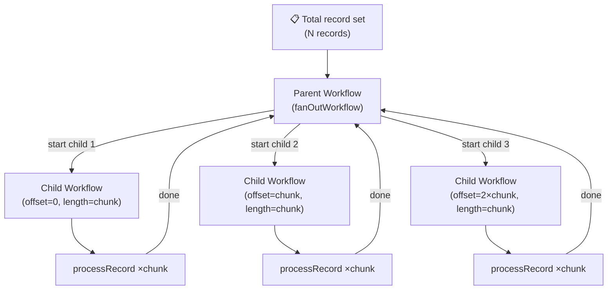

import Tabs from '@theme/Tabs';
import TabItem from '@theme/TabItem';

:::info[TLDR]
Split your record set into fixed-size chunks and start **one child Workflow per chunk** so that each chunk's history stays within Temporal's limits. Use this when you want maximum concurrency with no rate control and you can pre-compute how many chunks you need before the job starts. Keep the number of in-flight children per parent well under the default limit of 2,000; use [Sliding Window](/design-patterns/sliding-window) or [Batch Iterator](/design-patterns/batch-iterator) for larger workloads.
:::

## Overview

The Fan-Out pattern distributes a large record set across multiple independent child Workflows, each responsible for processing a fixed-size chunk. The parent Workflow assigns work by offset and length so that no record IDs need to be passed over the wire — only two integers per child.

## Problem

A single Workflow run can have at most 2,000 in-flight Activities (aim for 500) and at most 50,000 history events. Processing millions of records in a single Workflow run is therefore not possible.

You need a way to partition a large record set, process each partition independently, and coordinate the overall job while keeping each Workflow's history within safe bounds.

## Solution

You split the total record count into fixed-size chunks and start one child Workflow per chunk. Each child is given an `offset` and a `length` so it knows which slice of the record set to fetch and process independently.

The parent Workflow starts all children concurrently and waits for them all to complete. If a child fails the parent can retry that child without re-processing the records handled by other children.



The following describes each step in the diagram:

1. The parent Workflow receives the total record count and a configured chunk size.
2. It divides the total into chunks and starts one child Workflow per chunk, passing only `offset` and `length`.
3. Each child independently fetches its slice of records (using the offset and length) and calls `processRecord` for each one.
4. Each child completes and returns its result to the parent.
5. The parent blocks until all children have completed, then returns the aggregated result.

## Implementation

The following examples show how each SDK implements the Fan-Out pattern.

<Tabs groupId="language" queryString>
<TabItem value="typescript" label="TypeScript">

```typescript
// workflows.ts
import {
  executeChild,
  proxyActivities,
  workflowInfo,
} from "@temporalio/workflow";
import type * as activities from "./activities";
import { TASK_QUEUE, CHUNK_SIZE } from "./shared";

const { processRecord } = proxyActivities<typeof activities>({
  startToCloseTimeout: "10 seconds",
});

export async function fanOutWorkflow(
  totalRecords: number,
  chunkSize: number = CHUNK_SIZE
): Promise<number> {
  const children: Promise<number>[] = [];

  for (let offset = 0; offset < totalRecords; offset += chunkSize) {
    const length = Math.min(chunkSize, totalRecords - offset);
    children.push(
      executeChild(recordBatchWorkflow, {
        args: [offset, length],
        taskQueue: TASK_QUEUE,
        workflowId: `${workflowInfo().workflowId}/batch-${offset}`,
      })
    );
  }

  const results = await Promise.all(children);
  return results.reduce((sum, n) => sum + n, 0);
}

export async function recordBatchWorkflow(
  offset: number,
  length: number
): Promise<number> {
  let processed = 0;
  for (let i = offset; i < offset + length; i++) {
    await processRecord(i);
    processed++;
  }
  return processed;
}
```

</TabItem>
<TabItem value="python" label="Python">

```python
# workflows.py
from datetime import timedelta
from temporalio import workflow
from temporalio.workflow import ChildWorkflowHandle
import asyncio
from activities import process_record
from shared import TASK_QUEUE, CHUNK_SIZE


@workflow.defn
class RecordBatchWorkflow:
    @workflow.run
    async def run(self, offset: int, length: int) -> int:
        processed = 0
        for i in range(offset, offset + length):
            await workflow.execute_activity(
                process_record,
                i,
                start_to_close_timeout=timedelta(seconds=10),
            )
            processed += 1
        return processed


@workflow.defn
class FanOutWorkflow:
    @workflow.run
    async def run(self, total_records: int, chunk_size: int = CHUNK_SIZE) -> int:
        handles: list[ChildWorkflowHandle] = []
        parent_id = workflow.info().workflow_id

        offset = 0
        while offset < total_records:
            length = min(chunk_size, total_records - offset)
            handle = await workflow.start_child_workflow(
                RecordBatchWorkflow.run,
                args=[offset, length],
                id=f"{parent_id}/batch-{offset}",
                task_queue=TASK_QUEUE,
            )
            handles.append(handle)
            offset += chunk_size

        results = await asyncio.gather(*handles)
        return sum(results)
```

</TabItem>
<TabItem value="go" label="Go">

```go
// workflows.go
package main

import (
	"fmt"
	"time"

	"go.temporal.io/sdk/workflow"
)

func FanOutWorkflow(ctx workflow.Context, totalRecords int, chunkSize int) (int, error) {
	if chunkSize <= 0 {
		chunkSize = ChunkSize
	}

	var futures []workflow.Future
	parentID := workflow.GetInfo(ctx).WorkflowExecution.ID

	for offset := 0; offset < totalRecords; offset += chunkSize {
		length := chunkSize
		if offset+chunkSize > totalRecords {
			length = totalRecords - offset
		}
		off := offset // capture loop variable
		cwo := workflow.ChildWorkflowOptions{
			WorkflowID: parentID + "/batch-" + fmt.Sprintf("%d", off),
			TaskQueue:  TaskQueue,
		}
		cctx := workflow.WithChildOptions(ctx, cwo)
		futures = append(futures, workflow.ExecuteChildWorkflow(cctx, RecordBatchWorkflow, off, length))
	}

	total := 0
	for _, f := range futures {
		var n int
		if err := f.Get(ctx, &n); err != nil {
			return total, err
		}
		total += n
	}
	return total, nil
}

func RecordBatchWorkflow(ctx workflow.Context, offset int, length int) (int, error) {
	ao := workflow.ActivityOptions{
		StartToCloseTimeout: 10 * time.Second,
	}
	ctx = workflow.WithActivityOptions(ctx, ao)

	processed := 0
	for i := offset; i < offset+length; i++ {
		if err := workflow.ExecuteActivity(ctx, ProcessRecord, i).Get(ctx, nil); err != nil {
			return processed, err
		}
		processed++
	}
	return processed, nil
}
```

</TabItem>
<TabItem value="java" label="Java">

```java
// FanOutWorkflow.java
import io.temporal.activity.ActivityOptions;
import io.temporal.workflow.*;
import java.time.Duration;
import java.util.ArrayList;
import java.util.List;

@WorkflowInterface
public interface FanOutWorkflow {
    @WorkflowMethod
    int run(int totalRecords, int chunkSize);
}

// FanOutWorkflowImpl.java
public class FanOutWorkflowImpl implements FanOutWorkflow {
    @Override
    public int run(int totalRecords, int chunkSize) {
        if (chunkSize <= 0) chunkSize = Shared.CHUNK_SIZE;

        List<Promise<Integer>> promises = new ArrayList<>();
        String parentId = Workflow.getInfo().getWorkflowId();

        for (int offset = 0; offset < totalRecords; offset += chunkSize) {
            int length = Math.min(chunkSize, totalRecords - offset);
            ChildWorkflowOptions opts = ChildWorkflowOptions.newBuilder()
                .setWorkflowId(parentId + "/batch-" + offset)
                .setTaskQueue(Shared.TASK_QUEUE)
                .build();
            RecordBatchWorkflow child = Workflow.newChildWorkflowStub(RecordBatchWorkflow.class, opts);
            promises.add(Async.function(child::run, offset, length));
        }

        int total = 0;
        for (Promise<Integer> p : promises) {
            total += p.get();
        }
        return total;
    }
}

// RecordBatchWorkflow.java
@WorkflowInterface
public interface RecordBatchWorkflow {
    @WorkflowMethod
    int run(int offset, int length);
}

// RecordBatchWorkflowImpl.java
public class RecordBatchWorkflowImpl implements RecordBatchWorkflow {
    private final Activities activities = Workflow.newActivityStub(
        Activities.class,
        ActivityOptions.newBuilder()
            .setStartToCloseTimeout(Duration.ofSeconds(10))
            .build()
    );

    @Override
    public int run(int offset, int length) {
        int processed = 0;
        for (int i = offset; i < offset + length; i++) {
            activities.processRecord(i);
            processed++;
        }
        return processed;
    }
}
```

</TabItem>
</Tabs>

## Best practices

- **Use offset and length, not explicit IDs.** Pass only two integers to each child rather than a full slice of IDs. The child fetches its own records. This keeps history events small.
- **Size chunks to stay under the Activity limit.** Each child Workflow can have at most 2,000 in-flight Activities. Aim for chunks of 500 records or fewer if each record maps to one Activity.
- **Cap concurrent children in the parent.** Starting thousands of child Workflows simultaneously puts pressure on the namespace. Consider batching child starts or using [Sliding Window](/design-patterns/sliding-window) if you need tighter concurrency control.
- **Set `PARENT_CLOSE_POLICY_ABANDON`** for fire-and-forget fan-outs where the parent does not need to collect results. With the default `TERMINATE` policy, cancelling or timing out the parent will terminate all in-flight children.
- **Give each child a deterministic Workflow ID** (`parentId/batch-<offset>`). This makes it safe to re-run the parent: Temporal deduplicates child starts by Workflow ID, so already-completed children are not re-executed.

## Common pitfalls

- **Starting too many children at once.** Each child start adds to the parent's history. Temporal enforces a default limit of 2,000 pending (in-flight) child Workflows per parent; keep well under it. See [Temporal guidance](https://docs.temporal.io/workflows#when-to-use-child-workflows). If you need more children, switch to [MapReduce Tree](/design-patterns/mapreduce-tree) or [Sliding Window](/design-patterns/sliding-window).
- **Passing large lists of IDs.** Workflow inputs are stored in event history. Passing millions of record IDs as a list will blow the history size limit. Use offset + length instead.
- **Ignoring child failures.** A failed child does not automatically fail the parent unless you await all results. Always await child handles and handle errors explicitly.

## Related resources

- [Child Workflows pattern](/design-patterns/child-workflows) — core concepts for parent/child Workflow coordination
- [Batch Iterator](/design-patterns/batch-iterator) — unbounded record sets with Continue-as-New pagination
- [Sliding Window](/design-patterns/sliding-window) — bounded concurrency with maximum throughput
- [Temporal limits reference](https://docs.temporal.io/cloud/limits)
