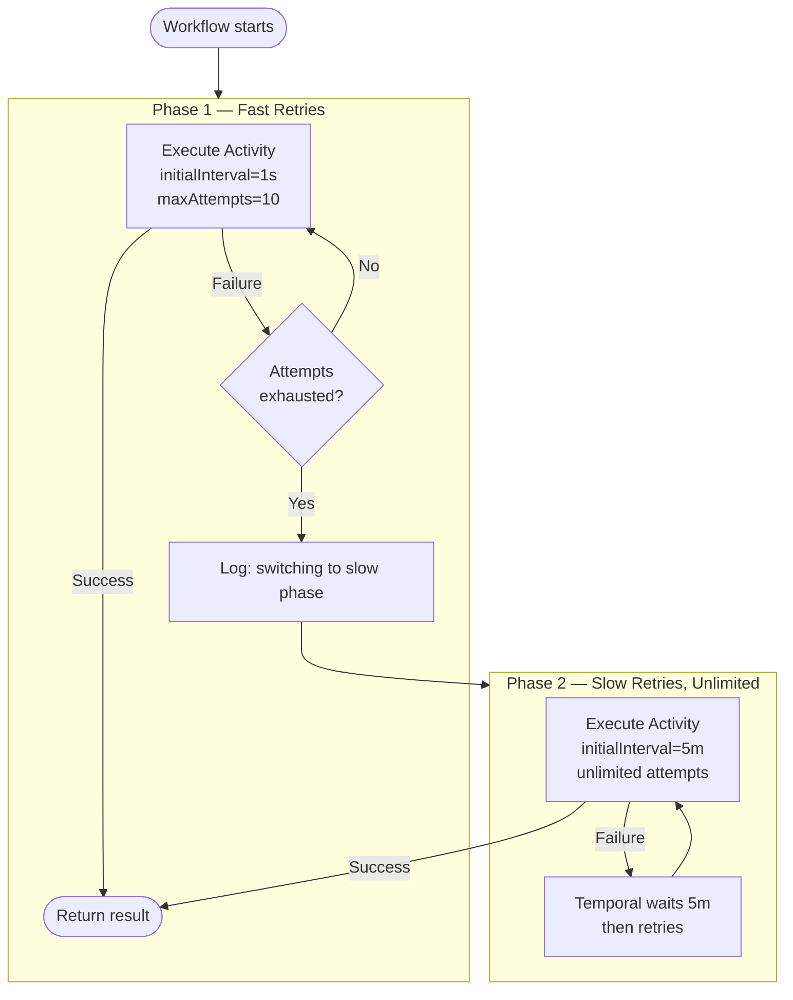

import Tabs from '@theme/Tabs';
import TabItem from '@theme/TabItem';

:::info[TLDR]
Orchestrate two retry phases in the Workflow: a fast phase with short intervals and bounded attempts for transient errors, followed by a slow phase with long intervals and unlimited retries for extended outages. **Use this when a single `RetryPolicy` should not cover both brief blips and hour-long outages or maintenance windows.**
:::

## Overview

The Fast/Slow Retries pattern runs an Activity through two distinct retry phases: a fast phase with a short interval and bounded attempt count, followed by an unlimited slow phase with a long fixed interval managed by the Temporal Service.
Use it when transient errors are common and worth recovering from quickly, but the downstream system may also suffer extended outages that require patient, indefinite waiting.

## Problem

Conventional retry policies force you to choose between:

- **Low `MaximumAttempts`**: Recovers from transient errors quickly but abandons the request when the downstream system has a longer outage.
- **Unlimited or High `MaximumAttempts` with short interval**: Floods a degraded downstream system with retries and accumulates noisy failures in logs. Incurs processing cost with each attempt.
- **Long fixed interval with unlimited retries**: Recovers from outages eventually, but is too slow to recover from transient errors that would have resolved in seconds.

None of these options handles both scenarios well — a downstream system that sometimes has brief 503 errors *and* occasionally goes down for an extended maintenance window.

## Solution

Use the Workflow itself as a retry orchestrator across two phases:

**Phase 1 — Fast retries**: Execute the Activity with a short `InitialInterval` and a bounded `MaximumAttempts`. This phase recovers from transient errors within seconds or minutes.

**Phase 2 — Slow retries**: When the fast retry policy is exhausted, catch the `ActivityError` in the Workflow and execute the Activity again with a long `InitialInterval` and unlimited `MaximumAttempts`. The Temporal Service owns the slow retry management; the Workflow blocks until the Activity eventually succeeds.

This design is invisible in conventional retry libraries because it requires the retry orchestrator to be a durable, resumable process — exactly what a Temporal Workflow is.



The following describes each step:

1. The Workflow first tries the Activity with a fast policy: 1-second initial interval and a maximum of 10 total attempts.
2. If the Activity succeeds during the fast phase, the Workflow returns the result immediately.
3. If all fast attempts are exhausted, the Workflow logs a warning and transitions to the slow phase.
4. In the slow phase, the Workflow executes the Activity with a 5-minute fixed interval and unlimited retries. The Temporal Service manages the wait between attempts.
5. When the Activity eventually succeeds — after the downstream system recovers — the Workflow returns the result.

## Implementation

### Two-phase workflow retry management

The key change between phases is the retry interval and attempt count.
In Phase 1, the Temporal Service manages a fast set of retries: short interval, bounded attempts.
In Phase 2, the Temporal Service manages a slow set of retries: long fixed interval, unlimited attempts.

<Tabs groupId="language" queryString>
<TabItem value="python" label="Python">

```python
# workflows.py
from datetime import timedelta
from temporalio import workflow
from temporalio.common import RetryPolicy
from temporalio.exceptions import ActivityError
import activities

@workflow.defn
class FastSlowRetryWorkflow:
    @workflow.run
    async def run(self, request: str) -> str:
        # Phase 1: fast retries 
        fast_policy = RetryPolicy(
            initial_interval=timedelta(seconds=1),
            backoff_coefficient=1.5,
            maximum_interval=timedelta(seconds=30),
            maximum_attempts=10,
        )
        try:
            return await workflow.execute_activity(
                activities.call_downstream,
                request,
                start_to_close_timeout=timedelta(seconds=30),
                retry_policy=fast_policy,
            )
        except ActivityError:
            workflow.logger.warning(
                "Fast retries exhausted — switching to slow retry phase",
                extra={"request": request},
            )

            # Phase 2: slow retries 
            slow_policy = RetryPolicy(
                initial_interval=timedelta(minutes=5),
                backoff_coefficient=1.0,
            )
            return await workflow.execute_activity(
                activities.call_downstream,
                request,
                start_to_close_timeout=timedelta(seconds=30),
                retry_policy=slow_policy,
            )
```

</TabItem>
<TabItem value="go" label="Go">

```go
// workflow.go
package downstream

import (
    "time"

    "go.temporal.io/sdk/temporal"
    "go.temporal.io/sdk/workflow"
)

func FastSlowRetryWorkflow(ctx workflow.Context, request string) (string, error) {
    log := workflow.GetLogger(ctx)

    // Phase 1: fast retries 
    fastCtx := workflow.WithActivityOptions(ctx, workflow.ActivityOptions{
        StartToCloseTimeout: 30 * time.Second,
        RetryPolicy: &temporal.RetryPolicy{
            InitialInterval:    time.Second,
            BackoffCoefficient: 1.5,
            MaximumInterval:    30 * time.Second,
            MaximumAttempts:    10,
        },
    })

    var result string
    err := workflow.ExecuteActivity(fastCtx, CallDownstream, request).Get(fastCtx, &result)
    if err != nil {
        log.Warn("Fast retries exhausted — switching to slow retry phase",
            "request", request)

        // Phase 2: slow retries 
        slowCtx := workflow.WithActivityOptions(ctx, workflow.ActivityOptions{
            StartToCloseTimeout: 30 * time.Second,
            RetryPolicy: &temporal.RetryPolicy{
                InitialInterval:    5 * time.Minute,
                BackoffCoefficient: 1.0,
                // MaximumAttempts defaults to 0 (unlimited)
            },
        })

        err = workflow.ExecuteActivity(slowCtx, CallDownstream, request).Get(slowCtx, &result)
    }
    return result, err
}
```

</TabItem>
<TabItem value="java" label="Java">

```java
// FastSlowRetryWorkflowImpl.java
import io.temporal.activity.ActivityOptions;
import io.temporal.common.RetryOptions;
import io.temporal.failure.ActivityFailure;
import io.temporal.workflow.Workflow;
import java.time.Duration;

public class FastSlowRetryWorkflowImpl implements FastSlowRetryWorkflow {
    @Override
    public String run(String request) {
        // Phase 1: fast retries 
        DownstreamActivities fastActivities = Workflow.newActivityStub(
            DownstreamActivities.class,
            ActivityOptions.newBuilder()
                .setStartToCloseTimeout(Duration.ofSeconds(30))
                .setRetryOptions(RetryOptions.newBuilder()
                    .setInitialInterval(Duration.ofSeconds(1))
                    .setBackoffCoefficient(1.5)
                    .setMaximumInterval(Duration.ofSeconds(30))
                    .setMaximumAttempts(10)
                    .build())
                .build()
        );

        try {
            return fastActivities.callDownstream(request);
        } catch (ActivityFailure e) {
            Workflow.getLogger(getClass()).warn(
                "Fast retries exhausted — switching to slow retry phase: " + request
            );

            // Phase 2: slow retries 
            DownstreamActivities slowActivities = Workflow.newActivityStub(
                DownstreamActivities.class,
                ActivityOptions.newBuilder()
                    .setStartToCloseTimeout(Duration.ofSeconds(30))
                    .setRetryOptions(RetryOptions.newBuilder()
                        .setInitialInterval(Duration.ofMinutes(5))
                        .setBackoffCoefficient(1.0)
                        // setMaximumAttempts not set — defaults to unlimited
                        .build())
                    .build()
            );

            return slowActivities.callDownstream(request);
        }
    }
}
```

</TabItem>
<TabItem value="typescript" label="TypeScript">

```typescript
// workflows.ts
import * as wf from '@temporalio/workflow';
import type * as activities from './activities';

const fastDownstream = wf.proxyActivities<typeof activities>({
    startToCloseTimeout: '30s',
    retry: {
        initialInterval: '1s',
        backoffCoefficient: 1.5,
        maximumInterval: '30s',
        maximumAttempts: 10,
    },
});

const slowDownstream = wf.proxyActivities<typeof activities>({
    startToCloseTimeout: '30s',
    retry: {
        initialInterval: '5m',
        backoffCoefficient: 1,
        // maximumAttempts defaults to unlimited
    },
});

export async function fastSlowRetryWorkflow(request: string): Promise<string> {
    // Phase 1: fast retries 
    try {
        return await fastDownstream.callDownstream(request);
    } catch {
        wf.log.warn('Fast retries exhausted — switching to slow retry phase', { request });

        // Phase 2: slow retries 
        return await slowDownstream.callDownstream(request);
    }
}
```

</TabItem>
</Tabs>

## Tuning the phases

Adjust the phase parameters to match the characteristics of your downstream system:

| Parameter | Typical value | Rationale |
| :--- | :--- | :--- |
| Phase 1 `InitialInterval` | 1–5 seconds | Recover from transient errors within seconds |
| Phase 1 `BackoffCoefficient` | 1.5–2.0 | Spread retries to avoid overwhelming a briefly degraded system |
| Phase 1 `MaximumAttempts` | 5–20 | Enough attempts to cover a short transient period |
| Phase 2 `InitialInterval` | 1–15 minutes | Long enough to avoid hammering a down system; short enough to recover promptly |
| Phase 2 `BackoffCoefficient` | 1.0 | Keeps the interval fixed; the default 2.0 would exponentially increase delays between slow-phase attempts |

Phase 2 runs indefinitely by default.
If the business process has a maximum wait time, add a `ScheduleToCloseTimeout` or use a Workflow execution timeout to impose an outer bound.

## Best practices

- **Log the phase transition.** The transition from fast to slow is a meaningful signal that the downstream system may have a sustained problem. Log it with enough context — request identifier, attempt count, timestamp — to aid diagnosis.
- **Leave `MaximumAttempts` unset in Phase 2.** Omitting `MaximumAttempts` (or setting it to 0) gives the slow phase unlimited retries. The Temporal Service manages the wait between attempts via `InitialInterval`; the Workflow blocks until the Activity eventually succeeds.
- **Combine with Retry Alerting via Metrics.** Add a metric counter inside the Activity to surface slow-phase attempts to on-call teams. See [Retry Alerting via Metrics](/design-patterns/retry-metrics).

## Common pitfalls

- **Catching too broadly in Phase 1.** Catch `ActivityError` specifically. Catching all exceptions in Phase 1 may swallow errors that should propagate immediately (such as `CancelledError` in Python or a `PanicError` in Go).
- **Setting `MaximumAttempts` in Phase 2.** If you set a finite `MaximumAttempts` in the slow phase, it will eventually exhaust and propagate a failure to the Workflow. Only add a limit if the business process has a defined maximum wait time; in that case, pair it with a `ScheduleToCloseTimeout` to make the budget explicit.
- **Using exponential backoff in Phase 2.** The default `BackoffCoefficient` is 2.0, which doubles the interval with each attempt. Set `BackoffCoefficient=1.0` in the slow phase to keep the interval fixed and predictable.

## Related patterns

- [Retry Alerting via Metrics](/design-patterns/retry-metrics): Emit a metric in the slow-phase Activity to surface sustained failures to on-call teams.
- [Delayed Retry](/design-patterns/delayed-retry): Override the retry interval per error type using `nextRetryDelay` on `ApplicationFailure`.
- [Error Handling & Retry Patterns](/design-patterns/error-handling-patterns): Overview and decision tree for all retry patterns.

## References

- [Understanding Workflow Retries and Failures](https://community.temporal.io/t/understanding-workflow-retries-and-failures/122)
- [Failure Handling in Practice](https://temporal.io/blog/failure-handling-in-practice)
