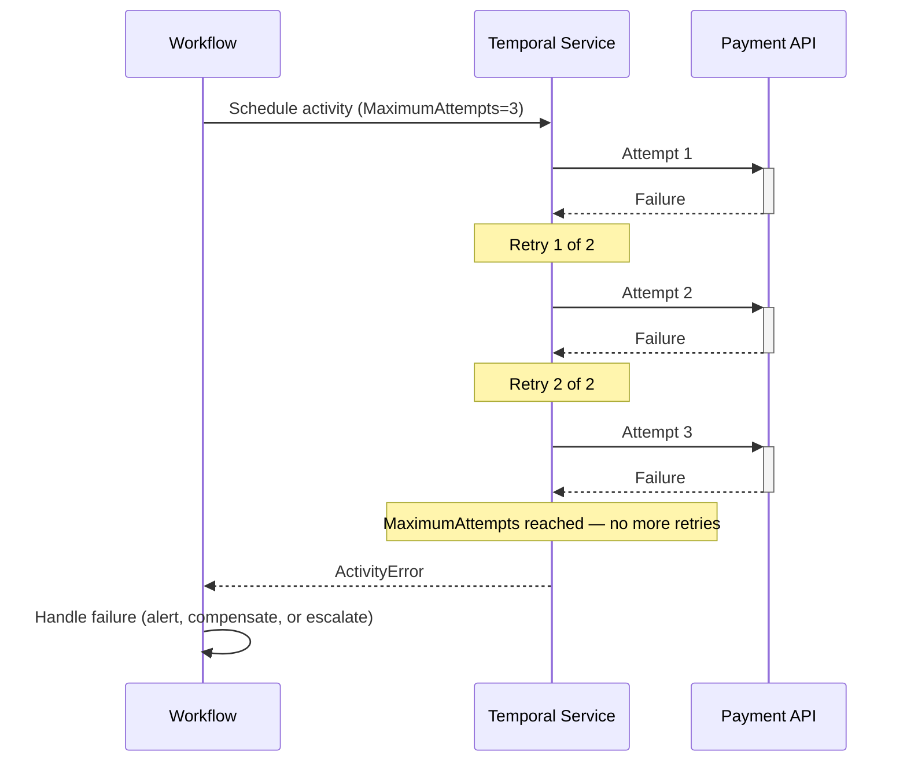

import Tabs from '@theme/Tabs';
import TabItem from '@theme/TabItem';

:::info[TLDR]
Set `MaximumAttempts` on the `RetryPolicy` to **cap how many times Temporal will attempt an Activity**. Use this when each attempt consumes a paid API call, a rate-limited token, or any scarce resource where unbounded retries translate directly to unbounded cost.
:::

## Overview

The Fixed Count of Retries pattern caps the total number of Activity execution attempts by setting `MaximumAttempts` on the `RetryPolicy`.
Use it when each attempt consumes a paid API call, a rate-limited token, or any scarce resource where unbounded retries translate directly to unbounded cost.

## Problem

Temporal's default retry policy retries Activities indefinitely with exponential backoff.
This is appropriate for most infrastructure failures, but it creates problems when the Activity calls a paid third-party API:

- A credit card authorization that fails due to a transient network error will be retried dozens of times, each attempt charging a per-call fee.
- A generative AI API with a per-token pricing model will accumulate costs silently while the Workflow waits.
- A rate-limited partner API will exhaust its quota across all callers if one Workflow retries without bound.

Without a cap, a single stuck Workflow can generate costs that are orders of magnitude larger than the intended spend.

## Solution

Set `MaximumAttempts` on the `RetryPolicy` passed to the Activity call.
Temporal counts the initial attempt and each retry toward the limit.
When the limit is reached, Temporal stops retrying and delivers an `ActivityError` to the Workflow.
The Workflow can catch that error and decide whether to fail, alert, or escalate.



The following describes each step:

1. The Workflow schedules the Activity with a `RetryPolicy` that caps attempts at 3.
2. The Temporal Service executes the Activity. On failure, it schedules a retry.
3. After 3 total attempts (1 initial + 2 retries), Temporal delivers an `ActivityError` to the Workflow.
4. The Workflow catches the error and handles it — logging, compensating, or escalating — rather than accumulating further cost.

## Implementation

### Capping attempts

Set `maximum_attempts` (Python), `MaximumAttempts` (Go / Java), or `maximumAttempts` (TypeScript) on the retry policy.
The count includes the initial attempt, so `maximum_attempts=3` means one attempt plus two retries.

<Tabs groupId="language" queryString>
<TabItem value="python" label="Python">

```python
# workflows.py
from datetime import timedelta
from temporalio import workflow
from temporalio.common import RetryPolicy
from temporalio.exceptions import ActivityError, RetryState
import activities

@workflow.defn
class PaymentWorkflow:
    @workflow.run
    async def run(self, order_id: str) -> str:
        try:
            return await workflow.execute_activity(
                activities.charge_payment_api,
                order_id,
                start_to_close_timeout=timedelta(seconds=10),
                retry_policy=RetryPolicy(maximum_attempts=3),
            )
        except ActivityError as e:
            if e.retry_state == RetryState.MAXIMUM_ATTEMPTS_REACHED:
                # All retries exhausted — handle the failure here.
                # Options: alert on-call, trigger a compensation activity, or escalate to a human.
                workflow.logger.error(
                    "Payment failed: all 3 attempts exhausted",
                    extra={"order_id": order_id},
                )
            raise
```

</TabItem>
<TabItem value="go" label="Go">

```go
// workflow.go
package payments

import (
    "errors"
    "time"

    enumspb "go.temporal.io/api/enums/v1"
    "go.temporal.io/sdk/temporal"
    "go.temporal.io/sdk/workflow"
)

func PaymentWorkflow(ctx workflow.Context, orderID string) (string, error) {
    ao := workflow.ActivityOptions{
        StartToCloseTimeout: 10 * time.Second,
        RetryPolicy: &temporal.RetryPolicy{
            MaximumAttempts: 3,
        },
    }
    ctx = workflow.WithActivityOptions(ctx, ao)

    var result string
    err := workflow.ExecuteActivity(ctx, ChargePaymentAPI, orderID).Get(ctx, &result)
    if err != nil {
        var actErr *temporal.ActivityError
        if errors.As(err, &actErr) && actErr.RetryState() == enumspb.RETRY_STATE_MAXIMUM_ATTEMPTS_REACHED {
            // All retries exhausted — handle the failure here.
            // Options: alert on-call, trigger a compensation activity, or escalate to a human.
            workflow.GetLogger(ctx).Error("Payment failed: all 3 attempts exhausted",
                "orderID", orderID)
        }
        return "", err
    }
    return result, nil
}
```

</TabItem>
<TabItem value="java" label="Java">

```java
// PaymentWorkflowImpl.java
import io.temporal.activity.ActivityOptions;
import io.temporal.api.enums.v1.RetryState;
import io.temporal.common.RetryOptions;
import io.temporal.failure.ActivityFailure;
import io.temporal.workflow.Workflow;
import java.time.Duration;

public class PaymentWorkflowImpl implements PaymentWorkflow {
    private final PaymentActivities activities = Workflow.newActivityStub(
        PaymentActivities.class,
        ActivityOptions.newBuilder()
            .setStartToCloseTimeout(Duration.ofSeconds(10))
            .setRetryOptions(RetryOptions.newBuilder()
                .setMaximumAttempts(3)
                .build())
            .build()
    );

    @Override
    public String run(String orderId) {
        try {
            return activities.chargePaymentApi(orderId);
        } catch (ActivityFailure e) {
            if (e.getRetryState() == RetryState.RETRY_STATE_MAXIMUM_ATTEMPTS_REACHED) {
                // All retries exhausted — handle the failure here.
                // Options: alert on-call, trigger a compensation activity, or escalate to a human.
                Workflow.getLogger(getClass()).error(
                    "Payment failed: all 3 attempts exhausted: " + orderId, e);
            }
            throw e;
        }
    }
}
```

</TabItem>
<TabItem value="typescript" label="TypeScript">

```typescript
// workflows.ts
import * as wf from '@temporalio/workflow';
import type * as activities from './activities';

const { chargePaymentApi } = wf.proxyActivities<typeof activities>({
    startToCloseTimeout: '10s',
    retry: { maximumAttempts: 3 },
});

export async function paymentWorkflow(orderId: string): Promise<string> {
    try {
        return await chargePaymentApi(orderId);
    } catch (err) {
        if (err instanceof wf.ActivityFailure && err.retryState === wf.RetryState.MAXIMUM_ATTEMPTS_REACHED) {
            // All retries exhausted — handle the failure here.
            // Options: alert on-call, trigger a compensation activity, or escalate to a human.
            wf.log.error('Payment failed: all 3 attempts exhausted', { orderId });
        }
        throw err;
    }
}
```

</TabItem>
</Tabs>

### Disabling retries entirely

Set `maximum_attempts=1` to disable retries.
The Activity starts once and any failure is immediately delivered to the Workflow.
This is appropriate when the operation is not idempotent and a second attempt would cause a duplicate side effect such as a double charge or a duplicate email.

<Tabs groupId="language" queryString>
<TabItem value="python" label="Python">

```python
# workflows.py
result = await workflow.execute_activity(
    activities.send_welcome_email,
    user_id,
    start_to_close_timeout=timedelta(seconds=10),
    retry_policy=RetryPolicy(maximum_attempts=1),
)
```

</TabItem>
<TabItem value="go" label="Go">

```go
// workflow.go
ao := workflow.ActivityOptions{
    StartToCloseTimeout: 10 * time.Second,
    RetryPolicy: &temporal.RetryPolicy{
        MaximumAttempts: 1,
    },
}
```

</TabItem>
<TabItem value="java" label="Java">

```java
// Workflow.java
ActivityOptions.newBuilder()
    .setStartToCloseTimeout(Duration.ofSeconds(10))
    .setRetryOptions(RetryOptions.newBuilder()
        .setMaximumAttempts(1)
        .build())
    .build()
```

</TabItem>
<TabItem value="typescript" label="TypeScript">

```typescript
// workflows.ts
const { sendWelcomeEmail } = wf.proxyActivities<typeof activities>({
    startToCloseTimeout: '10s',
    retry: { maximumAttempts: 1 },
});
```

</TabItem>
</Tabs>

If a Worker crashes after the API call succeeds but before the result is recorded, Temporal will not retry — the call is lost.
An idempotency key (a stable identifier derived from the Workflow and Activity IDs) lets the downstream system detect and discard duplicates if a retry is needed in future. If you have idempotency keys, there's little need to cap retries at 1.

## Best practices

- **Match the cap to the cost model.** If the API charges per call, set `maximum_attempts` to the maximum number of calls you are willing to pay for per Workflow execution.
- **Combine with `StartToCloseTimeout`.** A per-attempt timeout prevents a slow response from consuming the entire retry budget on a single hanging call.
- **Catch `ActivityError` in the Workflow.** Handle the exhausted-retries case explicitly — log, alert, compensate, or escalate — rather than letting it fail the Workflow silently.
- **Use idempotency keys.** When retrying, it's vital to have downstream systems detect and discard duplicate calls to avoid duplicate downstream effects.
- **Prefer non-retryable errors for structural failures.** If the failure is not transient (for example, invalid input), mark it as non-retryable rather than relying solely on `maximum_attempts`.

## Common pitfalls

- **Confusing `MaximumAttempts` with allowed retry count.** `MaximumAttempts=3` means 3 total attempts (1 initial + 2 retries), not 3 retries after the initial attempt.
- **Setting no timeout alongside a low attempt cap.** Without `StartToCloseTimeout`, a single hanging attempt can block all retries for minutes or hours.
- **Ignoring the `ActivityError` in the Workflow.** Exhausted retries raise an error in the Workflow. If you do not catch it, the Workflow fails without any compensation or alerting.
- **Disabling retries on operations without safeguards.** `maximum_attempts=1` on a call means any failure — including a Worker crash after the API responded — results in a permanent gap.

## Related patterns

- [Non-Retryable Errors](/design-patterns/non-retryable-errors): Fail immediately for errors that will never succeed regardless of how many times you try.
- [Fixed Wall-Time Retries](/design-patterns/fixed-wall-time-retries): Bound by total elapsed time rather than attempt count.
- [Error Handling & Retry Patterns](/design-patterns/error-handling-patterns): Overview and decision tree for all retry patterns.

## References

- [Temporal Retry Policies](/encyclopedia/retry-policies)
- [Idempotency and Durable Execution](https://temporal.io/blog/idempotency-and-durable-execution)
