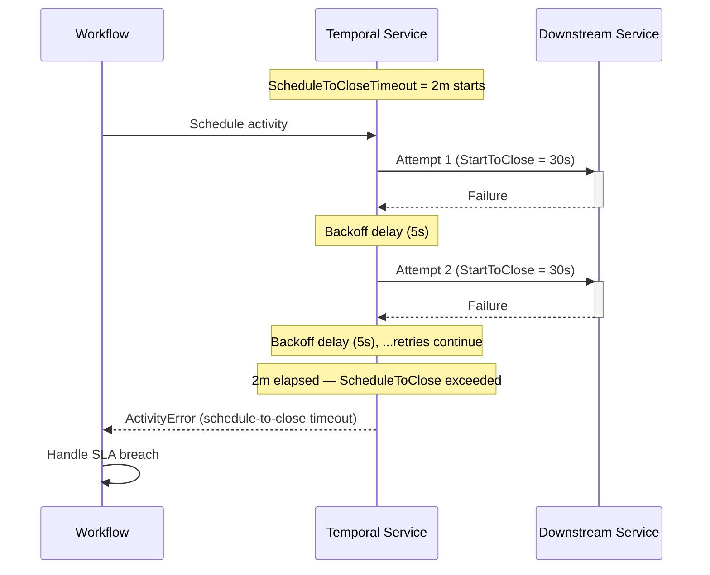

import Tabs from '@theme/Tabs';
import TabItem from '@theme/TabItem';

:::info[TLDR]
Set `ScheduleToCloseTimeout` on the Activity call to enforce a hard time budget across all retry attempts. Use this when a business SLA requires the Activity to **succeed or fail within a defined window**, regardless of how many individual attempts occur.
:::

## Overview

The Fixed Wall-Time Retries pattern enforces a maximum total elapsed time across all Activity retry attempts using `ScheduleToCloseTimeout`.
Use it when a business process must _succeed or fail_ within a defined time budget, regardless of how many individual attempts occur.

## Problem

`StartToCloseTimeout` limits how long a single Activity attempt may run before Temporal cancels it and schedules a retry.
It does not limit how long retries collectively may run.

A process with `StartToCloseTimeout=5m` and the default unlimited retry policy can run for days — each attempt times out at 5 minutes, then Temporal waits for the backoff delay and tries again, indefinitely.

When a business SLA exists and violating that SLA is a failure such as a payment must charge in two minutes or less, an authorization check must complete within 30 seconds — you need a hard outer boundary that Temporal enforces automatically without requiring the Workflow to track elapsed time itself.

## Solution

Set `ScheduleToCloseTimeout` on the Activity call options.
It starts when the Activity is first scheduled and expires when the clock runs out, regardless of how many attempts have occurred.
When the timeout expires, the Temporal Service marks the Activity Execution as timed out and delivers an `ActivityError` to the Workflow.
No further retries are scheduled.
A timeout does not forcibly stop Activity code that is already running, so an Activity that runs past the budget must heartbeat and handle cancellation to stop cooperatively.



The following describes each step:

1. The two minute budget clock starts the moment the Workflow schedules the Activity.
2. Each attempt runs up to 30 seconds (`StartToCloseTimeout`). On failure, Temporal waits the backoff delay and retries.
3. Retries continue until either the Activity succeeds or the two minute budget is exhausted.
4. When the budget expires, Temporal delivers an `ActivityError` to the Workflow, which can log, alert, or compensate.

## Implementation

### Enforcing a 2-minute SLA

Set both `schedule_to_close_timeout` (the total budget) and `start_to_close_timeout` (the per-attempt cap).
The retry policy controls the interval between attempts.
Temporal stops retrying automatically when the budget runs out.

<Tabs groupId="language" queryString>
<TabItem value="python" label="Python">

```python
# workflows.py
from datetime import timedelta
from temporalio import workflow
from temporalio.common import RetryPolicy
from temporalio.exceptions import ActivityError, TimeoutError, TimeoutType
import activities

@workflow.defn
class PaymentAuthWorkflow:
    @workflow.run
    async def run(self, transaction_id: str) -> str:
        try:
            return await workflow.execute_activity(
                activities.authorize_transaction,
                transaction_id,
                schedule_to_close_timeout=timedelta(minutes=2),  # total budget
                start_to_close_timeout=timedelta(seconds=30),    # per attempt
                retry_policy=RetryPolicy(
                    initial_interval=timedelta(seconds=5),
                    backoff_coefficient=1.5,
                    maximum_interval=timedelta(seconds=30),
                ),
            )
        except ActivityError as e:
            cause = e.__cause__
            if isinstance(cause, TimeoutError) and cause.type == TimeoutType.SCHEDULE_TO_CLOSE:
                workflow.logger.error(
                    "Authorization failed — 2-minute SLA breached",
                    extra={"transaction_id": transaction_id},
                )
            raise
```

</TabItem>
<TabItem value="go" label="Go">

```go
// workflow.go
package shipment

import (
    "errors"
    "time"

    enumspb "go.temporal.io/api/enums/v1"
    "go.temporal.io/sdk/temporal"
    "go.temporal.io/sdk/workflow"
)

func PaymentAuthWorkflow(ctx workflow.Context, transactionID string) (string, error) {
    ao := workflow.ActivityOptions{
        ScheduleToCloseTimeout: 2 * time.Minute,   // total budget
        StartToCloseTimeout:    30 * time.Second,  // per attempt
        RetryPolicy: &temporal.RetryPolicy{
            InitialInterval:    5 * time.Second,
            BackoffCoefficient: 1.5,
            MaximumInterval:    30 * time.Second,
        },
    }
    ctx = workflow.WithActivityOptions(ctx, ao)

    var result string
    err := workflow.ExecuteActivity(ctx, AuthorizeTransaction, transactionID).Get(ctx, &result)
    if err != nil {
        var timeoutErr *temporal.TimeoutError
        if errors.As(err, &timeoutErr) && timeoutErr.TimeoutType() == enumspb.TIMEOUT_TYPE_SCHEDULE_TO_CLOSE {
            workflow.GetLogger(ctx).Error(
                "Authorization failed — 2-minute SLA breached",
                "transactionID", transactionID,
            )
        }
        return "", err
    }
    return result, nil
}
```

</TabItem>
<TabItem value="java" label="Java">

```java
// ShipmentNotificationWorkflowImpl.java
import io.temporal.activity.ActivityOptions;
import io.temporal.api.enums.v1.TimeoutType;
import io.temporal.common.RetryOptions;
import io.temporal.failure.ActivityFailure;
import io.temporal.failure.TimeoutFailure;
import io.temporal.workflow.Workflow;
import java.time.Duration;

public class PaymentAuthWorkflowImpl implements PaymentAuthWorkflow {
    private final PaymentActivities activities = Workflow.newActivityStub(
        PaymentActivities.class,
        ActivityOptions.newBuilder()
            .setScheduleToCloseTimeout(Duration.ofMinutes(2))   // total budget
            .setStartToCloseTimeout(Duration.ofSeconds(30))     // per attempt
            .setRetryOptions(RetryOptions.newBuilder()
                .setInitialInterval(Duration.ofSeconds(5))
                .setBackoffCoefficient(1.5)
                .setMaximumInterval(Duration.ofSeconds(30))
                .build())
            .build()
    );

    @Override
    public String run(String transactionId) {
        try {
            return activities.authorizeTransaction(transactionId);
        } catch (ActivityFailure e) {
            if (e.getCause() instanceof TimeoutFailure tf
                    && tf.getTimeoutType() == TimeoutType.TIMEOUT_TYPE_SCHEDULE_TO_CLOSE) {
                Workflow.getLogger(getClass()).error(
                    "Authorization failed — 2-minute SLA breached: " + transactionId, e
                );
            }
            throw e;
        }
    }
}
```

</TabItem>
<TabItem value="typescript" label="TypeScript">

```typescript
// workflows.ts
import * as wf from '@temporalio/workflow';
import type * as activities from './activities';

const { authorizeTransaction } = wf.proxyActivities<typeof activities>({
    scheduleToCloseTimeout: '2m',   // total budget
    startToCloseTimeout: '30s',     // per attempt
    retry: {
        initialInterval: '5s',
        backoffCoefficient: 1.5,
        maximumInterval: '30s',
    },
});

export async function paymentAuthWorkflow(transactionId: string): Promise<string> {
    try {
        return await authorizeTransaction(transactionId);
    } catch (err) {
        if (err instanceof wf.ActivityFailure) {
            const cause = err.cause;
            if (cause instanceof wf.TimeoutFailure && cause.type === wf.TimeoutType.SCHEDULE_TO_CLOSE) {
                wf.log.error('Authorization failed — 2-minute SLA breached', { transactionId });
            }
        }
        throw err;
    }
}
```

</TabItem>
</Tabs>

### Short SLA without a per-attempt timeout

For tighter budgets — such as a 30 second authorization window — you may omit `StartToCloseTimeout` and let `ScheduleToCloseTimeout` act as the only bound. 
Temporal requires at least one timeout to be set; `ScheduleToCloseTimeout` alone satisfies that requirement.

<Tabs groupId="language" queryString>
<TabItem value="python" label="Python">

```python
# workflows.py
result = await workflow.execute_activity(
    activities.authorize_transaction,
    transaction_id,
    schedule_to_close_timeout=timedelta(seconds=30),
    retry_policy=RetryPolicy(
        initial_interval=timedelta(seconds=3),
        backoff_coefficient=1.5,
    ),
)
```

</TabItem>
<TabItem value="go" label="Go">

```go
// workflow.go
ao := workflow.ActivityOptions{
    ScheduleToCloseTimeout: 30 * time.Second,
    RetryPolicy: &temporal.RetryPolicy{
        InitialInterval:    3 * time.Second,
        BackoffCoefficient: 1.5,
    },
}
```

</TabItem>
<TabItem value="java" label="Java">

```java
// Workflow.java
ActivityOptions.newBuilder()
    .setScheduleToCloseTimeout(Duration.ofSeconds(30))
    .setRetryOptions(RetryOptions.newBuilder()
        .setInitialInterval(Duration.ofSeconds(3))
        .setBackoffCoefficient(1.5)
        .build())
    .build()
```

</TabItem>
<TabItem value="typescript" label="TypeScript">

```typescript
// workflows.ts
const { authorizeTransaction } = wf.proxyActivities<typeof activities>({
    scheduleToCloseTimeout: '30s',
    retry: {
        initialInterval: '3s',
        backoffCoefficient: 1.5,
    },
});
```

</TabItem>
</Tabs>

## Best practices

- **Set both timeouts for clarity.** Use `ScheduleToCloseTimeout` as the total SLA and `StartToCloseTimeout` as a per-attempt safety valve. Omitting `StartToCloseTimeout` means a single slow response can consume the entire budget.
- **Cap `MaximumInterval` well below the SLA.** If `MaximumInterval` is 2 hours and the SLA is 24 hours, only 12 retries are possible. Tune the interval so the backoff plateaus at a value that allows meaningful retries within the budget.
- **Handle `ActivityError` explicitly.** When the SLA expires, Temporal delivers an error to the Workflow. Catch it to send an alert, trigger a compensation, or record a breach in an audit log.
- **Distinguish SLA breaches from transient errors.** Inspect the error cause — check that the `ActivityError`'s cause is a `TimeoutError` with `TimeoutType.SCHEDULE_TO_CLOSE` (Python) or a `TimeoutFailure` with `TimeoutType.SCHEDULE_TO_CLOSE` (TypeScript) or `TIMEOUT_TYPE_SCHEDULE_TO_CLOSE` (Go/Java) to separate an SLA breach from an application failure. This lets you log or alert specifically on SLA violations rather than treating all activity errors the same way.

## Common pitfalls

- **Not accounting for `ScheduleToStart` delay in the budget.** `ScheduleToCloseTimeout` begins when the Activity is first scheduled, which includes the time the task waits in the queue before a Worker picks it up. Under high load or insufficient Worker capacity, tasks can sit in the queue for seconds or minutes before the first attempt starts — consuming SLA budget before any work is done. Provision Workers with enough capacity for peak traffic, or use autoscaling, to keep `ScheduleToStart` latency negligible relative to the SLA window.
- **Using `StartToCloseTimeout` alone for SLA enforcement.** A downstream system that responds slowly but never fully times out can keep resetting the per-attempt clock indefinitely.
- **Setting `ScheduleToCloseTimeout` shorter than `StartToCloseTimeout`.** If the total budget is shorter than a single attempt's maximum, the first attempt cannot finish within the budget — the Temporal Service times out the Activity Execution and returns an error before any attempt can succeed.
- **Ignoring the breach in the Workflow.** Letting the `ActivityError` propagate without handling it means SLA breaches go unlogged and uncompensated.
- **Not accounting for backoff delays in the budget.** The total time includes both attempt durations and the backoff delays between them. A 1-hour budget with a 30-minute initial interval and coefficient 2.0 leaves room for only one or two attempts.

## Related patterns

- [Fixed Count of Retries](/design-patterns/fixed-count-retries): Bound by attempt count rather than elapsed time.
- [Delayed Retry](/design-patterns/delayed-retry): Fixed-interval retry when the downstream unavailability window is known.
- [Error Handling & Retry Patterns](/design-patterns/error-handling-patterns): Overview and decision tree for all retry patterns.

## References

- [Activity Timeouts](https://temporal.io/blog/activity-timeouts)
- [Temporal Retry Policies](https://docs.temporal.io/encyclopedia/retry-policies)
