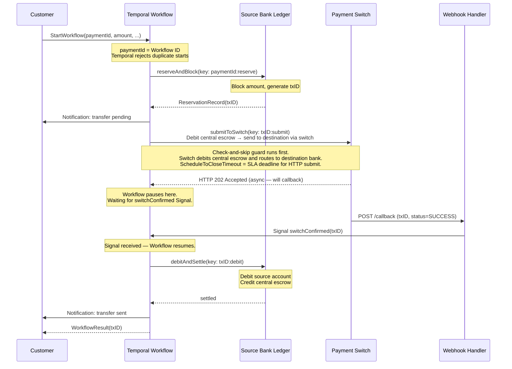
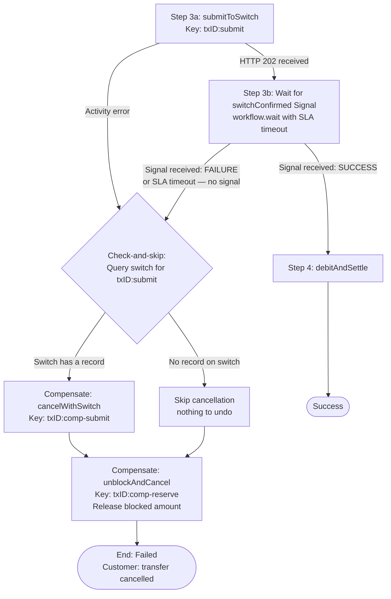
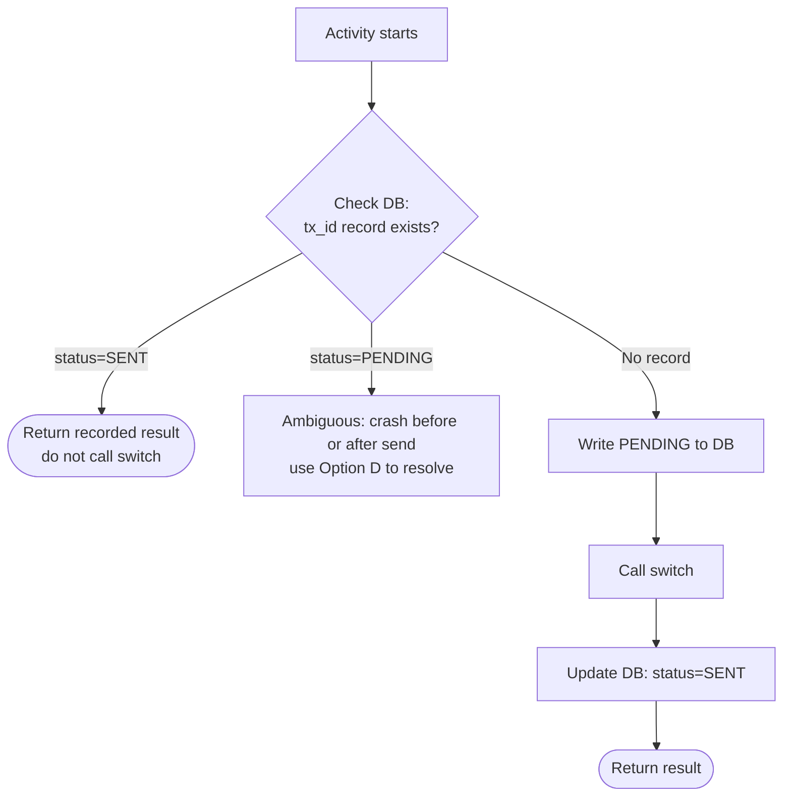
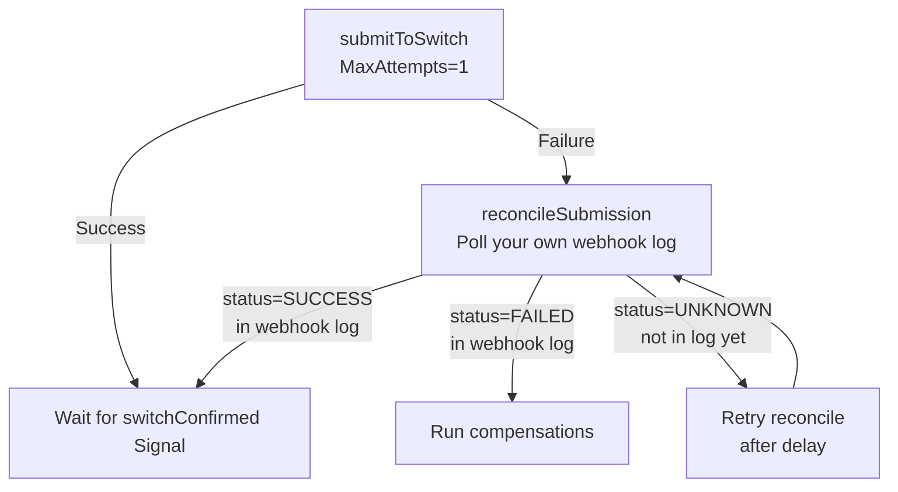
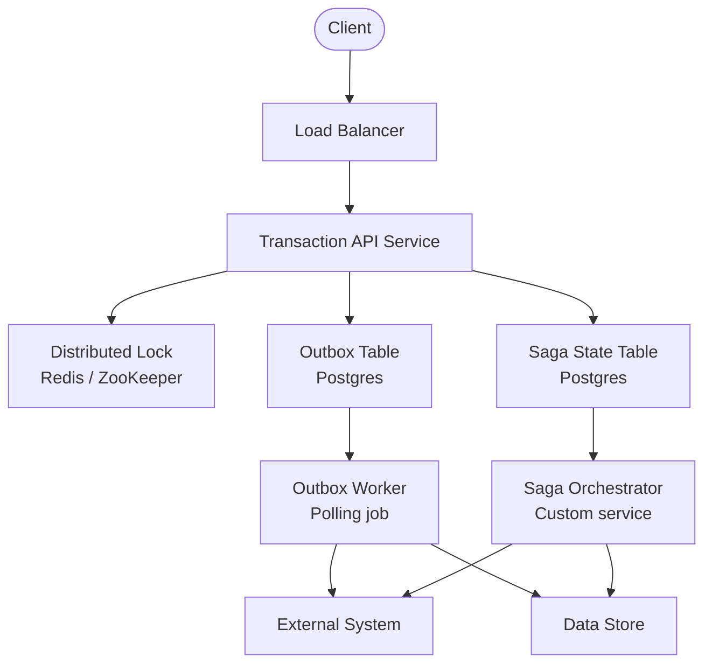
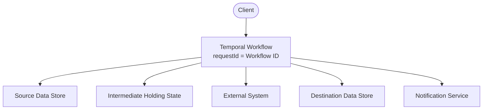

import Tabs from '@theme/Tabs';
import TabItem from '@theme/TabItem';

## Overview

The Idempotent Distributed Transactions pattern coordinates a multi-step operation across external services such that every step is safe to retry, every failure triggers an automatic rollback, and duplicate client submissions never produce duplicate side effects.

A payment workflow is used as the concrete example throughout because it makes the consequences of non-idempotent execution immediately tangible, but the pattern applies to any multi-step transaction that touches more than one external system.

## Problem

Any workflow that calls multiple external services in sequence faces three hard failure modes:

1. **Double execution on retry.** Your service crashes after calling an external system but before recording the result.
On restart, you retry the call — but the remote system already processed the first request and now processes a second.
In a payment context, the payer is charged twice.
In an inventory context, stock is decremented twice.
In an email context, the user receives two copies of the same notification.

2. **Lost compensation on failure.** Step A succeeds, step B times out, and the process crashes.
When it restarts, it has no record of the in-flight state.
Step A is never reversed.
The system is left in a partially committed state that requires manual repair.

3. **Duplicate submissions from clients.** The client retries a timed-out HTTP request.
Two executions of the same logical transaction are now running concurrently.
Both reach the first mutating step simultaneously.

Conventional mitigations — distributed locks, outbox tables, idempotency middleware, custom saga orchestrators — each address one failure mode but require significant infrastructure, careful coordination, and extensive testing to hold together under real conditions.

## Solution

Temporal replaces this custom infrastructure with three built-in guarantees:

1. **Exactly-once Workflow execution per ID.** If you use the client-supplied request reference as the Workflow ID, Temporal rejects any duplicate `StartWorkflow` call for a running or completed execution. Client retries are handled automatically at the platform level.

2. **Durable activity state.** When a Worker crashes mid-execution, Temporal replays the Workflow from its event history on any available Worker. Activities that already completed are not re-executed — their results are replayed from history. Activities that were in-flight are retried from scratch, so each activity must be idempotent, but no activity runs more than once to completion.

3. **Deterministic idempotency keys.** Because the Workflow replays deterministically, any value derived from `workflow.info().workflowId` and a per-step constant is identical on every replay attempt. You pass these keys to external systems so that retried activity calls are recognized as duplicates and skipped.

The example used throughout this pattern is an **outward interbank payment** from a source bank to a government/industry-managed payment switch (such as NPCI/UPI, SEPA, NPP, FedNow/RTP or SWIFT).
The destination bank leg is out of scope — we focus only on what the source bank's system must do to send money out reliably.

The workflow has four steps, each with a registered compensation:

1. **Validate input** — check the request fields locally; no external calls
2. **Reserve and block** — generate a transaction ID, block the transfer amount in the customer's account, and notify the customer that a transfer is pending
3. **Submit to switch and wait for callback** — send the transfer instruction to the switch, then pause the Workflow and wait for the switch's asynchronous confirmation to arrive as a Signal; use check-and-skip on the submit activity to avoid double submission if the Worker crashes mid-flight
4. **Debit and settle** — once the switch confirmation Signal is received, move the blocked funds from the source account to the central escrow account, then notify the customer of success

The switch confirmation is **asynchronous**: the switch does not respond inline to the HTTP call.
Instead, it processes the transfer and POSTs a callback to your service's webhook endpoint.
Your webhook handler calls `workflow.signal()` to deliver the confirmation into the waiting Workflow.

The Workflow resumes from exactly where it paused — no polling, no database, no separate coordinator.

The key insight is that **funds are only debited after the switch signals confirmation**.
Blocking the amount in step 2 prevents the customer from spending the money while the transfer is in-flight, but the actual debit does not happen until step 4.
If the switch rejects the transfer, signals a failure, or the SLA deadline expires with no signal received, the block is released and no debit ever occurs.

### Transaction flow (happy path)



The following describes each step:

1. The customer starts the payment. The `paymentId` is used as the Workflow ID — Temporal rejects any duplicate start for the same ID, handling customer retries automatically.
2. The Workflow validates all fields locally with no external calls. If validation fails, the Workflow ends with no side effects.
3. The `reserveAndBlock` activity generates a `txID`, blocks the transfer amount in the customer's account, and sends a "transfer pending" notification. The idempotency key `paymentId:reserve` makes this safe to retry. The compensation for this step unblocks the amount.
4. The `submitToSwitch` activity runs the check-and-skip guard (query switch before sending), then sends the transfer instruction. The instruction tells the switch to debit the source bank's central escrow account and route the funds to the destination bank. The switch responds with HTTP 202 — it has accepted the instruction but has not yet settled it. The `ScheduleToCloseTimeout` caps the total time spent on this activity across all retries.
5. The Workflow calls `workflow.wait_condition` (or `workflow.await`) on the `switchConfirmed` signal and pauses. No polling. No thread blocking. The Workflow is durably suspended — if the Worker restarts, Temporal replays it back to this exact waiting state.
6. The switch processes the transfer asynchronously and POSTs a callback to your webhook. The webhook handler calls `temporal_client.signal_workflow(workflow_id=payment_id, signal="switchConfirmed", ...)`. The Workflow resumes immediately.
7. The `debitAndSettle` activity debits the customer's source account and credits the bank's central escrow account (key `txID:debit`). This is the first and only time the customer's balance is reduced — and it happens only because the switch already confirmed that it debited the central escrow and delivered the funds to the destination bank. The debit step completes the internal settlement: escrow is now square.
8. The customer receives a "transfer sent" notification and the Workflow completes.

### Compensation flow on mid-step failure

There are two distinct failure scenarios after step 3 — and they require different compensation paths.

**Scenario A — submit activity fails (Worker crash or switch error):** The submit activity returns an error. We do not know if the switch received the instruction, so we must query before cancelling.

**Scenario B — SLA deadline exceeded waiting for the callback signal:** The submit activity succeeded (switch accepted the instruction), but the switch never sent the callback within the SLA window. The Workflow's signal wait times out.



The following describes both failure paths:

**Path A — submit activity errors:**
1. The `submitToSwitch` activity fails (Worker crashed, network error, switch returned non-retryable error, or `ScheduleToCloseTimeout` expired across all retries).
2. The check-and-skip guard queries the switch for `txID:submit` to resolve the ambiguity: did the instruction reach the switch before the failure?
3. If the switch has a record, the transfer was accepted. The compensation sends a cancellation with key `txID:comp-submit`.
4. If the switch has no record, the instruction never arrived. Cancellation is skipped.
5. Either way, the source account block is released with key `txID:comp-reserve`. The customer is notified.

**Path B — SLA timeout waiting for callback:**
1. The `submitToSwitch` activity returns successfully (switch responded HTTP 202). The Workflow begins waiting for the `switchConfirmed` signal with a deadline.
2. The deadline passes with no signal. This means the switch accepted the instruction but has not called back yet — it may still be processing, or the callback was lost.
3. The same check-and-skip guard runs. The switch is queried for `txID:submit`.
4. Since the switch accepted the original submission (it returned 202), a record will likely exist. The compensation sends a cancellation.
5. The source account block is released. The customer is notified that the transfer timed out.

### Idempotency strategies for the submit activity

The riskiest moment in the entire workflow is when the `submitToSwitch` activity sends the transfer instruction, the switch accepts it, but the Worker crashes before Temporal records the activity result.
On retry, the activity runs again.
Without a guard, the switch receives the same instruction twice and may process it twice.

There are four strategies for handling this. They differ in what the switch must support and what infrastructure you must maintain.

#### Option A — Query switch by idempotency key (check-and-skip)

Before sending, query the switch for an existing record with `txID:submit`.
If a record exists, the previous attempt reached the switch — return immediately without sending again.

```
query switch for txID:submit
  → found    → return (skip send)
  → not found → send instruction
```

| | |
|---|---|
| **Pros** | No extra infrastructure. Works even after a Worker crash mid-send. Compensation also uses the same guard to decide whether to cancel. |
| **Cons** | Switch must expose a query-by-key endpoint. Not all switches do. |
| **Best for** | Switches that support idempotency key lookup (most modern payment APIs). |

This is the approach shown in the implementation code above.

---

#### Option B — Client-supplied transaction reference in the request body

Many switches accept a `clientTransactionId` or `endToEndId` field in the request body and use it to de-duplicate on their side.
You derive this field deterministically from the Workflow ID in the Workflow layer — the same value on every retry.
The switch silently returns the same response for a duplicate reference without processing it twice.

```python
# The clientTransactionId is derived in the Workflow (not in the activity)
# so it is identical on every replay attempt.
client_tx_id = f"{workflow_id}:submit"   # e.g. "pay-abc123:submit"

await switch_client.submit(
    client_transaction_id=client_tx_id,
    amount=params["amount"],
    ...
)
```

| | |
|---|---|
| **Pros** | No query round-trip. No extra infrastructure on your side. The switch absorbs duplicates transparently. |
| **Cons** | Switch must honour the client-supplied field for de-duplication. Requires confirming behaviour with the switch operator. |
| **Best for** | Switches that accept a client reference field (UPI, SEPA, SWIFT, Stripe). This is the most common case for government-managed interbank switches. |

---

#### Option C — Write-ahead submission log in your own database

Before calling the switch, the activity writes a record to your own database:

```
INSERT INTO payment_submissions (tx_id, status)
VALUES (:tx_id, 'PENDING')
ON CONFLICT (tx_id) DO NOTHING
```

On retry, the activity reads the record first:
- `status = SENT` → switch was called and succeeded. Skip. Return recorded result.
- `status = PENDING` → previous attempt crashed before or after calling the switch. The state is ambiguous — fall through to Option D to resolve.



| | |
|---|---|
| **Pros** | Fully within your control. No switch query API needed. Cleanly handles the "before the call" crash case. |
| **Cons** | Does not resolve the ambiguous window between calling the switch and updating the DB. That window still requires Option A or D. Best used in combination. |
| **Best for** | Adding a first layer of protection on top of Option D. |

---

#### Option D — Non-retryable submit + reconciliation activity

Set `MaxAttempts: 1` on the submit activity.
If it fails for any reason (including a crash after the switch accepted), the activity fails immediately — no automatic retry.
The Workflow then executes a separate `reconcileSubmission` activity that reads from your own webhook callback log to determine what actually happened.



Your webhook handler stores every incoming switch callback in a `switch_callbacks` table keyed by `tx_id`.
The `reconcileSubmission` activity reads from that table.

<Tabs groupId="language" queryString>
<TabItem value="python" label="Python" default>

```python
@activity.defn
async def reconcile_submission(params: dict) -> str:
    """
    Read from the local webhook callback log to determine what the switch
    decided. Called only when submitToSwitch fails.
    Returns "SUCCESS", "FAILED", or "UNKNOWN".
    """
    row = await db.query_one(
        "SELECT status FROM switch_callbacks WHERE tx_id = :tx_id",
        tx_id=params["tx_id"],
    )
    if row is None:
        return "UNKNOWN"   # callback not received yet — caller should retry
    return row["status"]   # "SUCCESS" or "FAILED"
```

</TabItem>
<TabItem value="go" label="Go">

```go
func ReconcileSubmission(ctx context.Context, params ReconcileParams) (string, error) {
    // Read from the local webhook callback log.
    // Called only when SubmitToSwitch fails.
    // Returns "SUCCESS", "FAILED", or "UNKNOWN".
    row, err := db.QueryOne(ctx,
        "SELECT status FROM switch_callbacks WHERE tx_id = $1", params.TxID)
    if err != nil {
        return "", err
    }
    if row == nil {
        return "UNKNOWN", nil // callback not received yet — caller should retry
    }
    return row.Status, nil   // "SUCCESS" or "FAILED"
}
```

</TabItem>
<TabItem value="java" label="Java">

```java
@ActivityMethod
public String reconcileSubmission(ReconcileParams params) {
    // Read from the local webhook callback log.
    // Called only when submitToSwitch fails.
    // Returns "SUCCESS", "FAILED", or "UNKNOWN".
    Optional<CallbackRow> row = db.queryOne(
        "SELECT status FROM switch_callbacks WHERE tx_id = ?", params.txId());
    if (row.isEmpty()) {
        return "UNKNOWN"; // callback not received yet — caller should retry
    }
    return row.get().status(); // "SUCCESS" or "FAILED"
}
```

</TabItem>
<TabItem value="typescript" label="TypeScript">

```typescript
export async function reconcileSubmission(params: ReconcileParams): Promise<string> {
  // Read from the local webhook callback log.
  // Called only when submitToSwitch fails.
  // Returns 'SUCCESS', 'FAILED', or 'UNKNOWN'.
  const row = await db.queryOne(
    'SELECT status FROM switch_callbacks WHERE tx_id = $1', [params.txId]
  );
  if (!row) return 'UNKNOWN'; // callback not received yet — caller should retry
  return row.status;          // 'SUCCESS' or 'FAILED'
}
```

</TabItem>
</Tabs>

| | |
|---|---|
| **Pros** | Most robust. Resolves every ambiguous crash scenario. Does not depend on the switch having a query API. Reconciliation reads your own data. |
| **Cons** | Requires a `switch_callbacks` table and a webhook handler that writes to it. More moving parts than Options A–C. |
| **Best for** | Switches with no query API and no client reference field. Also the right fallback when Options A or B are unavailable. |

---

#### Comparison and recommendation

| Strategy | Switch query API needed | Your DB needed | Handles crash-after-send | Complexity |
| :--- | :--- | :--- | :--- | :--- |
| A — Query switch by key | Yes | No | Yes | Low |
| B — Client reference in request body | No (switch de-duplicates on field) | No | Yes | Low |
| C — Write-ahead submission log | No | Yes (submissions table) | Partially — ambiguous window remains | Medium |
| D — Non-retryable + reconciliation | No | Yes (callbacks table) | Yes | Medium |

**Recommended approach:**

1. **If your switch accepts a `clientTransactionId` or equivalent field** → use Option B. It requires nothing extra and the switch handles de-duplication. Verify the switch API documentation confirms idempotent behaviour on that field.

2. **If your switch exposes a query-by-key endpoint** → use Option A (check-and-skip). This is what the implementation code in this pattern demonstrates.

3. **If your switch has neither** → use Option D (non-retryable + reconciliation). Your webhook handler already stores callbacks to drive the `switchConfirmed` Signal — extend the same table to also serve the reconciliation activity. Option C can be layered on top of D to make the `PENDING` case cheaper to resolve.

In practice, most government-managed interbank switches (UPI, SEPA, SWIFT gpi) support either a client end-to-end reference (Option B) or a status query endpoint (Option A), so Options C and D are primarily fallback strategies.

### Before Temporal: the conventional approach



The conventional approach requires you to build and maintain:

- A distributed lock to prevent concurrent duplicate executions
- An outbox table and polling worker to guarantee at-least-once delivery to external systems
- A saga state table to persist compensation state across process restarts
- A saga orchestrator service to resume and compensate interrupted transactions
- Idempotency middleware to de-duplicate retried HTTP calls

Each component is an independent failure point requiring its own monitoring, schema migrations, retry logic, and operational runbook.
The surface area for bugs is large, and the bugs tend to be rare, hard to reproduce, and high-impact.

### After Temporal: durable execution as infrastructure



Temporal's durable execution engine replaces the lock, the outbox, the saga state table, and the orchestrator with a single programming model.
The Workflow function is the authoritative record of execution state.
When a Worker crashes, Temporal replays the Workflow from its event history on any available Worker, skipping completed activities and retrying in-flight ones.

### Idempotency key derivation

You derive idempotency keys from the Workflow ID and a per-step suffix inside the Workflow function, not inside Activities.
The key is stable across all replay attempts because it is derived from deterministic inputs.

```
idempotency_key = workflow_id + ":" + step_name
```

Example keys for a Workflow ID `pay-abc123`:

| Step | Key | Used by |
| :--- | :--- | :--- |
| Reserve and block | `pay-abc123:reserve` | Source bank ledger |
| Submit to switch | `pay-abc123:submit` | Payment switch |
| Debit and settle | `pay-abc123:debit` | Source bank ledger |
| Unblock (comp. for reserve) | `pay-abc123:comp-reserve` | Source bank ledger |
| Cancel with switch (comp. for submit) | `pay-abc123:comp-submit` | Payment switch |

Each system uses this key to de-duplicate requests — if the same key arrives twice, the system returns the result of the first call instead of executing again.
Forward and compensation steps must use distinct keys so the switch does not reject a cancellation as a duplicate of the original submission.

### Intermediate holding state

The intermediate holding state is any platform-controlled resource that sits between the source mutation and the destination mutation.
In the payment example it is a ledger escrow account.
In other domains it could be a reservation record, a staging queue, or a provisional inventory allocation.

The invariant is: at any point in time, the total across source + holding + destination equals the original total.
No resources are created or destroyed by a partial failure — they are either fully committed or fully reversed.

### SLA enforcement on external calls

External systems have contractual SLAs (for example, respond within 30 seconds).
You enforce the SLA by setting `ScheduleToCloseTimeout` on the delivery activity.
This timeout covers all retries of the activity, not just a single attempt.
If the external system does not confirm within the SLA window, the activity fails deterministically and compensation begins.

## Implementation

### Define payment types and idempotency key helper

Define the payment request type and the key derivation helper in the Workflow layer.
The helper must live here — not inside activities — so that every key computed during a replay is identical to the key computed during the original execution.

<Tabs groupId="language" queryString>
<TabItem value="python" label="Python" default>

```python
# payment_types.py
from dataclasses import dataclass

@dataclass
class PaymentRequest:
    payment_id: str    # Client-supplied reference — used as the Workflow ID
    source_account: str
    destination_account: str
    amount: int        # In minor units (e.g. cents)
    currency: str

@dataclass
class ReservationRecord:
    tx_id: str         # Unique transaction ID generated during reserve step

def step_key(tx_id: str, step: str) -> str:
    """Derive a stable idempotency key for a workflow step.

    Keys are derived here (in Workflow code) not inside activities, so
    the same key is produced on every replay attempt.
    """
    return f"{tx_id}:{step}"
```

</TabItem>
<TabItem value="go" label="Go">

```go
// payment_types.go
package payment

import "fmt"

type PaymentRequest struct {
    PaymentID          string // Client-supplied reference — used as the Workflow ID
    SourceAccount      string
    DestinationAccount string
    Amount             int64  // In minor units (e.g. cents)
    Currency           string
}

type ReservationRecord struct {
    TxID string // Unique transaction ID generated during reserve step
}

// StepKey derives a stable idempotency key for a workflow step.
// Must be called in Workflow code, not inside activities, so the key
// is identical on every replay attempt.
func StepKey(txID, step string) string {
    return fmt.Sprintf("%s:%s", txID, step)
}
```

</TabItem>
<TabItem value="java" label="Java">

```java
// PaymentTypes.java
public class PaymentTypes {

    public record PaymentRequest(
        String paymentId,         // Client-supplied reference — used as the Workflow ID
        String sourceAccount,
        String destinationAccount,
        long amount,              // In minor units (e.g. cents)
        String currency
    ) {}

    public record ReservationRecord(
        String txId              // Unique transaction ID generated during reserve step
    ) {}

    /**
     * Derives a stable idempotency key for a workflow step.
     * Must be called in Workflow code, not inside activities, so the key
     * is identical on every replay attempt.
     */
    public static String stepKey(String txId, String step) {
        return txId + ":" + step;
    }
}
```

</TabItem>
<TabItem value="typescript" label="TypeScript">

```typescript
// paymentTypes.ts
export interface PaymentRequest {
  paymentId: string;           // Client-supplied reference — used as the Workflow ID
  sourceAccount: string;
  destinationAccount: string;
  amount: number;              // In minor units (e.g. cents)
  currency: string;
}

export interface ReservationRecord {
  txId: string;                // Unique transaction ID generated during reserve step
}

/**
 * Derives a stable idempotency key for a workflow step.
 * Must be called in Workflow code, not inside activities, so the key
 * is identical on every replay attempt.
 */
export function stepKey(txId: string, step: string): string {
  return `${txId}:${step}`;
}
```

</TabItem>
</Tabs>

### Implement the Workflow with Signal and Saga compensations

The Workflow defines a `switchConfirmed` Signal handler that the webhook calls to deliver the switch's asynchronous response.
After submitting to the switch, the Workflow pauses with `workflow.wait_condition` / `workflow.await` until either the Signal arrives or the SLA deadline passes.
Idempotency keys are derived in the Workflow function — never inside activities — so they are stable across all replay attempts.

<Tabs groupId="language" queryString>
<TabItem value="python" label="Python" default>

```python
# payment_workflow.py
from datetime import timedelta
from dataclasses import dataclass, field
from temporalio import workflow
from payment_types import PaymentRequest, step_key

@dataclass
class SwitchCallback:
    tx_id: str
    status: str   # "SUCCESS" or "FAILURE"
    reason: str = ""

@workflow.defn
class InterBankPaymentWorkflow:
    def __init__(self) -> None:
        # Holds the callback payload when the signal arrives
        self._switch_callback: SwitchCallback | None = None

    @workflow.signal
    def switch_confirmed(self, callback: SwitchCallback) -> None:
        """
        Called by your webhook handler when the payment switch posts a callback.
        The webhook sends:  temporal_client.signal_workflow(
                                workflow_id=payment_id,
                                signal_name="switch_confirmed",
                                arg=SwitchCallback(tx_id, status))
        """
        self._switch_callback = callback

    @workflow.run
    async def run(self, req: PaymentRequest) -> str:
        compensations = []

        try:
            # Step 1: Validate input — local only, no external calls
            if req.amount <= 0 or not req.source_account or not req.destination_account:
                raise ValueError("Invalid payment request")

            # Step 2: Reserve and block
            # Generates txID, blocks the amount, notifies customer "transfer pending"
            reservation = await workflow.execute_activity(
                reserve_and_block,
                {
                    "idempotency_key": f"{req.payment_id}:reserve",
                    "payment_id": req.payment_id,
                    "source_account": req.source_account,
                    "amount": req.amount,
                },
                start_to_close_timeout=timedelta(seconds=10),
            )
            # Compensation: unblock the amount if anything goes wrong
            compensations.append(
                lambda r=reservation: workflow.execute_activity(
                    unblock_and_cancel,
                    {
                        "idempotency_key": step_key(r.tx_id, "comp-reserve"),
                        "tx_id": r.tx_id,
                        "source_account": req.source_account,
                        "amount": req.amount,
                    },
                    start_to_close_timeout=timedelta(seconds=10),
                )
            )

            # Step 3a: Submit to payment switch
            # ScheduleToCloseTimeout = total budget for the HTTP submit across all retries
            # Key derived here — stable even if Worker crashes and replays
            await workflow.execute_activity(
                submit_to_switch,
                {
                    "idempotency_key": step_key(reservation.tx_id, "submit"),
                    "tx_id": reservation.tx_id,
                    "source_account": req.source_account,
                    "destination_account": req.destination_account,
                    "amount": req.amount,
                    "currency": req.currency,
                },
                schedule_to_close_timeout=timedelta(seconds=10),
            )
            # Compensation: cancel with switch if debit step fails after confirmation
            compensations.append(
                lambda r=reservation: workflow.execute_activity(
                    cancel_with_switch,
                    {
                        "idempotency_key": step_key(r.tx_id, "comp-submit"),
                        "tx_id": r.tx_id,
                    },
                    start_to_close_timeout=timedelta(seconds=15),
                )
            )

            # Step 3b: Wait for switch callback signal (SLA = 60 seconds)
            # The Workflow is durably suspended here — no polling, no thread blocking.
            # If the Worker restarts, Temporal replays to this point and waits again.
            confirmed = await workflow.wait_condition(
                lambda: self._switch_callback is not None,
                timeout=timedelta(seconds=60),
            )
            if not confirmed or self._switch_callback.status != "SUCCESS":
                reason = self._switch_callback.reason if self._switch_callback else "SLA timeout"
                raise RuntimeError(f"Switch did not confirm transfer: {reason}")

            # Step 4: Debit and settle
            # Only reached after switch signals SUCCESS — now safe to move funds
            await workflow.execute_activity(
                debit_and_settle,
                {
                    "idempotency_key": step_key(reservation.tx_id, "debit"),
                    "tx_id": reservation.tx_id,
                    "source_account": req.source_account,
                    "amount": req.amount,
                },
                start_to_close_timeout=timedelta(seconds=15),
            )

            return reservation.tx_id

        except Exception:
            # Run compensations in reverse (LIFO) — most recent step first
            for compensation in reversed(compensations):
                await compensation()
            raise
```

</TabItem>
<TabItem value="go" label="Go">

```go
// payment_workflow.go
package payment

import (
    "fmt"
    "time"

    "go.temporal.io/sdk/workflow"
)

// SwitchCallback is the payload delivered via the switchConfirmed Signal.
type SwitchCallback struct {
    TxID   string
    Status string // "SUCCESS" or "FAILURE"
    Reason string
}

func InterBankPaymentWorkflow(ctx workflow.Context, req PaymentRequest) (string, error) {
    var compensations []func() error
    var err error

    // defer runs compensations in LIFO order if err is non-nil at return
    defer func() {
        if err != nil {
            for i := len(compensations) - 1; i >= 0; i-- {
                _ = compensations[i]()
            }
        }
    }()

    // switchCallback is set when the switchConfirmed Signal arrives.
    // The webhook handler calls: temporal_client.SignalWorkflow(ctx, paymentID,
    //     "", "switchConfirmed", SwitchCallback{...})
    var switchCallback *SwitchCallback
    workflow.SetSignalHandler(ctx, "switchConfirmed", func(cb SwitchCallback) {
        switchCallback = &cb
    })

    // Step 1: Validate input — local only, no external calls
    if req.Amount <= 0 || req.SourceAccount == "" || req.DestinationAccount == "" {
        err = fmt.Errorf("invalid payment request")
        return "", err
    }

    ao := workflow.ActivityOptions{StartToCloseTimeout: 10 * time.Second}
    ctx = workflow.WithActivityOptions(ctx, ao)

    // Step 2: Reserve and block
    // Generates txID, blocks the amount, notifies customer "transfer pending"
    var reservation ReservationRecord
    err = workflow.ExecuteActivity(ctx, ReserveAndBlock, ReserveParams{
        IdempotencyKey: req.PaymentID + ":reserve",
        PaymentID:      req.PaymentID,
        SourceAccount:  req.SourceAccount,
        Amount:         req.Amount,
    }).Get(ctx, &reservation)
    if err != nil {
        return "", err
    }
    // Compensation: unblock the amount if anything goes wrong
    compensations = append(compensations, func() error {
        return workflow.ExecuteActivity(ctx, UnblockAndCancel, UnblockParams{
            IdempotencyKey: StepKey(reservation.TxID, "comp-reserve"),
            TxID:           reservation.TxID,
            SourceAccount:  req.SourceAccount,
            Amount:         req.Amount,
        }).Get(ctx, nil)
    })

    // Step 3a: Submit to payment switch
    // Key derived here — stable even if Worker crashes and replays
    switchCtx := workflow.WithActivityOptions(ctx, workflow.ActivityOptions{
        ScheduleToCloseTimeout: 10 * time.Second,
    })
    err = workflow.ExecuteActivity(switchCtx, SubmitToSwitch, SubmitParams{
        IdempotencyKey:     StepKey(reservation.TxID, "submit"),
        TxID:               reservation.TxID,
        SourceAccount:      req.SourceAccount,
        DestinationAccount: req.DestinationAccount,
        Amount:             req.Amount,
        Currency:           req.Currency,
    }).Get(ctx, nil)
    if err != nil {
        return "", err
    }
    // Compensation: cancel with switch if debit step fails after confirmation
    compensations = append(compensations, func() error {
        return workflow.ExecuteActivity(ctx, CancelWithSwitch, CancelParams{
            IdempotencyKey: StepKey(reservation.TxID, "comp-submit"),
            TxID:           reservation.TxID,
        }).Get(ctx, nil)
    })

    // Step 3b: Wait for switch callback signal (SLA = 60 seconds)
    // The Workflow is durably suspended here — no polling, no thread blocking.
    // If the Worker restarts, Temporal replays to this point and waits again.
    slaCtx, cancel := workflow.WithCancel(ctx)
    defer cancel()
    _ = workflow.NewTimer(slaCtx, 60*time.Second)

    workflow.Await(ctx, func() bool {
        return switchCallback != nil
    })

    if switchCallback == nil {
        err = fmt.Errorf("SLA timeout: switch did not confirm within 60s")
        return "", err
    }
    if switchCallback.Status != "SUCCESS" {
        err = fmt.Errorf("switch rejected transfer: %s", switchCallback.Reason)
        return "", err
    }

    // Step 4: Debit and settle
    // Only reached after switch signals SUCCESS — now safe to move funds
    err = workflow.ExecuteActivity(ctx, DebitAndSettle, DebitParams{
        IdempotencyKey: StepKey(reservation.TxID, "debit"),
        TxID:           reservation.TxID,
        SourceAccount:  req.SourceAccount,
        Amount:         req.Amount,
    }).Get(ctx, nil)
    return reservation.TxID, err
}
```

</TabItem>
<TabItem value="java" label="Java">

```java
// InterBankPaymentWorkflowImpl.java
import io.temporal.workflow.Workflow;
import io.temporal.workflow.SignalMethod;
import io.temporal.activity.ActivityOptions;
import java.time.Duration;

public class InterBankPaymentWorkflowImpl implements InterBankPaymentWorkflow {

    // Set by the switchConfirmed Signal when the webhook calls back
    private SwitchCallback switchCallback = null;

    /**
     * Signal handler — called by your webhook endpoint via:
     *   WorkflowStub stub = client.newUntypedWorkflowStub(paymentId);
     *   stub.signal("switchConfirmed", new SwitchCallback(txId, "SUCCESS", ""));
     */
    @SignalMethod
    public void switchConfirmed(SwitchCallback callback) {
        this.switchCallback = callback;
    }

    private final PaymentActivities activities = Workflow.newActivityStub(
        PaymentActivities.class,
        ActivityOptions.newBuilder()
            .setStartToCloseTimeout(Duration.ofSeconds(10))
            .build()
    );

    private final PaymentActivities switchActivities = Workflow.newActivityStub(
        PaymentActivities.class,
        ActivityOptions.newBuilder()
            .setScheduleToCloseTimeout(Duration.ofSeconds(10))
            .build()
    );

    @Override
    public String processPayment(PaymentRequest req) {
        // Step 1: Validate input — local only, no external calls
        if (req.amount() <= 0 || req.sourceAccount().isEmpty()) {
            throw new IllegalArgumentException("Invalid payment request");
        }

        Saga saga = new Saga(new Saga.Options.Builder()
            .setParallelCompensation(false)
            .build());

        try {
            // Step 2: Reserve and block
            ReservationRecord reservation = activities.reserveAndBlock(new ReserveParams(
                req.paymentId() + ":reserve",
                req.paymentId(), req.sourceAccount(), req.amount()
            ));
            saga.addCompensation(activities::unblockAndCancel, new UnblockParams(
                PaymentTypes.stepKey(reservation.txId(), "comp-reserve"),
                reservation.txId(), req.sourceAccount(), req.amount()
            ));

            // Step 3a: Submit to payment switch
            // Key derived here — stable even if Worker crashes and replays
            switchActivities.submitToSwitch(new SubmitParams(
                PaymentTypes.stepKey(reservation.txId(), "submit"),
                reservation.txId(), req.sourceAccount(),
                req.destinationAccount(), req.amount(), req.currency()
            ));
            saga.addCompensation(activities::cancelWithSwitch, new CancelParams(
                PaymentTypes.stepKey(reservation.txId(), "comp-submit"),
                reservation.txId()
            ));

            // Step 3b: Wait for switch callback signal (SLA = 60 seconds)
            // The Workflow is durably suspended here — no polling, no thread blocking.
            // If the Worker restarts, Temporal replays to this point and waits again.
            boolean received = Workflow.await(
                Duration.ofSeconds(60),
                () -> this.switchCallback != null
            );
            if (!received || !"SUCCESS".equals(this.switchCallback.status())) {
                String reason = received ? this.switchCallback.reason() : "SLA timeout";
                throw new RuntimeException("Switch did not confirm transfer: " + reason);
            }

            // Step 4: Debit and settle
            // Only reached after switch signals SUCCESS — now safe to move funds
            activities.debitAndSettle(new DebitParams(
                PaymentTypes.stepKey(reservation.txId(), "debit"),
                reservation.txId(), req.sourceAccount(), req.amount()
            ));

            return reservation.txId();

        } catch (Exception e) {
            saga.compensate();
            throw e;
        }
    }
}
```

</TabItem>
<TabItem value="typescript" label="TypeScript">

```typescript
// paymentWorkflow.ts
import {
  executeActivity, ActivityOptions,
  defineSignal, setHandler, condition, sleep
} from '@temporalio/workflow';
import { PaymentRequest, ReservationRecord, stepKey } from './paymentTypes';
import * as activities from './paymentActivities';

// Signal definition — webhook handler calls:
//   handle.signal(switchConfirmedSignal, { txId, status: 'SUCCESS', reason: '' })
export const switchConfirmedSignal = defineSignal<[SwitchCallback]>('switchConfirmed');

interface SwitchCallback {
  txId: string;
  status: 'SUCCESS' | 'FAILURE';
  reason: string;
}

const defaultOptions: ActivityOptions = { startToCloseTimeout: '10s' };
const switchOptions: ActivityOptions = { scheduleToCloseTimeout: '10s' };
const SLA_SECONDS = 60;

export async function interBankPaymentWorkflow(req: PaymentRequest): Promise<string> {
  type Compensation = () => Promise<void>;
  const compensations: Compensation[] = [];

  // switchCallback is set when the Signal arrives from the webhook
  let switchCallback: SwitchCallback | null = null;
  setHandler(switchConfirmedSignal, (cb: SwitchCallback) => {
    switchCallback = cb;
  });

  try {
    // Step 1: Validate input — local only, no external calls
    if (req.amount <= 0 || !req.sourceAccount || !req.destinationAccount) {
      throw new Error('Invalid payment request');
    }

    // Step 2: Reserve and block
    const reservation: ReservationRecord = await executeActivity(
      activities.reserveAndBlock,
      [{ idempotencyKey: `${req.paymentId}:reserve`, paymentId: req.paymentId,
         sourceAccount: req.sourceAccount, amount: req.amount }],
      defaultOptions
    );
    compensations.unshift(() =>
      executeActivity(activities.unblockAndCancel, [{
        idempotencyKey: stepKey(reservation.txId, 'comp-reserve'),
        txId: reservation.txId,
        sourceAccount: req.sourceAccount,
        amount: req.amount,
      }], defaultOptions)
    );

    // Step 3a: Submit to payment switch
    // Key derived here — stable even if Worker crashes and replays
    await executeActivity(activities.submitToSwitch, [{
      idempotencyKey: stepKey(reservation.txId, 'submit'),
      txId: reservation.txId,
      sourceAccount: req.sourceAccount,
      destinationAccount: req.destinationAccount,
      amount: req.amount,
      currency: req.currency,
    }], switchOptions);
    compensations.unshift(() =>
      executeActivity(activities.cancelWithSwitch, [{
        idempotencyKey: stepKey(reservation.txId, 'comp-submit'),
        txId: reservation.txId,
      }], defaultOptions)
    );

    // Step 3b: Wait for switch callback signal (SLA = 60 seconds)
    // The Workflow is durably suspended here — no polling, no thread blocking.
    // If the Worker restarts, Temporal replays to this point and waits again.
    const received = await condition(
      () => switchCallback !== null,
      `${SLA_SECONDS}s`
    );
    if (!received || switchCallback!.status !== 'SUCCESS') {
      const reason = received ? switchCallback!.reason : 'SLA timeout';
      throw new Error(`Switch did not confirm transfer: ${reason}`);
    }

    // Step 4: Debit and settle
    // Only reached after switch signals SUCCESS — now safe to move funds
    await executeActivity(activities.debitAndSettle, [{
      idempotencyKey: stepKey(reservation.txId, 'debit'),
      txId: reservation.txId,
      sourceAccount: req.sourceAccount,
      amount: req.amount,
    }], defaultOptions);

    return reservation.txId;

  } catch (err) {
    for (const comp of compensations) {
      await comp();
    }
    throw err;
  }
}
```

</TabItem>
</Tabs>

The key differences between SDKs for the Signal wait are:

- **Python**: `workflow.wait_condition(lambda: ..., timeout=timedelta(...))` — returns `False` on timeout.
- **Go**: `workflow.Await(ctx, func() bool { ... })` with a timer-based cancel context for the SLA deadline.
- **Java**: `Workflow.await(Duration.ofSeconds(60), () -> condition)` — returns `false` on timeout.
- **TypeScript**: `condition(() => ..., '60s')` — returns `false` on timeout.

In all SDKs, if the Worker restarts while waiting, Temporal replays the Workflow deterministically back to the `await`/`wait_condition` call and continues waiting — no message is lost.

The key differences between SDKs are:

- **Go**: Uses `defer` with a captured error variable to run compensations in LIFO order when the function returns with a non-nil error.
- **Python**: Appends compensations to a list and iterates with `reversed()` on exception.
- **TypeScript**: Uses `unshift()` to prepend each new compensation so the array is always in reverse registration order.
- **Java**: Uses the built-in `Saga` object which tracks and executes compensations in reverse order automatically.

### Implement the switch activity with check-and-skip

The submit-to-switch activity is the most dangerous step in the workflow.
Consider this scenario: the Worker sends the transfer instruction to the switch, the switch accepts it, but the network drops before the response reaches the Worker.
The Worker marks the activity as failed and retries — but the switch already processed the first request.
Without check-and-skip, the switch receives a duplicate instruction and could process the transfer twice.

The fix is a two-step guard inside the activity:
1. Query the switch for an existing record with the idempotency key before sending.
2. If a record exists, return the existing result immediately — do not send again.

The same guard applies to the cancellation compensation: if the switch never received the original instruction, there is nothing to cancel.

<Tabs groupId="language" queryString>
<TabItem value="python" label="Python" default>

```python
# payment_activities.py
from temporalio import activity

@activity.defn
async def submit_to_switch(params: dict) -> None:
    """
    Submit a transfer to the payment switch with exactly-once protection.

    Scenario this solves: Worker crashes after the switch accepts the instruction
    but before the response arrives. On retry, we must not submit again.

    Guard:
      1. Query switch for existing record with this idempotency key.
      2. If found — switch already processed it. Return immediately.
      3. If not found — safe to send.
    """
    existing = await switch_client.query_by_key(params["idempotency_key"])
    if existing is not None:
        return  # Switch already has this — do not send again

    await switch_client.submit(
        idempotency_key=params["idempotency_key"],
        tx_id=params["tx_id"],
        source_account=params["source_account"],
        destination_account=params["destination_account"],
        amount=params["amount"],
        currency=params["currency"],
    )

@activity.defn
async def cancel_with_switch(params: dict) -> None:
    """
    Cancel a previously submitted transfer with the payment switch.

    Scenario this solves: debit step fails after the switch confirmed the transfer.
    We need to cancel on the switch side.

    Guard:
      1. Query switch for the original submission record.
      2. If not found — transfer never reached the switch. Nothing to cancel.
      3. If found — send cancellation instruction.
    """
    existing = await switch_client.query_by_key(params["idempotency_key"])
    if existing is None:
        return  # Transfer never reached switch — nothing to cancel

    await switch_client.cancel(
        idempotency_key=params["idempotency_key"] + ":cancel",
        original_key=params["idempotency_key"],
        tx_id=params["tx_id"],
    )
```

</TabItem>
<TabItem value="go" label="Go">

```go
// switch_activity.go

// SubmitToSwitch sends a transfer instruction to the payment switch
// with exactly-once protection via check-and-skip.
//
// Scenario this solves: Worker crashes after the switch accepts the instruction
// but before the response arrives. On retry, we must not submit again.
func SubmitToSwitch(ctx context.Context, params SubmitParams) error {
    // 1. Query switch for existing record — did a previous attempt get through?
    existing, err := switchClient.QueryByKey(ctx, params.IdempotencyKey)
    if err != nil {
        return err
    }
    if existing != nil {
        return nil // Switch already has this — do not send again
    }

    // 2. Safe to send — switch has no record of this key
    return switchClient.Submit(ctx, SubmitRequest{
        IdempotencyKey:     params.IdempotencyKey,
        TxID:               params.TxID,
        SourceAccount:      params.SourceAccount,
        DestinationAccount: params.DestinationAccount,
        Amount:             params.Amount,
        Currency:           params.Currency,
    })
}

// CancelWithSwitch cancels a previously submitted transfer.
//
// Scenario this solves: debit step fails after the switch confirmed.
// Guard: if switch has no record of the original submission, there is nothing to cancel.
func CancelWithSwitch(ctx context.Context, params CancelParams) error {
    existing, err := switchClient.QueryByKey(ctx, params.IdempotencyKey)
    if err != nil {
        return err
    }
    if existing == nil {
        return nil // Transfer never reached switch — nothing to cancel
    }
    return switchClient.Cancel(ctx, CancelRequest{
        IdempotencyKey: params.IdempotencyKey + ":cancel",
        OriginalKey:    params.IdempotencyKey,
        TxID:           params.TxID,
    })
}
```

</TabItem>
<TabItem value="java" label="Java">

```java
// SwitchActivity.java

/**
 * Submits a transfer instruction to the payment switch with exactly-once protection.
 *
 * Scenario this solves: Worker crashes after the switch accepts the instruction
 * but before the response arrives. On retry, we must not submit again.
 */
@ActivityMethod
public void submitToSwitch(SubmitParams params) {
    // 1. Query switch for existing record — did a previous attempt get through?
    SwitchRecord existing = switchClient.queryByKey(params.idempotencyKey());
    if (existing != null) {
        return; // Switch already has this — do not send again
    }

    // 2. Safe to send — switch has no record of this key
    switchClient.submit(SubmitRequest.builder()
        .idempotencyKey(params.idempotencyKey())
        .txId(params.txId())
        .sourceAccount(params.sourceAccount())
        .destinationAccount(params.destinationAccount())
        .amount(params.amount())
        .currency(params.currency())
        .build());
}

/**
 * Cancels a previously submitted transfer.
 * Guard: if switch has no record of the original submission, there is nothing to cancel.
 */
@ActivityMethod
public void cancelWithSwitch(CancelParams params) {
    SwitchRecord existing = switchClient.queryByKey(params.idempotencyKey());
    if (existing == null) {
        return; // Transfer never reached switch — nothing to cancel
    }
    switchClient.cancel(CancelRequest.builder()
        .idempotencyKey(params.idempotencyKey() + ":cancel")
        .originalKey(params.idempotencyKey())
        .txId(params.txId())
        .build());
}
```

</TabItem>
<TabItem value="typescript" label="TypeScript">

```typescript
// switchActivity.ts

/**
 * Submits a transfer instruction to the payment switch with exactly-once protection.
 *
 * Scenario this solves: Worker crashes after the switch accepts the instruction
 * but before the response arrives. On retry, we must not submit again.
 */
export async function submitToSwitch(params: SubmitParams): Promise<void> {
  // 1. Query switch for existing record — did a previous attempt get through?
  const existing = await switchClient.queryByKey(params.idempotencyKey);
  if (existing !== null) {
    return; // Switch already has this — do not send again
  }

  // 2. Safe to send — switch has no record of this key
  await switchClient.submit({
    idempotencyKey: params.idempotencyKey,
    txId: params.txId,
    sourceAccount: params.sourceAccount,
    destinationAccount: params.destinationAccount,
    amount: params.amount,
    currency: params.currency,
  });
}

/**
 * Cancels a previously submitted transfer.
 * Guard: if switch has no record of the original submission, there is nothing to cancel.
 */
export async function cancelWithSwitch(params: CancelParams): Promise<void> {
  const existing = await switchClient.queryByKey(params.idempotencyKey);
  if (existing === null) {
    return; // Transfer never reached switch — nothing to cancel
  }
  await switchClient.cancel({
    idempotencyKey: params.idempotencyKey + ':cancel',
    originalKey: params.idempotencyKey,
    txId: params.txId,
  });
}
```

</TabItem>
</Tabs>

## When to use

The Idempotent Distributed Transactions pattern is a good fit when you coordinate writes across two or more external systems in a single logical operation, any individual step must be safe to retry without producing duplicate side effects, a failure partway through must trigger automatic rollback across all completed steps, and your external systems support idempotency keys on write operations.

It is not a good fit for single-service operations that can use a local database transaction, processes where no meaningful compensation can be defined for a completed step, external systems that do not support idempotency keys or a query-by-key endpoint, or operations that require strong ACID consistency rather than eventual consistency.

In the payment domain specifically, use this pattern for fund transfers, disbursements, and multi-leg settlements where duplicate charges or lost credits are unacceptable.

### Target audience

This pattern is for engineers building any multi-step workflow that coordinates writes across more than one external system and requires exactly-once execution, full rollback on failure, and protection against duplicate submissions.
Common domains include financial transactions, order fulfilment, inventory reservation, and multi-service provisioning flows.

### Prerequisites

- Familiarity with the [Saga Pattern](/design-patterns/saga-pattern) and compensating transactions
- External systems that support idempotency keys on write operations
- An external system that supports a query-by-key endpoint so you can check whether a previous call was processed
- An intermediate holding resource (escrow account, reservation slot, staging allocation) controlled by your platform

### People and process considerations

- **Reconciliation team**: Ensure reconciliation jobs can distinguish resources held in the intermediate state from fully committed resources. A transaction stuck in the holding state after a failed compensation requires manual investigation.
- **Operations runbook**: Define escalation procedures for compensation failures. If the external system's reversal endpoint is also unavailable, resources remain in the holding state until it recovers. Alert on any Workflow that remains in the compensating state longer than a defined threshold.
- **Idempotency key agreement**: Agree with each external system operator on the key format and expiry policy before integration. Mismatches in key format cause the system to treat each retry as a new operation.
- **Holding state monitoring**: Monitor the age and size of resources in the intermediate holding state continuously. Growth indicates stuck or uncommitted transactions.

## Benefits

This pattern provides exactly-once delivery semantics for each step without requiring custom infrastructure.
Temporal's durable execution guarantees that compensations run even after Worker failures, network partitions, or process crashes.
The intermediate holding state ensures that at any point in time the total resource count across source, holding, and destination is consistent — no resources are created or destroyed by a partial failure.
Using the client-supplied reference as the Workflow ID makes the entire end-to-end operation idempotent at the API boundary.


The following table maps each failure scenario in the interbank payment example to the before and after behaviour:

| Failure scenario | Without Temporal | With this pattern |
| :--- | :--- | :--- |
| Worker crashes after switch accepts instruction, before response arrives | Retry submits again — switch processes transfer twice | Check-and-skip detects existing record; second submission skipped |
| SLA expires — switch never responds | Funds blocked forever; manual repair | `ScheduleToCloseTimeout` fires; compensation unblocks funds automatically |
| Worker crashes after reserve step, before submit | Amount stays blocked; no record of in-flight state | Temporal replays Workflow; reservation key recognised; compensation unblocks on failure |
| Customer submits same payment twice | Two concurrent Workflows; possible double transfer | Temporal rejects duplicate `paymentId` Workflow ID; first result returned |
| New Worker picks up in-flight Workflow | Completed activities re-execute; reserve runs again | Temporal replays from history; completed activities skipped deterministically |
| Debit step fails after switch confirms | Funds stuck in escrow; switch already transferred | Compensation sends `comp-submit` cancellation to switch; unblocks source funds |

## Comparison with alternatives

| Approach | Duplicate protection | Auto compensation | Infrastructure required | Consistency |
| :--- | :--- | :--- | :--- | :--- |
| Idempotent Distributed Transactions (this pattern) | Per-step via idempotency keys | Automatic via Saga | Temporal only | Eventual |
| Custom saga + outbox | Per-step via outbox table | Manual orchestrator | Lock + outbox + state table + orchestrator | Eventual |
| Two-phase commit | Transaction-level | Database rollback | Distributed lock manager | Strong (ACID) |
| Best-effort retry | None | None | None | None |

## Best practices

- **Derive idempotency keys in the Workflow, not the Activity.** Keys generated inside an Activity are recomputed on each retry and defeat de-duplication. Keys derived from `workflow.info().workflowId` and a step constant are stable across all replays.
- **Use the client-supplied request reference as the Workflow ID.** This makes the Workflow ID the outer idempotency key. Temporal rejects a duplicate `StartWorkflow` call for a running or completed Workflow automatically.
- **Use `ScheduleToCloseTimeout` for external SLA enforcement.** `StartToCloseTimeout` restarts on each retry. `ScheduleToCloseTimeout` covers the full activity lifecycle including all retries and maps directly to a contractual SLA.
- **Use distinct keys for forward and compensation activities.** Reusing the same key causes the external system to reject the compensation as a duplicate of the original call.
- **Register compensations before Activity execution.** This ensures cleanup runs even if the Activity fails after a partial side effect has occurred.
- **Always re-raise the original exception after compensating.** Swallowing the error marks the Workflow as successful even though it rolled back, making incident investigation very difficult.
- **Alert on resources stuck in the holding state.** A transaction that completes the source mutation but fails all delivery attempts leaves resources in holding indefinitely. Alert when holding-state age exceeds your maximum retry window.

## Common pitfalls

- **Generating idempotency keys inside an Activity.** Each retry produces a different key. The external system treats every retry as a new operation, defeating the entire purpose of the pattern.
- **Using `StartToCloseTimeout` for SLA enforcement on external calls.** A slow-but-responding system keeps resetting the per-attempt timeout indefinitely. Use `ScheduleToCloseTimeout` to cap total elapsed time across all retries.
- **Skipping the check-and-skip on compensation.** If the external system processed the delivery but the response was lost, and compensation skips the query, the reversal is never sent. The source is refunded but the destination retains the resource.
- **Reusing the same key for forward and compensation activities.** The compensation is rejected as a duplicate of the forward call and the rollback silently fails.
- **Swallowing the original exception after compensating.** The Workflow is recorded as successful in history even though it rolled back.
- **Not handling compensation failures.** If a compensation activity fails with a non-retryable error, the rollback is incomplete. Always alert for manual intervention rather than silently swallowing compensation errors.

## Related patterns

- **[Saga Pattern](/design-patterns/saga-pattern)**: The base pattern this extends. Covers compensation registration strategies and SDK-specific differences in detail.
- **[Child Workflows](/design-patterns/child-workflows)**: Extract each phase into a Child Workflow to scope history growth and apply independent retry policies per phase.
- **[Polling External Services](/design-patterns/polling)**: Replace the synchronous delivery call with a polling loop when the external system is asynchronous.
- **[Long Running Activity](/design-patterns/long-running-activity)**: Add heartbeating to the delivery activity when the external system uses a long-polling acknowledgement model.
- **[Continue-As-New](/design-patterns/continue-as-new)**: Bound history size for high-throughput processors running many transactions per long-lived Workflow.

## Sample code

- [Go Saga Sample](https://github.com/temporalio/samples-go/tree/main/saga) — Saga with `defer`-based compensations, adaptable to the idempotency key pattern.
- [Java Saga Sample](https://github.com/temporalio/samples-java/tree/main/core/src/main/java/io/temporal/samples/hello/HelloSaga.java) — Saga using the built-in `Saga` API.
- [TypeScript Saga Sample](https://github.com/temporalio/samples-typescript/tree/main/saga) — Saga with array-based compensations.
- [Python Samples](https://github.com/temporalio/samples-python) — Saga with list-based compensations.
