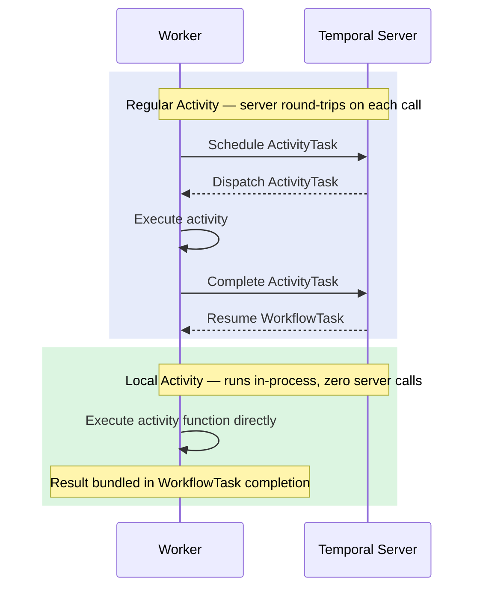

import Tabs from '@theme/Tabs';
import TabItem from '@theme/TabItem';

:::info[TLDR]
**Replace regular Activities with Local Activities to eliminate Temporal server round-trips and reduce per-Activity overhead to near zero.** This is best for short-lived, idempotent Activities that complete well within the Workflow Task timeout. Each Activity you convert saves approximately 50 ms of scheduling overhead on Temporal Cloud. If you haven't measured a latency problem, start with regular Activities—they are easier to debug, rate-limit, and monitor.
:::

## Overview

A **Local Activity** executes the Activity function directly inside the Worker process that is currently running the Workflow Task. The result is recorded as part of the same Workflow Task completion event, so no additional server calls occur between Activity invocations.



**Numbered walkthrough:**

1. A regular Activity follows a five-step exchange with the Temporal server: schedule, dispatch, execute, complete, then resume the Workflow Task. On Temporal Cloud, each round-trip adds approximately 50 ms.
2. A Local Activity bypasses all of that. The Workflow Task scheduler on the Worker invokes the Activity function directly. The result is folded into the WorkflowTask completion event sent at the end of the task.
3. For a Workflow with three serial Activities, switching all three to Local Activities can save 150 ms or more while keeping the exact same business logic.

## Problem

Workflows that call several short Activities in sequence accumulate significant latency from server scheduling overhead. A validation-and-reservation flow with three Activities may complete in 850 ms even when the actual computation takes only milliseconds. Every regular Activity incurs at least two server round-trips (schedule + complete), which becomes a bottleneck on latency-sensitive paths.

## Solution

Use `workflow.execute_local_activity` (Python), `proxyLocalActivities` (TypeScript), `workflow.ExecuteLocalActivity` (Go), or `Workflow.newLocalActivityStub` with `LocalActivityOptions` (Java) to run Activity functions in-process. The Activity executes inside the same Workflow Task and its result is available immediately—no scheduling overhead.

Local Activities are subject to the Workflow Task timeout (default 10 seconds) rather than an independent start-to-close timeout. Always configure the `scheduleToCloseTimeout` option (not `startToCloseTimeout`) to set an upper bound.

<Tabs groupId="language" queryString>
<TabItem value="python" label="Python">

```python
# workflows.py
from temporalio import workflow
from datetime import timedelta
from activities import validate_transaction, reserve_funds, settle_transaction

LOCAL_ACTIVITY_TIMEOUT = timedelta(seconds=10)

@workflow.defn
class TransactionWorkflow:
    @workflow.run
    async def run(self, req: TransactionRequest) -> Transaction:
        # All three activities run in-process — no server round-trips.
        tx = await workflow.execute_local_activity(
            validate_transaction, req,
            schedule_to_close_timeout=LOCAL_ACTIVITY_TIMEOUT,
        )
        tx = await workflow.execute_local_activity(
            reserve_funds, tx,
            schedule_to_close_timeout=LOCAL_ACTIVITY_TIMEOUT,
        )
        return await workflow.execute_local_activity(
            settle_transaction, tx,
            schedule_to_close_timeout=LOCAL_ACTIVITY_TIMEOUT,
        )
```

</TabItem>
<TabItem value="typescript" label="TypeScript">

```typescript
// workflows.ts
import { proxyLocalActivities } from "@temporalio/workflow";
import type * as activities from "./activities";

const { validateTransaction, reserveFunds, settleTransaction } =
  proxyLocalActivities<typeof activities>({ scheduleToCloseTimeout: "10s" });

export async function transactionWorkflow(
  req: TransactionRequest,
): Promise<Transaction> {
  // All three activities run in-process — no server round-trips.
  let tx = await validateTransaction(req);
  tx = await reserveFunds(tx);
  return settleTransaction(tx);
}
```

</TabItem>
<TabItem value="go" label="Go">

```go
// workflows.go
func TransactionWorkflow(ctx workflow.Context, req TransactionRequest) (Transaction, error) {
    localCtx := workflow.WithLocalActivityOptions(ctx, workflow.LocalActivityOptions{
        ScheduleToCloseTimeout: 10 * time.Second,
    })

    // All three activities run in-process — no server round-trips.
    var tx Transaction
    if err := workflow.ExecuteLocalActivity(localCtx, ValidateTransaction, req).Get(localCtx, &tx); err != nil {
        return Transaction{}, err
    }
    if err := workflow.ExecuteLocalActivity(localCtx, ReserveFunds, tx).Get(localCtx, &tx); err != nil {
        return Transaction{}, err
    }
    if err := workflow.ExecuteLocalActivity(localCtx, SettleTransaction, tx).Get(localCtx, &tx); err != nil {
        return Transaction{}, err
    }
    return tx, nil
}
```

</TabItem>
<TabItem value="java" label="Java">

```java
// TransactionWorkflow.java
public class Impl implements TransactionWorkflow {
    // All activities run as local — no server round-trips.
    private final Activities activities = Workflow.newLocalActivityStub(
        Activities.class,
        LocalActivityOptions.newBuilder()
            .setScheduleToCloseTimeout(Duration.ofSeconds(10))
            .build()
    );

    @Override
    public Shared.Transaction processTransaction(Shared.TransactionRequest req) {
        Shared.Transaction tx = activities.validateTransaction(req);
        tx = activities.reserveFunds(tx);
        return activities.settleTransaction(tx);
    }
}
```

</TabItem>
</Tabs>

## When to use

**Good fit:**

- Short-lived Activities that complete in milliseconds or a few seconds
- Idempotent operations safe to re-execute if a Workflow Task fails
- Hot-path Workflows where end-to-end latency is a product requirement
- CPU-bound or in-memory computations that do not need a separate worker pool

**Poor fit:**

- Activities that may run longer than the Workflow Task timeout (default 10 seconds)
- Activities that require heartbeating to detect stuck executions
- Operations with long retry back-off intervals—retry timers still schedule server events, reducing the latency benefit
- Non-idempotent operations where re-execution on Worker crash would cause harm
- Operations that need rate limiting or routing through task queue capacity controls—Local Activities bypass the task queue entirely and cannot be throttled by the server

## Benefits and trade-offs

| | Regular Activity | Local Activity |
|---|---|---|
| Server round-trips | 2–4 per call | 0 |
| Latency overhead | ~50 ms per call (Temporal Cloud) | Near zero |
| Heartbeat support | Yes | No |
| Execution timeout | `StartToCloseTimeout` | `ScheduleToCloseTimeout` |
| Retry semantics | Independent per attempt | Entire Workflow Task re-executes on failure |
| Dedicated worker pool | Yes (separate poller) | No (shares Workflow Task thread) |
| Rate limiting / routing | Yes (task queue capacity) | No (bypasses task queue) |
| Visible in Temporal UI | Full Activity history event | Recorded in Workflow Task event; no standalone Activity task in UI |

## Best practices

- **Design for at-least-once execution.** If a Workflow Task fails after a Local Activity completes but before the task is persisted, all Local Activities in that task re-execute on the next attempt. Your Activity logic must tolerate this.
- **Keep each Local Activity short.** Aim for well under 5 seconds to leave headroom for retries within the same Workflow Task, which has a 10-second default timeout.
- **Avoid blocking signal and update handlers.** While a Local Activity executes, the Workflow Task is occupied. Incoming signals and updates accumulate in the server buffer and are not processed until the next task begins.
- **Set retry policy carefully.** Large `initialInterval` or `maximumInterval` values in a retry policy still cause the SDK to schedule server-side timer events, which partially defeats the latency benefit.

## Common pitfalls

- **Exceeding the Workflow Task timeout.** If a Local Activity takes longer than the Workflow Task timeout (default 10 seconds), the entire task times out and retries—including any Local Activities that already completed in memory during that task.
- **Assuming exactly-once semantics.** Unlike regular Activities, a Local Activity does not get its own persisted history event until the Workflow Task completes. A crashed Worker causes the whole task to re-run. This compounds when Local Activities are chained: if a Worker crashes after the third of five sequential Local Activities, all five re-execute on the next attempt. If you need a durable checkpoint between each step, use regular Activities instead.
- **Long retry intervals.** Each retry attempt with back-off creates a server-side timer event. For truly short Activities, use a tight `scheduleToCloseTimeout` and allow immediate retries rather than spaced-out back-off.

## Related patterns

- [Early Return + Local Activities](/design-patterns/early-return-local-activities) — adds an Update-with-Start early-response path on top of Local Activities for minimum first-response latency
- [Early Return](/design-patterns/early-return) — returns a response to the caller before the Workflow finishes, independent of Local Activities
- [Eager Workflow Start](/design-patterns/eager-workflow-start) — eliminates the server Matching step when starting a Workflow for additional latency reduction
- [Long Running Activity](/design-patterns/long-running-activity) — the right choice when Activities need heartbeating and long execution windows
