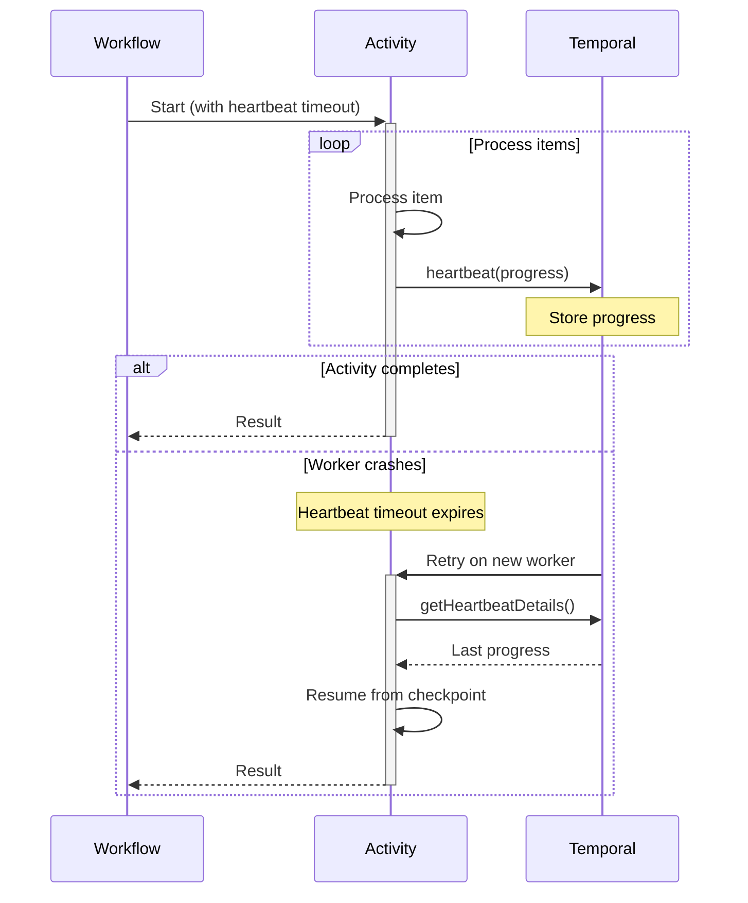

import Tabs from '@theme/Tabs';
import TabItem from '@theme/TabItem';

## Overview

The Activity Heartbeat pattern enables long-running Activities to report progress, handle cancellation gracefully, and resume from the last checkpoint after failures.
Heartbeats inform Temporal that the Activity is still alive and allow storing progress details that survive Worker restarts.

## Problem

In long-running operations, you often need Activities that process large datasets or perform time-consuming operations (minutes to hours), report progress to avoid appearing stuck or timing out, resume from the last checkpoint after Worker crashes or restarts, handle cancellation requests gracefully and clean up resources, and avoid reprocessing already-completed work.

Without heartbeats, you must set very long Activity timeouts that delay failure detection, reprocess entire batches from the beginning on failures, accept no visibility into Activity progress, risk zombie Activities that appear alive but are stuck, and implement custom checkpointing and recovery logic.

## Solution

Activity heartbeats periodically report progress to the Temporal Service.
The heartbeat details are persisted and available to retry attempts, enabling resumption from the last checkpoint.
Heartbeat timeouts detect stuck Activities faster than execution timeouts.



The following describes each step in the diagram:

1. The Workflow starts the Activity with a heartbeat timeout.
2. The Activity processes items in a loop, heartbeating progress after each batch.
3. If the Activity completes normally, it returns the result to the Workflow.
4. If the Worker crashes, the heartbeat timeout expires and Temporal retries the Activity on a new Worker. The new attempt retrieves the last heartbeat details and resumes from the checkpoint.

## Implementation

### Basic progress tracking

The following implementation processes a large file line by line, heartbeating every 100 lines.
On retry, it retrieves the last processed line number and skips ahead:

<Tabs groupId="language" queryString>
<TabItem value="python" label="Python" default>

```python
# activities.py
from temporalio import activity

@activity.defn
async def process_large_file(file_path: str) -> None:
    details = activity.info().heartbeat_details
    start_line = details[0] if details else 0

    with open(file_path, "r") as f:
        for i, line in enumerate(f):
            if i < start_line:
                continue

            process_line(line)

            if (i + 1) % 100 == 0:
                activity.heartbeat(i + 1)
```

</TabItem>
<TabItem value="go" label="Go">

```go
// activities.go
func ProcessLargeFile(ctx context.Context, filePath string) error {
	startLine := 0
	if activity.HasHeartbeatDetails(ctx) {
		if err := activity.GetHeartbeatDetails(ctx, &startLine); err != nil {
			return err
		}
	}

	file, err := os.Open(filePath)
	if err != nil {
		return err
	}
	defer file.Close()

	scanner := bufio.NewScanner(file)
	currentLine := 0
	for scanner.Scan() {
		if currentLine < startLine {
			currentLine++
			continue
		}

		processLine(scanner.Text())
		currentLine++

		if currentLine%100 == 0 {
			activity.RecordHeartbeat(ctx, currentLine)
		}
	}
	return scanner.Err()
}
```

</TabItem>
<TabItem value="java" label="Java">

```java
// FileProcessingActivityImpl.java
@ActivityInterface
public interface FileProcessingActivity {
  void processLargeFile(String filePath);
}

public class FileProcessingActivityImpl implements FileProcessingActivity {
  @Override
  public void processLargeFile(String filePath) {
    ActivityExecutionContext context = Activity.getExecutionContext();
    Optional<Integer> lastProcessedLine = context.getHeartbeatDetails(Integer.class);
    int startLine = lastProcessedLine.orElse(0);

    try (BufferedReader reader = new BufferedReader(new FileReader(filePath))) {
      for (int i = 0; i < startLine; i++) {
        reader.readLine();
      }

      String line;
      int currentLine = startLine;
      while ((line = reader.readLine()) != null) {
        processLine(line);
        currentLine++;

        if (currentLine % 100 == 0) {
          context.heartbeat(currentLine);
        }
      }
    }
  }
}
```

</TabItem>
<TabItem value="typescript" label="TypeScript">

```typescript
// activities.ts
import { heartbeat, activityInfo } from '@temporalio/activity';
import { createReadStream } from 'fs';
import { createInterface } from 'readline';

export async function processLargeFile(filePath: string): Promise<void> {
  const startLine = activityInfo().heartbeatDetails ?? 0;

  const rl = createInterface({
    input: createReadStream(filePath),
  });

  let currentLine = 0;
  for await (const line of rl) {
    if (currentLine < startLine) {
      currentLine++;
      continue;
    }

    processLine(line);
    currentLine++;

    if (currentLine % 100 === 0) {
      heartbeat(currentLine);
    }
  }
}
```

</TabItem>
</Tabs>

The heartbeat details call retrieves the last heartbeat value from a previous attempt.
If this is the first attempt, there are no details and the Activity starts from line 0.
The Activity heartbeats every 100 lines, storing the current line number as the checkpoint.

### Handling cancellation

The following implementation adds cancellation support.
The Activity checks for cancellation on each heartbeat and cleans up resources before exiting:

<Tabs groupId="language" queryString>
<TabItem value="python" label="Python" default>

```python
# activities.py
import asyncio
from temporalio import activity

@activity.defn
async def process_large_file(file_path: str) -> None:
    details = activity.info().heartbeat_details
    current_line = details[0] if details else 0

    try:
        with open(file_path, "r") as f:
            for i, line in enumerate(f):
                if i < current_line:
                    continue

                activity.heartbeat(i)
                process_line(line)
                current_line = i + 1
    except asyncio.CancelledError:
        cleanup_resources()
        raise
```

</TabItem>
<TabItem value="go" label="Go">

```go
// activities.go
func ProcessLargeFile(ctx context.Context, filePath string) error {
	currentLine := 0
	if activity.HasHeartbeatDetails(ctx) {
		if err := activity.GetHeartbeatDetails(ctx, &currentLine); err != nil {
			return err
		}
	}

	file, err := os.Open(filePath)
	if err != nil {
		return err
	}
	defer file.Close()

	scanner := bufio.NewScanner(file)
	for scanner.Scan() {
		if currentLine > 0 {
			currentLine--
			continue
		}

		activity.RecordHeartbeat(ctx, currentLine)

		// Check if the Activity has been cancelled
		select {
		case <-ctx.Done():
			cleanupResources()
			return ctx.Err()
		default:
		}

		processLine(scanner.Text())
		currentLine++
	}
	return scanner.Err()
}
```

</TabItem>
<TabItem value="java" label="Java">

```java
// FileProcessingActivityImpl.java
public class FileProcessingActivityImpl implements FileProcessingActivity {
  @Override
  public void processLargeFile(String filePath) {
    ActivityExecutionContext context = Activity.getExecutionContext();
    Optional<Integer> lastProcessedLine = context.getHeartbeatDetails(Integer.class);
    int currentLine = lastProcessedLine.orElse(0);

    try (BufferedReader reader = new BufferedReader(new FileReader(filePath))) {
      for (int i = 0; i < currentLine; i++) {
        reader.readLine();
      }

      String line;
      while ((line = reader.readLine()) != null) {
        context.heartbeat(currentLine);
        processLine(line);
        currentLine++;
      }
    } catch (CanceledFailure e) {
      cleanupResources();
      throw e;
    }
  }
}
```

</TabItem>
<TabItem value="typescript" label="TypeScript">

```typescript
// activities.ts
import { heartbeat, activityInfo, sleep } from '@temporalio/activity';
import { CancelledFailure } from '@temporalio/common';
import { createReadStream } from 'fs';
import { createInterface } from 'readline';

export async function processLargeFile(filePath: string): Promise<void> {
  const startLine = activityInfo().heartbeatDetails ?? 0;

  const rl = createInterface({
    input: createReadStream(filePath),
  });

  let currentLine = 0;
  try {
    for await (const line of rl) {
      if (currentLine < startLine) {
        currentLine++;
        continue;
      }

      heartbeat(currentLine);
      processLine(line);
      currentLine++;
    }
  } catch (err) {
    if (err instanceof CancelledFailure) {
      cleanupResources();
    }
    throw err;
  }
}
```

</TabItem>
</Tabs>

Cancellation is delivered to the Activity when it heartbeats.
In Java, the next `heartbeat()` call throws a `CanceledFailure`.
In TypeScript, cancellation is delivered as a `CancelledFailure` via `sleep()` or `Context.current().cancelled`.
In Python, cancellation is delivered as an `asyncio.CancelledError`.
In Go, the context is cancelled and `ctx.Done()` becomes readable.
The catch/error handling block performs cleanup before re-throwing the error.

### Complex progress state

The following implementation tracks multiple progress fields -- processed count, failed count, and the last processed ID:

<Tabs groupId="language" queryString>
<TabItem value="python" label="Python" default>

```python
# activities.py
from dataclasses import dataclass
from temporalio import activity

@dataclass
class ProgressState:
    processed_count: int = 0
    failed_count: int = 0
    last_processed_id: str = ""

@activity.defn
async def process_batch(item_ids: list[str]) -> dict:
    details = activity.info().heartbeat_details
    progress = details[0] if details else ProgressState()

    start_index = (
        item_ids.index(progress.last_processed_id) + 1
        if progress.last_processed_id
        else 0
    )

    for i in range(start_index, len(item_ids)):
        item_id = item_ids[i]

        try:
            await process_item(item_id)
            progress.processed_count += 1
        except Exception:
            progress.failed_count += 1

        progress.last_processed_id = item_id
        activity.heartbeat(progress)

    return {
        "processed_count": progress.processed_count,
        "failed_count": progress.failed_count,
    }
```

</TabItem>
<TabItem value="go" label="Go">

```go
// activities.go
type ProgressState struct {
	ProcessedCount  int    `json:"processedCount"`
	FailedCount     int    `json:"failedCount"`
	LastProcessedID string `json:"lastProcessedId"`
}

type BatchResult struct {
	ProcessedCount int `json:"processedCount"`
	FailedCount    int `json:"failedCount"`
}

func ProcessBatch(ctx context.Context, itemIDs []string) (BatchResult, error) {
	progress := ProgressState{}
	if activity.HasHeartbeatDetails(ctx) {
		if err := activity.GetHeartbeatDetails(ctx, &progress); err != nil {
			return BatchResult{}, err
		}
	}

	startIndex := 0
	if progress.LastProcessedID != "" {
		for i, id := range itemIDs {
			if id == progress.LastProcessedID {
				startIndex = i + 1
				break
			}
		}
	}

	for i := startIndex; i < len(itemIDs); i++ {
		itemID := itemIDs[i]

		if err := processItem(ctx, itemID); err != nil {
			progress.FailedCount++
		} else {
			progress.ProcessedCount++
		}

		progress.LastProcessedID = itemID
		activity.RecordHeartbeat(ctx, progress)
	}

	return BatchResult{
		ProcessedCount: progress.ProcessedCount,
		FailedCount:    progress.FailedCount,
	}, nil
}
```

</TabItem>
<TabItem value="java" label="Java">

```java
// BatchProcessingActivityImpl.java
public class BatchProcessingActivityImpl implements BatchProcessingActivity {

  static class ProgressState {
    int processedCount;
    int failedCount;
    String lastProcessedId;
  }

  @Override
  public BatchResult processBatch(List<String> itemIds) {
    ActivityExecutionContext context = Activity.getExecutionContext();
    Optional<ProgressState> details = context.getHeartbeatDetails(ProgressState.class);
    ProgressState progress = details.orElse(new ProgressState());

    int startIndex = itemIds.indexOf(progress.lastProcessedId) + 1;

    for (int i = startIndex; i < itemIds.size(); i++) {
      String itemId = itemIds.get(i);

      try {
        processItem(itemId);
        progress.processedCount++;
      } catch (Exception e) {
        progress.failedCount++;
      }

      progress.lastProcessedId = itemId;
      context.heartbeat(progress);
    }

    return new BatchResult(progress.processedCount, progress.failedCount);
  }
}
```

</TabItem>
<TabItem value="typescript" label="TypeScript">

```typescript
// activities.ts
import { heartbeat, activityInfo } from '@temporalio/activity';

interface ProgressState {
  processedCount: number;
  failedCount: number;
  lastProcessedId: string;
}

export async function processBatch(itemIds: string[]): Promise<BatchResult> {
  const saved: ProgressState = activityInfo().heartbeatDetails ?? {
    processedCount: 0,
    failedCount: 0,
    lastProcessedId: '',
  };

  const startIndex = saved.lastProcessedId
    ? itemIds.indexOf(saved.lastProcessedId) + 1
    : 0;

  const progress = { ...saved };

  for (let i = startIndex; i < itemIds.length; i++) {
    const itemId = itemIds[i];

    try {
      await processItem(itemId);
      progress.processedCount++;
    } catch {
      progress.failedCount++;
    }

    progress.lastProcessedId = itemId;
    heartbeat(progress);
  }

  return { processedCount: progress.processedCount, failedCount: progress.failedCount };
}
```

</TabItem>
</Tabs>

The progress state object stores all the checkpoint data needed to resume.
On retry, the Activity finds the index of the last processed ID and starts from the next item.
Each heartbeat stores the full progress state, so the next attempt has everything it needs to resume.

## When to use

The Heartbeat pattern is a good fit for batch processing of large datasets, file uploads and downloads with progress tracking, database migrations or bulk operations, long-running computations (ML training, video encoding), external API polling with multiple attempts, and any Activity running longer than 30 seconds.

It is not a good fit for quick operations (under 10 seconds), operations that cannot be checkpointed, Activities requiring exact-once semantics without idempotency, or real-time streaming (use Workflows instead).

## Benefits and trade-offs

Heartbeats enable fault tolerance by resuming from the last checkpoint after failures.
Heartbeat timeouts detect stuck Activities faster than execution timeouts.
You gain visibility into Activity progress in real-time.
Activities can handle cancellation gracefully and clean up resources.
Completed work is not reprocessed, and Activities can move between Workers.

The trade-offs to consider are that frequent heartbeats increase network traffic.
You must implement checkpointing logic and state management.
You must handle partial reprocessing of the last checkpoint (idempotency).
You need to balance heartbeat frequency between responsiveness and overhead.
Heartbeat details have size limits, so you should avoid large objects.

## Comparison with alternatives

| Approach | Progress tracking | Resumable | Cancellation | Complexity |
| :--- | :--- | :--- | :--- | :--- |
| Heartbeat | Yes | Yes | Graceful | Medium |
| Long Timeout | No | No | Delayed | Low |
| Child Workflows | Yes | Yes | Immediate | High |
| Local Activity | No | No | N/A | Low |

## Best practices

- **Set heartbeat timeout.** Configure to 2-3x the expected heartbeat interval.
- **Heartbeat at regular intervals.** Balance between responsiveness (every 10-30 seconds) and overhead.
- **Checkpoint strategically.** Save progress at meaningful boundaries (records, pages, chunks).
- **Keep details small.** Store minimal state (IDs, offsets, counts), not full objects.
- **Handle idempotency.** Ensure reprocessing the last checkpoint is safe.
- **Check cancellation.** Heartbeat regularly to detect cancellation quickly.
- **Clean up on cancel.** Handle cancellation errors appropriately: catch `CanceledFailure` (Java), `CancelledFailure` (TypeScript), `asyncio.CancelledError` (Python), or check `ctx.Done()` (Go).
- **Log progress.** Log heartbeat details for debugging and monitoring.
- **Test resumption.** Verify Activities resume correctly after simulated failures.
- **Avoid heartbeat spam.** Do not heartbeat on every iteration of tight loops.

## Common pitfalls

- **Missing HeartbeatTimeout.** Without a HeartbeatTimeout, Temporal cannot detect a stuck or crashed Worker until the StartToCloseTimeout expires. Always set HeartbeatTimeout shorter than StartToCloseTimeout.
- **Heartbeating too infrequently.** Cancellation is only delivered on the next heartbeat. If the Activity heartbeats every 5 minutes, cancellation takes up to 5 minutes to propagate.
- **Not resuming from heartbeat progress on retry.** When an Activity retries, retrieve the last heartbeat details -- `context.getHeartbeatDetails()` (Java), `activityInfo().heartbeatDetails` (TypeScript), `activity.info().heartbeat_details` (Python), or `activity.GetHeartbeatDetails()` (Go) -- and resume from the last checkpoint instead of restarting from scratch.
- **Catching the wrong exception for cancellation.** Cancellation is SDK-specific: `CanceledFailure` (Java), `CancelledFailure` (TypeScript), `asyncio.CancelledError` (Python), or `ctx.Err()` returning `context.Canceled` (Go).

## Related patterns

- **[Saga Pattern](/design-patterns/saga-pattern)**: Compensating transactions with long-running steps.
- **[Polling](/design-patterns/polling)**: Heartbeating Activity for frequent polling.

## Sample code

### Java
- [Heartbeating Activity Batch](https://github.com/temporalio/samples-java/tree/main/core/src/main/java/io/temporal/samples/batch/heartbeatingactivity) -- Complete batch processing implementation.
- [Auto-Heartbeating](https://github.com/temporalio/samples-java/tree/main/core/src/main/java/io/temporal/samples/autoheartbeat) -- Automatic heartbeating via interceptor.

### TypeScript
- [Activities Cancellation and Heartbeating](https://github.com/temporalio/samples-typescript/tree/main/activities-cancellation-heartbeating) -- Activity cancellation and heartbeat-based resumption.

### Python
- [Hello Cancellation](https://github.com/temporalio/samples-python/blob/main/hello/hello_cancellation.py) -- Activity heartbeating with cancellation handling.
- [Custom Decorator Heartbeat](https://github.com/temporalio/samples-python/blob/main/custom_decorator/activity_utils.py) -- Automatic heartbeating via decorator.

### Go
- [Cancellation](https://github.com/temporalio/samples-go/tree/main/cancellation) -- Workflow and Activity cancellation with heartbeating.
