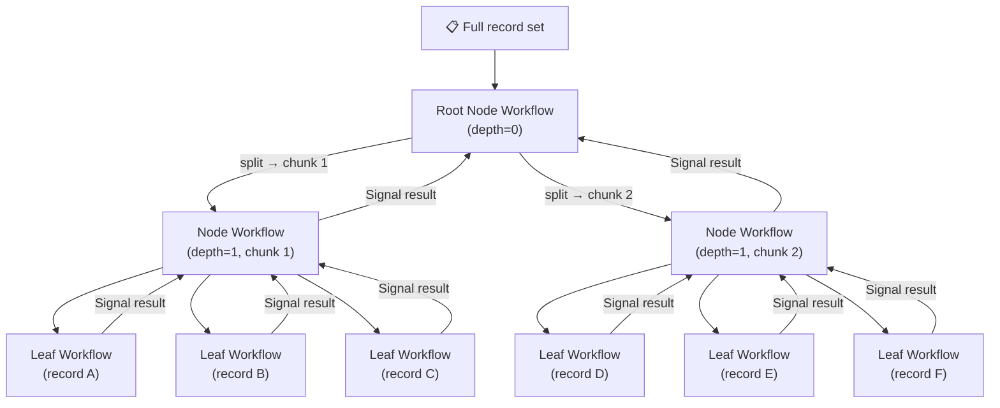

import Tabs from '@theme/Tabs';
import TabItem from '@theme/TabItem';

:::info[TLDR]
Recursively split a record set into a tree of child Workflows — each node fans out to N sub-slices (two by default) — process every leaf in parallel, and signal results back up the tree to the root. Use this when you need **maximum throughput** for an embarrassingly parallel workload and downstream systems can absorb an unbounded burst of concurrent requests.
:::

## Overview

The MapReduce Tree pattern processes a large record set with maximum parallelism by recursively splitting it into smaller chunks and distributing each chunk to a child Workflow. Results are signalled back up the tree to the parent. It is best suited for embarrassingly parallel workloads where speed matters more than rate limiting.

## Problem

Both the [Batch Iterator](/design-patterns/batch-iterator) and [Sliding Window](/design-patterns/sliding-window) patterns bound concurrency, which limits throughput. When you need to process a large record set as fast as possible and downstream systems can handle the load, you want to fan out work across as many concurrent processors as possible without a fixed window.

You also need a way to handle record sets larger than what a single Workflow's concurrency limits allow, without pre-partitioning data into fixed chunks before the job starts.

## Solution

A Node Workflow receives a slice of records. If the slice is small enough (at or below a configurable `leafThreshold`), it starts one Leaf Workflow per record. Otherwise it splits the slice into `n` sub-slices and starts `n` Node child Workflows recursively.

Each Leaf Workflow runs the actual processing Activity and signals its result back to its parent Node. Each Node aggregates the results it receives and signals them up to its own parent. The Root Node returns the final aggregated result.



The following describes each step in the diagram:

1. The Root Node Workflow receives the full record set and `depth=0`.
2. Because the record set is larger than `leafThreshold`, the Root splits it into N chunks and starts N child Node Workflows (two in this example, but the split factor is configurable).
3. Each Node Workflow receives its chunk and checks its size against `leafThreshold`. In this example, each chunk is small enough, so each Node starts one Leaf Workflow per record.
4. Each Leaf Workflow calls the `processRecord` Activity and, when complete, signals its result back to its parent Node using `signalExternalWorkflow`.
5. Each Node collects all leaf results via signal handlers, aggregates them, and signals the aggregated result back to the Root.
6. The Root collects both node results and returns the final aggregate.

## Implementation


The following examples show how each SDK implements the MapReduce Tree pattern.

<Tabs groupId="language" queryString>
<TabItem value="typescript" label="TypeScript" default>

```typescript
// workflows.ts
import {
  condition,
  defineSignal,
  getExternalWorkflowHandle,
  proxyActivities,
  setHandler,
  startChild,
  workflowInfo,
} from "@temporalio/workflow";
import type * as activities from "./activities";
import { TASK_QUEUE, LEAF_THRESHOLD, MAX_DEPTH } from "./shared";

const { processRecord } = proxyActivities<typeof activities>({
  startToCloseTimeout: "30 seconds",
});

interface ResultPayload {
  id: string;
  results: string[];
}

export const resultSignal = defineSignal<[ResultPayload]>("leafResult");

export async function leafWorkflow(
  record: string,
  parentWorkflowId: string
): Promise<void> {
  const result = await processRecord(record);
  // Signal result back to parent node.
  const parent = getExternalWorkflowHandle(parentWorkflowId);
  await parent.signal(resultSignal, { id: record, results: [result] });
}

export async function nodeWorkflow(
  records: string[],
  depth: number = 0,
  parentWorkflowId: string = ""
): Promise<string[]> {
  if (depth > MAX_DEPTH) {
    throw new Error(`Tree depth exceeded ${MAX_DEPTH}`);
  }

  const myId = workflowInfo().workflowId;
  const collectedResults: string[] = [];
  let received = 0;
  let expected = 0;

  setHandler(resultSignal, (payload: ResultPayload) => {
    collectedResults.push(...payload.results);
    received++;
  });

  if (records.length <= LEAF_THRESHOLD) {
    // Start one leaf per record.
    expected = records.length;
    for (const record of records) {
      void startChild(leafWorkflow, {
        args: [record, myId],
        workflowId: `${myId}/leaf-${record}`,
        taskQueue: TASK_QUEUE,
      });
    }
  } else {
    // Split and recurse.
    const mid = Math.floor(records.length / 2);
    const chunks = [records.slice(0, mid), records.slice(mid)];
    expected = chunks.length;
    for (let i = 0; i < chunks.length; i++) {
      void startChild(nodeWorkflow, {
        args: [chunks[i], depth + 1, myId],
        workflowId: `${myId}/node-d${depth + 1}-${i}`,
        taskQueue: TASK_QUEUE,
      });
    }
  }

  // Wait until all expected signals have arrived.
  await condition(() => received >= expected);

  // Signal aggregated results up to parent (if this is not the root).
  if (parentWorkflowId) {
    const parent = getExternalWorkflowHandle(parentWorkflowId);
    await parent.signal(resultSignal, { id: myId, results: collectedResults });
  }

  return collectedResults;
}
```

</TabItem>
<TabItem value="python" label="Python">

```python
# workflows.py
import asyncio
from datetime import timedelta
from temporalio import workflow
from activities import process_record
from shared import TASK_QUEUE, LEAF_THRESHOLD, MAX_DEPTH

RESULT_SIGNAL = "leafResult"


@workflow.defn
class LeafWorkflow:
    @workflow.run
    async def run(self, record: str, parent_workflow_id: str) -> None:
        result = await workflow.execute_activity(
            process_record,
            record,
            start_to_close_timeout=timedelta(seconds=30),
        )
        handle = workflow.get_external_workflow_handle(parent_workflow_id)
        await handle.signal(RESULT_SIGNAL, [record, result])


@workflow.defn
class NodeWorkflow:
    def __init__(self) -> None:
        self._results: list[str] = []

    @workflow.signal(name=RESULT_SIGNAL)
    def leaf_result(self, record: str, result: str) -> None:
        self._results.append(result)

    @workflow.run
    async def run(
        self,
        records: list[str],
        depth: int = 0,
        parent_workflow_id: str = "",
    ) -> list[str]:
        if depth > MAX_DEPTH:
            raise RuntimeError(f"Tree depth exceeded {MAX_DEPTH}")

        my_id = workflow.info().workflow_id
        expected = 0

        if len(records) <= LEAF_THRESHOLD:
            for record in records:
                await workflow.start_child_workflow(
                    LeafWorkflow.run,
                    args=[record, my_id],
                    id=f"{my_id}/leaf-{record}",
                    task_queue=TASK_QUEUE,
                )
            expected = len(records)
        else:
            mid = len(records) // 2
            chunks = [records[:mid], records[mid:]]
            for i, chunk in enumerate(chunks):
                await workflow.start_child_workflow(
                    NodeWorkflow.run,
                    args=[chunk, depth + 1, my_id],
                    id=f"{my_id}/node-d{depth+1}-{i}",
                    task_queue=TASK_QUEUE,
                )
            expected = len(chunks)

        await workflow.wait_condition(lambda: len(self._results) >= expected)

        if parent_workflow_id:
            handle = workflow.get_external_workflow_handle(parent_workflow_id)
            await handle.signal(RESULT_SIGNAL, [my_id, ",".join(self._results)])

        return self._results
```

</TabItem>
<TabItem value="go" label="Go">

```go
// workflows.go
package main

import (
	"fmt"
	"strings"
	"time"

	"go.temporal.io/sdk/workflow"
)

const ResultSignal = "leafResult"

type ResultPayload struct {
	ID     string
	Result string
}

func LeafWorkflow(ctx workflow.Context, record string, parentWorkflowID string) error {
	ao := workflow.ActivityOptions{StartToCloseTimeout: 30 * time.Second}
	ctx = workflow.WithActivityOptions(ctx, ao)

	var result string
	if err := workflow.ExecuteActivity(ctx, ProcessRecord, record).Get(ctx, &result); err != nil {
		return err
	}

	return workflow.SignalExternalWorkflow(ctx, parentWorkflowID, "", ResultSignal,
		ResultPayload{ID: record, Result: result}).Get(ctx, nil)
}

func NodeWorkflow(ctx workflow.Context, records []string, depth int, parentWorkflowID string) ([]string, error) {
	if depth > MaxDepth {
		return nil, fmt.Errorf("tree depth exceeded %d", MaxDepth)
	}

	myID := workflow.GetInfo(ctx).WorkflowExecution.ID
	resultCh := workflow.GetSignalChannel(ctx, ResultSignal)

	var results []string
	expected := 0

	if len(records) <= LeafThreshold {
		for _, record := range records {
			cwo := workflow.ChildWorkflowOptions{
				WorkflowID: myID + "/leaf-" + record,
				TaskQueue:  TaskQueue,
			}
			workflow.ExecuteChildWorkflow(workflow.WithChildOptions(ctx, cwo), LeafWorkflow, record, myID)
			expected++
		}
	} else {
		mid := len(records) / 2
		chunks := [][]string{records[:mid], records[mid:]}
		for i, chunk := range chunks {
			cwo := workflow.ChildWorkflowOptions{
				WorkflowID: fmt.Sprintf("%s/node-d%d-%d", myID, depth+1, i),
				TaskQueue:  TaskQueue,
			}
			workflow.ExecuteChildWorkflow(workflow.WithChildOptions(ctx, cwo), NodeWorkflow, chunk, depth+1, myID)
			expected++
		}
	}

	for i := 0; i < expected; i++ {
		var payload ResultPayload
		resultCh.Receive(ctx, &payload)
		results = append(results, payload.Result)
	}

	if parentWorkflowID != "" {
		err := workflow.SignalExternalWorkflow(ctx, parentWorkflowID, "", ResultSignal,
			ResultPayload{ID: myID, Result: strings.Join(results, ",")}).Get(ctx, nil)
		if err != nil {
			return results, err
		}
	}

	return results, nil
}
```

</TabItem>
<TabItem value="java" label="Java">

```java
// NodeWorkflow.java
import io.temporal.workflow.*;
import java.util.*;

@WorkflowInterface
public interface NodeWorkflow {
    @WorkflowMethod
    List<String> run(List<String> records, int depth, String parentWorkflowId);

    @SignalMethod
    void leafResult(String id, String result);
}

// NodeWorkflowImpl.java
public class NodeWorkflowImpl implements NodeWorkflow {
    private final List<String> results = new ArrayList<>();

    @Override
    public void leafResult(String id, String result) {
        results.add(result);
    }

    @Override
    public List<String> run(List<String> records, int depth, String parentWorkflowId) {
        if (depth > Shared.MAX_DEPTH) {
            throw new RuntimeException("Tree depth exceeded " + Shared.MAX_DEPTH);
        }

        String myId = Workflow.getInfo().getWorkflowId();
        int expected;

        if (records.size() <= Shared.LEAF_THRESHOLD) {
            for (String record : records) {
                ChildWorkflowOptions opts = ChildWorkflowOptions.newBuilder()
                    .setWorkflowId(myId + "/leaf-" + record)
                    .setTaskQueue(Shared.TASK_QUEUE)
                    .build();
                LeafWorkflow leaf = Workflow.newChildWorkflowStub(LeafWorkflow.class, opts);
                Async.procedure(leaf::run, record, myId);
            }
            expected = records.size();
        } else {
            int mid = records.size() / 2;
            List<List<String>> chunks = List.of(records.subList(0, mid), records.subList(mid, records.size()));
            for (int i = 0; i < chunks.size(); i++) {
                ChildWorkflowOptions opts = ChildWorkflowOptions.newBuilder()
                    .setWorkflowId(String.format("%s/node-d%d-%d", myId, depth + 1, i))
                    .setTaskQueue(Shared.TASK_QUEUE)
                    .build();
                NodeWorkflow child = Workflow.newChildWorkflowStub(NodeWorkflow.class, opts);
                Async.function(child::run, chunks.get(i), depth + 1, myId);
            }
            expected = chunks.size();
        }

        Workflow.await(() -> results.size() >= expected);

        if (parentWorkflowId != null && !parentWorkflowId.isEmpty()) {
            ExternalWorkflowStub parent = Workflow.newUntypedExternalWorkflowStub(parentWorkflowId, "");
            parent.signal("leafResult", myId, String.join(",", results));
        }

        return results;
    }
}
```

</TabItem>
</Tabs>

## Best Practices

- **Set a `leafThreshold` to control tree depth.** A threshold of 3–10 records per leaf is typical. Too small a threshold creates excessive Workflow overhead; too large prevents full parallelism.
- **Set a `MAX_DEPTH` guard.** Recursive fan-out without a depth limit can produce extremely deep trees for large record sets. Fail fast if depth exceeds your expected maximum (e.g. `log2(totalRecords / leafThreshold) + 2`).
- **Avoid external writes in Node Workflows.** Node Workflows only aggregate results from children. Leaf Workflows perform the actual work. Keeping the roles separate prevents duplicate external writes if a Node is retried.
- **Use signals for result aggregation, not return values.** A parent cannot directly await a child started in a previous Workflow run. Signals decouple the result delivery from the parent-child lifetime, making the pattern resilient to replays.
- **Skip the reduce phase if results are not needed.** If you only need the side effects of processing each record (writes to a database, messages sent), omit the signal-back entirely and set `PARENT_CLOSE_POLICY_ABANDON` on all children.
- **Consider replacing Leaf Workflows with Activities for simpler workloads.** Leaf Workflows give each record its own history, independent cancellation, and dedicated visibility in the UI — useful when per-record observability matters. If those properties are not required, executing the `processRecord` Activity directly from a Node Workflow reduces overhead: each Leaf Workflow start and completion adds roughly 3 extra history events to the Node's history compared to a direct Activity call.

## Common Pitfalls

- **Thundering herd.** The MapReduce Tree fans out exponentially. For large record sets, all leaf Activities start nearly simultaneously. Ensure your downstream system can absorb the burst, or switch to [Sliding Window](/design-patterns/sliding-window) for rate limiting.
- **Signal storms.** If thousands of leaves all signal a single Node at the same time, the Node's signal queue can become a bottleneck. A two-level tree (Root → Nodes → Leaves) distributes this load; a deeper tree helps even more.
- **History bloat in the Root Workflow.** Each child start and signal received adds events to the Root's history. For very large record sets, consider adding an extra tree level to keep the Root from receiving too many direct signals.
- **Attempting external/downstream writes from Node Workflows.** Nodes may be retried. Any external write in a Node Workflow will be executed multiple times. Keep all side effects in Leaf Workflows (or Activities called by Leaves).

## Related Resources

- [Fan-Out with Child Workflows](/design-patterns/fanout-child-workflows) — simpler flat fan-out for smaller record sets
- [Sliding Window](/design-patterns/sliding-window) — bounded concurrency with rate limiting
- [Child Workflows pattern](/design-patterns/child-workflows) — core concepts for parent/child coordination
- [Temporal limits reference](https://docs.temporal.io/cloud/limits)
