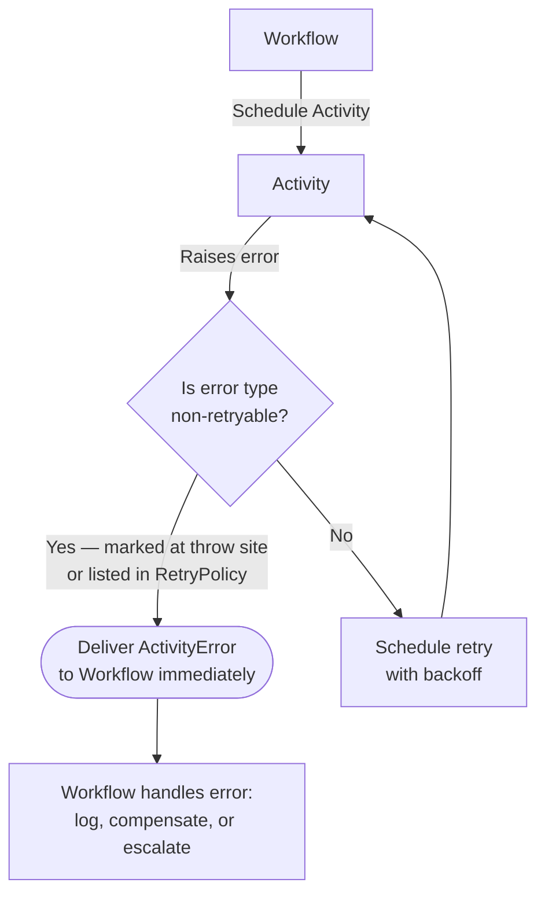

import Tabs from '@theme/Tabs';
import TabItem from '@theme/TabItem';

:::info[TLDR]
Raise a non-retryable `ApplicationError` from the Activity — or list error types in the `RetryPolicy` — so **the Temporal Activity fails fast instead of retrying indefinitely**. Use this for permanent failures such as invalid input, missing records, or authorization errors where repeating the same call will never succeed.
:::

## Overview

The Non-Retryable Errors pattern marks specific error types so Temporal stops retrying immediately when one is raised.
Use it for failures where the root cause is structural — invalid input, a missing record, an authorization problem — where repeating the same call will never produce a different result.

## Problem

Temporal retries all Activity failures by default.
For transient infrastructure errors such as network timeouts or service restarts, this is the right behavior.
But some failures are permanent: no amount of retrying will fix them.

Retrying a permanent failure wastes time and resources:

- A transfer to a non-existent account number will fail on attempt 1, 2, and 3 in exactly the same way.
- An API call with a malformed request body will be rejected every time.
- A request from a revoked API key will receive an authorization error on every attempt.

With the default unlimited retry policy, the Workflow waits through exponential backoff delays — minutes to hours — before eventually delivering the error to the Workflow, when it could have failed in milliseconds.

## Solution

Raise a non-retryable error from inside the Activity when the failure is known to be permanent.
Temporal detects the error type and skips all remaining retries, delivering the failure to the Workflow immediately.

There are two complementary mechanisms:

1. **Mark the error as non-retryable at the throw site** — the Activity explicitly signals that this specific failure should not be retried.
2. **Register non-retryable error types in the `RetryPolicy`** — the Workflow declares which error type names should never be retried, regardless of how the Activity raises them.

Both mechanisms can be used together.



The following describes each path:

1. The Activity raises an error. Temporal inspects whether the error type is non-retryable.
2. If non-retryable — either because the Activity flagged it or the `RetryPolicy` lists the type — Temporal delivers the `ActivityError` to the Workflow without delay.
3. If retryable, Temporal schedules another attempt after the configured backoff.
4. The Workflow catches the `ActivityError` and handles it according to the business logic.

## Implementation


### Marking an error as non-retryable at the throw site

Use the SDK's `ApplicationError` (or equivalent) with the non-retryable flag.
Temporal propagates the error type name and the flag to the Workflow without retrying.

<Tabs groupId="language" queryString>
<TabItem value="python" label="Python" default>

```python
# activities.py
from temporalio import activity
from temporalio.exceptions import ApplicationError

@activity.defn
async def process_order(order_id: str) -> str:
    response = await http_client.post(f"/orders/{order_id}/process")
    if response.status_code == 404:
        raise ApplicationError(
            f"Order {order_id} not found",
            type="OrderNotFoundError",
            non_retryable=True,
        )
    if response.status_code == 422:
        raise ApplicationError(
            f"Order {order_id} rejected: {response.json().get('detail', 'validation error')}",
            type="ValidationError",
            non_retryable=True,
        )

    response.raise_for_status()
    return response.json()["confirmation_id"]
```

</TabItem>
<TabItem value="go" label="Go">

```go
// activities.go
package orders

import (
    "context"
    "fmt"

    "go.temporal.io/sdk/temporal"
)

func ProcessOrder(ctx context.Context, orderID string) (string, error) {
    resp, err := httpClient.Post(fmt.Sprintf("/orders/%s/process", orderID))
    if err != nil {
        return "", err
    }
    if resp.StatusCode == 404 {
        return "", temporal.NewNonRetryableApplicationError(
            fmt.Sprintf("order %s not found", orderID),
            "OrderNotFoundError",
            nil,
        )
    }
    if resp.StatusCode == 422 {
        return "", temporal.NewNonRetryableApplicationError(
            fmt.Sprintf("order %s rejected: %s", orderID, resp.ErrorDetail),
            "ValidationError",
            nil,
        )
    }
    return resp.ConfirmationID, nil
}
```

</TabItem>
<TabItem value="java" label="Java">

```java
// ProcessOrderActivityImpl.java
import io.temporal.failure.ApplicationFailure;

public class ProcessOrderActivityImpl implements ProcessOrderActivity {
    @Override
    public String processOrder(String orderId) {
        HttpResponse response = httpClient.post("/orders/" + orderId + "/process");
        if (response.getStatusCode() == 404) {
            throw ApplicationFailure.newNonRetryableFailure(
                "Order " + orderId + " not found",
                "OrderNotFoundError"
            );
        }
        if (response.getStatusCode() == 422) {
            throw ApplicationFailure.newNonRetryableFailure(
                "Order " + orderId + " rejected: " + response.getErrorDetail(),
                "ValidationError"
            );
        }
        return response.getConfirmationId();
    }
}
```

</TabItem>
<TabItem value="typescript" label="TypeScript">

```typescript
// activities.ts
import { ApplicationFailure } from '@temporalio/activity';

export async function processOrder(orderId: string): Promise<string> {
    const response = await fetch(`/orders/${orderId}/process`, { method: 'POST' });
    if (response.status === 404) {
        throw ApplicationFailure.nonRetryable(
            `Order ${orderId} not found`,
            'OrderNotFoundError',
        );
    }
    if (response.status === 422) {
        const body = await response.json();
        throw ApplicationFailure.nonRetryable(
            `Order ${orderId} rejected: ${body.detail ?? 'validation error'}`,
            'ValidationError',
        );
    }

    if (!response.ok) throw new Error(`API error ${response.status}`);
    const body = await response.json();
    return body.confirmation_id;
}
```

</TabItem>
</Tabs>

### Declaring non-retryable types in the RetryPolicy

Alternatively, list error type names in the `RetryPolicy` at the Workflow call site.
Temporal stops retrying when the Activity raises an error whose type matches any name in the list.
This approach separates the retry decision from the Activity code, which is useful when the Activity is shared and the non-retryable classification depends on the caller's context.

The Activity raises a standard `ApplicationError` with a type name but without the non-retryable flag — the retry decision is delegated to the Workflow's `RetryPolicy`:

<Tabs groupId="language" queryString>
<TabItem value="python" label="Python" default>

```python
# activities.py
@activity.defn
async def process_order(order_id: str) -> str:
    response = await http_client.post(f"/orders/{order_id}/process")
    if response.status_code == 404:
        # No non_retryable=True — the RetryPolicy in the Workflow controls retry behavior
        raise ApplicationError(f"Order {order_id} not found", type="OrderNotFoundError")
    if response.status_code == 422:
        raise ApplicationError(
            f"Order {order_id} rejected: {response.json().get('detail', 'validation error')}",
            type="ValidationError",
        )
    response.raise_for_status()
    return response.json()["confirmation_id"]
```

</TabItem>
<TabItem value="go" label="Go">

```go
// activities.go
func ProcessOrder(ctx context.Context, orderID string) (string, error) {
    resp, err := httpClient.Post(fmt.Sprintf("/orders/%s/process", orderID))
    if err != nil {
        return "", err
    }
    if resp.StatusCode == 404 {
        // Use NewApplicationError, not NewNonRetryableApplicationError
        return "", temporal.NewApplicationError(
            fmt.Sprintf("order %s not found", orderID), "OrderNotFoundError",
        )
    }
    if resp.StatusCode == 422 {
        return "", temporal.NewApplicationError(
            fmt.Sprintf("order %s rejected: %s", orderID, resp.ErrorDetail), "ValidationError",
        )
    }
    return resp.ConfirmationID, nil
}
```

</TabItem>
<TabItem value="java" label="Java">

```java
// ProcessOrderActivityImpl.java
public String processOrder(String orderId) {
    HttpResponse response = httpClient.post("/orders/" + orderId + "/process");
    if (response.getStatusCode() == 404) {
        // Use newFailure, not newNonRetryableFailure
        throw ApplicationFailure.newFailure("Order " + orderId + " not found", "OrderNotFoundError");
    }
    if (response.getStatusCode() == 422) {
        throw ApplicationFailure.newFailure(
            "Order " + orderId + " rejected: " + response.getErrorDetail(), "ValidationError");
    }
    return response.getConfirmationId();
}
```

</TabItem>
<TabItem value="typescript" label="TypeScript">

```typescript
// activities.ts
export async function processOrder(orderId: string): Promise<string> {
    const response = await fetch(`/orders/${orderId}/process`, { method: 'POST' });
    if (response.status === 404) {
        // Use ApplicationFailure.create, not .nonRetryable
        throw ApplicationFailure.create({ message: `Order ${orderId} not found`, type: 'OrderNotFoundError' });
    }
    if (response.status === 422) {
        const body = await response.json();
        throw ApplicationFailure.create({
            message: `Order ${orderId} rejected: ${body.detail ?? 'validation error'}`,
            type: 'ValidationError',
        });
    }
    if (!response.ok) throw new Error(`API error ${response.status}`);
    const body = await response.json();
    return body.confirmation_id;
}
```

</TabItem>
</Tabs>

The Workflow lists which error type names to never retry:

<Tabs groupId="language" queryString>
<TabItem value="python" label="Python" default>

```python
# workflows.py
from datetime import timedelta
from temporalio import workflow
from temporalio.common import RetryPolicy
import activities

@workflow.defn
class OrderWorkflow:
    @workflow.run
    async def run(self, order_id: str) -> str:
        return await workflow.execute_activity(
            activities.process_order,
            order_id,
            start_to_close_timeout=timedelta(seconds=10),
            retry_policy=RetryPolicy(
                non_retryable_error_types=["OrderNotFoundError", "ValidationError"],
            ),
        )
```

</TabItem>
<TabItem value="go" label="Go">

```go
// workflow.go
ao := workflow.ActivityOptions{
    StartToCloseTimeout: 10 * time.Second,
    RetryPolicy: &temporal.RetryPolicy{
        NonRetryableErrorTypes: []string{"OrderNotFoundError", "ValidationError"},
    },
}
ctx = workflow.WithActivityOptions(ctx, ao)
```

</TabItem>
<TabItem value="java" label="Java">

```java
// OrderWorkflowImpl.java
private final ProcessOrderActivity activities = Workflow.newActivityStub(
    ProcessOrderActivity.class,
    ActivityOptions.newBuilder()
        .setStartToCloseTimeout(Duration.ofSeconds(10))
        .setRetryOptions(RetryOptions.newBuilder()
            .setDoNotRetry("OrderNotFoundError", "ValidationError")
            .build())
        .build()
);
```

</TabItem>
<TabItem value="typescript" label="TypeScript">

```typescript
// workflows.ts
const { processOrder } = wf.proxyActivities<typeof activities>({
    startToCloseTimeout: '10s',
    retry: {
        nonRetryableErrorTypes: ['OrderNotFoundError', 'ValidationError'],
    },
});
```

</TabItem>
</Tabs>

### Handling non-retryable errors in the Workflow

Catch the `ActivityError` in the Workflow to distinguish between permanent failures and transient ones.
Inspect the underlying cause to route to the appropriate compensation or escalation path.

<Tabs groupId="language" queryString>
<TabItem value="python" label="Python" default>

```python
# workflows.py
from temporalio.exceptions import ActivityError, ApplicationError

@workflow.defn
class OrderWorkflow:
    @workflow.run
    async def run(self, order_id: str) -> str:
        try:
            return await workflow.execute_activity(
                activities.process_order,
                order_id,
                start_to_close_timeout=timedelta(seconds=10),
                retry_policy=RetryPolicy(
                    non_retryable_error_types=["OrderNotFoundError", "ValidationError"],
                ),
            )
        except ActivityError as e:
            cause = e.__cause__
            if isinstance(cause, ApplicationError):
                if cause.type == "ValidationError":
                    return f"Order rejected: {cause}"
                if cause.type == "OrderNotFoundError":
                    return f"Order not found: {cause}"
            raise
```

</TabItem>
<TabItem value="go" label="Go">

```go
// workflow.go
var result string
err := workflow.ExecuteActivity(ctx, ProcessOrder, orderID).Get(ctx, &result)
if err != nil {
    var appErr *temporal.ApplicationError
    if errors.As(err, &appErr) {
        switch appErr.Type() {
        case "ValidationError":
            return "", fmt.Errorf("order rejected: %w", appErr)
        case "OrderNotFoundError":
            return "", fmt.Errorf("order not found: %w", appErr)
        }
    }
    return "", err
}
```

</TabItem>
<TabItem value="java" label="Java">

```java
// OrderWorkflowImpl.java
try {
    return activities.processOrder(orderId);
} catch (ActivityFailure e) {
    if (e.getCause() instanceof ApplicationFailure appFailure) {
        switch (appFailure.getType()) {
            case "ValidationError" -> { return "Order rejected: " + appFailure.getMessage(); }
            case "OrderNotFoundError" -> { return "Order not found: " + appFailure.getMessage(); }
        }
    }
    throw e;
}
```

</TabItem>
<TabItem value="typescript" label="TypeScript">

```typescript
// workflows.ts
try {
    return await processOrder(orderId);
} catch (err) {
    if (err instanceof wf.ActivityFailure && err.cause instanceof wf.ApplicationFailure) {
        if (err.cause.type === 'ValidationError') {
            return `Order rejected: ${err.cause.message}`;
        }
        if (err.cause.type === 'OrderNotFoundError') {
            return `Order not found: ${err.cause.message}`;
        }
    }
    throw err;
}
```

</TabItem>
</Tabs>

## Best practices

- **Validate input before scheduling the Activity.** If the Workflow can detect invalid input upfront — using an `Update` validator or by inspecting the input data — fail fast in the Workflow rather than paying the cost of an Activity execution.
- **Use specific error type names.** Generic names like `"Error"` or `"Failure"` match too broadly. Use domain-specific names like `"OrderNotFoundError"` or `"InsufficientFundsError"` so the Workflow can distinguish between failure causes.
- **Reserve non-retryable for truly permanent failures.** A rate-limit error (HTTP 429) is transient — the same call will succeed after a delay. A not-found error (HTTP 404) is typically permanent. Match the non-retryable classification to the nature of the error.
- **Combine both mechanisms for defence in depth.** Mark the error as non-retryable at the throw site so the Activity is self-describing, and also list the type in the `RetryPolicy` so the classification is enforced even if the Activity code changes.

## Common pitfalls

- **Marking transient errors as non-retryable.** Network timeouts and service unavailability are transient. Marking them non-retryable removes Temporal's ability to recover automatically.
- **Using the error message instead of a type name.** `RetryPolicy.NonRetryableErrorTypes` matches on type names, not message strings. Without a type name, the policy cannot identify the error.
- **Swallowing the `ActivityError` without logging.** Non-retryable errors fail fast and silently if you do not catch and log them. Always log the failure before re-raising or returning an error result.
- **Confusing non-retryable errors with Workflow failures.** A non-retryable `ActivityError` fails the Activity and delivers the error to the Workflow. The Workflow itself does not fail unless it re-raises the error without catching it.

## Related patterns

- [Fixed Count of Retries](/design-patterns/fixed-count-retries): Limit retries for transient errors that are worth retrying a bounded number of times.
- [Resumable Activity](/design-patterns/resumable-activity): Park the Workflow and accept a corrected input via Signal when retries are exhausted.
- [Error Handling & Retry Patterns](/design-patterns/error-handling-patterns): Overview and decision tree for all retry patterns.

## References

- [Temporal Retry Policies](https://docs.temporal.io/encyclopedia/retry-policies)
- [Failure Handling in Practice](https://temporal.io/blog/failure-handling-in-practice)
