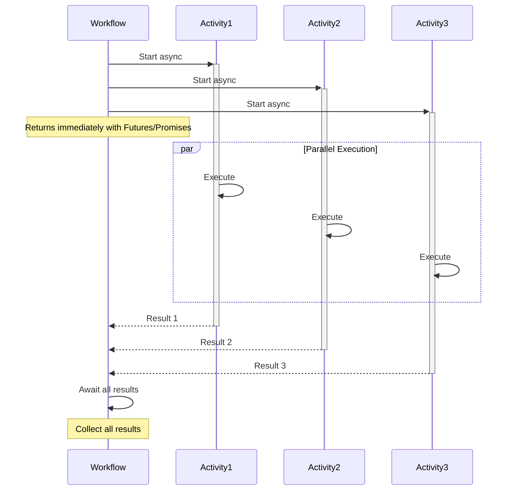

import Tabs from '@theme/Tabs';
import TabItem from '@theme/TabItem';

## Overview

The Parallel Execution pattern enables concurrent execution of multiple Activities or Child Workflows to maximize throughput and minimize total execution time.
Using Temporal's async APIs, you can launch multiple operations asynchronously and wait for their completion.

## Problem

In sequential execution, operations run one after another, causing unnecessary delays when multiple independent operations could run simultaneously.
Total execution time equals the sum of all operation durations, resources sit idle while waiting, and batch processing takes hours when it could take minutes.

Without parallel execution, you must accept slow sequential processing, implement complex threading or async logic manually, risk inconsistent state management across threads, and handle thread safety and synchronization issues.

## Solution

Each SDK provides its own mechanism for launching Activities concurrently and waiting for the results:

- **Java**: `Async.function()` schedules Activities that return `Promise` objects. `Promise.allOf()` waits for all of them.
- **TypeScript**: Activity proxy functions return native `Promise` objects. `Promise.all()` waits for all of them.
- **Python**: `workflow.execute_activity()` returns awaitables. `asyncio.gather()` waits for all of them.
- **Go**: `workflow.ExecuteActivity()` returns `Future` objects. You call `.Get()` on each Future to collect results.



The following describes each step in the diagram:

1. The Workflow starts three Activities asynchronously, which returns immediately with Futures or Promises.
2. All three Activities execute in parallel on available Workers.
3. As each Activity completes, its Future or Promise resolves with the result.
4. The Workflow waits until all results are available, then collects them.

## Implementation

### Basic parallel Activities

The following implementation starts one Activity per item in a list and waits for all of them to complete:

<Tabs groupId="language" queryString>
<TabItem value="python" label="Python" default>

```python
# workflows.py
import asyncio
from datetime import timedelta
from temporalio import workflow

with workflow.unsafe.imports_passed_through():
    from activities import process

@workflow.defn
class ParallelWorkflow:
    @workflow.run
    async def run(self, items: list[str]) -> list[str]:
        results = await asyncio.gather(
            *[
                workflow.execute_activity(
                    process,
                    item,
                    start_to_close_timeout=timedelta(seconds=30),
                )
                for item in items
            ]
        )
        return list(results)
```

</TabItem>
<TabItem value="go" label="Go">

```go
// parallel_workflow.go
func ProcessInParallel(ctx workflow.Context, items []string) ([]string, error) {
	ao := workflow.ActivityOptions{
		StartToCloseTimeout: 30 * time.Second,
	}
	ctx = workflow.WithActivityOptions(ctx, ao)

	futures := make([]workflow.Future, len(items))
	for i, item := range items {
		futures[i] = workflow.ExecuteActivity(ctx, Process, item)
	}

	results := make([]string, len(items))
	for i, future := range futures {
		if err := future.Get(ctx, &results[i]); err != nil {
			return nil, err
		}
	}
	return results, nil
}
```

</TabItem>
<TabItem value="java" label="Java">

```java
// ParallelWorkflowImpl.java
@WorkflowInterface
public interface ParallelWorkflow {
  @WorkflowMethod
  List<String> processInParallel(List<String> items);
}

public class ParallelWorkflowImpl implements ParallelWorkflow {
  private final ProcessingActivity activity =
    Workflow.newActivityStub(ProcessingActivity.class,
        ActivityOptions.newBuilder()
            .setStartToCloseTimeout(Duration.ofSeconds(30))
            .build());

  @Override
  public List<String> processInParallel(List<String> items) {
    List<Promise<String>> promises = new ArrayList<>();

    for (String item : items) {
      Promise<String> promise = Async.function(activity::process, item);
      promises.add(promise);
    }

    Promise.allOf(promises).get();
    return promises.stream().map(Promise::get).collect(Collectors.toList());
  }
}
```

</TabItem>
<TabItem value="typescript" label="TypeScript">

```typescript
// workflows.ts
import { proxyActivities } from '@temporalio/workflow';
import type * as activities from './activities';

const { process } = proxyActivities<typeof activities>({
  startToCloseTimeout: '30s',
});

export async function processInParallel(items: string[]): Promise<string[]> {
  const promises = items.map((item) => process(item));
  return await Promise.all(promises);
}
```

</TabItem>
</Tabs>

Each SDK schedules all Activities before waiting for any results.
In Java, `Async.function()` returns a `Promise`; in TypeScript, calling the activity proxy without `await` returns a native `Promise`; in Python, `workflow.execute_activity()` returns an awaitable; and in Go, `workflow.ExecuteActivity()` returns a `Future`.
The Workflow then waits for all of them to complete and collects the results.

### Controlled parallelism

The following implementation limits the number of concurrent Activities by processing items in batches:

<Tabs groupId="language" queryString>
<TabItem value="python" label="Python" default>

```python
# workflows.py
import asyncio
from datetime import timedelta
from temporalio import workflow

with workflow.unsafe.imports_passed_through():
    from activities import process

@workflow.defn
class BatchWorkflow:
    @workflow.run
    async def run(self, items: list[str], max_parallel: int) -> list[str]:
        results: list[str] = []

        for i in range(0, len(items), max_parallel):
            batch = items[i : i + max_parallel]
            batch_results = await asyncio.gather(
                *[
                    workflow.execute_activity(
                        process,
                        item,
                        start_to_close_timeout=timedelta(seconds=30),
                    )
                    for item in batch
                ]
            )
            results.extend(batch_results)

        return results
```

</TabItem>
<TabItem value="go" label="Go">

```go
// batch_workflow.go
func ProcessBatch(ctx workflow.Context, items []string, maxParallel int) ([]string, error) {
	ao := workflow.ActivityOptions{
		StartToCloseTimeout: 30 * time.Second,
	}
	ctx = workflow.WithActivityOptions(ctx, ao)

	var results []string

	for i := 0; i < len(items); i += maxParallel {
		end := i + maxParallel
		if end > len(items) {
			end = len(items)
		}
		batch := items[i:end]

		futures := make([]workflow.Future, len(batch))
		for j, item := range batch {
			futures[j] = workflow.ExecuteActivity(ctx, Process, item)
		}

		for _, future := range futures {
			var result string
			if err := future.Get(ctx, &result); err != nil {
				return nil, err
			}
			results = append(results, result)
		}
	}

	return results, nil
}
```

</TabItem>
<TabItem value="java" label="Java">

```java
// BatchWorkflowImpl.java
public class BatchWorkflowImpl implements BatchWorkflow {
  private final ProcessingActivity activity =
    Workflow.newActivityStub(ProcessingActivity.class,
        ActivityOptions.newBuilder()
            .setStartToCloseTimeout(Duration.ofSeconds(30))
            .build());

  @Override
  public BatchResult processBatch(List<String> items, int maxParallel) {
    List<String> results = new ArrayList<>();

    for (int i = 0; i < items.size(); i += maxParallel) {
      int end = Math.min(i + maxParallel, items.size());
      List<String> batch = items.subList(i, end);

      List<Promise<String>> promises = batch.stream()
        .map(item -> Async.function(activity::process, item))
        .collect(Collectors.toList());

      Promise.allOf(promises).get();
      results.addAll(promises.stream().map(Promise::get).collect(Collectors.toList()));
    }

    return new BatchResult(results);
  }
}
```

</TabItem>
<TabItem value="typescript" label="TypeScript">

```typescript
// workflows.ts
import { proxyActivities } from '@temporalio/workflow';
import type * as activities from './activities';

const { process } = proxyActivities<typeof activities>({
  startToCloseTimeout: '30s',
});

export async function processBatch(
  items: string[],
  maxParallel: number
): Promise<string[]> {
  const results: string[] = [];

  for (let i = 0; i < items.length; i += maxParallel) {
    const batch = items.slice(i, i + maxParallel);
    const batchResults = await Promise.all(batch.map((item) => process(item)));
    results.push(...batchResults);
  }

  return results;
}
```

</TabItem>
</Tabs>

The Workflow processes items in chunks of `maxParallel`.
Each chunk runs in parallel, and the Workflow waits for the entire chunk to complete before starting the next one.
This prevents overwhelming Workers or external services.

### Error handling

The following implementation wraps each Activity in error handling so that individual failures do not prevent other Activities from completing:

<Tabs groupId="language" queryString>
<TabItem value="python" label="Python" default>

```python
# workflows.py
import asyncio
from dataclasses import dataclass
from datetime import timedelta
from temporalio import workflow

with workflow.unsafe.imports_passed_through():
    from activities import process

@dataclass
class Result:
    item: str
    output: str | None = None
    error: str | None = None

@workflow.defn
class ResilientParallelWorkflow:
    @workflow.run
    async def run(self, items: list[str]) -> list[Result]:
        tasks = [
            workflow.execute_activity(
                process,
                item,
                start_to_close_timeout=timedelta(seconds=30),
            )
            for item in items
        ]
        outcomes = await asyncio.gather(*tasks, return_exceptions=True)

        results: list[Result] = []
        for item, outcome in zip(items, outcomes):
            if isinstance(outcome, BaseException):
                results.append(Result(item=item, error=str(outcome)))
            else:
                results.append(Result(item=item, output=outcome))
        return results
```

</TabItem>
<TabItem value="go" label="Go">

```go
// resilient_parallel_workflow.go
func ProcessWithErrorHandling(ctx workflow.Context, items []string) ([]Result, error) {
	ao := workflow.ActivityOptions{
		StartToCloseTimeout: 30 * time.Second,
	}
	ctx = workflow.WithActivityOptions(ctx, ao)

	futures := make([]workflow.Future, len(items))
	for i, item := range items {
		futures[i] = workflow.ExecuteActivity(ctx, Process, item)
	}

	results := make([]Result, len(items))
	for i, future := range futures {
		var output string
		if err := future.Get(ctx, &output); err != nil {
			results[i] = Result{Item: items[i], Error: err.Error()}
		} else {
			results[i] = Result{Item: items[i], Output: output}
		}
	}
	return results, nil
}
```

</TabItem>
<TabItem value="java" label="Java">

```java
// ResilientParallelWorkflowImpl.java
public class ResilientParallelWorkflowImpl implements ParallelWorkflow {

  @Override
  public ProcessingReport processWithErrorHandling(List<String> items) {
    List<Promise<Result>> promises = new ArrayList<>();

    for (String item : items) {
      Promise<Result> promise = Async.function(() -> {
        try {
          return activity.process(item);
        } catch (Exception e) {
          return Result.failed(item, e.getMessage());
        }
      });
      promises.add(promise);
    }

    Promise.allOf(promises).get();

    List<Result> results = promises.stream().map(Promise::get).collect(Collectors.toList());
    return new ProcessingReport(results);
  }
}
```

</TabItem>
<TabItem value="typescript" label="TypeScript">

```typescript
// workflows.ts
import { proxyActivities } from '@temporalio/workflow';
import type * as activities from './activities';

const { process } = proxyActivities<typeof activities>({
  startToCloseTimeout: '30s',
});

interface Result {
  item: string;
  output?: string;
  error?: string;
}

export async function processWithErrorHandling(items: string[]): Promise<Result[]> {
  const settled = await Promise.allSettled(items.map((item) => process(item)));

  return settled.map((outcome, i) => {
    if (outcome.status === 'fulfilled') {
      return { item: items[i], output: outcome.value };
    }
    return { item: items[i], error: String(outcome.reason) };
  });
}
```

</TabItem>
</Tabs>

Each Activity handles its own errors so that the Workflow can collect results from all Activities, including those that failed.
In TypeScript, `Promise.allSettled()` is especially convenient for this pattern.
In Python, `asyncio.gather()` with `return_exceptions=True` captures errors alongside successes.
In Go, each `Future.Get()` call is checked individually for errors.

## When to use

The Parallel Execution pattern is a good fit for processing independent items in batches, calling multiple external services simultaneously, fan-out/fan-in patterns, parallel data transformations, concurrent API requests, and multi-step pipelines with independent stages.

It is not a good fit for operations with dependencies between them, resource-constrained environments (use controlled parallelism), operations requiring strict ordering, or a single fast operation (the overhead is not worth it).

## Benefits and trade-offs

Parallel execution reduces total execution time dramatically and maximizes Worker and external service usage.
Temporal handles retries and failures per operation, and you do not need manual thread management or synchronization.

The trade-offs to consider are that more concurrent operations require more Workers.
Error handling across parallel operations is harder.
Parallel execution makes tracing more difficult.
You may overwhelm external services without throttling, and storing many Futures or Promises consumes Workflow memory.

## Comparison with alternatives

| Approach | Parallelism | Complexity | Control | Use case |
| :--- | :--- | :--- | :--- | :--- |
| Async Activities | High | Low | Medium | Independent operations |
| Sequential | None | Very Low | Full | Dependent operations |
| Child Workflows | High | Medium | High | Complex sub-processes |
| ContinueAsNew | None | Medium | Full | Large iterations |

## Best practices

- **Limit concurrency.** Use batching to avoid overwhelming Workers or external services.
- **Handle failures.** Wrap operations in error handling or use Activity retry policies.
- **Set timeouts.** Configure appropriate Activity timeouts for parallel operations.
- **Monitor resources.** Ensure sufficient Workers for the desired parallelism.
- **Aggregate carefully.** Consider memory when collecting large result sets.
- **Use Child Workflows.** For complex parallel operations with their own state.
- **Test scalability.** Verify performance with realistic parallel loads.
- **Rate limit.** Implement throttling for external API calls.
- **Support partial results.** Consider returning partial results on some failures.
- **Avoid premature blocking.** Schedule all Activities before waiting for any results.

## Common pitfalls

- **Exceeding the pending Activities limit.** A single Workflow Execution can have at most 2,000 pending (concurrently running) Activities. Scheduling more causes Workflow Task failures. Batch Activities or use child Workflows for higher concurrency.
- **Ignoring errors from individual Activities.** Waiting for all results (e.g., `Promise.allOf()` in Java, `Promise.all()` in TypeScript, `asyncio.gather()` in Python) fails on the first error by default. If you need partial results, catch errors inside each async function or use `Promise.allSettled()` / `return_exceptions=True` / per-Future error checking.
- **Blowing the 4 MB gRPC message limit.** Scheduling hundreds of Activities in a single Workflow Task can exceed the 4 MB gRPC message size limit if their combined inputs are large. Batch scheduling across multiple Workflow Tasks.
- **Not using Continue-As-New for large fan-outs.** Each Activity adds events to history. Hundreds of parallel Activities can quickly approach the 50K event limit. Use Continue-As-New or child Workflows to partition work.

## Related patterns

- **[Child Workflows](/design-patterns/child-workflows)**: For complex parallel operations with their own state.
- **[Saga Pattern](/design-patterns/saga-pattern)**: Parallel operations with compensation.

## Sample code

**Java:**
- [HelloParallelActivity](https://github.com/temporalio/samples-java/tree/main/core/src/main/java/io/temporal/samples/hello/HelloParallelActivity.java) — Basic parallel Activity execution.
- [HelloAsync](https://github.com/temporalio/samples-java/tree/main/core/src/main/java/io/temporal/samples/hello/HelloAsync.java) — Async execution with Promises.
- [Sliding Window Batch](https://github.com/temporalio/samples-java/tree/main/core/src/main/java/io/temporal/samples/batch/slidingwindow) — Controlled parallel Child Workflows.

**TypeScript:**
- [activities-examples](https://github.com/temporalio/samples-typescript/tree/main/activities-examples) — Activity patterns including parallel execution with `Promise.all()`.

**Python:**
- [hello_parallel_activity](https://github.com/temporalio/samples-python/blob/main/hello/hello_parallel_activity.py) — Basic parallel Activity execution with `asyncio.gather()`.

**Go:**
- [splitmerge-future](https://github.com/temporalio/samples-go/tree/main/splitmerge-future) — Parallel Activity execution with Futures.
- [splitmerge-selector](https://github.com/temporalio/samples-go/tree/main/splitmerge-selector) — Parallel Activities with Selector for first-completion handling.
