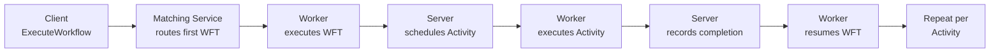

import PatternCards from '@site/src/components/PatternCards';

Temporal Workflows are durable and reliable, but a default implementation—using regular Activities scheduled through the Temporal server—carries inherent latency. Each regular Activity incurs multiple server round-trips, and each new Workflow begins with a Matching Service routing step. On Temporal Cloud, this baseline can reach 850 ms or more for a typical three-Activity workflow.

This section covers three complementary patterns that each target a different source of latency. They can be applied individually or combined depending on your requirements.

## Latency Sources in a Typical Workflow

| Source | Overhead | Pattern that removes it |
|---|---|---|
| Matching Service (first Workflow Task) | ~30–50 ms | [Eager Workflow Start](/design-patterns/eager-workflow-start) |
| Activity scheduling round-trip | ~50 ms per Activity | [Local Activities](/design-patterns/local-activities) |
| Client waiting for full workflow | Total duration | [Early Return](/design-patterns/early-return) |

## Pattern Comparison

The numbers below are approximate benchmarks based on a three-Activity transaction workflow running on Temporal Cloud. Actual results vary by region, Activity implementation, and server load.

| Pattern | First Response | Total Latency | SDK Support |
|---|---|---|---|
| Baseline (regular Activities) | ~850 ms | ~850 ms | All |
| [Early Return](/design-patterns/early-return) | ~265 ms | ~850 ms | All |
| [Local Activities](/design-patterns/local-activities) | ~275 ms | ~275 ms | All |
| [Early Return + Local Activities](/design-patterns/early-return-local-activities) | ~160 ms | ~275 ms | All |
| [Eager Workflow Start](/design-patterns/eager-workflow-start) + Local Activities | ~265 ms | ~265 ms | Go, Java, Python |
| Early Return + Local Activities + Eager Start | ~160 ms | ~265 ms | Go, Java, Python |

**First Response** is the time until the client receives an actionable result. **Total Latency** is the time until the Workflow fully completes.

:::tip[TypeScript users]
Eager Workflow Start is not available in the TypeScript SDK, but the latency gap is small (~30–50 ms per Workflow start). [Local Activities](/design-patterns/local-activities) and [Early Return + Local Activities](/design-patterns/early-return-local-activities) are fully supported and achieve competitive results: ~275 ms total latency and ~160 ms first-response latency respectively.
:::

## Patterns in This Section

<PatternCards items={[
  {
    href: "/design-patterns/local-activities",
    icon: "local-activities-icon.svg",
    title: "Local Activities",
    description: "Run Activity functions in-process inside the Workflow Task, eliminating all server scheduling round-trips. Best for short, idempotent Activities on a latency-sensitive path.",
  },
  {
    href: "/design-patterns/early-return-local-activities",
    icon: "early-return-local-activities-icon.svg",
    title: "Early Return + Local Activities",
    description: "Extends Early Return by running Phase 1 Activities as Local Activities. The client receives its response after Phase 1 completes entirely in-process, achieving the lowest possible first-response latency.",
  },
  {
    href: "/design-patterns/eager-workflow-start",
    icon: "eager-workflow-start-icon.svg",
    title: "Eager Workflow Start",
    description: "Dispatch the first Workflow Task directly to a co-located Worker, bypassing the Temporal Matching Service. Requires the starter and Worker to share the same process and client connection.",
  },
]} />

## Choosing a Pattern

**You only care about total workflow latency** (not first-response time): use [Local Activities](/design-patterns/local-activities). If co-location is feasible, add [Eager Workflow Start](/design-patterns/eager-workflow-start) for the maximum reduction.

**You care most about first-response latency**: use [Early Return + Local Activities](/design-patterns/early-return-local-activities). The client gets its response in ~160 ms; background work continues independently.

**You are using TypeScript**: use [Local Activities](/design-patterns/local-activities) and [Early Return + Local Activities](/design-patterns/early-return-local-activities). Eager Workflow Start is not available in the TypeScript SDK.

**You want to start simple**: begin with [Local Activities](/design-patterns/local-activities). It requires minimal structural change and provides the most straightforward per-Activity improvement.

## Related Sections

- [Distributed Transaction Patterns](/design-patterns/distributed-transaction-patterns) — the [Early Return](/design-patterns/early-return) pattern lives there, describing the Update-with-Start mechanism in detail
- [Worker Configuration Patterns](/design-patterns/worker-configuration-patterns) — tuning Worker concurrency and task queue assignments that affect throughput
- [QoS & Throughput Patterns](/design-patterns/qos-throughput-patterns) — rate limiting and fairness patterns for high-volume workloads
