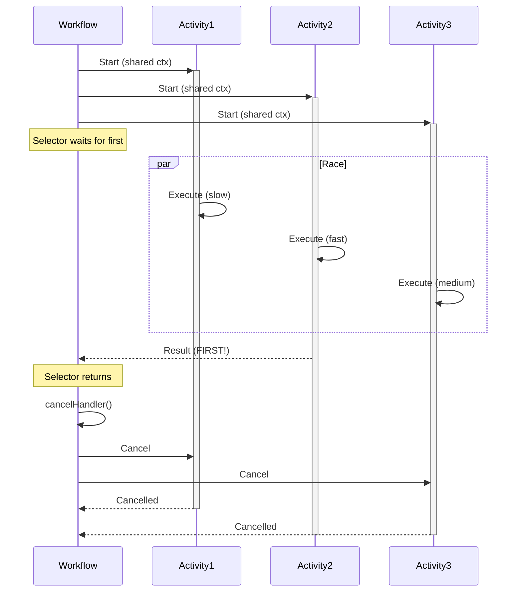

import Tabs from '@theme/Tabs';
import TabItem from '@theme/TabItem';

## Overview

The Pick First pattern executes multiple Activities in parallel and returns the result of whichever completes first, then cancels the remaining Activities.
It is suitable for racing multiple approaches to the same task, implementing timeout alternatives, or optimizing for fastest response when multiple options are available.

## Problem

In distributed systems, you often need Workflows that execute multiple Activities that can accomplish the same goal, return as soon as any one succeeds (fastest wins), cancel remaining Activities to avoid wasted resources, and handle scenarios where speed matters more than trying all options.

Without the Pick First pattern, you must wait for all Activities to complete even when only one result is needed, manually track which Activity finished first, implement complex cancellation logic for remaining Activities, and waste compute resources on Activities whose results will not be used.

## Solution

The Pick First pattern races multiple Activities simultaneously, captures the first result, then cancels remaining Activities using a cancellation mechanism provided by each SDK.



The following describes each step in the diagram:

1. The Workflow starts three Activities in parallel using a shared cancellable context.
2. The Workflow waits for the first Activity to complete.
3. Activity 2 completes first. The Workflow captures its result.
4. The Workflow cancels the shared context, which cancels Activities 1 and 3.

The following implementation shows the core pattern.
The Workflow creates a cancellable context, starts two Activities, and captures the first result:

<Tabs groupId="language" queryString>
<TabItem value="python" label="Python">

```python
# workflows.py
import asyncio
from datetime import timedelta
from temporalio import workflow

with workflow.unsafe.imports_passed_through():
    from activities import sample_activity

@workflow.defn
class PickFirstWorkflow:
    @workflow.run
    async def run(self) -> str:
        task1 = asyncio.create_task(
            workflow.execute_activity(
                sample_activity,
                "option1",
                start_to_close_timeout=timedelta(minutes=2),
                heartbeat_timeout=timedelta(seconds=10),
            )
        )
        task2 = asyncio.create_task(
            workflow.execute_activity(
                sample_activity,
                "option2",
                start_to_close_timeout=timedelta(minutes=2),
                heartbeat_timeout=timedelta(seconds=10),
            )
        )

        done, pending = await workflow.wait(
            [task1, task2], return_when=asyncio.FIRST_COMPLETED
        )

        for task in pending:
            task.cancel()

        return done.pop().result()
```

</TabItem>
<TabItem value="go" label="Go">

```go
// workflow.go
func PickFirstWorkflow(ctx workflow.Context) (string, error) {
  selector := workflow.NewSelector(ctx)
  var firstResponse string

  childCtx, cancelHandler := workflow.WithCancel(ctx)
  childCtx = workflow.WithActivityOptions(childCtx, activityOptions)

  f1 := workflow.ExecuteActivity(childCtx, Activity, "option1")
  f2 := workflow.ExecuteActivity(childCtx, Activity, "option2")

  selector.AddFuture(f1, func(f workflow.Future) {
    _ = f.Get(ctx, &firstResponse)
  }).AddFuture(f2, func(f workflow.Future) {
    _ = f.Get(ctx, &firstResponse)
  })

  selector.Select(ctx) // Blocks until first completes
  cancelHandler()      // Cancel remaining activities

  return firstResponse, nil
}
```

</TabItem>
<TabItem value="java" label="Java">

```java
// PickFirstWorkflow.java
public class PickFirstWorkflowImpl implements PickFirstWorkflow {

    private final SampleActivities activities =
        Workflow.newActivityStub(
            SampleActivities.class,
            ActivityOptions.newBuilder()
                .setStartToCloseTimeout(Duration.ofMinutes(2))
                .setHeartbeatTimeout(Duration.ofSeconds(10))
                .build());

    @Override
    public String pickFirst() {
        List<Promise<String>> results = new ArrayList<>();

        CancellationScope scope =
            Workflow.newCancellationScope(
                () -> {
                    results.add(Async.function(activities::sampleActivity, "option1"));
                    results.add(Async.function(activities::sampleActivity, "option2"));
                });

        scope.run();

        String firstResponse = Promise.anyOf(results).get();

        scope.cancel();

        return firstResponse;
    }
}
```

</TabItem>
<TabItem value="typescript" label="TypeScript">

```typescript
// workflows.ts
import { proxyActivities, CancellationScope } from '@temporalio/workflow';
import type * as activities from './activities';

const { sampleActivity } = proxyActivities<typeof activities>({
  startToCloseTimeout: '2m',
  heartbeatTimeout: '10s',
});

export async function pickFirstWorkflow(): Promise<string> {
  return await CancellationScope.cancellable(async () => {
    const p1 = sampleActivity('option1');
    const p2 = sampleActivity('option2');
    const firstResponse = await Promise.race([p1, p2]);
    CancellationScope.current().cancel();
    return firstResponse;
  });
}
```

</TabItem>
</Tabs>

Each SDK provides a different mechanism for racing Activities and cancelling the rest:

- **Go** uses `workflow.NewSelector()` with `AddFuture()` callbacks and `workflow.WithCancel(ctx)` for cancellation.
- **TypeScript** uses `Promise.race()` within a `CancellationScope.cancellable()`. Calling `CancellationScope.current().cancel()` cancels all Activities started in that scope.
- **Python** uses `asyncio.create_task()` to start Activities concurrently, then `workflow.wait()` with `return_when=asyncio.FIRST_COMPLETED` to get the first result. Pending tasks are cancelled explicitly.
- **Java** uses `Async.function()` to start Activities inside a `CancellationScope`, then `Promise.anyOf()` to wait for the first result. Calling `scope.cancel()` cancels the remaining Activities.

## Implementation

### Activity with cancellation support

For the Pick First pattern to work efficiently, Activities must detect cancellation via heartbeats and respond to the cancellation signal provided by their SDK:

<Tabs groupId="language" queryString>
<TabItem value="python" label="Python">

```python
# activities.py
import asyncio
from temporalio import activity

@activity.defn
async def sample_activity(branch_id: str) -> str:
    try:
        for elapsed in range(60):
            await asyncio.sleep(1)
            activity.heartbeat("status-report")
        return f"Branch {branch_id} completed"
    except asyncio.CancelledError:
        activity.logger.info(f"Branch {branch_id} cancelled")
        raise
```

</TabItem>
<TabItem value="go" label="Go">

```go
// activity.go
func SampleActivity(ctx context.Context, branchID int, duration time.Duration) (string, error) {
  logger := activity.GetLogger(ctx)
  elapsed := time.Nanosecond

  for elapsed < duration {
    time.Sleep(time.Second)
    elapsed += time.Second

    activity.RecordHeartbeat(ctx, "status-report")

    select {
    case <-ctx.Done():
      msg := fmt.Sprintf("Branch %d cancelled", branchID)
      logger.Info(msg)
      return msg, ctx.Err()
    default:
      // Continue working
    }
  }

  return fmt.Sprintf("Branch %d completed", branchID), nil
}
```

</TabItem>
<TabItem value="java" label="Java">

```java
// SampleActivityImpl.java
public class SampleActivityImpl implements SampleActivities {

    @Override
    public String sampleActivity(String branchID) {
        for (int elapsed = 0; elapsed < 60; elapsed++) {
            try {
                Thread.sleep(1000);
            } catch (InterruptedException e) {
                Thread.currentThread().interrupt();
                throw Activity.wrap(e);
            }
            Activity.getExecutionContext().heartbeat("status-report");
            // Heartbeat throws CanceledFailure if cancellation was requested
        }
        return "Branch " + branchID + " completed";
    }
}
```

</TabItem>
<TabItem value="typescript" label="TypeScript">

```typescript
// activities.ts
import { Context, heartbeat } from '@temporalio/activity';

export async function sampleActivity(branchID: string): Promise<string> {
  for (let elapsed = 0; elapsed < 60; elapsed++) {
    await new Promise((resolve) => setTimeout(resolve, 1000));
    heartbeat('status-report');
    Context.current().cancellationSignal.throwIfAborted();
  }
  return `Branch ${branchID} completed`;
}
```

</TabItem>
</Tabs>

The Activity heartbeats on each iteration, which allows the Temporal Server to deliver cancellation notifications promptly.
When cancellation is detected, the Activity performs any necessary cleanup and exits.

### Wait for cancellation completion

The following implementation waits for all Activities to finish their cleanup before returning:

<Tabs groupId="language" queryString>
<TabItem value="python" label="Python">

```python
# workflows.py
import asyncio
from datetime import timedelta
from temporalio import workflow
from temporalio.common import RetryPolicy

with workflow.unsafe.imports_passed_through():
    from activities import sample_activity

@workflow.defn
class PickFirstWithCleanup:
    @workflow.run
    async def run(self) -> str:
        task1 = asyncio.create_task(
            workflow.execute_activity(
                sample_activity,
                "branch1",
                start_to_close_timeout=timedelta(minutes=2),
                heartbeat_timeout=timedelta(seconds=10),
                cancellation_type=workflow.ActivityCancellationType.WAIT_CANCELLATION_COMPLETED,
            )
        )
        task2 = asyncio.create_task(
            workflow.execute_activity(
                sample_activity,
                "branch2",
                start_to_close_timeout=timedelta(minutes=2),
                heartbeat_timeout=timedelta(seconds=10),
                cancellation_type=workflow.ActivityCancellationType.WAIT_CANCELLATION_COMPLETED,
            )
        )

        done, pending = await workflow.wait(
            [task1, task2], return_when=asyncio.FIRST_COMPLETED
        )

        for task in pending:
            task.cancel()

        # Wait for all activities to finish cancellation
        for task in pending:
            try:
                await task
            except asyncio.CancelledError:
                pass

        return done.pop().result()
```

</TabItem>
<TabItem value="go" label="Go">

```go
// workflow.go
func PickFirstWithCleanup(ctx workflow.Context) (string, error) {
  selector := workflow.NewSelector(ctx)
  var firstResponse string

  childCtx, cancelHandler := workflow.WithCancel(ctx)
  childCtx = workflow.WithActivityOptions(childCtx, workflow.ActivityOptions{
    StartToCloseTimeout: 2 * time.Minute,
    WaitForCancellation: true,
  })

  f1 := workflow.ExecuteActivity(childCtx, Activity, "branch1")
  f2 := workflow.ExecuteActivity(childCtx, Activity, "branch2")
  pendingFutures := []workflow.Future{f1, f2}

  selector.AddFuture(f1, func(f workflow.Future) {
    _ = f.Get(ctx, &firstResponse)
  }).AddFuture(f2, func(f workflow.Future) {
    _ = f.Get(ctx, &firstResponse)
  })

  selector.Select(ctx)
  cancelHandler()

  // Wait for all activities to finish cancellation
  for _, f := range pendingFutures {
    _ = f.Get(ctx, nil)
  }

  return firstResponse, nil
}
```

</TabItem>
<TabItem value="java" label="Java">

```java
// PickFirstWithCleanupImpl.java
public class PickFirstWithCleanupImpl implements PickFirstWorkflow {

    private final SampleActivities activities =
        Workflow.newActivityStub(
            SampleActivities.class,
            ActivityOptions.newBuilder()
                .setStartToCloseTimeout(Duration.ofMinutes(2))
                .setHeartbeatTimeout(Duration.ofSeconds(10))
                .setCancellationType(
                    ActivityCancellationType.WAIT_CANCELLATION_COMPLETED)
                .build());

    @Override
    public String pickFirst() {
        List<Promise<String>> results = new ArrayList<>();

        CancellationScope scope =
            Workflow.newCancellationScope(
                () -> {
                    results.add(Async.function(activities::sampleActivity, "branch1"));
                    results.add(Async.function(activities::sampleActivity, "branch2"));
                });

        scope.run();

        String firstResponse = Promise.anyOf(results).get();

        scope.cancel();

        // Wait for all activities to finish cancellation
        for (Promise<String> activityResult : results) {
            try {
                activityResult.get();
            } catch (ActivityFailure e) {
                if (!(e.getCause() instanceof CanceledFailure)) {
                    throw e;
                }
            }
        }

        return firstResponse;
    }
}
```

</TabItem>
<TabItem value="typescript" label="TypeScript">

```typescript
// workflows.ts
import {
  proxyActivities,
  CancellationScope,
  ActivityCancellationType,
  isCancellation,
} from '@temporalio/workflow';
import type * as activities from './activities';

const { sampleActivity } = proxyActivities<typeof activities>({
  startToCloseTimeout: '2m',
  heartbeatTimeout: '10s',
  cancellationType: ActivityCancellationType.WAIT_CANCELLATION_COMPLETED,
});

export async function pickFirstWithCleanup(): Promise<string> {
  return await CancellationScope.cancellable(async () => {
    const p1 = sampleActivity('branch1');
    const p2 = sampleActivity('branch2');
    const firstResponse = await Promise.race([p1, p2]);
    CancellationScope.current().cancel();

    // Wait for all activities to finish cancellation
    const results = [p1, p2];
    for (const p of results) {
      try {
        await p;
      } catch (err) {
        if (!isCancellation(err)) throw err;
      }
    }

    return firstResponse;
  });
}
```

</TabItem>
</Tabs>

Each SDK provides a way to wait for cancelled Activities to finish their cleanup:

- **Go** sets `WaitForCancellation: true` in the Activity options, then calls `Get` on all futures after cancelling.
- **TypeScript** sets `cancellationType: ActivityCancellationType.WAIT_CANCELLATION_COMPLETED` in the Activity options, then awaits all promises while catching cancellation errors with `isCancellation()`.
- **Python** sets `cancellation_type=workflow.ActivityCancellationType.WAIT_CANCELLATION_COMPLETED`, then awaits pending tasks while catching `asyncio.CancelledError`.
- **Java** sets `setCancellationType(ActivityCancellationType.WAIT_CANCELLATION_COMPLETED)`, then calls `get()` on all promises while catching `ActivityFailure` with a `CanceledFailure` cause.

## When to use

The Pick First pattern is a good fit for racing multiple data sources (primary vs backup), trying multiple algorithms and picking the fastest, implementing fallback strategies with timeout, optimizing for latency when multiple options exist, and testing multiple service endpoints for fastest response.

It is not a good fit when you need results from all Activities (use parallel execution), Activities have side effects that should not be cancelled, order matters (use sequential execution), or all Activities must complete.

## Benefits and trade-offs

The pattern returns as soon as the fastest option completes, optimizing for latency.
Unnecessary work is cancelled automatically.
Each SDK's race mechanism ensures replay consistency, and cancellation cleanup is handled properly.

The trade-offs to consider are that cancelled Activities may have done partial work.
Activities need heartbeats to detect cancellation quickly.
Activities do not cancel instantly (they wait for the next heartbeat).
You must implement proper cancellation handling in Activities.
Only the first result is used; others are discarded.

## Comparison with alternatives

| Approach | Returns first | Cancels others | Complexity | Use case |
| :--- | :--- | :--- | :--- | :--- |
| Pick First | Yes | Yes | Medium | Race for fastest |
| Parallel Execution | No | No | Low | All must complete |
| Sequential | No | N/A | Low | Order matters |
| Split/Merge | No | No | Medium | Aggregate results |

## Best practices

- **Use heartbeats.** Activities must heartbeat to detect cancellation quickly.
- **Configure cancellation wait behavior.** Decide if the Workflow should wait for cleanup to complete before returning.
- **Handle cancellation in Activities.** Activities must check for cancellation signals and exit cleanly.
- **Use a shared cancellable context.** Use a single cancellable context or scope for all raced Activities.
- **Track futures or tasks.** Keep references to all futures or tasks if waiting for cleanup.
- **Set Activity timeouts.** Configure appropriate StartToCloseTimeout and HeartbeatTimeout.
- **Log cancellations.** Log when Activities are cancelled for observability.
- **Design idempotent Activities.** Ensure Activities handle cancellation safely.

## Common pitfalls

- **Missing heartbeats in Activities.** Activities must heartbeat to detect cancellation. Without heartbeats, cancelled Activities continue running until their StartToCloseTimeout expires, wasting resources.
- **Not waiting for cancellation cleanup.** Without configuring the cancellation type to wait for completion (e.g., `WaitForCancellation: true` in Go, `WAIT_CANCELLATION_COMPLETED` in other SDKs), fetching a cancelled Activity's result returns a cancellation error immediately, before the Activity has finished cleanup. Configure this setting if you need to wait for cleanup to complete.
- **Ignoring errors from the winning Activity.** The first Activity to complete might return an error. Always check the result for errors rather than assuming success.
- **Forgetting to cancel remaining Activities.** If you forget to cancel the shared context or scope after receiving the first result, the remaining Activities continue running indefinitely.

## Related patterns

- **[Parallel Execution](/design-patterns/parallel-execution)**: Execute in parallel and combine all results.

## Sample code

- [Go Sample](https://github.com/temporalio/samples-go/tree/main/pickfirst) — Complete implementation with Worker and starter.
- [TypeScript Sample](https://github.com/temporalio/samples-typescript/tree/main/activities-cancellation-heartbeating) — Activities with cancellation and heartbeating.
- [Java Sample](https://github.com/temporalio/samples-java/tree/main/core/src/main/java/io/temporal/samples/hello) — Hello samples including cancellation scope patterns.
- [Python Sample](https://github.com/temporalio/samples-python) — Python SDK samples with async patterns.
