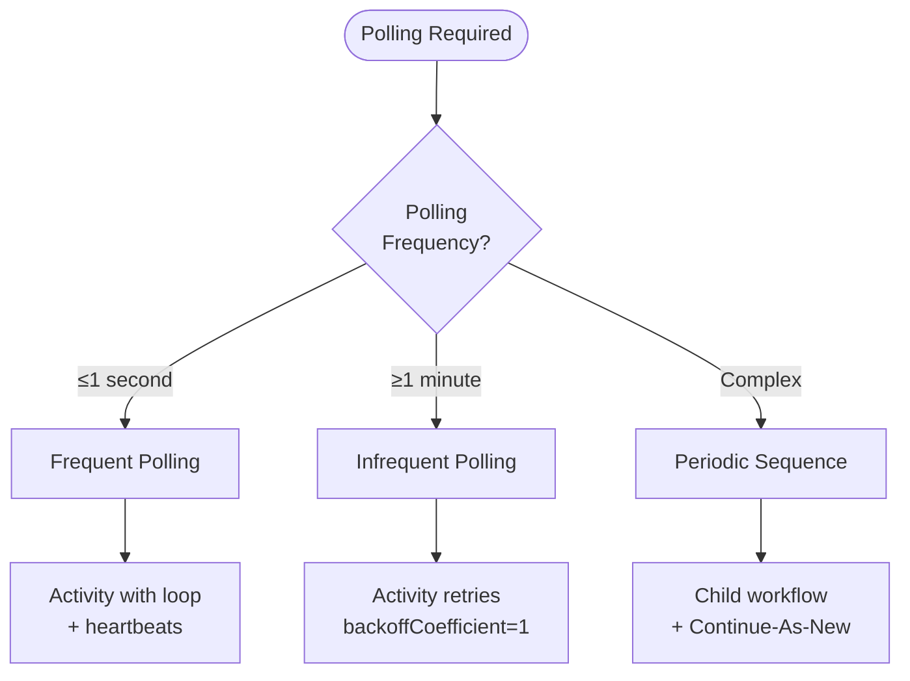

import Tabs from '@theme/Tabs';
import TabItem from '@theme/TabItem';

## Overview

The Polling External Services pattern implements strategies for periodically checking external systems until a desired state is reached.
It enables Workflows to wait for asynchronous operations in third-party services that do not support callbacks, making it essential for integrating with REST APIs, job queues, and batch processing systems.

## Problem

In distributed systems, you often need Workflows that wait for external jobs to complete, poll REST APIs that do not provide webhooks, check the status of long-running operations in third-party systems, handle varying poll frequencies, and avoid overwhelming external services with requests.

Without proper polling strategies, you must implement complex retry logic manually, risk unbounded Workflow history growth, choose between responsiveness and resource efficiency, and handle heartbeating and timeout management yourself.

## Solution

You can use Temporal to implement three distinct polling strategies, each optimized for different polling frequencies and requirements:

1. **Frequent Polling (1 second or faster)**: Loop inside an Activity with heartbeats.
2. **Infrequent Polling (1 minute or slower)**: Use Activity retries with fixed backoff.
3. **Periodic Sequence**: Use Child Workflows for complex polling sequences.



The following describes each path in the diagram:

1. If you need polling at 1-second intervals or faster, use frequent polling with an Activity loop and heartbeats.
2. If you need polling at 1-minute intervals or slower, use infrequent polling with Activity retries and a fixed backoff coefficient.
3. If you need complex multi-step polling or changing parameters between attempts, use a periodic sequence with Child Workflows and Continue-As-New.

## Implementation

### Frequent polling (fast response required)

For polling intervals of 1 second or faster, implement the polling loop inside the Activity with heartbeats.
The heartbeat reports progress and enables Temporal to detect stuck Activities:

<Tabs groupId="language" queryString>
<TabItem value="python" label="Python">

```python
# activities.py
from temporalio import activity
import asyncio

@activity.defn
async def do_poll() -> str:
    while True:
        activity.heartbeat()

        result = await external_service.check_status()

        if result == "COMPLETED":
            return result

        await asyncio.sleep(1)
```

</TabItem>
<TabItem value="go" label="Go">

```go
// activities.go
func DoPoll(ctx context.Context) (string, error) {
	for {
		activity.RecordHeartbeat(ctx)

		result, err := externalService.CheckStatus()
		if err != nil {
			return "", err
		}

		if result == "COMPLETED" {
			return result, nil
		}

		select {
		case <-ctx.Done():
			return "", ctx.Err()
		case <-time.After(1 * time.Second):
		}
	}
}
```

</TabItem>
<TabItem value="java" label="Java">

```java
// FrequentPollingActivityImpl.java
@ActivityInterface
public interface PollingActivities {
  String doPoll();
}

public class FrequentPollingActivityImpl implements PollingActivities {
  @Override
  public String doPoll() {
    while (true) {
      Activity.getExecutionContext().heartbeat(null);

      String result = externalService.checkStatus();

      if (result.equals("COMPLETED")) {
        return result;
      }

      try {
        Thread.sleep(1000);
      } catch (InterruptedException e) {
        throw Activity.wrap(e);
      }
    }
  }
}
```

</TabItem>
<TabItem value="typescript" label="TypeScript">

```typescript
// activities.ts
import { heartbeat, sleep } from '@temporalio/activity';

export async function doPoll(): Promise<string> {
  while (true) {
    heartbeat();

    const result = await externalService.checkStatus();

    if (result === 'COMPLETED') {
      return result;
    }

    await sleep('1s');
  }
}
```

</TabItem>
</Tabs>

The Activity loops indefinitely, heartbeating on each iteration.
If the Worker crashes, the heartbeat timeout expires and Temporal retries the Activity on another Worker.

The Workflow configures the Activity with a heartbeat timeout shorter than the start-to-close timeout:

<Tabs groupId="language" queryString>
<TabItem value="python" label="Python">

```python
# workflows.py
from datetime import timedelta
from temporalio import workflow

with workflow.unsafe.imports_passed_through():
    from activities import do_poll

@workflow.defn
class FrequentPollingWorkflow:
    @workflow.run
    async def run(self) -> str:
        return await workflow.execute_activity(
            do_poll,
            start_to_close_timeout=timedelta(seconds=60),
            heartbeat_timeout=timedelta(seconds=2),
        )
```

</TabItem>
<TabItem value="go" label="Go">

```go
// workflow.go
func FrequentPollingWorkflow(ctx workflow.Context) (string, error) {
	ao := workflow.ActivityOptions{
		StartToCloseTimeout: 60 * time.Second,
		HeartbeatTimeout:    2 * time.Second,
	}
	ctx = workflow.WithActivityOptions(ctx, ao)

	var result string
	err := workflow.ExecuteActivity(ctx, DoPoll).Get(ctx, &result)
	return result, err
}
```

</TabItem>
<TabItem value="java" label="Java">

```java
// FrequentPollingWorkflowImpl.java
public class FrequentPollingWorkflowImpl implements PollingWorkflow {
  @Override
  public String exec() {
    ActivityOptions options = ActivityOptions.newBuilder()
        .setStartToCloseTimeout(Duration.ofSeconds(60))
        .setHeartbeatTimeout(Duration.ofSeconds(2))
        .build();

    PollingActivities activities = Workflow.newActivityStub(PollingActivities.class, options);
    return activities.doPoll();
  }
}
```

</TabItem>
<TabItem value="typescript" label="TypeScript">

```typescript
// workflows.ts
import { proxyActivities } from '@temporalio/workflow';
import type * as activities from './activities';

const { doPoll } = proxyActivities<typeof activities>({
  startToCloseTimeout: '60s',
  heartbeatTimeout: '2s',
});

export async function frequentPollingWorkflow(): Promise<string> {
  return await doPoll();
}
```

</TabItem>
</Tabs>

The heartbeat timeout (2 seconds) is shorter than the start-to-close timeout (60 seconds).
If the Activity misses a heartbeat, Temporal detects the failure and retries the Activity.

### Infrequent polling (resource efficient)

For polling intervals of 1 minute or slower, use Activity retries with a backoff coefficient of 1.
The Activity throws an exception when the external service is not ready, and Temporal retries after the configured interval:

<Tabs groupId="language" queryString>
<TabItem value="python" label="Python">

```python
# activities.py
from temporalio import activity
from temporalio.exceptions import ApplicationError

@activity.defn
async def do_poll() -> str:
    result = await external_service.check_status()

    if result != "COMPLETED":
        raise ApplicationError("Service not ready, will retry")

    return result
```

</TabItem>
<TabItem value="go" label="Go">

```go
// activities.go
func DoPoll(ctx context.Context) (string, error) {
	result, err := externalService.CheckStatus()
	if err != nil {
		return "", err
	}

	if result != "COMPLETED" {
		return "", fmt.Errorf("service not ready, will retry")
	}

	return result, nil
}
```

</TabItem>
<TabItem value="java" label="Java">

```java
// InfrequentPollingActivityImpl.java
public class InfrequentPollingActivityImpl implements PollingActivities {
  @Override
  public String doPoll() {
    String result = externalService.checkStatus();

    if (!result.equals("COMPLETED")) {
      throw new RuntimeException("Service not ready, will retry");
    }

    return result;
  }
}
```

</TabItem>
<TabItem value="typescript" label="TypeScript">

```typescript
// activities.ts
import { ApplicationFailure } from '@temporalio/activity';

export async function doPoll(): Promise<string> {
  const result = await externalService.checkStatus();

  if (result !== 'COMPLETED') {
    throw ApplicationFailure.retryable('Service not ready, will retry');
  }

  return result;
}
```

</TabItem>
</Tabs>

The Activity performs a single poll and throws if the service is not ready.
Temporal handles the retry scheduling.

The Workflow configures the retry policy with a fixed interval:

<Tabs groupId="language" queryString>
<TabItem value="python" label="Python">

```python
# workflows.py
from datetime import timedelta
from temporalio import workflow
from temporalio.common import RetryPolicy

with workflow.unsafe.imports_passed_through():
    from activities import do_poll

@workflow.defn
class InfrequentPollingWorkflow:
    @workflow.run
    async def run(self) -> str:
        return await workflow.execute_activity(
            do_poll,
            start_to_close_timeout=timedelta(seconds=2),
            retry_policy=RetryPolicy(
                backoff_coefficient=1,
                initial_interval=timedelta(seconds=60),
            ),
        )
```

</TabItem>
<TabItem value="go" label="Go">

```go
// workflow.go
func InfrequentPollingWorkflow(ctx workflow.Context) (string, error) {
	ao := workflow.ActivityOptions{
		StartToCloseTimeout: 2 * time.Second,
		RetryPolicy: &temporal.RetryPolicy{
			BackoffCoefficient: 1,
			InitialInterval:    60 * time.Second,
		},
	}
	ctx = workflow.WithActivityOptions(ctx, ao)

	var result string
	err := workflow.ExecuteActivity(ctx, DoPoll).Get(ctx, &result)
	return result, err
}
```

</TabItem>
<TabItem value="java" label="Java">

```java
// InfrequentPollingWorkflowImpl.java
public class InfrequentPollingWorkflowImpl implements PollingWorkflow {
  @Override
  public String exec() {
    ActivityOptions options = ActivityOptions.newBuilder()
        .setStartToCloseTimeout(Duration.ofSeconds(2))
        .setRetryOptions(
            RetryOptions.newBuilder()
                .setBackoffCoefficient(1)
                .setInitialInterval(Duration.ofSeconds(60))
                .build())
        .build();

    PollingActivities activities = Workflow.newActivityStub(PollingActivities.class, options);
    return activities.doPoll();
  }
}
```

</TabItem>
<TabItem value="typescript" label="TypeScript">

```typescript
// workflows.ts
import { proxyActivities } from '@temporalio/workflow';
import type * as activities from './activities';

const { doPoll } = proxyActivities<typeof activities>({
  startToCloseTimeout: '2s',
  retry: {
    backoffCoefficient: 1,
    initialInterval: '60s',
  },
});

export async function infrequentPollingWorkflow(): Promise<string> {
  return await doPoll();
}
```

</TabItem>
</Tabs>

Setting the backoff coefficient to 1 creates a fixed retry interval.
The initial interval of 60 seconds sets the polling frequency.
Retries do not add events to the Workflow history, keeping it small.

### Periodic sequence (complex polling)

For polling that requires multiple Activities or changing parameters between attempts, use Child Workflows with Continue-As-New.
The Child Workflow polls in a loop and calls Continue-As-New to prevent unbounded history:

<Tabs groupId="language" queryString>
<TabItem value="python" label="Python">

```python
# workflows.py
from datetime import timedelta
from temporalio import workflow

with workflow.unsafe.imports_passed_through():
    from activities import do_poll

@workflow.defn
class PollingChildWorkflow:
    @workflow.run
    async def run(self, polling_interval_seconds: int) -> str:
        max_attempts = 10

        for _ in range(max_attempts):
            result = await workflow.execute_activity(
                do_poll,
                start_to_close_timeout=timedelta(seconds=10),
            )

            if result == "COMPLETED":
                return result

            await workflow.sleep(polling_interval_seconds)

        # Continue-as-new to prevent unbounded history
        workflow.continue_as_new(polling_interval_seconds)
```

</TabItem>
<TabItem value="go" label="Go">

```go
// workflow.go
func PollingChildWorkflow(ctx workflow.Context, pollingIntervalSeconds int) (string, error) {
	ao := workflow.ActivityOptions{
		StartToCloseTimeout: 10 * time.Second,
	}
	ctx = workflow.WithActivityOptions(ctx, ao)

	maxAttempts := 10
	for i := 0; i < maxAttempts; i++ {
		var result string
		err := workflow.ExecuteActivity(ctx, DoPoll).Get(ctx, &result)
		if err != nil {
			return "", err
		}

		if result == "COMPLETED" {
			return result, nil
		}

		workflow.Sleep(ctx, time.Duration(pollingIntervalSeconds)*time.Second)
	}

	// Continue-as-new to prevent unbounded history
	return "", workflow.NewContinueAsNewError(ctx, PollingChildWorkflow, pollingIntervalSeconds)
}
```

</TabItem>
<TabItem value="java" label="Java">

```java
// PeriodicPollingChildWorkflowImpl.java
@WorkflowInterface
public interface PollingChildWorkflow {
  @WorkflowMethod
  String exec(int pollingIntervalInSeconds);
}

public class PeriodicPollingChildWorkflowImpl implements PollingChildWorkflow {
  @Override
  public String exec(int pollingIntervalInSeconds) {
    ActivityOptions options = ActivityOptions.newBuilder()
        .setStartToCloseTimeout(Duration.ofSeconds(10))
        .build();

    PollingActivities activities = Workflow.newActivityStub(PollingActivities.class, options);

    int maxAttempts = 10;
    for (int i = 0; i < maxAttempts; i++) {
      String result = activities.doPoll();

      if (result.equals("COMPLETED")) {
        return result;
      }

      Workflow.sleep(Duration.ofSeconds(pollingIntervalInSeconds));
    }

    // Continue-as-new to prevent unbounded history
    PollingChildWorkflow continueAsNew = Workflow.newContinueAsNewStub(PollingChildWorkflow.class);
    continueAsNew.exec(pollingIntervalInSeconds);
    return null;
  }
}
```

</TabItem>
<TabItem value="typescript" label="TypeScript">

```typescript
// workflows.ts
import { proxyActivities, sleep, continueAsNew } from '@temporalio/workflow';
import type * as activities from './activities';

const { doPoll } = proxyActivities<typeof activities>({
  startToCloseTimeout: '10s',
});

export async function pollingChildWorkflow(
  pollingIntervalSeconds: number
): Promise<string> {
  const maxAttempts = 10;

  for (let i = 0; i < maxAttempts; i++) {
    const result = await doPoll();

    if (result === 'COMPLETED') {
      return result;
    }

    await sleep(`${pollingIntervalSeconds}s`);
  }

  // Continue-as-new to prevent unbounded history
  await continueAsNew<typeof pollingChildWorkflow>(pollingIntervalSeconds);
  return ''; // unreachable
}
```

</TabItem>
</Tabs>

The Child Workflow polls up to 10 times, sleeping between attempts.
After 10 attempts, it calls Continue-As-New to start a fresh execution with the same parameters.

The parent Workflow starts the Child Workflow and waits for its result:

<Tabs groupId="language" queryString>
<TabItem value="python" label="Python">

```python
# workflows.py
from temporalio import workflow

@workflow.defn
class PeriodicPollingWorkflow:
    @workflow.run
    async def run(self) -> str:
        return await workflow.execute_child_workflow(
            PollingChildWorkflow.run,
            5,
            id="ChildWorkflowPoll",
        )
```

</TabItem>
<TabItem value="go" label="Go">

```go
// workflow.go
func PeriodicPollingWorkflow(ctx workflow.Context) (string, error) {
	cwo := workflow.ChildWorkflowOptions{
		WorkflowID: "ChildWorkflowPoll",
	}
	ctx = workflow.WithChildOptions(ctx, cwo)

	var result string
	err := workflow.ExecuteChildWorkflow(ctx, PollingChildWorkflow, 5).Get(ctx, &result)
	return result, err
}
```

</TabItem>
<TabItem value="java" label="Java">

```java
// PeriodicPollingWorkflowImpl.java
public class PeriodicPollingWorkflowImpl implements PollingWorkflow {
  @Override
  public String exec() {
    PollingChildWorkflow childWorkflow = Workflow.newChildWorkflowStub(
        PollingChildWorkflow.class,
        ChildWorkflowOptions.newBuilder()
            .setWorkflowId("ChildWorkflowPoll")
            .build());

    return childWorkflow.exec(5);
  }
}
```

</TabItem>
<TabItem value="typescript" label="TypeScript">

```typescript
// workflows.ts
import { executeChild } from '@temporalio/workflow';
import { pollingChildWorkflow } from './polling-child-workflow';

export async function periodicPollingWorkflow(): Promise<string> {
  return await executeChild(pollingChildWorkflow, {
    args: [5],
    workflowId: 'ChildWorkflowPoll',
  });
}
```

</TabItem>
</Tabs>

The parent remains blocked and is unaware of the child's Continue-As-New calls.
When the child completes, the parent receives the result.

## When to use

### Frequent polling (1 second or faster)

This strategy is a good fit for real-time status checks, high-priority operations requiring fast response, and short-lived external operations (minutes, not hours).
It is not a good fit for long-running operations (hours or days), rate-limited APIs, or resource-constrained external services.

### Infrequent polling (1 minute or slower)

This strategy is a good fit for batch job completion checks, long-running external processes, rate-limited APIs, and operations that may take hours or days.
It is not a good fit for sub-minute polling requirements or operations requiring immediate response.

### Periodic sequence

This strategy is a good fit for multi-step polling sequences, changing Activity parameters between polls, and very long-running polls requiring Continue-As-New.
It is not a good fit when the frequent or infrequent patterns are sufficient.

## Benefits and trade-offs

All three strategies work with any external service that does not support callbacks.
Temporal handles retry scheduling and fault tolerance automatically.
All timing is based on Workflow time, ensuring deterministic behavior.

Frequent polling provides fast response but consumes more resources and requires heartbeating.
Infrequent polling is resource-efficient with minimal history growth but has a minimum 1-minute interval.
Periodic sequence is the most flexible but adds complexity through Child Workflow management.

## Comparison with alternatives

| Strategy | Poll frequency | History impact | Complexity | Best for |
| :--- | :--- | :--- | :--- | :--- |
| Frequent Polling | 1 second or faster | Medium | Low | Real-time checks |
| Infrequent Polling | 1 minute or slower | Minimal | Low | Long operations |
| Periodic Sequence | Any | Low (with CAN) | Medium | Complex sequences |
| Workflow Timer Loop | Any | High | Medium | Avoid this approach |

## Best practices

- **Choose the right strategy.** Match polling frequency to the pattern.
- **Set appropriate timeouts.** HeartbeatTimeout must be shorter than StartToCloseTimeout for frequent polling.
- **Handle failures gracefully.** Distinguish transient from permanent failures.
- **Add exponential backoff.** Use backoff for error cases (not normal polling).
- **Implement circuit breakers.** Protect external services from overload.
- **Use Continue-As-New.** Prevent unbounded history in periodic sequences.
- **Monitor polling metrics.** Track poll attempts, success rates, and durations.
- **Respect rate limits.** Adjust polling frequency to API constraints.
- **Add jitter.** Prevent thundering herd when many Workflows poll simultaneously.
- **Consider webhooks.** If the external service supports callbacks, use async completion instead.

## Common pitfalls

- **Wrong pattern choice.** Using frequent polling for hour-long operations wastes resources.
- **Missing heartbeats.** Frequent polling without heartbeats causes delayed failure detection.
- **Unbounded history.** Not using Continue-As-New in periodic sequences leads to history limit failures.
- **Tight polling loops.** Polling too frequently overwhelms external services.
- **No timeout.** Polling indefinitely without max attempts or a deadline risks runaway Workflows.
- **Ignoring errors.** Not distinguishing between retryable and permanent failures leads to wasted retries.
- **Workflow timer loops.** Using Workflow timers instead of proper polling patterns bloats history.

## Related patterns

- **[Long-Running Activity](/design-patterns/long-running-activity)**: Reporting progress in long Activities.
- **[Continue-As-New](/design-patterns/continue-as-new)**: Managing unbounded Workflow history.

## Sample code

### Java
- [Frequent Polling](https://github.com/temporalio/samples-java/tree/main/core/src/main/java/io/temporal/samples/polling/frequent) — Fast polling with heartbeats.
- [Infrequent Polling](https://github.com/temporalio/samples-java/tree/main/core/src/main/java/io/temporal/samples/polling/infrequent) — Efficient long-interval polling.
- [Periodic Sequence](https://github.com/temporalio/samples-java/tree/main/core/src/main/java/io/temporal/samples/polling/periodicsequence) — Complex polling with Child Workflows.

### TypeScript
- [Frequent Polling](https://github.com/temporalio/samples-typescript/tree/main/polling/frequent) — Fast polling with heartbeats.
- [Infrequent Polling](https://github.com/temporalio/samples-typescript/tree/main/polling/infrequent) — Efficient long-interval polling.
- [Periodic Sequence](https://github.com/temporalio/samples-typescript/tree/main/polling/periodic-sequence) — Complex polling with Child Workflows.

### Python
- [Frequent Polling](https://github.com/temporalio/samples-python/tree/main/polling/frequent) — Fast polling with heartbeats.
- [Infrequent Polling](https://github.com/temporalio/samples-python/tree/main/polling/infrequent) — Efficient long-interval polling.
- [Periodic Sequence](https://github.com/temporalio/samples-python/tree/main/polling/periodic_sequence) — Complex polling with Child Workflows.

### Go
- [Frequent Polling](https://github.com/temporalio/samples-go/tree/main/polling/frequent) — Fast polling with heartbeats.
- [Infrequent Polling](https://github.com/temporalio/samples-go/tree/main/polling/infrequent) — Efficient long-interval polling.
- [Periodic Sequence](https://github.com/temporalio/samples-go/tree/main/polling/periodicsequence) — Complex polling with Child Workflows.
