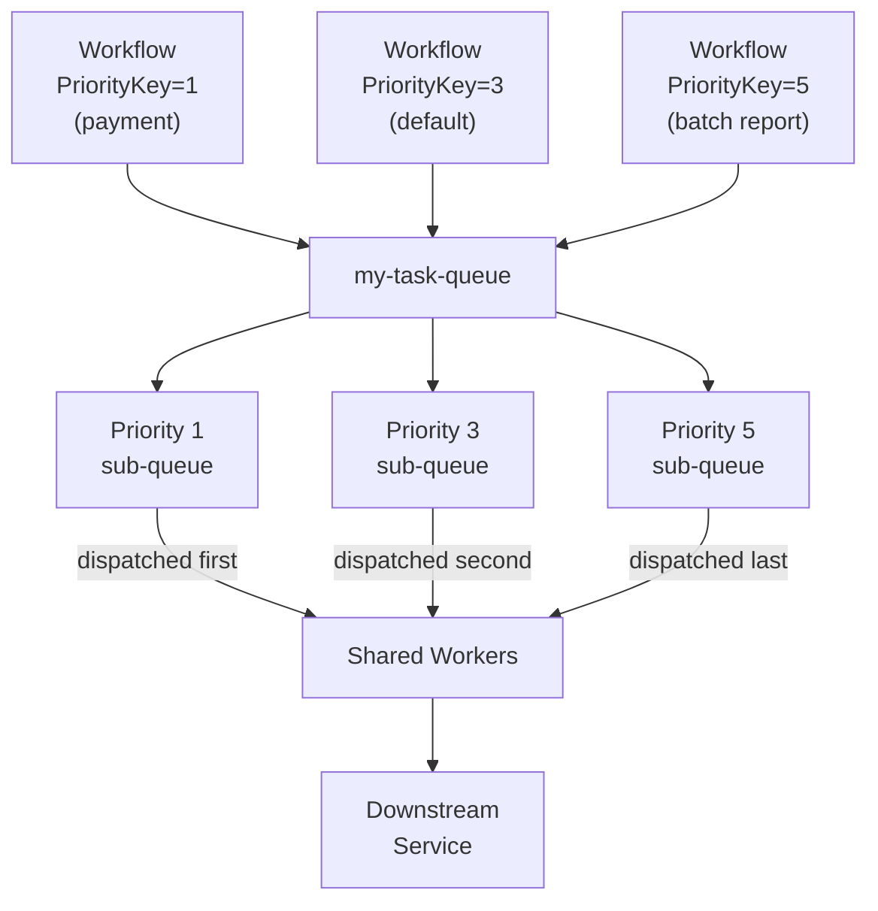

import Tabs from '@theme/Tabs';
import TabItem from '@theme/TabItem';

:::info[TLDR]
Assign a `PriorityKey` (1–5) to Workflows and Activities so **high priority work executes ahead of lower priority work** on a shared Task Queue. Use this when a flood of batch or background tasks would otherwise delay high-urgency requests.
:::

## Overview

The Priority Task Queues pattern assigns a `PriorityKey` to Workflows, Activities, and Child Workflows so that time-sensitive work executes ahead of lower-priority work within a single Task Queue—without requiring separate queues or routing logic.

## Problem

In a shared Task Queue, tasks execute in generally first-in-first-out (FIFO) order. When a large batch of low-priority work—nightly reports, bulk imports, background processing—floods the queue before time-sensitive requests arrive, the higher-priority requests wait behind the entire batch. A single queue with no ordering mechanism gives equal treatment to all tasks regardless of business urgency.

## Solution

Temporal's native Priority feature lets you assign a `PriorityKey` (an integer from 1 to 5, where 1 is the highest priority and 5 is the lowest) to any Workflow, Activity, or Child Workflow. The Temporal matching service maintains a sub-queue for each priority level and exhausts all tasks at a given level before dispatching to the next. Tasks default to priority 3 when no key is set. Activities and Child Workflows inherit the parent Workflow's priority unless they set their own.



The following describes each step in the diagram:

1. Workflows start with a `PriorityKey` in their start options. Payment workflows use priority 1; routine workflows default to 3; nightly batch reports use priority 5.
2. The Temporal matching service routes each task to the corresponding priority sub-queue inside the single Task Queue.
3. Workers poll the Task Queue and receive tasks in priority order: all priority-1 tasks are dispatched before any priority-2 task, and so on.
4. Activities and Child Workflows inherit the parent Workflow's `PriorityKey` unless they explicitly set their own.

## Implementation

Priority is enabled by default in Temporal Cloud and self-hosted Temporal.

### Set Workflow priority at start

<Tabs groupId="language" queryString>
<TabItem value="python" label="Python">

```python
from temporalio.common import Priority

handle = await client.start_workflow(
    ChargeCustomer.run,
    id="charge-customer-wf",
    task_queue="my-task-queue",
    priority=Priority(priority_key=1),
)
```

</TabItem>
<TabItem value="go" label="Go">

```go
we, err := c.ExecuteWorkflow(
    context.Background(),
    client.StartWorkflowOptions{
        ID:        "charge-customer-wf",
        TaskQueue: "my-task-queue",
        Priority:  temporal.Priority{PriorityKey: 1},
    },
    ChargeCustomer,
)
```

</TabItem>
<TabItem value="java" label="Java">

```java
WorkflowOptions options = WorkflowOptions.newBuilder()
    .setWorkflowId("charge-customer-wf")
    .setTaskQueue("my-task-queue")
    .setPriority(Priority.newBuilder().setPriorityKey(1).build())
    .build();
ChargeCustomer workflow = client.newWorkflowStub(ChargeCustomer.class, options);
WorkflowClient.start(workflow::run);
```

</TabItem>
</Tabs>

### Set Activity priority

Activities inherit the parent Workflow's priority. Override the `PriorityKey` in `ActivityOptions` when an individual Activity should run at a different level than its Workflow.

<Tabs groupId="language" queryString>
<TabItem value="python" label="Python">

```python
from temporalio.common import Priority

# inside the workflow
result = await workflow.execute_activity(
    process_payment,
    start_to_close_timeout=timedelta(minutes=1),
    priority=Priority(priority_key=1),
)
```

</TabItem>
<TabItem value="go" label="Go">

```go
ao := workflow.ActivityOptions{
    StartToCloseTimeout: time.Minute,
    Priority:            temporal.Priority{PriorityKey: 1},
}
ctx = workflow.WithActivityOptions(ctx, ao)
err := workflow.ExecuteActivity(ctx, ProcessPayment).Get(ctx, nil)
```

</TabItem>
<TabItem value="java" label="Java">

```java
ActivityOptions options = ActivityOptions.newBuilder()
    .setStartToCloseTimeout(Duration.ofMinutes(1))
    .setPriority(Priority.newBuilder().setPriorityKey(1).build())
    .build();
PaymentActivities activities = Workflow.newActivityStub(PaymentActivities.class, options);
activities.processPayment();
```

</TabItem>
</Tabs>

### Set Child Workflow priority

<Tabs groupId="language" queryString>
<TabItem value="python" label="Python">

```python
from temporalio.common import Priority

# inside the parent workflow
result = await workflow.execute_child_workflow(
    ProcessOrder.run,
    id="process-order-child",
    task_queue="my-task-queue",
    priority=Priority(priority_key=2),
)
```

</TabItem>
<TabItem value="go" label="Go">

```go
cwo := workflow.ChildWorkflowOptions{
    WorkflowID: "process-order-child",
    TaskQueue:  "my-task-queue",
    Priority:   temporal.Priority{PriorityKey: 2},
}
ctx = workflow.WithChildOptions(ctx, cwo)
err := workflow.ExecuteChildWorkflow(ctx, ProcessOrder).Get(ctx, nil)
```

</TabItem>
<TabItem value="java" label="Java">

```java
ChildWorkflowOptions options = ChildWorkflowOptions.newBuilder()
    .setWorkflowId("process-order-child")
    .setTaskQueue("my-task-queue")
    .setPriority(Priority.newBuilder().setPriorityKey(2).build())
    .build();
ProcessOrder child = Workflow.newChildWorkflowStub(ProcessOrder.class, options);
child.run();
```

</TabItem>
</Tabs>

### Set priority via CLI

```sh
temporal workflow start \
  --type ChargeCustomer \
  --task-queue my-task-queue \
  --workflow-id charge-customer-wf \
  --input '{"customerId":"12345"}' \
  --priority-key 1
```

## When to use

This pattern is a good fit when your system mixes time-sensitive operations (payment processing, user-facing requests) with background or batch work (reporting, data imports, inventory management), and you want urgent tasks to proceed even during periods of high load. It also works well when you need to mark urgent tasks that should override normal processing—for example, triggering immediate re-runs of failed critical tasks.

It is not a good fit when all work is effectively equal in urgency, when a continuously replenished high-priority backlog could starve lower-priority work indefinitely, or when you need hard capacity isolation between tiers (see dedicated queues per tier as a supplementary measure). If your concern is prioritizing work amongst tenants or customers, consider the [Fairness](/design-patterns/fairness) pattern, which distributes capacity proportionally using weighted fairness keys rather than strict ordering.

## Benefits and trade-offs

Native priority requires no extra queues, routing logic, or additional Worker pools. A single pool of Workers serves all priority levels, so idle capacity at low-priority levels is automatically used by higher-priority work without any additional configuration.

Lower-priority tasks are blocked until all higher-priority tasks have started. In an environment with a continuously replenished high-priority backlog, low-priority tasks may be significantly delayed. The built-in `PriorityKey` range is 1–5; if more than five distinct levels are needed, the feature cannot accommodate them.

## Comparison with alternatives

| Approach | Isolation | Dynamic priority | Complexity | Scales to many priorities |
| :--- | :--- | :--- | :--- | :--- |
| Temporal PriorityKey (native) | Soft | Yes | Low | Yes (1–5 levels) |
| [Fairness](/design-patterns/fairness) | Soft | Yes | Low | Yes (unlimited keys) |
| Separate Task Queues per tier | Hard | No | Medium | No (static tiers) |
| Single queue (no control) | None | N/A | Lowest | N/A |
| External queue (Kafka, SQS) | Hard | Yes | High | Yes |

## Best practices

- **Use no more than five priority levels.** The `PriorityKey` range is 1–5. Keep levels coarse—for example, 1 = urgent, 3 = normal, 5 = batch—rather than mapping fine-grained business importance to many values.
- **Reserve priority 1 for genuinely urgent work.** If high priority is the fallback when no priority is specified, the highest level fills with routine work and the feature provides no benefit. The default is 3 when no key is set.
- **Set `PriorityKey` at Workflow start, not inside Workflow code.** Workflow code cannot change its own priority after it starts. Set the priority in the start options before execution begins.
- **Override Activity priority deliberately.** Activities inherit the parent Workflow's priority by default. Override only when a specific Activity must run at a different level than its Workflow.
- **Monitor queue depth per priority level.** Sustained backlog growth at a priority level signals that Worker capacity is insufficient for the submitted load at that level.

## Common pitfalls

- **Assigning priority 1 to all work by default.** When every caller sets the highest priority, the feature provides no ordering benefit. Establish an explicit policy for which work types qualify for each level.
- **Neglecting low-priority starvation.** Under sustained high load, priority-5 tasks may wait indefinitely. Use `ScheduleToStartTimeout` on low-priority activities to surface starvation as a visible failure.
- **Changing priority after scheduling.** `PriorityKey` is evaluated when a task enters the queue and cannot be changed while it waits. To re-prioritize an already-queued task, cancel it and reschedule with the new priority.
- **Assuming hard isolation between priority levels.** Priority controls dispatch order, not Worker capacity allocation. A priority-5 task may still consume a Worker slot that is then unavailable for a priority-1 task arriving a moment later.

## Related patterns

- **[Fairness](/design-patterns/fairness)**: Distribute capacity proportionally across tenants within a priority level using fairness keys.
- **[Downstream Rate Limiting](/design-patterns/downstream-rate-limiting)**: Cap absolute throughput to a downstream service regardless of task priority.
- **[Worker-Specific Task Queues](/design-patterns/worker-specific-taskqueue)**: Route Activities to a specific Worker host for resource or data affinity.

## Sample code

The official Temporal documentation provides SDK code examples for setting priority keys on Workflows, Activities, and Child Workflows across all supported languages:

- [Task Queue Priority and Fairness — Temporal docs](https://docs.temporal.io/develop/task-queue-priority-fairness#task-queue-priority)
