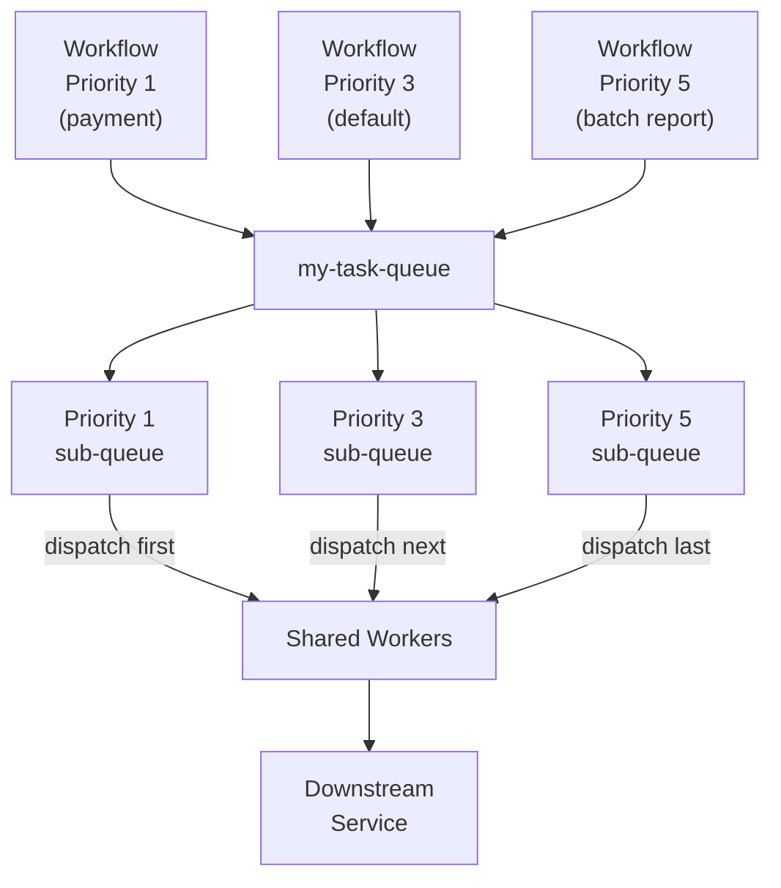

:::info[TLDR]
Assign a Priority key from 1 to 5 to Workflows, Activities, and Child Workflows so higher-priority Tasks dispatch ahead of lower-priority Tasks on a shared Task Queue. Use this when a flood of batch or background Tasks would otherwise delay urgent work.
:::

## Overview

The Priority pattern orders Task dispatches within a shared Task Queue so that time-sensitive work can move ahead of lower-priority work without separate queues or routing logic. Lower Priority key values represent higher priority, so `1` is the highest priority and `5` is the lowest.

Priority applies to dispatch. It does not preempt running Tasks or reserve Worker capacity.

## Problem

In a shared Task Queue, backlogged Tasks are generally dispatched in first-in-first-out (FIFO) order within a partition. When a large batch of low-priority work, such as nightly reports, bulk imports, or background processing, fills the backlog before time-sensitive requests arrive, the urgent work waits behind the batch.

A Task Queue without Priority gives the same dispatch preference to all Tasks, regardless of business urgency.

## Solution

Temporal's Priority feature lets you assign a Priority key from 1 to 5 to any Workflow, Activity, or Child Workflow. Within a Task Queue partition and Worker Deployment Version, the Matching Service maintains a sub-queue for each Priority level and dispatches the highest-priority backlogged Tasks first. Without Fairness, Tasks at the same Priority level are dispatched in FIFO order.

Tasks use Priority key `3` by default. Activities and Child Workflows inherit the parent Workflow's Priority key unless they set their own.

```mermaid
flowchart TD
    WF1["Workflow\nPriority 1\n(payment)"] --> TQ["my-task-queue"]
    WF2["Workflow\nPriority 3\n(default)"] --> TQ
    WF3["Workflow\nPriority 5\n(batch report)"] --> TQ
    TQ --> P1["Priority 1\nsub-queue"]
    TQ --> P3["Priority 3\nsub-queue"]
    TQ --> P5["Priority 5\nsub-queue"]
    P1 -->|dispatch first| W["Shared Workers"]
    P3 -->|dispatch next| W
    P5 -->|dispatch last| W
    W --> DS["Downstream\nService"]
```

The diagram assumes all three levels have backlogged Tasks in the same partition and Worker Deployment Version.

1. Workflows start with a Priority key in their start options. Payment Workflows use Priority `1`, routine Workflows use the default Priority `3`, and nightly batch reports use Priority `5`.
2. The Matching Service routes each Task to its Priority sub-queue within the Task Queue.
3. Workers poll the Task Queue and receive the highest-priority backlogged Tasks first.
4. Activities and Child Workflows inherit the parent Workflow's Priority key unless they set their own.

## Implementation

Priority is enabled by default in Temporal Cloud and self-hosted Temporal. Set a Priority key in Workflow start options or in Activity and Child Workflow options.

See [Task Queue Priority](/develop/task-queue-priority-fairness#task-queue-priority) for SDK and command-line examples, inheritance behavior, and self-hosted configuration.

## When to use

Use Priority when a Task Queue handles work with different levels of urgency. Common examples include payments or user-facing requests sharing Workers with reports, data imports, or inventory updates. When Tasks back up, Priority dispatches urgent Tasks ahead of routine Tasks.

Priority also works well for exceptional Tasks that should dispatch ahead of normal work, such as an operator-triggered recovery Task.

Priority adds little when all work has the same urgency. A sustained high-priority backlog can starve lower-priority Tasks. Use separate Task Queues with dedicated Workers and compute for capacity isolation. Use [Fairness](/design-patterns/fairness) when tenants within a Priority level need weighted shares of dispatches.

## Benefits and trade-offs

Native Priority requires no extra queues, routing logic, or additional Worker pools. A single pool of Workers serves all Priority levels, so idle Worker capacity is shared across all levels.

Priority applies only to Tasks waiting for dispatch. It does not preempt Tasks that are already running. A sustained higher-priority backlog can delay lower-priority Tasks indefinitely. Priority supports five levels, from `1` for the highest priority to `5` for the lowest.

## Comparison with alternatives

| Approach | Backlog dispatch | Shares idle capacity |
| :--- | :--- | :--- |
| Priority on a shared Task Queue | Higher-priority Tasks first | Yes |
| [Fairness](/design-patterns/fairness) on a shared Task Queue | Weighted across groups within a Priority level | Yes |
| Separate Task Queues with shared compute | Independent backlogs | Yes |
| Separate Task Queues with dedicated compute | Independent backlogs | No |

## Best practices

- **Keep Priority levels coarse.** For example, use `1` for urgent work, `3` for normal work, and `5` for batch work.
- **Reserve Priority `1` for urgent work.** When every caller uses the highest Priority, the feature provides no ordering benefit.
- **Set the initial Priority key in Workflow start options.** Activities and Child Workflows inherit it unless they set their own.
- **Override Activity Priority deliberately.** Use a different Priority key only when an Activity should dispatch at a different level than its Workflow.

## Common pitfalls

- **Assigning Priority key `1` to all work.** Priority cannot order Tasks when they all use the same key.
- **Expecting Priority across Task Queue partitions.** Each partition orders its backlog independently.
- **Expecting Priority across Worker Deployment Versions.** Each version has a separate backlog. Priority applies within each version's backlog.
- **Expecting FIFO order within a Priority level when using Fairness.** Fairness controls dispatch within each Priority level.
- **Expecting every Task to pass through priority dispatch.** Synchronous matching can send a Task directly to an idle poller. [Eager Task Execution](/develop/worker-performance#eager-task-execution) bypasses matching.
- **Ignoring lower-priority starvation.** A sustained higher-priority backlog can prevent lower-priority Tasks from dispatching.

## Related

### Patterns

- **[Fairness](/design-patterns/fairness)**: Distribute dispatches across tenants within a Priority level.
- **[Downstream Rate Limiting](/design-patterns/downstream-rate-limiting)**: Cap dispatch throughput to a downstream service.
- **[Worker-Specific Task Queues](/design-patterns/worker-specific-taskqueue)**: Route Activities to a specific Worker host for resource or data affinity.
