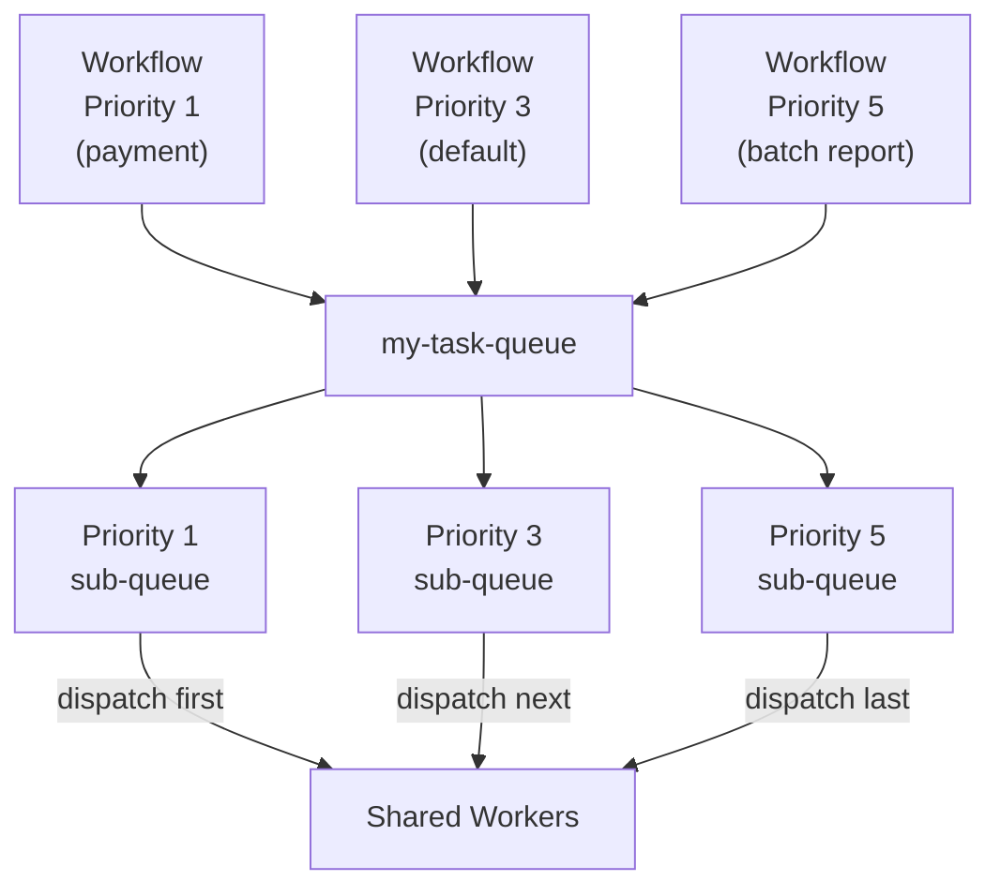

:::info[TLDR]
Assign a Priority key from 1 to 5 to Workflows, Activities, and Child Workflows. When Tasks are backlogged, Temporal dispatches higher-priority Tasks first. Use Priority when urgent work should move ahead of a backlog.
:::

## Overview

Priority orders Task dispatches within a shared Task Queue. Lower Priority key values represent higher priority, so `1` is the highest priority and `5` is the lowest.

Priority applies to dispatch. It does not preempt running Tasks or reserve Worker capacity.

## Problem

Without Priority, backlogged Tasks are generally dispatched in first-in-first-out (FIFO) order within a Task Queue partition. A large batch can fill the backlog before urgent work arrives, delaying time-sensitive Tasks.

Separate Task Queues can isolate the backlogs, but require more routing and Worker configuration.

## Solution

Assign a Priority key to each Workflow, Activity, or Child Workflow. Within a Task Queue partition, the Matching Service dispatches the highest-priority backlogged Tasks first. Without Fairness, Tasks with the same Priority key are dispatched in FIFO order.

Tasks use Priority key `3` by default. Activities and Child Workflows inherit the parent Workflow's Priority key unless they set their own.

```mermaid
flowchart TD
    WF1["Workflow\nPriority 1\n(payment)"] --> TQ["my-task-queue"]
    WF2["Workflow\nPriority 3\n(default)"] --> TQ
    WF3["Workflow\nPriority 5\n(batch report)"] --> TQ
    TQ --> P1["Priority 1\nsub-queue"]
    TQ --> P3["Priority 3\nsub-queue"]
    TQ --> P5["Priority 5\nsub-queue"]
    P1 -->|dispatch first| W["Shared Workers"]
    P3 -->|dispatch next| W
    P5 -->|dispatch last| W
```

The diagram assumes all three levels have backlogged Tasks. Lower-priority Tasks wait for higher-priority backlogs to drain.

## Implementation

Priority is enabled by default in Temporal Cloud and self-hosted Temporal. Set a Priority key in Workflow start options or in Activity and Child Workflow options.

See [Task Queue Priority](/develop/task-queue-priority-fairness#task-queue-priority) for SDK and command-line examples, inheritance behavior, and self-hosted configuration.

## When to use

Use Priority when a Task Queue handles work with different levels of urgency. Common examples include payments or user-facing requests sharing Workers with reports, data imports, or inventory updates. When Tasks back up, Priority dispatches urgent Tasks ahead of routine Tasks.

Priority also works well for exceptional Tasks that should dispatch ahead of normal work, such as an operator-triggered recovery Task.

Priority adds little when all work has the same urgency. A sustained high-priority backlog can starve lower-priority Tasks. Use separate Task Queues with dedicated Workers and compute for capacity isolation. Use [Fairness](/design-patterns/fairness) when tenants within a Priority level need weighted shares of dispatches.

## Benefits and trade-offs

Priority keeps work on one Task Queue and Worker pool. Urgency levels require no separate routing or Workers. All levels share idle Worker capacity. When one level has no backlog, Tasks at other levels can use the available dispatches.

Priority applies only to Tasks waiting for dispatch. It does not preempt Tasks that are already running. A sustained higher-priority backlog can delay lower-priority Tasks indefinitely. Priority supports five levels, from `1` for the highest priority to `5` for the lowest.

## Comparison with alternatives

| Approach | Backlog dispatch | Shares idle capacity |
| :--- | :--- | :--- |
| Priority on a shared Task Queue | Higher-priority Tasks first | Yes |
| [Fairness](/design-patterns/fairness) on a shared Task Queue | Weighted across groups within a Priority level | Yes |
| Separate Task Queues with shared compute | Independent backlogs | Yes |
| Separate Task Queues with dedicated compute | Independent backlogs | No |

## Best practices

- **Define a small set of levels.** For example, use `1` for urgent work, `3` for normal work, and `5` for batch work.
- **Use inheritance.** Set an Activity or Child Workflow's Priority key only when it should differ from its parent Workflow.

## Common pitfalls

- **Assigning Priority key `1` to all work.** Priority cannot order Tasks when they all use the same key.
- **Expecting Priority across Task Queue partitions.** Each partition orders its backlog independently.
- **Expecting Priority across Worker Deployment Versions.** Each version has a separate backlog. Priority applies within each version's backlog.
- **Expecting FIFO order within a Priority level when using Fairness.** Fairness controls dispatch within each Priority level.
- **Expecting every Task to pass through priority dispatch.** Synchronous matching can send a Task directly to an idle poller. [Eager Task Execution](/develop/worker-performance#eager-task-execution) bypasses matching.
- **Ignoring lower-priority starvation.** A sustained higher-priority backlog can prevent lower-priority Tasks from dispatching.

## Related

### Patterns

- **[Fairness](/design-patterns/fairness)**: Distribute dispatches across tenants within a Priority level.
- **[Downstream Rate Limiting](/design-patterns/downstream-rate-limiting)**: Cap dispatch throughput to a downstream service.
- **[Worker-Specific Task Queues](/design-patterns/worker-specific-taskqueue)**: Route Activities to a specific Worker host for resource or data affinity.
