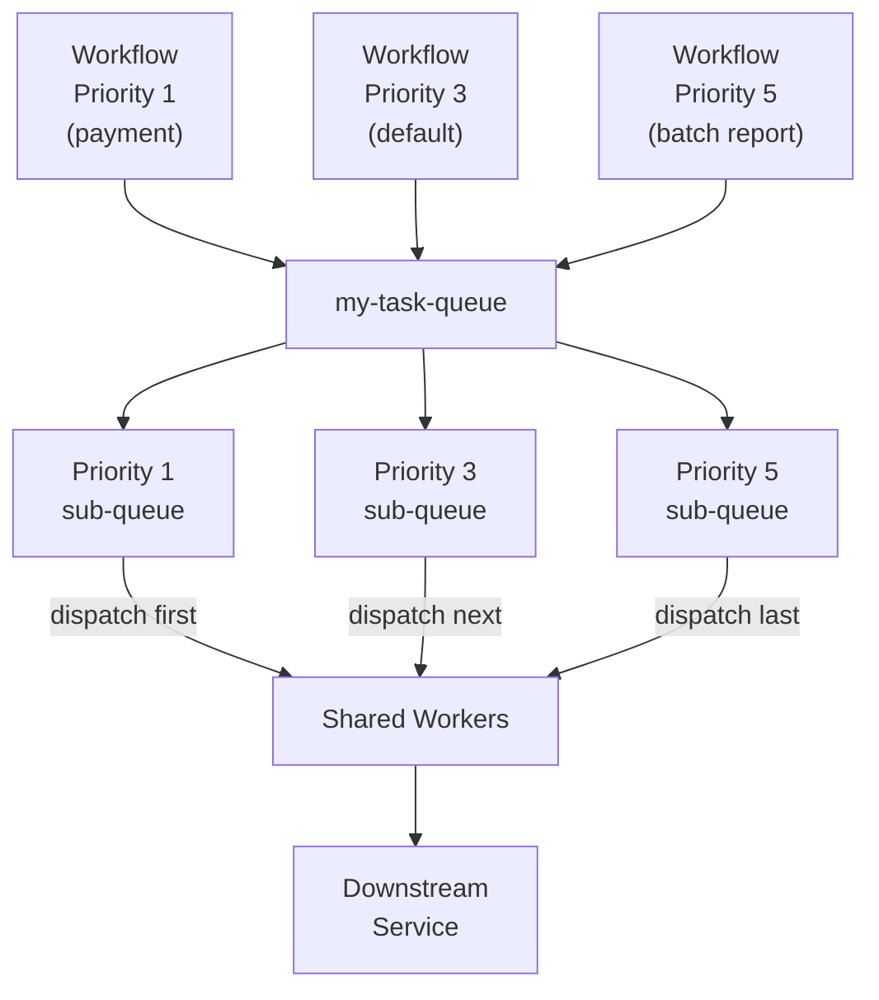

:::info[TLDR]
Assign a Priority key from 1 to 5 to Workflows and Activities so high-priority work dispatches ahead of lower-priority work on a shared Task Queue. Use this when a flood of batch or background Tasks would otherwise delay high-urgency requests.
:::

## Overview

The Priority pattern assigns a Priority key to Workflows, Activities, and Child Workflows so that time-sensitive work dispatches ahead of lower-priority work within a single Task Queue, without requiring separate queues or routing logic.

Priority applies to dispatch. It does not preempt running Tasks or reserve Worker capacity.

## Problem

In a shared Task Queue, backlogged Tasks are generally dispatched in first-in-first-out (FIFO) order within a partition. When a large batch of low-priority work, such as nightly reports, bulk imports, or background processing, fills the backlog before time-sensitive requests arrive, the higher-priority requests wait behind the entire batch. A single Task Queue with no ordering mechanism gives the same dispatch preference to all Tasks, regardless of business urgency.

## Solution

Temporal's native Priority feature lets you assign a Priority key (an integer from 1 to 5, where 1 is the highest priority and 5 is the lowest) to any Workflow, Activity, or Child Workflow. The Matching Service maintains a sub-queue for each Priority level and exhausts all backlogged Tasks at a given level before dispatching to the next. Tasks default to Priority `3` when no key is set. Activities and Child Workflows inherit the parent Workflow's Priority unless they set their own.

```mermaid
flowchart TD
    WF1["Workflow\nPriority 1\n(payment)"] --> TQ["my-task-queue"]
    WF2["Workflow\nPriority 3\n(default)"] --> TQ
    WF3["Workflow\nPriority 5\n(batch report)"] --> TQ
    TQ --> P1["Priority 1\nsub-queue"]
    TQ --> P3["Priority 3\nsub-queue"]
    TQ --> P5["Priority 5\nsub-queue"]
    P1 -->|dispatch first| W["Shared Workers"]
    P3 -->|dispatch next| W
    P5 -->|dispatch last| W
    W --> DS["Downstream\nService"]
```

The diagram assumes all three levels have backlogged Tasks in the same Task Queue partition and Worker Deployment Version.

1. Workflows start with a Priority key in their start options. Payment Workflows use Priority `1`. Routine Workflows default to Priority `3`. Nightly batch reports use Priority `5`.
2. The Matching Service routes each Task to the corresponding Priority sub-queue inside the Task Queue.
3. Workers poll the Task Queue and receive the highest-priority backlogged Tasks first.
4. Activities and Child Workflows inherit the parent Workflow's Priority unless they set their own.

## Implementation

Priority is enabled by default in Temporal Cloud and self-hosted Temporal. Set a Priority key in Workflow start options or in Activity and Child Workflow options.

See [Task Queue Priority](/develop/task-queue-priority-fairness#task-queue-priority) for SDK and command-line examples, inheritance behavior, and self-hosted configuration.

## When to use

This pattern is a good fit when your system mixes time-sensitive operations (payment processing, user-facing requests) with background or batch work (reporting, data imports, inventory management), and you want urgent Tasks to dispatch first during periods of high load. It also works well when you need to mark urgent Tasks that should dispatch ahead of normal processing, for example, triggering immediate reruns of failed critical Tasks.

It is not a good fit when all work is effectively equal in urgency, when a continuously replenished high-priority backlog could starve lower-priority work indefinitely, or when you need hard capacity isolation between tiers. Use separate Task Queues with dedicated Worker pools and compute resources for hard capacity isolation. If your concern is prioritizing work among tenants or customers, consider [Fairness](/design-patterns/fairness), which distributes dispatches proportionally using weighted Fairness keys.

## Benefits and trade-offs

Native Priority requires no extra queues, routing logic, or additional Worker pools. A single pool of Workers serves all Priority levels, so idle Worker capacity is shared across all levels.

Lower-priority Tasks wait while higher-priority Tasks remain backlogged. In an environment with a continuously replenished high-priority backlog, low-priority Tasks may be delayed indefinitely. The built-in Priority key range is 1 to 5. The feature does not support more than five levels.

## Comparison with alternatives

| Approach | Backlog dispatch | Shares idle capacity |
| :--- | :--- | :--- |
| Priority on a shared Task Queue | Higher-priority Tasks first | Yes |
| [Fairness](/design-patterns/fairness) on a shared Task Queue | Weighted across groups within a Priority level | Yes |
| Separate Task Queues with shared compute | Independent backlogs | Yes |
| Separate Task Queues with dedicated compute | Independent backlogs | No |

## Best practices

- **Use no more than five Priority levels.** The Priority key range is 1 to 5. Keep levels coarse. For example, use `1` for urgent work, `3` for normal work, and `5` for batch work.
- **Reserve Priority `1` for genuinely urgent work.** When every caller uses Priority `1`, the highest level fills with routine work and the feature provides no benefit. The default is `3` when no key is set.
- **Set the initial Priority key at Workflow start.** Set the Priority in the start options before execution begins. Activities and Child Workflows inherit it unless they set their own.
- **Override Activity Priority deliberately.** Activities inherit the parent Workflow's Priority by default. Override it only when a specific Activity must dispatch at a different level than its Workflow.
- **Monitor queue depth per Priority level.** Sustained backlog growth at a level means Tasks are arriving faster than they are being dispatched.

## Common pitfalls

- **Assigning Priority `1` to all work by default.** When every caller sets the highest Priority, the feature provides no ordering benefit. Establish an explicit policy for which work types qualify for each level.
- **Neglecting low-priority starvation.** Under sustained high load, Priority `5` Tasks may wait indefinitely. Use a [Schedule-To-Start Timeout](/encyclopedia/detecting-activity-failures#schedule-to-start-timeout) on low-priority Activities to surface starvation as a visible failure.
- **Assuming Priority cannot change after scheduling.** Use `UpdateWorkflowExecutionOptions` to change a Workflow Execution's Priority and `UpdateActivityOptions` to change a pending Activity's Priority.
- **Assuming hard isolation between Priority levels.** Priority controls dispatch order, not Worker capacity allocation. A Priority `5` Task may still occupy a Worker slot when a Priority `1` Task arrives.

## Related

### Patterns

- **[Fairness](/design-patterns/fairness)**: Distribute dispatches across tenants within a Priority level.
- **[Downstream Rate Limiting](/design-patterns/downstream-rate-limiting)**: Cap dispatch throughput to a downstream service.
- **[Worker-Specific Task Queues](/design-patterns/worker-specific-taskqueue)**: Route Activities to a specific Worker host for resource or data affinity.
