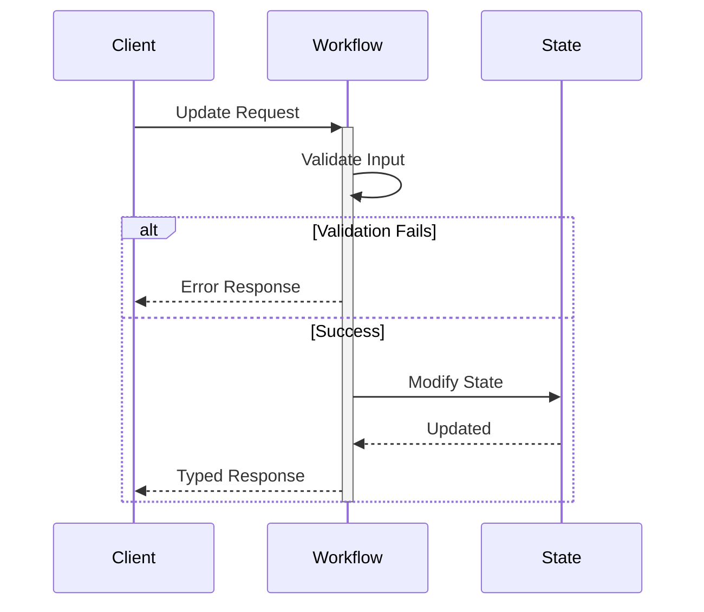

import Tabs from '@theme/Tabs';
import TabItem from '@theme/TabItem';

## Overview

Workflow Updates enable synchronous request-response interactions where clients receive immediate, typed responses while the Workflow continues processing.
Updates modify Workflow state, validate inputs, and return results directly to the caller with strong consistency guarantees.

## Problem

In distributed systems, you often need Workflows that provide immediate feedback to clients (validation results, confirmation IDs), require strong consistency guarantees for operations, need typed error handling for validation failures, should validate inputs before accepting work, and allow external systems to modify Workflow state synchronously.

Without Updates, clients must use Signals and poll via Queries (complex, eventually consistent), wait for entire Workflow completion (slow), implement complex coordination logic, and handle race conditions between Signals and Queries.

## Solution

Temporal's Update API executes an Update handler that can validate inputs, modify state, and return values synchronously.
The Update is recorded in Workflow history before returning, providing strong consistency.



The following describes each step in the diagram:

1. The client sends an Update request to the Workflow.
2. The Workflow validates the input. If validation fails, it returns a typed error response.
3. If validation succeeds, the Workflow modifies its state and returns a typed response to the client.

## Implementation

The following examples show a task assignment Workflow that accepts tasks via Updates with validation.
The Update validator rejects requests when the task limit is reached, and the Update handler assigns the task and returns a result.

<Tabs groupId="language" queryString>
<TabItem value="python" label="Python">

```python
# workflows.py
import uuid
from dataclasses import dataclass
from temporalio import workflow

MAX_TASKS = 10

@dataclass
class AssignmentResult:
    assignment_id: str
    task_name: str
    total_tasks: int

@workflow.defn
class TaskWorkflow:
    def __init__(self) -> None:
        self.tasks: list[str] = []

    @workflow.run
    async def run(self) -> None:
        await workflow.wait_condition(lambda: False)

    @workflow.update
    async def assign_task(self, task_name: str) -> AssignmentResult:
        assignment_id = str(uuid.uuid4())
        self.tasks.append(task_name)
        return AssignmentResult(
            assignment_id=assignment_id,
            task_name=task_name,
            total_tasks=len(self.tasks),
        )

    @assign_task.validator
    def validate_assign_task(self, task_name: str) -> None:
        if len(self.tasks) >= MAX_TASKS:
            raise ValueError("Task limit reached")

    @workflow.query
    def get_tasks(self) -> list[str]:
        return list(self.tasks)
```

</TabItem>
<TabItem value="go" label="Go">

```go
// workflow.go
type TaskWorkflow struct{}

const MaxTasks = 10

func (w *TaskWorkflow) Run(ctx workflow.Context) error {
	tasks := []string{}

	err := workflow.SetUpdateHandlerWithOptions(
		ctx,
		"AssignTask",
		func(ctx workflow.Context, taskName string) (AssignmentResult, error) {
			assignmentID := uuid.New().String()
			tasks = append(tasks, taskName)
			return AssignmentResult{
				AssignmentID: assignmentID,
				TaskName:     taskName,
				TotalTasks:   len(tasks),
			}, nil
		},
		workflow.UpdateHandlerOptions{
			Validator: func(taskName string) error {
				if len(tasks) >= MaxTasks {
					return fmt.Errorf("task limit reached")
				}
				return nil
			},
		},
	)
	if err != nil {
		return err
	}

	err = workflow.SetQueryHandler(ctx, "GetTasks", func() ([]string, error) {
		return tasks, nil
	})
	if err != nil {
		return err
	}

	workflow.GetSignalChannel(ctx, "").Receive(ctx, nil)
	return nil
}
```

</TabItem>
<TabItem value="java" label="Java">

```java
// TaskWorkflow.java
@WorkflowInterface
public interface TaskWorkflow {
  @WorkflowMethod
  void run();

  @UpdateMethod
  AssignmentResult assignTask(String taskName);

  @QueryMethod
  List<String> getTasks();
}

public class TaskWorkflowImpl implements TaskWorkflow {
  private static final int MAX_TASKS = 10;
  private List<String> tasks = new ArrayList<>();

  @Override
  public void run() {
    Workflow.await(() -> false);
  }

  @UpdateValidatorMethod(updateName = "assignTask")
  protected void validateAssignTask(String taskName) {
    if (tasks.size() >= MAX_TASKS) {
      throw new IllegalStateException("Task limit reached");
    }
  }

  @Override
  public AssignmentResult assignTask(String taskName) {
    String assignmentId = UUID.randomUUID().toString();
    tasks.add(taskName);

    return new AssignmentResult(assignmentId, taskName, tasks.size());
  }

  @Override
  public List<String> getTasks() {
    return new ArrayList<>(tasks);
  }
}
```

</TabItem>
<TabItem value="typescript" label="TypeScript">

```typescript
// workflow.ts
import * as wf from '@temporalio/workflow';

interface AssignmentResult {
  assignmentId: string;
  taskName: string;
  totalTasks: number;
}

export const assignTaskUpdate = wf.defineUpdate<AssignmentResult, [string]>('assignTask');
export const getTasksQuery = wf.defineQuery<string[]>('getTasks');

const MAX_TASKS = 10;

export async function taskWorkflow(): Promise<void> {
  const tasks: string[] = [];

  wf.setHandler(
    assignTaskUpdate,
    (taskName: string): AssignmentResult => {
      const assignmentId = wf.uuid4();
      tasks.push(taskName);
      return { assignmentId, taskName, totalTasks: tasks.length };
    },
    {
      validator: (taskName: string): void => {
        if (tasks.length >= MAX_TASKS) {
          throw new Error('Task limit reached');
        }
      },
    }
  );

  wf.setHandler(getTasksQuery, (): string[] => tasks);

  await wf.condition(() => false);
}
```

</TabItem>
</Tabs>

In all SDKs, the validator runs before the Update handler.
If the validator throws an exception, the Update is rejected and the client receives a typed error.
If the validator passes, the Update handler modifies state and returns a typed result.
The Update is recorded in Workflow history before the response is returned to the client.

## When to use

The Update pattern is a good fit for request-response patterns requiring immediate confirmation, input validation before accepting work, synchronous state modifications with typed responses, operations requiring strong consistency guarantees, and entity Workflows that need external state Updates.

It is not a good fit for fire-and-forget operations (use Signals), read-only operations (use Queries), high-throughput scenarios where latency matters (Updates are slower than Signals), or operations that do not need an immediate response.

## Benefits and trade-offs

Benefits:

- Updates provide a synchronous response — the client receives a typed return value immediately.
- Validation failures return as typed exceptions.
- The Update is recorded in history before returning, providing strong consistency.
- You can modify Workflow state directly from external systems.

Trade-offs:

- Updates are slower than Signals (they require a history write).
- The Update handler blocks Workflow Task execution and consumes Workflow Task execution time.
- For fire-and-forget messages that need no response, Updates require more machinery than Signals.
- Update arguments and return values are limited by the Workflow history event size (typically 2 MB per event).
- Each Update adds events to Workflow history, contributing to the 50K event limit.
- There is a maximum of 10 in-flight Updates per Workflow execution and a maximum of 2,000 total Updates in Workflow history.

## Comparison with alternatives

| Approach | Use case | Response type | Latency | Consistency |
| :--- | :--- | :--- | :--- | :--- |
| Update | Request-response | Sync typed value | Higher | Strong |
| Signal | Fire-and-forget | None | Lower | Eventual |
| Query | Read-only | Sync typed value | Lowest | Eventual |

## Best practices

- **Validate early.** Check inputs at the start of the Update handler to fail fast.
- **Handle errors.** Throw typed exceptions for validation failures.
- **Return quickly.** Do not perform long operations in the Update handler.
- **Track Update IDs only across Continue-As-New.** Within a single Workflow Execution, the Server deduplicates retried Updates automatically by Update ID, so a retry does not run the handler twice. You only need to track processed Update IDs in Workflow state when carrying them across a Continue-As-New boundary, because Update ID deduplication is scoped to a single Workflow Run.
- **Set timeouts.** Configure appropriate Update timeouts.
- **Maintain state consistency.** Ensure state modifications are atomic within the handler.

## Common pitfalls

- **Performing long operations in the Update handler.** Update handlers block Workflow Task execution. Offload long-running work to Activities and use `Workflow.await` in the handler to wait for results.
- **Exceeding the 2,000 total Updates limit.** Each accepted Update adds events to history. Use Continue-As-New before reaching the limit. The server sets `SuggestContinueAsNew` at 90% of the limit.
- **Not setting Update timeouts.** Without a client-side timeout, the caller blocks indefinitely if the Worker is unavailable. Always set a context timeout or deadline.
- **Assuming you must set an Update ID for retry safety.** The SDK auto-generates a unique `updateId` when you do not provide one, and retried client calls are deduplicated automatically, so a transient retry will not run the handler twice. Set a stable, business-meaningful `updateId` when you want a retried Update-with-Start to attach to an existing in-flight Update instead of starting duplicate work.
- **Using Updates for fire-and-forget.** Updates require a Worker to be online and responsive. For fire-and-forget operations, use Signals instead.

## Related patterns

- **Signal**: Fire-and-forget state modifications.
- **Query**: Read-only state inspection.
- **[Entity Workflow](/design-patterns/entity-workflow)**: Long-running Workflows representing business entities.
- **[Early Return](/design-patterns/early-return)**: Returning intermediate results before Workflow completion.

## Sample code

- [Safe Message Handlers (Python)](https://github.com/temporalio/samples-python/tree/main/message_passing/safe_message_handlers) — Concurrent Update handling with validation.
- [Safe Message Passing (Java)](https://github.com/temporalio/samples-java/tree/main/core/src/main/java/io/temporal/samples/safemessagepassing) — Concurrent Update handling with validation.
- [Update with Start - Shopping Cart (Go)](https://github.com/temporalio/samples-go/tree/main/shoppingcart) — Update-with-Start for lazy initialization.
