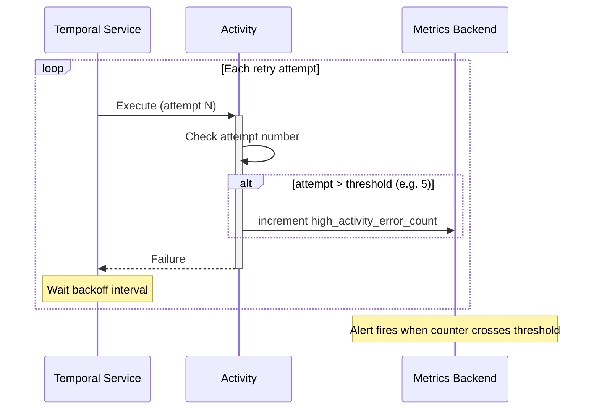

import Tabs from '@theme/Tabs';
import TabItem from '@theme/TabItem';

:::info[TLDR]
Emit a counter metric from inside the Activity when the attempt number exceeds a threshold, using the SDK's built-in metrics scope. **Use this to surface silent, persistent failures to on-call teams before they breach an SLA** — without changing retry behavior or adding Workflow-level tracking.
:::

## Overview

The Retry Alerting via Metrics pattern emits a custom metric counter from inside the Activity whenever the attempt number exceeds a threshold.
Use it to surface silent, persistent failures to on-call teams before they breach an SLA — without modifying retry behavior or adding Workflow-level tracking.

## Problem

When an Activity retries indefinitely, failures are invisible at the system level until something breaks.
The Temporal UI shows the current attempt number, but on-call teams do not watch the UI continuously.
Without a metric or alert, a downstream system can be down for hours while the Workflow keeps retrying silently — and the first sign of a problem is an SLA breach or a user complaint.

Common gaps:

- A payment gateway is down. Workflows are retrying every 5 minutes. No alert fires until the merchant escalates.
- An email provider is rejecting requests. Activities are on attempt 50. No metric has been emitted. On-call has no signal.
- A third-party API degraded. Retries are accumulating. The engineering team learns about the problem from a customer, not from their own alerting.

## Solution

Read the current attempt number from the Activity execution context and emit a counter metric when it exceeds a threshold.
The metric is sent through the Temporal SDK's built-in metrics scope — the same pipeline used for SDK-internal metrics — so it flows to whatever metrics backend your Workers are already configured to use (Prometheus, StatsD, etc.) without additional setup.



The following describes each step:

1. Temporal executes the Activity, passing the current attempt number in the execution context.
2. The Activity checks whether the attempt number exceeds the threshold.
3. If it does, the Activity increments a counter metric using the SDK's built-in metrics scope.
4. On failure, Temporal waits the backoff interval and retries.
5. The metrics backend accumulates the counter. Your alerting system fires when the counter or rate crosses a configured threshold.

## Implementation


### Emitting a counter at high attempt counts

Read the attempt number from the Activity info and emit a counter through the SDK metrics scope.
Configure the retry policy separately — the metric emission does not change retry behavior.

<Tabs groupId="language" queryString>
<TabItem value="python" label="Python" default>

```python
# activities.py
from temporalio import activity
from temporalio.exceptions import ApplicationError

ALERT_THRESHOLD = 5

@activity.defn
async def call_downstream_service(endpoint: str) -> str:
    info = activity.info()

    if info.attempt > ALERT_THRESHOLD:
        meter = activity.metric_meter()
        meter.create_counter(
            "high_activity_error_count",
            "Activity has exceeded the failure attempt threshold",
        ).add(1)

    # Attempt the actual work — raises on failure, triggering a retry
    response = await downstream.call(endpoint)
    return response.data
```

</TabItem>
<TabItem value="go" label="Go">

```go
// activities.go
package downstream

import (
    "context"

    "go.temporal.io/sdk/activity"
)

const alertThreshold = 5

func CallDownstreamService(ctx context.Context, endpoint string) (string, error) {
    info := activity.GetInfo(ctx)

    if info.Attempt > alertThreshold {
        activity.GetMetricsHandler(ctx).
            Counter("high_activity_error_count").
            Inc(1)
    }

    // Attempt the actual work — returns an error on failure, triggering a retry
    response, err := downstream.Call(endpoint)
    if err != nil {
        return "", err
    }
    return response.Data, nil
}
```

</TabItem>
<TabItem value="java" label="Java">

```java
// CallDownstreamActivityImpl.java
import io.temporal.activity.Activity;
import io.temporal.activity.ActivityExecutionContext;

public class CallDownstreamActivityImpl implements CallDownstreamActivity {
    private static final int ALERT_THRESHOLD = 5;

    @Override
    public String callDownstreamService(String endpoint) {
        ActivityExecutionContext ctx = Activity.getExecutionContext();

        if (ctx.getInfo().getAttempt() > ALERT_THRESHOLD) {
            ctx.getMetricsScope()
               .counter("HighActivityErrorCount")
               .inc(1);
        }

        // Attempt the actual work — throws on failure, triggering a retry
        return downstream.call(endpoint).getData();
    }
}
```

</TabItem>
<TabItem value="typescript" label="TypeScript">

```typescript
// activities.ts
import { Context } from '@temporalio/activity';

const ALERT_THRESHOLD = 5;

export async function callDownstreamService(endpoint: string): Promise<string> {
    const ctx = Context.current();

    if (ctx.info.attempt > ALERT_THRESHOLD) {
        ctx.metricMeter
            .createCounter('high_activity_error_count')
            .add(1);
    }

    // Attempt the actual work — throws on failure, triggering a retry
    const response = await downstream.call(endpoint);
    return response.data;
}
```

</TabItem>
</Tabs>

### Workflow configuration

Configure the Activity in the Workflow with the desired retry policy.
The metric emission inside the Activity is independent of the retry configuration.

<Tabs groupId="language" queryString>
<TabItem value="python" label="Python" default>

```python
# workflows.py
from datetime import timedelta
from temporalio import workflow
from temporalio.common import RetryPolicy
import activities

@workflow.defn
class MonitoredRetryWorkflow:
    @workflow.run
    async def run(self, endpoint: str) -> str:
        return await workflow.execute_activity(
            activities.call_downstream_service,
            endpoint,
            start_to_close_timeout=timedelta(seconds=30),
            retry_policy=RetryPolicy(
                initial_interval=timedelta(seconds=5),
                backoff_coefficient=2.0,
                maximum_interval=timedelta(minutes=5),
                # No maximum_attempts — retries indefinitely until success
            ),
        )
```

</TabItem>
<TabItem value="go" label="Go">

```go
// workflow.go
func MonitoredRetryWorkflow(ctx workflow.Context, endpoint string) (string, error) {
    ao := workflow.ActivityOptions{
        StartToCloseTimeout: 30 * time.Second,
        RetryPolicy: &temporal.RetryPolicy{
            InitialInterval:    5 * time.Second,
            BackoffCoefficient: 2.0,
            MaximumInterval:    5 * time.Minute,
            // No MaximumAttempts — retries indefinitely until success
        },
    }
    ctx = workflow.WithActivityOptions(ctx, ao)

    var result string
    err := workflow.ExecuteActivity(ctx, CallDownstreamService, endpoint).Get(ctx, &result)
    return result, err
}
```

</TabItem>
<TabItem value="java" label="Java">

```java
// MonitoredRetryWorkflowImpl.java
public class MonitoredRetryWorkflowImpl implements MonitoredRetryWorkflow {
    private final CallDownstreamActivity activities = Workflow.newActivityStub(
        CallDownstreamActivity.class,
        ActivityOptions.newBuilder()
            .setStartToCloseTimeout(Duration.ofSeconds(30))
            .setRetryOptions(RetryOptions.newBuilder()
                .setInitialInterval(Duration.ofSeconds(5))
                .setBackoffCoefficient(2.0)
                .setMaximumInterval(Duration.ofMinutes(5))
                // No setMaximumAttempts — retries indefinitely until success
                .build())
            .build()
    );

    @Override
    public String run(String endpoint) {
        return activities.callDownstreamService(endpoint);
    }
}
```

</TabItem>
<TabItem value="typescript" label="TypeScript">

```typescript
// workflows.ts
import * as wf from '@temporalio/workflow';
import type * as activities from './activities';

const { callDownstreamService } = wf.proxyActivities<typeof activities>({
    startToCloseTimeout: '30s',
    retry: {
        initialInterval: '5s',
        backoffCoefficient: 2,
        maximumInterval: '5m',
        // No maximumAttempts — retries indefinitely until success
    },
});

export async function monitoredRetryWorkflow(endpoint: string): Promise<string> {
    return await callDownstreamService(endpoint);
}
```

</TabItem>
</Tabs>

### Adding dimension labels to the metric

Add labels (tags) to the metric to identify which Activity type, endpoint, or Workflow is producing the high attempt counts.
This makes the metric actionable in dashboards and alerts.

<Tabs groupId="language" queryString>
<TabItem value="python" label="Python" default>

```python
# activities.py
if info.attempt > ALERT_THRESHOLD:
    meter = activity.metric_meter()
    meter.create_counter(
        "high_activity_error_count",
        "Activity has exceeded the failure attempt threshold",
    ).add(1, {"activity_type": info.activity_type, "endpoint": endpoint})
```

</TabItem>
<TabItem value="go" label="Go">

```go
// activities.go
if info.Attempt > alertThreshold {
    activity.GetMetricsHandler(ctx).
        WithTags(map[string]string{
            "activity_type": info.ActivityType.Name,
            "endpoint":      endpoint,
        }).
        Counter("high_activity_error_count").
        Inc(1)
}
```

</TabItem>
<TabItem value="java" label="Java">

```java
// CallDownstreamActivityImpl.java
if (ctx.getInfo().getAttempt() > ALERT_THRESHOLD) {
    ctx.getMetricsScope()
       .tagged(ImmutableMap.of(
           "activity_type", ctx.getInfo().getActivityType(),
           "endpoint", endpoint
       ))
       .counter("HighActivityErrorCount")
       .inc(1);
}
```

</TabItem>
<TabItem value="typescript" label="TypeScript">

```typescript
// activities.ts
if (ctx.info.attempt > ALERT_THRESHOLD) {
    ctx.metricMeter
        .createCounter('high_activity_error_count')
        .add(1, { activity_type: ctx.info.activityType, endpoint });
}
```

</TabItem>
</Tabs>

## Best practices

- **Choose a threshold above normal transient noise.** If your downstream system occasionally has 1–2 retry attempts under normal conditions, set the threshold at 5 or 10 so the metric only fires for genuinely sustained failures.
- **Emit on every attempt above the threshold, not just once.** Incrementing the counter on each high-attempt invocation allows alerting systems to detect both the onset and the duration of a problem by watching the counter rate.
- **Use the SDK metrics scope, not a third-party library.** The SDK scope integrates with your Worker's existing metrics pipeline and adds default labels such as namespace and task queue automatically.
- **Set up rate-based alerts, not count-based.** A count alert requires resetting or remembering the baseline. A rate alert (e.g., "more than 3 increments per minute") fires when the problem is active and clears when it resolves.
- **Combine with Fast/Slow Retries.** Emit the metric in the slow-phase Activity of a [Fast/Slow Retries](/design-patterns/fast-slow-retries) pattern to alert when the Workflow has been in the slow phase long enough to be a concern.

## Common pitfalls

- **Emitting the metric in the Workflow instead of the Activity.** The Workflow does not have access to the Activity's attempt number without passing it explicitly. The Activity context always has the current attempt number — use it there.
- **Alerting on the total counter value instead of the rate.** If the counter is cumulative, a single high-attempt event in the past will keep the counter elevated forever. Alert on the increment rate (events per minute) rather than the absolute count.
- **Not resetting alerting context on success.** If the Activity eventually succeeds after 50 attempts, the high-attempt metric has already fired. Ensure your alerting system can resolve the alert when the metric rate drops to zero.
- **Setting the threshold too low.** A threshold of 1 means the metric fires on the very first retry — which is normal behavior. Calibrate the threshold to your system's expected transient error rate.

## Related patterns

- [Fast/Slow Retries](/design-patterns/fast-slow-retries): Combine by emitting this metric inside the slow-phase Activity to alert when patient waiting has gone on too long.
- [Fixed Count of Retries](/design-patterns/fixed-count-retries): Cap attempts at a fixed number instead of alerting at a threshold.
- [Error Handling & Retry Patterns](/design-patterns/error-handling-patterns): Overview and decision tree for all retry patterns.
