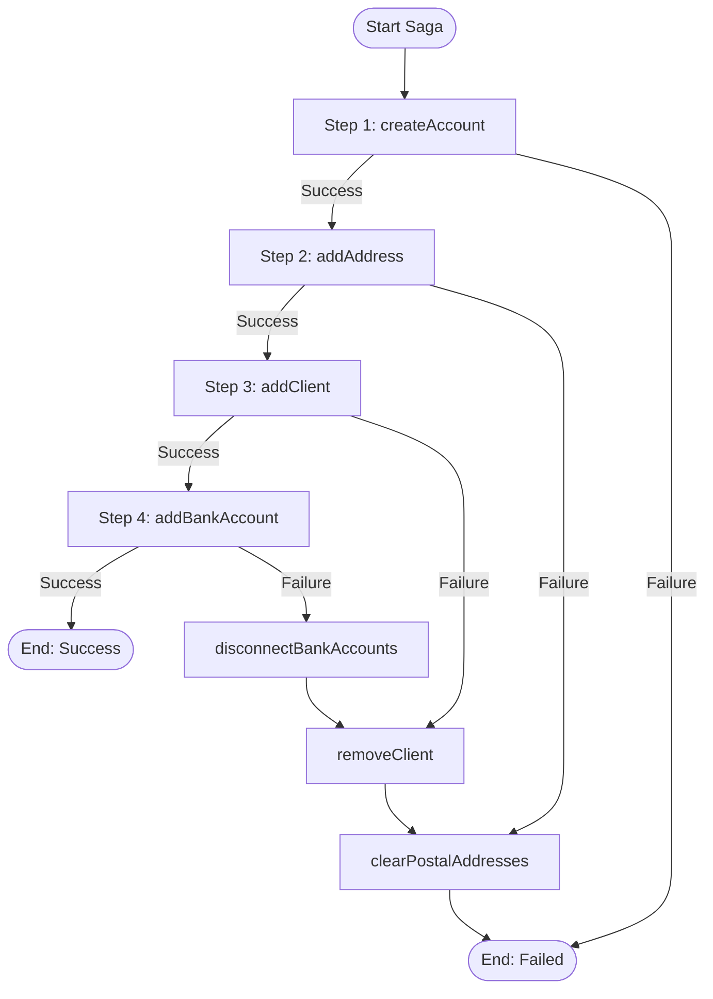

import Tabs from '@theme/Tabs';
import TabItem from '@theme/TabItem';

## Overview

The Saga pattern manages distributed transactions across multiple services by coordinating a sequence of local transactions, each with a compensating action that can undo its effects if subsequent steps fail.

## Problem

In distributed systems, you need to maintain data consistency across multiple services or databases without using traditional ACID transactions.
When a multi-step business process fails partway through, you must undo the effects of completed steps to maintain system consistency.
Traditional two-phase commit does not scale well and creates tight coupling between services.

## Solution

You implement each step as a local transaction with a corresponding compensation transaction.
If any step fails, you execute compensation transactions in reverse order to undo the effects of all completed steps.
You register compensations as each step completes, then automatically trigger them when errors occur to ensure cleanup happens reliably.

The following diagram shows the worked example used by the runner: opening a customer account in four steps, where `addBankAccount` simulates a downstream failure to trigger compensation.



The following describes each step in the diagram:

1. The Saga begins by executing Step 1 (`createAccount`).
2. If Step 1 succeeds, the Workflow proceeds to Step 2 (`addAddress`). If it fails, the Saga ends immediately — no compensations are registered yet.
3. If Step 2 succeeds, the Workflow proceeds to Step 3 (`addClient`). If it fails, the Workflow runs `clearPostalAddresses`.
4. If Step 3 succeeds, the Workflow proceeds to Step 4 (`addBankAccount`). If it fails, the Workflow runs `removeClient`, then `clearPostalAddresses`.
5. If Step 4 succeeds, the Saga completes. If it fails, the Workflow runs all three compensations in reverse: `disconnectBankAccounts`, `removeClient`, `clearPostalAddresses`. Note that `disconnectBankAccounts` is registered before `addBankAccount` runs, so it executes even if `addBankAccount` failed mid-flight — its implementation must be idempotent.

## Implementation

The following examples show how each SDK implements the Saga pattern.
Each language uses a different mechanism to register and execute compensations, but the core principle is the same: register a compensation before or after each step, and run all compensations in reverse order on failure.

<Tabs groupId="language" queryString>
<TabItem value="python" label="Python">

```python
# workflows.py
from temporalio import workflow

@workflow.defn
class OpenAccountWorkflow:
    @workflow.run
    async def run(self, req: OpenAccountRequest) -> str:
        compensations = []

        try:
            # Step 1: createAccount has no compensation — leaving an empty
            # account stub on later failure is acceptable.
            await workflow.execute_activity(
                create_account, req,
                start_to_close_timeout=timedelta(seconds=10),
            )

            # Register compensation for Step 2 BEFORE execution
            compensations.append(
                lambda: workflow.execute_activity(
                    clear_postal_addresses, req,
                    start_to_close_timeout=timedelta(seconds=10),
                )
            )
            # Step 2: Add postal address
            await workflow.execute_activity(
                add_address, req,
                start_to_close_timeout=timedelta(seconds=10),
            )

            # Register compensation for Step 3 BEFORE execution
            compensations.append(
                lambda: workflow.execute_activity(
                    remove_client, req,
                    start_to_close_timeout=timedelta(seconds=10),
                )
            )
            # Step 3: Add client record
            await workflow.execute_activity(
                add_client, req,
                start_to_close_timeout=timedelta(seconds=10),
            )

            # Register compensation for Step 4 BEFORE execution
            compensations.append(
                lambda: workflow.execute_activity(
                    disconnect_bank_accounts, req,
                    start_to_close_timeout=timedelta(seconds=10),
                )
            )
            # Step 4: Link bank account (this step fails in the demo)
            await workflow.execute_activity(
                add_bank_account, req,
                start_to_close_timeout=timedelta(seconds=10),
            )
        except Exception:
            # On error, run compensations in reverse order
            for compensation in reversed(compensations):
                await compensation()
            raise
```

</TabItem>
<TabItem value="go" label="Go">

```go
// open_account_workflow.go
func OpenAccountWorkflow(ctx workflow.Context, req OpenAccountRequest) error {
    var compensations []func()
    runCompensations := func() {
        for i := len(compensations) - 1; i >= 0; i-- {
            compensations[i]()
        }
    }

    // Step 1: CreateAccount has no compensation — leaving an empty account
    // stub on later failure is acceptable.
    if err := workflow.ExecuteActivity(ctx, CreateAccount, req).Get(ctx, nil); err != nil {
        return err
    }

    // Register compensation for Step 2 BEFORE execution
    compensations = append(compensations, func() {
        _ = workflow.ExecuteActivity(ctx, ClearPostalAddresses, req).Get(ctx, nil)
    })
    if err := workflow.ExecuteActivity(ctx, AddAddress, req).Get(ctx, nil); err != nil {
        runCompensations()
        return err
    }

    // Register compensation for Step 3 BEFORE execution
    compensations = append(compensations, func() {
        _ = workflow.ExecuteActivity(ctx, RemoveClient, req).Get(ctx, nil)
    })
    if err := workflow.ExecuteActivity(ctx, AddClient, req).Get(ctx, nil); err != nil {
        runCompensations()
        return err
    }

    // Register compensation for Step 4 BEFORE execution
    compensations = append(compensations, func() {
        _ = workflow.ExecuteActivity(ctx, DisconnectBankAccounts, req).Get(ctx, nil)
    })
    if err := workflow.ExecuteActivity(ctx, AddBankAccount, req).Get(ctx, nil); err != nil {
        runCompensations()
        return err
    }

    return nil
}
```

</TabItem>
<TabItem value="java" label="Java">

```java
// OpenAccountWorkflow.java
@WorkflowInterface
public interface OpenAccountWorkflow {
    @WorkflowMethod
    String openAccount(OpenAccountRequest req);
}

public class OpenAccountWorkflowImpl implements OpenAccountWorkflow {
    private final Activities activities = Workflow.newActivityStub(
        Activities.class,
        ActivityOptions.newBuilder()
            .setStartToCloseTimeout(Duration.ofSeconds(10))
            .build());

    @Override
    public String openAccount(OpenAccountRequest req) {
        // Create a Saga instance with compensation options
        Saga saga = new Saga(new Saga.Options.Builder()
            .setParallelCompensation(false) // Run compensations sequentially
            .build());

        try {
            // Step 1: createAccount has no compensation — leaving an empty
            // account stub on later failure is acceptable.
            activities.createAccount(req);

            // Register compensation for Step 2 BEFORE execution
            saga.addCompensation(activities::clearPostalAddresses, req);
            activities.addAddress(req);

            // Register compensation for Step 3 BEFORE execution
            saga.addCompensation(activities::removeClient, req);
            activities.addClient(req);

            // Register compensation for Step 4 BEFORE execution
            saga.addCompensation(activities::disconnectBankAccounts, req);
            activities.addBankAccount(req);

            return "Account " + req.accountId() + " opened";

        } catch (Exception e) {
            // On any error, run all registered compensations in reverse order
            saga.compensate();
            throw e;
        }
    }
}
```

</TabItem>
<TabItem value="typescript" label="TypeScript">

```typescript
// workflows.ts
type Compensation = () => Promise<void>;

export async function openAccount(req: OpenAccountRequest): Promise<string> {
  const compensations: Compensation[] = [];

  try {
    // Step 1: createAccount has no compensation — leaving an empty account
    // stub on later failure is acceptable.
    await acts.createAccount(req);

    // Register compensation for Step 2 BEFORE execution
    compensations.unshift(() => acts.clearPostalAddresses(req));
    await acts.addAddress(req);

    // Register compensation for Step 3 BEFORE execution
    compensations.unshift(() => acts.removeClient(req));
    await acts.addClient(req);

    // Register compensation for Step 4 BEFORE execution
    compensations.unshift(() => acts.disconnectBankAccounts(req));
    await acts.addBankAccount(req);

    return `Account ${req.accountId} opened`;
  } catch (err) {
    // On error, run all compensations in reverse order (unshift keeps them in LIFO already)
    for (const compensate of compensations) {
      await compensate();
    }
    throw err;
  }
}
```

</TabItem>
</Tabs>

The key differences between SDKs are:

- **Go**: Uses a slice of closures and iterates from the end on error. (Some samples use `defer` instead — both achieve LIFO; the slice form makes the rollback trigger explicit.)
- **Python**: Uses a list with `reversed()` to iterate compensations in LIFO order on error.
- **TypeScript**: Uses an array with `unshift()` to maintain LIFO order, and manually iterates on error.
- **Java**: Uses the SDK's `Saga` helper to track compensations and trigger them with `saga.compensate()`.

In all SDKs, compensations are registered before Activity execution and run in reverse order of registration.
All compensations must be idempotent and able to handle cases where the forward Activity never executed.

### When to register compensations

There are two approaches for when to register compensation Activities:

1. **Register before Activity execution** (recommended for safety): This ensures the compensation runs even if the Activity fails after partial completion. For example, a credit card may be charged but the Activity fails before returning success. The compensation must be idempotent and handle cases where the forward Activity never executed (no-op). This is the safer default when Activities have side effects that may occur before failure.

2. **Register after Activity execution** (appropriate when safe): This only compensates Activities that completed successfully. The compensation logic is simpler because you do not need to check whether the forward action occurred. This approach is appropriate when Activities are truly atomic (all-or-nothing). The risk is partial completion without compensation if the Activity fails mid-execution.

The choice depends on your Activity's failure characteristics and whether the compensation can safely handle cases where the forward Activity never executed.
When in doubt, register compensations before execution and ensure they are idempotent.

## When to use

The Saga pattern is a good fit when you need to maintain consistency across multiple services or databases, traditional distributed transactions (two-phase commit) are too slow or unavailable, you can define compensating actions for each step in your business process, eventual consistency is acceptable for your use case, and you need to handle long-running transactions that may span hours or days.

It is not a good fit for operations that require strong ACID consistency, single-service transactions that can use a local database transaction, processes where compensations cannot be defined, or operations that must appear atomic to external observers.

## Benefits and trade-offs

The Saga pattern maintains eventual consistency without distributed locks, and each service can use its own database and transaction model.
Temporal's durable execution guarantees that compensations will execute even after Worker failures.
The pattern scales better than two-phase commit protocols.

The trade-offs to consider are that only eventual consistency is provided — intermediate states are visible to other processes.
You must design idempotent compensation Activities, and compensation logic must be maintained alongside forward logic.
Some operations may not have meaningful compensations.

## Comparison with alternatives

| Approach | Consistency | Rollback mechanism | Coupling | Scalability |
| :--- | :--- | :--- | :--- | :--- |
| Saga (orchestration) | Eventual | Compensating transactions | Loose | High |
| Two-phase commit | Strong (ACID) | Distributed lock/rollback | Tight | Low |
| Saga (choreography) | Eventual | Event-driven compensations | Very loose | High |
| Local transaction | Strong (ACID) | Database rollback | None | Single service |

## Best practices

- **Make all compensations idempotent.** Compensations may run even when the forward Activity never executed (if registered before execution) or may run multiple times on retry. Use idempotency keys to ensure safe re-execution.
- **Register compensations before Activity execution.** This ensures cleanup runs even if the Activity fails after partial completion. The compensation must handle the case where the forward action never occurred (no-op).
- **Use idempotency keys for forward Activities.** Pass a unique identifier (such as a client ID or Workflow ID) to each Activity so retries do not create duplicate side effects.
- **Set StartToCloseTimeout on compensation Activities.** Set a `StartToCloseTimeout` but avoid `ScheduleToCloseTimeout` on compensations. Do not set Workflow-level timeouts — let compensations retry until they succeed.
- **Use a disconnected context for cancellation compensation.** In Go, use `NewDisconnectedContext` to run compensation Activities after Workflow cancellation, since the original context is already cancelled.
- **Keep compensation payloads small.** Pass references (IDs, URLs) instead of full data objects to avoid exceeding the 2 MB payload limit.
- **Log compensation failures but continue.** If a compensation fails, log the error and continue executing remaining compensations. In production, alert for manual intervention on persistent compensation failures.
- **Re-throw the original error after compensating.** Always re-throw the original exception after running compensations so the Workflow reports the correct failure reason.

## Common pitfalls

- **Non-idempotent compensations.** Compensations may run even when the forward Activity never executed (if registered before execution) or may run multiple times on retry. All compensations must be idempotent.
- **Forgetting to register a compensation.** If a step succeeds but its compensation was never registered, a later failure leaves that step's effects permanently in place.
- **Compensations that can fail permanently.** If a compensation Activity fails with a non-retryable error, the Saga cannot fully roll back. Design compensations with generous retry policies.
- **Large payloads in compensation state.** Passing large objects through the compensation chain can exceed the 2 MB payload limit. Use references (IDs, URLs) instead of full data.
- **Swallowing the ContinueAsNew exception in TypeScript.** In TypeScript, `continueAsNew` works by throwing a special exception. A `catch` block that does not re-throw it, or a `finally` block that returns a value, silently prevents Continue-As-New.

## Related patterns

- **Retry Policies**: Often combined with the Saga pattern to handle transient failures before compensating.
- **[Child Workflows](/design-patterns/child-workflows)**: You can use Child Workflows to organize complex Sagas with multiple sub-Sagas.
- **[Long-Running Activity](/design-patterns/long-running-activity)**: Heartbeats work well with long-running compensation Activities.
- **[Early Return](/design-patterns/early-return)**: You can combine Early Return with the Saga pattern to return initialization results before compensation runs.

## Sample code

- [Go Sample](https://github.com/temporalio/samples-go/tree/main/saga) — Saga with `defer`-based compensations.
- [Java Sample](https://github.com/temporalio/samples-java/tree/main/core/src/main/java/io/temporal/samples/hello/HelloSaga.java) — Saga with the `Saga` API.
- [TypeScript Sample](https://github.com/temporalio/samples-typescript/tree/main/saga) — Saga with array-based compensations.
- [Python Sample](https://github.com/temporalio/samples-python) — Saga with list-based compensations.
