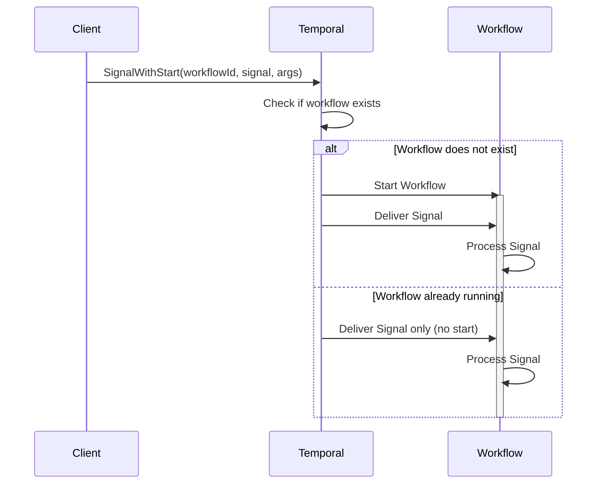

import Tabs from '@theme/Tabs';
import TabItem from '@theme/TabItem';

## Overview

Signal with Start is a pattern that lazily creates Workflows when Signaling them.
If the Workflow is already running, it receives the Signal; if not, the Workflow starts first and then receives the Signal.
This enables entity Workflows that only exist when needed and can receive operations throughout their lifetime.

## Problem

In distributed systems, you often need Workflows that represent long-lived entities (accounts, shopping carts, user sessions), consume events from streams (Kafka, SQS) and trigger certain behaviors of an aggregate or entity, receive multiple operations over time, should only exist when there is work to do, and need to handle the first operation without special client logic.

Without Signal with Start, clients must check if the Workflow exists before Signaling, start the Workflow if it does not exist and then Signal it, handle race conditions when multiple clients try to start the same Workflow, and write complex coordination logic.

## Solution

Temporal's Signal with Start API atomically starts a Workflow (if not running) and delivers a Signal in a single operation.
The client does not need to know whether the Workflow exists — the platform handles it automatically.



The following describes each step in the diagram:

1. The client calls SignalWithStart with a Workflow ID, Signal name, and arguments.
2. Temporal checks whether a Workflow with that ID is already running.
3. If the Workflow does not exist, Temporal starts it and then delivers the Signal.
4. If the Workflow is already running, Temporal delivers the Signal without starting a new instance.

## Implementation

### Basic Signal-With-Start

The following examples show a shopping cart entity Workflow that is created lazily when the first item is added.
Each SDK uses its own API to atomically start the Workflow (if needed) and deliver the Signal.

<Tabs groupId="language" queryString>
<TabItem value="python" label="Python">

```python
# client.py
from temporalio.client import Client
from workflows import ShoppingCartWorkflow, AddItemSignal

async def add_item(client: Client, cart_id: str, item_id: str, product_id: str, quantity: int) -> None:
    # Atomically start workflow (if needed) and deliver signal
    await client.start_workflow(
        ShoppingCartWorkflow.run,
        id=f"cart-{cart_id}",
        task_queue="carts",
        start_signal="add_item",
        start_signal_args=[AddItemSignal(item_id=item_id, product_id=product_id, quantity=quantity)],
    )

# workflows.py
from dataclasses import dataclass
from temporalio import workflow

@dataclass
class AddItemSignal:
    item_id: str
    product_id: str
    quantity: int

@dataclass
class CartItem:
    product_id: str
    quantity: int

@workflow.defn
class ShoppingCartWorkflow:
    def __init__(self) -> None:
        self.processed_items: set[str] = set()
        self.items: list[CartItem] = []

    @workflow.run
    async def run(self) -> None:
        await workflow.wait_condition(lambda: False)  # Run forever (entity workflow)

    @workflow.signal
    def add_item(self, sig: AddItemSignal) -> None:
        if sig.item_id in self.processed_items:
            return  # Idempotency: ignore duplicate signals
        self.processed_items.add(sig.item_id)
        self.items.append(CartItem(product_id=sig.product_id, quantity=sig.quantity))
```

</TabItem>
<TabItem value="go" label="Go">

```go
// client.go
func AddItem(ctx context.Context, cartID, itemID, productID string, quantity int) error {
	opts := client.StartWorkflowOptions{
		ID:        "cart-" + cartID,
		TaskQueue: "carts",
	}

	// Atomically start workflow (if needed) and deliver signal
	sig := AddItemSignal{ItemID: itemID, ProductID: productID, Quantity: quantity}
	_, err := c.SignalWithStartWorkflow(ctx, "cart-"+cartID, "addItem", sig, opts, ShoppingCartWorkflow)
	return err
}

// workflow.go
func ShoppingCartWorkflow(ctx workflow.Context) error {
	processedItems := make(map[string]bool)
	var items []CartItem

	addItemCh := workflow.GetSignalChannel(ctx, "addItem")
	workflow.Go(ctx, func(ctx workflow.Context) {
		for {
			var sig AddItemSignal
			addItemCh.Receive(ctx, &sig)
			if processedItems[sig.ItemID] {
				continue // Idempotency: ignore duplicate signals
			}
			processedItems[sig.ItemID] = true
			items = append(items, CartItem{ProductID: sig.ProductID, Quantity: sig.Quantity})
		}
	})

	workflow.Await(ctx, func() bool { return false }) // Run forever (entity workflow)
	return nil
}
```

</TabItem>
<TabItem value="java" label="Java">

```java
// ShoppingCartManager.java
public class ShoppingCartManager {
  public void addItem(String cartId, String itemId, String productId, int quantity) {
    WorkflowOptions options = WorkflowOptions.newBuilder()
        .setWorkflowId("cart-" + cartId)
        .setTaskQueue("carts")
        .build();

    ShoppingCartWorkflow workflow =
        workflowClient.newWorkflowStub(ShoppingCartWorkflow.class, options);

    // Atomically start workflow (if needed) and deliver signal
    BatchRequest request = workflowClient.newSignalWithStartRequest();
    request.add(workflow::run);
    request.add(workflow::addItem, itemId, productId, quantity);
    workflowClient.signalWithStart(request);
  }
}

// ShoppingCartWorkflow.java
@WorkflowInterface
public interface ShoppingCartWorkflow {
  @WorkflowMethod
  void run();

  @SignalMethod
  void addItem(String itemId, String productId, int quantity);
}

public class ShoppingCartWorkflowImpl implements ShoppingCartWorkflow {
  private Set<String> processedItems = new HashSet<>();
  private List<CartItem> items = new ArrayList<>();

  @Override
  public void run() {
    Workflow.await(() -> false); // Run forever (entity workflow)
  }

  @Override
  public void addItem(String itemId, String productId, int quantity) {
    if (!processedItems.add(itemId)) {
      return; // Idempotency: ignore duplicate signals
    }
    items.add(new CartItem(productId, quantity));
  }
}
```

</TabItem>
<TabItem value="typescript" label="TypeScript">

```typescript
// client.ts
export async function addItem(
  cartId: string,
  itemId: string,
  productId: string,
  quantity: number
) {
  // Atomically start workflow (if needed) and deliver signal
  const handle = await client.workflow.signalWithStart(shoppingCartWorkflow, {
    workflowId: `cart-${cartId}`,
    taskQueue: 'carts',
    signal: 'addItem',
    signalArgs: [itemId, productId, quantity],
  });
}

// workflow.ts
export async function shoppingCartWorkflow(): Promise<void> {
  const processedItems = new Set<string>();
  const items: CartItem[] = [];

  setHandler(addItemSignal, (itemId: string, productId: string, quantity: number) => {
    if (processedItems.has(itemId)) {
      return; // Idempotency: ignore duplicate signals
    }
    processedItems.add(itemId);
    items.push({ productId, quantity });
  });

  await condition(() => false); // Run forever (entity workflow)
}

export const addItemSignal = defineSignal<[string, string, number]>('addItem');
```

</TabItem>
</Tabs>

In all SDKs, the Workflow ID is derived from the business entity (the cart ID), ensuring one Workflow per entity.
The Signal handler checks a set of processed item IDs to prevent duplicate processing.
The Workflow blocks indefinitely, acting as a long-lived entity that receives operations over its lifetime.

## When to use

The Signal with Start pattern is a good fit for entity Workflows (accounts, shopping carts, user sessions, clusters), event-driven architectures (Kafka consumers, message queue processors), Workflows that receive multiple operations over their lifetime, lazy entity creation where you only create when the first operation arrives, and fire-and-forget operations where immediate response is not needed.

It is not a good fit for one-time operations (use REJECT_DUPLICATE policy instead), request-response patterns requiring synchronous confirmation (use Update with Start), or operations that need immediate return values.

## Benefits and trade-offs

Signal with Start provides an atomic operation — start and Signal happen atomically with no race conditions.
Workflows only exist when needed (lazy creation).
The client does not need to check if the Workflow exists.
The operation is safe to retry because duplicate starts are handled by the Workflow ID.
The pattern is a natural fit for long-lived business entities.

The trade-offs to consider are that Signals are fire-and-forget with no immediate confirmation that the Signal was processed.
You still need to track processed operation IDs in the Workflow for Signal idempotency.
Workflows must handle unbounded execution (use Continue-As-New).
Signals do not return values — use Queries or Updates for that.

Both ALLOW_DUPLICATE and ALLOW_DUPLICATE_FAILED_ONLY work well with Signal with Start:

- **ALLOW_DUPLICATE** (default): Allows a new Workflow Execution with the same ID after the previous one has closed (completed, failed, timed out, terminated, or cancelled). Does not affect a currently running Workflow — Signal with Start delivers the Signal to the running execution.
- **ALLOW_DUPLICATE_FAILED_ONLY**: Allows restart only if the previous run failed — prevents accidental restarts of running Workflows.
- **REJECT_DUPLICATE**: Prevents any duplicate starts — useful for one-time operations, not entity Workflows.
- **TERMINATE_IF_RUNNING**: Terminates the running Workflow and starts a new one — use with caution.

## Comparison with alternatives

| Approach | Use case | Response type | Idempotency |
| :--- | :--- | :--- | :--- |
| Signal with Start | Entity Workflows | Fire-and-forget | Signal-level |
| Update with Start | Request-response | Sync return value | Update-level |
| REJECT_DUPLICATE | One-time operations | Async (Workflow ID) | Workflow-level |

## Best practices

- **Derive Workflow ID from entity.** Use stable business identifiers (account ID, user ID).
- **Implement Signal idempotency.** Track processed operation IDs to prevent duplicates.
- **Use WorkflowInit.** Initialize state before Signals are delivered (Java, .NET, and Python's `__init__`).
- **Handle unbounded execution.** Use Continue-As-New for long-running entity Workflows.
- **Choose the right Workflow ID policy.** Use ALLOW_DUPLICATE_FAILED_ONLY for entity Workflows.
- **Include operation IDs.** Every Signal should include a unique operation or reference ID.
- **Return early.** Check for duplicates at the start of Signal handlers.

## Common pitfalls

- **Not implementing Signal idempotency.** Signals can be delivered more than once (for example, client retries). Without tracking processed operation IDs, the Workflow processes duplicates.
- **Unbounded history growth.** Entity Workflows that receive many Signals without calling Continue-As-New will hit the 50K event or 10K Signal limit. Use `isContinueAsNewSuggested()` to trigger Continue-As-New.
- **Losing pending Signals on Continue-As-New.** Drain all pending Signals before calling Continue-As-New, and pass unprocessed ones as input to the new execution.
- **Expecting a return value from Signals.** Signals are fire-and-forget. If you need a synchronous response, use Updates or Update-with-Start instead.
- **Race between SignalWithStart and Continue-As-New.** Temporal prevents this race — if a Signal arrives while the Workflow is completing via Continue-As-New, the Workflow rewinds to process the Signal first.

## Related patterns

- **[Entity Workflow](/design-patterns/entity-workflow)**: Long-running Workflows representing business entities.
- **[Continue-As-New](/design-patterns/continue-as-new)**: Managing unbounded Workflow history.
- **[Request-Response via Updates](/design-patterns/request-response-via-updates)**: When you need synchronous responses instead of fire-and-forget.
- **[Early Return](/design-patterns/early-return)**: Update-with-Start for request-response with lazy initialization.

## Sample code

**Python**
- [Hello Signal](https://github.com/temporalio/samples-python/tree/main/hello/hello_signal.py) — Basic Signal handling in a Workflow.
- [Message Passing](https://github.com/temporalio/samples-python/tree/main/message_passing/introduction) — Introduction to message passing with Signals, Queries, and Updates.

**Java**
- [Hello Signal](https://github.com/temporalio/samples-java/tree/main/core/src/main/java/io/temporal/samples/hello/HelloSignal.java) — Basic Signal handling in a Workflow.
- [Safe Message Passing](https://github.com/temporalio/samples-java/tree/main/core/src/main/java/io/temporal/samples/safemessagepassing) — Concurrent Signal handling with validation.

**TypeScript**
- [Signals and Queries](https://github.com/temporalio/samples-typescript/tree/main/signals-queries) — Signal and Query usage in a Workflow.

**Go**
- [Await Signals](https://github.com/temporalio/samples-go/tree/main/await-signals) — Waiting for Signals with timeout.
