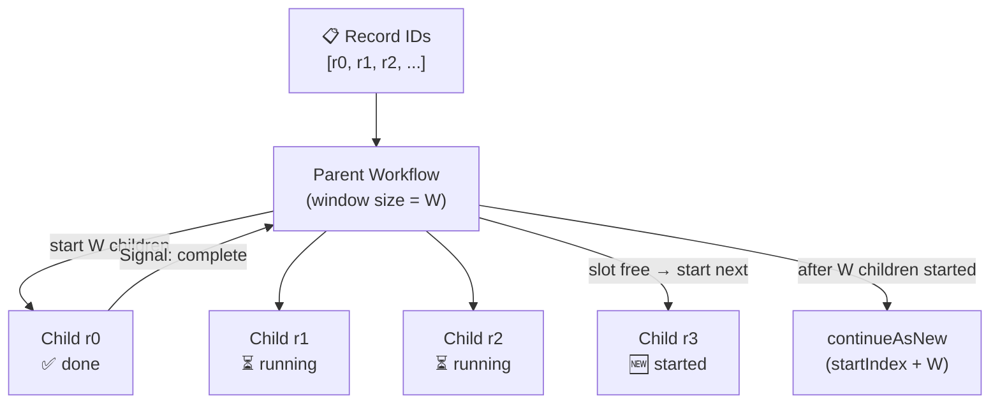

import Tabs from '@theme/Tabs';
import TabItem from '@theme/TabItem';

:::info[TLDR]
Keep exactly `windowSize` child Workflows running at all times — each completion signal triggers the next record to start immediately. Use this when your record set is arbitrarily large, you need **bounded concurrency** to protect downstream systems, and you want higher throughput than a sequential Batch Iterator provides.
:::

## Overview

The Sliding Window pattern maintains a fixed-size pool of concurrently running child Workflows. As each child completes it signals the parent, which immediately starts a replacement — keeping the concurrency level constant and progressing at the rate of the fastest processor. Continue-as-New prevents the parent's history from growing without bound.

## Problem

The [Batch Iterator](/design-patterns/batch-iterator) processes records sequentially — the overall throughput is limited by the slowest record in each page. The [Fan-Out](/design-patterns/fanout-child-workflows) pattern starts all children at once, which can overwhelm downstream systems when the record set is large.

You need a way to process an arbitrarily large record set with bounded concurrency, maximum throughput within that bound, and protection against history bloat.

## Solution

The parent Workflow keeps a live count of in-flight children (`active`) and runs a single loop that starts a child whenever a slot is free. The first `windowSize` slots are free, so those children start immediately; after that, a backpressure condition blocks each start until an in-flight child signals completion and frees a slot. Each child processes one record and, when finished, signals the parent, which decrements `active` and starts the next record's child.

Continue-as-New is called after the parent has started `windowSize` children. Because child Workflows have stable Workflow IDs and Continue-as-New preserves the parent's Workflow ID, children started by a previous run can still signal the current run. The parent carries `active` into the next run so it knows how many carried-over children will still signal it.



The following describes each step in the diagram:

1. The parent Workflow starts with a list of record IDs and a configured `windowSize`.
2. It starts the first `windowSize` children concurrently, one per record. Each child reads the parent's Workflow ID from its own Workflow metadata, so it knows where to signal.
3. As each child completes, it sends a completion signal to the parent.
4. The parent receives the signal, decrements its in-flight counter (`active`), and starts the next child (the next record in the list).
5. After starting `windowSize` children in total, the parent calls `continueAsNew` with the updated start index. The window slides forward without gaps because the parent's Workflow ID is preserved across runs.
6. Children from previous runs that have not yet signalled will find the new run when they send the signal, because the parent Workflow ID remains the same.

## Implementation

The following examples show how each SDK implements the Sliding Window pattern.

<Tabs groupId="language" queryString>
<TabItem value="typescript" label="TypeScript">

```typescript
// workflows.ts
import {
  ApplicationFailure,
  ParentClosePolicy,
  condition,
  continueAsNew,
  defineSignal,
  getExternalWorkflowHandle,
  proxyActivities,
  setHandler,
  startChild,
  workflowInfo,
} from "@temporalio/workflow";
import type * as activities from "./activities";
import { COMPLETION_SIGNAL, TASK_QUEUE, WINDOW_SIZE, type SlidingWindowInput } from "./shared";

const { processRecord } = proxyActivities<typeof activities>({
  startToCloseTimeout: "30 seconds",
});

export const completionSignal = defineSignal<[string]>(COMPLETION_SIGNAL);

// Child Workflow: processes one record and signals the parent on completion.
export async function recordProcessorWorkflow(recordId: string): Promise<void> {
  await processRecord(recordId);
  // Read the parent's Workflow ID from context. It is stable across the parent's
  // Continue-as-New runs, so signaling by Workflow ID (no run ID) always reaches
  // the current run. Ignore NOT_FOUND — the parent's final run may have completed.
  try {
    const parent = getExternalWorkflowHandle(workflowInfo().parent!.workflowId);
    await parent.signal(completionSignal, recordId);
  } catch (err) {
    if (!(err instanceof ApplicationFailure && err.type === "NOT_FOUND")) throw err;
  }
}

// Parent Workflow: maintains a fixed window of concurrent Child Workflows and calls
// Continue-as-New after dispatching windowSize children so history stays bounded.
export async function slidingWindowWorkflow(input: SlidingWindowInput): Promise<number> {
  const { recordIds, windowSize = WINDOW_SIZE, startIndex = 0 } = input;
  const parentId = workflowInfo().workflowId;
  // Total records completed across all runs, carried over via Continue-as-New.
  let totalProcessed = input.totalProcessed ?? 0;
  // Children started in this run; triggers Continue-as-New once it hits windowSize.
  let dispatched = 0;
  // Live in-flight count: +1 per start, -1 per completion signal, carried across runs.
  let active = input.active ?? 0;

  setHandler(completionSignal, () => {
    active--;
    totalProcessed++;
  });

  // Slide the window: keep it full, starting one child per free slot. The first
  // (windowSize - active) slots are already free, so those children start without
  // waiting; after that, each start waits for an in-flight child to free a slot.
  let nextIndex = startIndex;
  while (nextIndex < recordIds.length) {
    // Backpressure: block until the window has a free slot.
    await condition(() => active < windowSize);
    await startChild(recordProcessorWorkflow, {
      args: [recordIds[nextIndex]],
      workflowId: `${parentId}/record-${recordIds[nextIndex]}`,
      taskQueue: TASK_QUEUE,
      parentClosePolicy: ParentClosePolicy.ABANDON,
    });
    nextIndex++;
    dispatched++;
    active++;

    // Once this run has filled the window with fresh children, Continue-as-New so
    // history stays bounded. Carry active so the next run knows how many children
    // will still signal it.
    if (dispatched >= windowSize) {
      await continueAsNew<typeof slidingWindowWorkflow>({ recordIds, windowSize, startIndex: nextIndex, totalProcessed, active });
    }
  }

  // Wait for all remaining in-flight children to complete.
  await condition(() => active === 0);
  return totalProcessed;
}
```

</TabItem>
<TabItem value="python" label="Python">

```python
# workflows.py
from datetime import timedelta
from temporalio import workflow
from temporalio.exceptions import ApplicationError
from temporalio.workflow import ParentClosePolicy, continue_as_new
from activities import process_record
from shared import COMPLETION_SIGNAL, TASK_QUEUE, WINDOW_SIZE, SlidingWindowInput


@workflow.defn
class RecordProcessorWorkflow:
    """Child Workflow: processes one record and signals the parent on completion."""

    @workflow.run
    async def run(self, record_id: str) -> None:
        await workflow.execute_activity(
            process_record,
            record_id,
            start_to_close_timeout=timedelta(seconds=30),
        )
        # Read the parent's Workflow ID from context. It is stable across the parent's
        # continue_as_new runs, so signaling by Workflow ID always reaches the current
        # run. Ignore NOT_FOUND — the parent's final run may have already completed.
        parent = workflow.get_external_workflow_handle(workflow.info().parent.workflow_id)
        try:
            await parent.signal(COMPLETION_SIGNAL, record_id)
        except ApplicationError as e:
            if "not found" not in str(e).lower():
                raise


@workflow.defn
class SlidingWindowWorkflow:
    """Parent Workflow: maintains a fixed window of concurrent Child Workflows."""

    def __init__(self) -> None:
        # Live in-flight count: +1 per start, -1 per completion signal, carried across
        # runs. An instance field (not a run() local) because the signal handler is a
        # separate method and completions can signal before run() starts.
        self._active = 0
        # Total records completed across all runs, carried over via continue_as_new.
        self._total_processed = 0

    @workflow.signal(name=COMPLETION_SIGNAL)
    def record_completed(self, record_id: str) -> None:
        self._active -= 1
        self._total_processed += 1

    @workflow.run
    async def run(self, input: SlidingWindowInput) -> int:
        # Use += so completions that signal before run() starts are preserved.
        self._total_processed += input.total_processed
        self._active += input.active
        record_ids = input.record_ids
        window_size = input.window_size
        parent_id = workflow.info().workflow_id
        next_index = input.start_index
        # Children started in this run; triggers continue_as_new once it hits window_size.
        dispatched = 0

        # Slide the window: keep it full, starting one child per free slot. The first
        # (window_size - active) slots are already free, so those children start without
        # waiting; after that, each start waits for an in-flight child to free a slot.
        while next_index < len(record_ids):
            # Backpressure: block until the window has a free slot.
            await workflow.wait_condition(lambda: self._active < window_size)
            await workflow.start_child_workflow(
                RecordProcessorWorkflow.run,
                record_ids[next_index],
                id=f"{parent_id}/record-{record_ids[next_index]}",
                task_queue=TASK_QUEUE,
                parent_close_policy=ParentClosePolicy.ABANDON,
            )
            next_index += 1
            dispatched += 1
            self._active += 1

            # Once this run has filled the window with fresh children, continue_as_new so
            # history stays bounded. Carry _active so the next run knows how many children
            # will still signal it.
            if dispatched >= window_size:
                continue_as_new(args=[SlidingWindowInput(
                    record_ids=record_ids,
                    window_size=window_size,
                    start_index=next_index,
                    total_processed=self._total_processed,
                    active=self._active,
                )])

        # Wait for all remaining in-flight children to complete.
        await workflow.wait_condition(lambda: self._active == 0)
        return self._total_processed
```

</TabItem>
<TabItem value="go" label="Go">

```go
// workflows.go
package main

import (
	"fmt"
	"strings"
	"time"

	enums "go.temporal.io/api/enums/v1"
	"go.temporal.io/sdk/workflow"
)

const CompletionSignal = "recordCompleted"

// RecordProcessorWorkflow is the child Workflow: it processes one record and
// signals the parent on completion.
func RecordProcessorWorkflow(ctx workflow.Context, recordID string) error {
	ao := workflow.ActivityOptions{StartToCloseTimeout: 30 * time.Second}
	ctx = workflow.WithActivityOptions(ctx, ao)

	if err := workflow.ExecuteActivity(ctx, ProcessRecord, recordID).Get(ctx, nil); err != nil {
		return err
	}

	// Read the parent's Workflow ID from context. It is stable across the parent's
	// ContinueAsNew runs, so signaling by Workflow ID (empty run ID) always reaches
	// the current run. Ignore not-found — the parent's final run may have completed.
	parentID := workflow.GetInfo(ctx).ParentWorkflowExecution.ID
	err := workflow.SignalExternalWorkflow(ctx, parentID, "", CompletionSignal, recordID).Get(ctx, nil)
	if err != nil && strings.Contains(err.Error(), "not found") {
		return nil
	}
	return err
}

// SlidingWindowWorkflow is the parent Workflow: it maintains a fixed window of
// concurrent Child Workflows and calls ContinueAsNew after dispatching windowSize
// children so history stays bounded.
func SlidingWindowWorkflow(ctx workflow.Context, input SlidingWindowInput) (int, error) {
	windowSize := input.WindowSize
	if windowSize <= 0 {
		windowSize = WindowSize
	}
	recordIDs := input.RecordIDs
	parentID := workflow.GetInfo(ctx).WorkflowExecution.ID
	completedCh := workflow.GetSignalChannel(ctx, CompletionSignal)

	nextIndex := input.StartIndex
	// Total records completed across all runs, carried over via ContinueAsNew.
	totalProcessed := input.TotalProcessed
	// Children started in this run; triggers ContinueAsNew once it hits windowSize.
	dispatched := 0
	// Live in-flight count: +1 per start, -1 per completion signal, carried across runs.
	active := input.Active

	startChild := func(recordID string) error {
		cwo := workflow.ChildWorkflowOptions{
			WorkflowID:        fmt.Sprintf("%s/record-%s", parentID, recordID),
			TaskQueue:         TaskQueue,
			ParentClosePolicy: enums.PARENT_CLOSE_POLICY_ABANDON,
		}
		future := workflow.ExecuteChildWorkflow(workflow.WithChildOptions(ctx, cwo), RecordProcessorWorkflow, recordID)
		// Wait for the child to start so the command commits before any ContinueAsNew.
		return future.GetChildWorkflowExecution().Get(ctx, nil)
	}

	// Slide the window: keep it full, starting one child per free slot.
	for nextIndex < len(recordIDs) {
		// Backpressure: if the window is full, block on the completion channel until an
		// in-flight child signals, freeing a slot. Otherwise start without waiting.
		if active >= windowSize {
			completedCh.Receive(ctx, nil)
			totalProcessed++
			active--
		}
		if err := startChild(recordIDs[nextIndex]); err != nil {
			return 0, err
		}
		nextIndex++
		dispatched++
		active++

		// Once this run has filled the window with fresh children, ContinueAsNew so
		// history stays bounded. Carry active so the next run knows how many children
		// will still signal it.
		if dispatched >= windowSize {
			return 0, workflow.NewContinueAsNewError(ctx, SlidingWindowWorkflow, SlidingWindowInput{
				RecordIDs:      recordIDs,
				WindowSize:     windowSize,
				StartIndex:     nextIndex,
				TotalProcessed: totalProcessed,
				Active:         active,
			})
		}
	}

	// Drain all remaining in-flight children.
	for active > 0 {
		completedCh.Receive(ctx, nil)
		totalProcessed++
		active--
	}
	return totalProcessed, nil
}
```

</TabItem>
<TabItem value="java" label="Java">

```java
// SlidingWindowWorkflow.java
import io.temporal.activity.ActivityOptions;
import io.temporal.api.enums.v1.ParentClosePolicy;
import io.temporal.workflow.*;
import java.time.Duration;
import java.util.List;

public interface SlidingWindowWorkflow {

    /** Parent Workflow: maintains a fixed window of concurrent Child Workflows. */
    @WorkflowInterface
    interface Parent {
        @WorkflowMethod
        int run(Shared.SlidingWindowInput input);

        @SignalMethod
        void recordCompleted(String recordId);
    }

    /** Child Workflow: processes one record and signals the parent on completion. */
    @WorkflowInterface
    interface Child {
        @WorkflowMethod
        void run(String recordId);
    }

    final class ParentImpl implements Parent {
        // Live in-flight count: +1 per start, -1 per completion signal, carried across
        // runs. An instance field (not a run() local) because the signal handler is a
        // separate method and completions can signal before run() starts.
        private int active = 0;
        // Total records completed across all runs, carried over via Continue-as-New.
        private int totalProcessed = 0;

        @Override
        public void recordCompleted(String recordId) {
            active--;
            totalProcessed++;
        }

        @Override
        public int run(Shared.SlidingWindowInput input) {
            // Use += so completions that signal before run() starts are preserved.
            this.totalProcessed += input.totalProcessed;
            this.active += input.active;
            int windowSize = input.windowSize > 0 ? input.windowSize : Shared.WINDOW_SIZE;
            List<String> recordIds = input.recordIds;
            String parentId = Workflow.getInfo().getWorkflowId();
            int nextIndex = input.startIndex;
            // Children started in this run; triggers Continue-as-New once it hits windowSize.
            int dispatched = 0;

            // Slide the window: keep it full, starting one child per free slot. The first
            // (windowSize - active) slots are already free, so those children start without
            // waiting; after that, each start waits for an in-flight child to free a slot.
            while (nextIndex < recordIds.size()) {
                // Backpressure: block until the window has a free slot.
                Workflow.await(() -> active < windowSize);

                String recordId = recordIds.get(nextIndex);
                ChildWorkflowOptions opts = ChildWorkflowOptions.newBuilder()
                        .setWorkflowId(parentId + "/record-" + recordId)
                        .setTaskQueue(Shared.TASK_QUEUE)
                        .setParentClosePolicy(ParentClosePolicy.PARENT_CLOSE_POLICY_ABANDON)
                        .build();
                Child child = Workflow.newChildWorkflowStub(Child.class, opts);
                Async.procedure(child::run, recordId);
                // Wait until the child has started before counting it (and before any
                // Continue-as-New, which would otherwise race child startup).
                Workflow.getWorkflowExecution(child).get();
                nextIndex++;
                dispatched++;
                active++;

                // Once this run has filled the window with fresh children, Continue-as-New
                // so history stays bounded. Carry active so the next run knows how many
                // children will still signal it.
                if (dispatched >= windowSize) {
                    Workflow.newContinueAsNewStub(Parent.class)
                            .run(new Shared.SlidingWindowInput(
                                    recordIds, windowSize, nextIndex, this.totalProcessed, active));
                    return 0; // unreachable; Continue-as-New throws
                }
            }

            // Wait for all remaining in-flight children to complete.
            Workflow.await(() -> active == 0);
            return this.totalProcessed;
        }
    }

    final class ChildImpl implements Child {
        private final Activities activities = Workflow.newActivityStub(
                Activities.class,
                ActivityOptions.newBuilder()
                        .setStartToCloseTimeout(Duration.ofSeconds(30))
                        .build());

        @Override
        public void run(String recordId) {
            activities.processRecord(recordId);

            // Read the parent's Workflow ID from context. It is stable across the parent's
            // Continue-as-New runs, so signaling by Workflow ID always reaches the current
            // run. Ignore not-found — the parent's final run may have already completed.
            String parentWorkflowId = Workflow.getInfo().getParentWorkflowId().orElseThrow();
            ExternalWorkflowStub parent = Workflow.newUntypedExternalWorkflowStub(parentWorkflowId);
            try {
                parent.signal(Shared.COMPLETION_SIGNAL, recordId);
            } catch (Exception e) {
                String msg = e.getMessage() != null ? e.getMessage() : "";
                if (!msg.toLowerCase().contains("not found")) {
                    throw e;
                }
            }
        }
    }
}
```

</TabItem>
</Tabs>

## Best practices

- **Preserve the parent Workflow ID across Continue-as-New.** The parent's Workflow ID is stable across `continueAsNew` runs — do not generate a new one. Children read the parent's Workflow ID from their own Workflow metadata (`workflowInfo().parent` in TypeScript, `workflow.info().parent` in Python, `workflow.GetInfo(ctx).ParentWorkflowExecution` in Go, `Workflow.getInfo().getParentWorkflowId()` in Java) rather than receiving it as an argument, then signal by Workflow ID (with no run ID) so they always reach the current run.
- **Use `PARENT_CLOSE_POLICY_ABANDON` on child Workflows.** This lets children that were started by a previous run complete normally even after the parent has continued as new.
- **Size the window conservatively at first.** Each in-flight child counts toward the 2,000 unfinished-actions limit for the parent. A window of 50–200 is a reasonable starting point depending on child duration and downstream capacity.
- **Pass only IDs (not full records) to child Workflows.** Workflow inputs are stored in event history. Keep them small.
- **Carry minimal state into `continueAsNew`.** Pass `windowSize`, `startIndex`, the live in-flight count (`active`), a running `totalProcessed`, and the record ID list (or a reference to it). Do not accumulate results in the parent — collect them out-of-band if needed.

## Common pitfalls

- **Losing signals across Continue-as-New.** If a child signals before the parent's new run has registered the signal handler, the signal can be buffered and delivered correctly — Temporal buffers signals for existing Workflow IDs. However, ensure the signal handler is registered before any await, not conditionally.
- **Race between CAN and remaining signal draining.** After `continueAsNew`, the new run must handle signals from children started by the previous run. Pass `startIndex` (the next *unstarted* record) and `active` (the live in-flight count at the moment of CAN) to the new run so it knows how many carried-over children to expect signals from, without re-starting them. The new run folds `active` in with `+=`, so a completion that arrives before `run()` executes is still counted correctly.
- **Thundering herd on startup.** Starting hundreds of children simultaneously causes a burst of Activity polls. Ramp up the window gradually or use the [Batch Iterator](/design-patterns/batch-iterator) if rate limiting is more important than throughput.

## Related resources

- [Continue-as-New pattern](/design-patterns/continue-as-new) — history management fundamentals
- [Batch Iterator](/design-patterns/batch-iterator) — sequential alternative when ordered, one-at-a-time processing is acceptable
- [MapReduce Tree](/design-patterns/mapreduce-tree) — fully parallel alternative when rate limiting is not needed
- [Temporal limits reference](/cloud/limits)
- [Sliding window sample (Java)](https://github.com/temporalio/samples-java/tree/main/core/src/main/java/io/temporal/samples/batch/slidingwindow)
