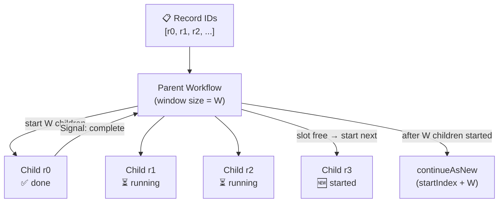

import Tabs from '@theme/Tabs';
import TabItem from '@theme/TabItem';

:::info[TLDR]
Keep exactly `windowSize` child Workflows running at all times — each completion signal triggers the next record to start immediately. Use this when your record set is arbitrarily large, you need **bounded concurrency** to protect downstream systems, and you want higher throughput than a sequential Batch Iterator provides.
:::

## Overview

The Sliding Window pattern maintains a fixed-size pool of concurrently running child Workflows. As each child completes it signals the parent, which immediately starts a replacement — keeping the concurrency level constant and progressing at the rate of the fastest processor. Continue-as-New prevents the parent's history from growing without bound.

## Problem

The [Batch Iterator](/design-patterns/batch-iterator) processes records sequentially — the overall throughput is limited by the slowest record in each page. The [Fan-Out](/design-patterns/fanout-child-workflows) pattern starts all children at once, which can overwhelm downstream systems when the record set is large.

You need a way to process an arbitrarily large record set with bounded concurrency, maximum throughput within that bound, and protection against history bloat.

## Solution

The parent Workflow starts exactly `windowSize` child Workflows simultaneously. Each child processes one record and, when finished, signals the parent with a completion notification. The parent maintains a count of completed children and starts a new child for the next record as soon as a slot becomes free.

Continue-as-New is called after the parent has started `windowSize` children. Because child Workflows have stable Workflow IDs and Continue-as-New preserves the parent's Workflow ID, children started by a previous run can still signal the current run.



The following describes each step in the diagram:

1. The parent Workflow starts with a list of record IDs and a configured `windowSize`.
2. It starts the first `windowSize` children concurrently, one per record, each receiving the parent's Workflow ID so they know where to signal.
3. As each child completes, it sends a completion signal to the parent.
4. The parent receives the signal, increments its completion counter, and starts the next child (the next record in the list).
5. After starting `windowSize` children in total, the parent calls `continueAsNew` with the updated start index. The window slides forward without gaps because the parent's Workflow ID is preserved across runs.
6. Children from previous runs that have not yet signalled will find the new run when they send the signal, because the parent Workflow ID remains the same.

## Implementation

The following examples show how each SDK implements the Sliding Window pattern.

<Tabs groupId="language" queryString>
<TabItem value="typescript" label="TypeScript">

```typescript
// workflows.ts
import {
  ApplicationFailure,
  ParentClosePolicy,
  condition,
  continueAsNew,
  defineSignal,
  getExternalWorkflowHandle,
  proxyActivities,
  setHandler,
  startChild,
  workflowInfo,
} from "@temporalio/workflow";
import type * as activities from "./activities";
import { TASK_QUEUE, WINDOW_SIZE } from "./shared";

const { processRecord } = proxyActivities<typeof activities>({
  startToCloseTimeout: "30 seconds",
});

export const completionSignal = defineSignal<[string]>("recordCompleted");

export async function recordProcessorWorkflow(
  recordId: string,
  parentWorkflowId: string
): Promise<void> {
  await processRecord(recordId);
  // Ignore NOT_FOUND — the parent's final run may have already completed.
  try {
    const parent = getExternalWorkflowHandle(parentWorkflowId);
    await parent.signal(completionSignal, recordId);
  } catch (err) {
    if (!(err instanceof ApplicationFailure && err.type === 'NOT_FOUND')) throw err;
  }
}

export async function slidingWindowWorkflow(input: SlidingWindowInput): Promise<number> {
  const {
    recordIds,
    windowSize = WINDOW_SIZE,
    startIndex = 0,
    inFlight = 0,
  } = input;
  let totalProcessed = input.totalProcessed ?? 0;
  const parentId = workflowInfo().workflowId;
  let pendingSignals = 0;
  let nextIndex = startIndex;
  let dispatched = 0;
  let active = inFlight;

  // Signal handler: each completion frees a slot and increments the total.
  setHandler(completionSignal, (_recordId: string) => {
    pendingSignals++;
    totalProcessed++;
  });

  // Only start (windowSize - inFlight) new children. Carried-over in-flight
  // children from the previous run will signal us when they complete.
  const newFill = Math.min(windowSize - inFlight, recordIds.length - startIndex);
  for (let i = 0; i < newFill; i++) {
    await startChild(recordProcessorWorkflow, {
      args: [recordIds[nextIndex], parentId],
      workflowId: `${parentId}/record-${recordIds[nextIndex]}`,
      taskQueue: TASK_QUEUE,
      parentClosePolicy: ParentClosePolicy.ABANDON,
    });
    nextIndex++;
    dispatched++;
    active++;
  }

  // If the window is full after the initial fill, continue-as-new immediately.
  if (dispatched >= windowSize) {
    await continueAsNew<typeof slidingWindowWorkflow>({ recordIds, windowSize, startIndex: nextIndex, totalProcessed, inFlight: windowSize });
    return;
  }

  // Slide the window: as each slot frees, start the next child.
  while (nextIndex < recordIds.length) {
    await condition(() => pendingSignals > 0);
    pendingSignals--;
    active--;
    await startChild(recordProcessorWorkflow, {
      args: [recordIds[nextIndex], parentId],
      workflowId: `${parentId}/record-${recordIds[nextIndex]}`,
      taskQueue: TASK_QUEUE,
      parentClosePolicy: ParentClosePolicy.ABANDON,
    });
    nextIndex++;
    dispatched++;
    active++;

    // Continue-as-New after starting windowSize children to keep history short.
    // Pass nextIndex (next unstarted record) and inFlight=windowSize (window is full).
    if (dispatched >= windowSize) {
      await continueAsNew<typeof slidingWindowWorkflow>({
        recordIds,
        windowSize,
        startIndex: nextIndex,
        totalProcessed,
        inFlight: windowSize,
      });
      return;
    }
  }

  // Wait for all remaining in-flight children to complete.
  await condition(() => pendingSignals >= active);
  return totalProcessed;
}
```

</TabItem>
<TabItem value="python" label="Python">

```python
# workflows.py
import asyncio
from datetime import timedelta
from temporalio import workflow
from temporalio.exceptions import ApplicationError
from temporalio.workflow import ParentClosePolicy, continue_as_new
from activities import process_record
from shared import TASK_QUEUE, WINDOW_SIZE

COMPLETION_SIGNAL = "recordCompleted"


@workflow.defn
class RecordProcessorWorkflow:
    @workflow.run
    async def run(self, record_id: str, parent_workflow_id: str) -> None:
        await workflow.execute_activity(
            process_record,
            record_id,
            start_to_close_timeout=timedelta(seconds=30),
        )
        # Ignore NOT_FOUND — the parent's final run may have already completed.
        try:
            handle = workflow.get_external_workflow_handle(parent_workflow_id)
            await handle.signal(COMPLETION_SIGNAL, record_id)
        except ApplicationError as e:
            if "not found" not in str(e).lower():
                raise


@workflow.defn
class SlidingWindowWorkflow:
    def __init__(self) -> None:
        self._pending_signals = 0
        self._total_processed = 0

    @workflow.signal(name=COMPLETION_SIGNAL)
    def record_completed(self, record_id: str) -> None:
        self._pending_signals += 1
        self._total_processed += 1

    @workflow.run
    async def run(self, input: SlidingWindowInput) -> int:
        self._total_processed += input.total_processed
        record_ids = input.record_ids
        window_size = input.window_size
        start_index = input.start_index
        in_flight = input.in_flight
        parent_id = workflow.info().workflow_id
        next_index = start_index
        dispatched = 0
        active = in_flight

        # Only start (window_size - in_flight) new children. Carried-over in-flight
        # children from the previous run will signal us when they complete.
        new_fill = min(window_size - in_flight, len(record_ids) - start_index)
        for _ in range(new_fill):
            await workflow.start_child_workflow(
                RecordProcessorWorkflow.run,
                args=[record_ids[next_index], parent_id],
                id=f"{parent_id}/record-{record_ids[next_index]}",
                task_queue=TASK_QUEUE,
                parent_close_policy=ParentClosePolicy.ABANDON,
            )
            next_index += 1
            dispatched += 1
            active += 1

        # Slide the window.
        while next_index < len(record_ids):
            await workflow.wait_condition(lambda: self._pending_signals > 0)
            self._pending_signals -= 1
            active -= 1
            await workflow.start_child_workflow(
                RecordProcessorWorkflow.run,
                args=[record_ids[next_index], parent_id],
                id=f"{parent_id}/record-{record_ids[next_index]}",
                task_queue=TASK_QUEUE,
                parent_close_policy=ParentClosePolicy.ABANDON,
            )
            next_index += 1
            dispatched += 1
            active += 1

            # Pass next_index (next unstarted record) and in_flight=window_size (window is full).
            if dispatched >= window_size:
                continue_as_new(args=[SlidingWindowInput(
                    record_ids=record_ids,
                    window_size=window_size,
                    start_index=next_index,
                    total_processed=self._total_processed,
                    in_flight=window_size,
                )])

        # Wait for all remaining in-flight children to complete.
        await workflow.wait_condition(lambda: self._pending_signals >= active)
        return self._total_processed
```

</TabItem>
<TabItem value="go" label="Go">

```go
// workflows.go
package main

import (
	"strings"
	"time"

	enums "go.temporal.io/api/enums/v1"
	"go.temporal.io/sdk/workflow"
)

const CompletionSignal = "recordCompleted"

func RecordProcessorWorkflow(ctx workflow.Context, recordID string, parentWorkflowID string) error {
	ao := workflow.ActivityOptions{StartToCloseTimeout: 30 * time.Second}
	ctx = workflow.WithActivityOptions(ctx, ao)

	if err := workflow.ExecuteActivity(ctx, ProcessRecord, recordID).Get(ctx, nil); err != nil {
		return err
	}

	// Ignore not-found — the parent's final run may have already completed.
	err := workflow.SignalExternalWorkflow(ctx, parentWorkflowID, "", CompletionSignal, recordID).Get(ctx, nil)
	if err != nil && strings.Contains(err.Error(), "not found") {
		return nil
	}
	return err
}

func SlidingWindowWorkflow(ctx workflow.Context, input SlidingWindowInput) (int, error) {
	windowSize := input.WindowSize
	if windowSize <= 0 {
		windowSize = WindowSize
	}
	recordIDs := input.RecordIDs
	parentID := workflow.GetInfo(ctx).WorkflowExecution.ID

	completedCh := workflow.GetSignalChannel(ctx, CompletionSignal)
	nextIndex := input.StartIndex
	totalProcessed := input.TotalProcessed
	dispatched := 0
	active := input.InFlight

	startChild := func(recordID string) error {
		cwo := workflow.ChildWorkflowOptions{
			WorkflowID:        parentID + "/record-" + recordID,
			TaskQueue:         TaskQueue,
			ParentClosePolicy: enums.PARENT_CLOSE_POLICY_ABANDON,
		}
		future := workflow.ExecuteChildWorkflow(workflow.WithChildOptions(ctx, cwo), RecordProcessorWorkflow, recordID, parentID)
		return future.GetChildWorkflowExecution().Get(ctx, nil)
	}

	// Only start (windowSize - inFlight) new children. Carried-over in-flight
	// children from the previous run will signal us when they complete.
	newFill := len(recordIDs) - input.StartIndex
	if newFill > windowSize-input.InFlight {
		newFill = windowSize - input.InFlight
	}
	for i := 0; i < newFill; i++ {
		if err := startChild(recordIDs[nextIndex]); err != nil {
			return totalProcessed, err
		}
		nextIndex++
		dispatched++
		active++
	}

	// If the window is full after the initial fill, continue-as-new immediately.
	if dispatched >= windowSize {
		return 0, workflow.NewContinueAsNewError(ctx, SlidingWindowWorkflow, SlidingWindowInput{
			RecordIDs:      recordIDs,
			WindowSize:     windowSize,
			StartIndex:     nextIndex,
			TotalProcessed: totalProcessed,
			InFlight:       windowSize,
		})
	}

	// Slide the window.
	for nextIndex < len(recordIDs) {
		workflow.GetSignalChannel(ctx, CompletionSignal).Receive(ctx, nil)
		totalProcessed++
		active--
		if err := startChild(recordIDs[nextIndex]); err != nil {
			return totalProcessed, err
		}
		nextIndex++
		dispatched++
		active++

		// Pass nextIndex (next unstarted record) and inFlight=windowSize (window is full).
		if dispatched >= windowSize {
			return 0, workflow.NewContinueAsNewError(ctx, SlidingWindowWorkflow, SlidingWindowInput{
				RecordIDs:      recordIDs,
				WindowSize:     windowSize,
				StartIndex:     nextIndex,
				TotalProcessed: totalProcessed,
				InFlight:       windowSize,
			})
		}
	}

	// Drain all remaining in-flight children.
	for active > 0 {
		completedCh.Receive(ctx, nil)
		totalProcessed++
		active--
	}
	return totalProcessed, nil
}
```

</TabItem>
<TabItem value="java" label="Java">

```java
// SlidingWindowWorkflow.java
import io.temporal.workflow.*;
import java.util.List;

@WorkflowInterface
public interface SlidingWindowWorkflow {
    @WorkflowMethod
    int run(Shared.SlidingWindowInput input);

    @SignalMethod
    void recordCompleted(String recordId);
}

// SlidingWindowWorkflowImpl.java
public class SlidingWindowWorkflowImpl implements SlidingWindowWorkflow {
    private int pendingSignals = 0;
    private int totalProcessed = 0;

    @Override
    public void recordCompleted(String recordId) {
        pendingSignals++;
        totalProcessed++;
    }

    @Override
    public int run(Shared.SlidingWindowInput input) {
        this.totalProcessed = input.totalProcessed;
        int windowSize = input.windowSize > 0 ? input.windowSize : Shared.WINDOW_SIZE;
        List<String> recordIds = input.recordIds;
        String parentId = Workflow.getInfo().getWorkflowId();
        int nextIndex = input.startIndex;
        int dispatched = 0;
        int active = input.inFlight;

        // Only start (windowSize - inFlight) new children. Carried-over in-flight
        // children from the previous run will signal us when they complete.
        int newFill = Math.min(windowSize - input.inFlight, recordIds.size() - input.startIndex);
        for (int i = 0; i < newFill; i++) {
            startChild(recordIds.get(nextIndex), parentId);
            nextIndex++;
            dispatched++;
            active++;
        }

        // Slide the window.
        while (nextIndex < recordIds.size()) {
            Workflow.await(() -> pendingSignals > 0);
            pendingSignals--;
            active--;
            startChild(recordIds.get(nextIndex), parentId);
            nextIndex++;
            dispatched++;
            active++;

            // Pass nextIndex (next unstarted record) and inFlight=windowSize (window is full).
            if (dispatched >= windowSize) {
                Workflow.newContinueAsNewStub(SlidingWindowWorkflow.class)
                    .run(new Shared.SlidingWindowInput(recordIds, windowSize, nextIndex, this.totalProcessed, windowSize));
            }
        }

        // Drain all remaining in-flight children.
        final int remainingActive = active;
        Workflow.await(() -> pendingSignals >= remainingActive);
        return this.totalProcessed;
    }

    private void startChild(String recordId, String parentId) {
        ChildWorkflowOptions opts = ChildWorkflowOptions.newBuilder()
            .setWorkflowId(parentId + "/record-" + recordId)
            .setTaskQueue(Shared.TASK_QUEUE)
            .setParentClosePolicy(ParentClosePolicy.PARENT_CLOSE_POLICY_ABANDON)
            .build();
        RecordProcessorWorkflow child = Workflow.newChildWorkflowStub(RecordProcessorWorkflow.class, opts);
        Async.procedure(child::run, recordId, parentId);
    }
}
```

</TabItem>
</Tabs>

## Best practices

- **Preserve the parent Workflow ID across Continue-as-New.** The parent's Workflow ID is stable across `continueAsNew` runs — do not generate a new one. Children use `signalExternalWorkflow` with that ID, so they always reach the current run.
- **Use `PARENT_CLOSE_POLICY_ABANDON` on child Workflows.** This lets children that were started by a previous run complete normally even after the parent has continued as new.
- **Size the window conservatively at first.** Each in-flight child counts toward the 2,000 unfinished-actions limit for the parent. A window of 50–200 is a reasonable starting point depending on child duration and downstream capacity.
- **Pass only IDs (not full records) to child Workflows.** Workflow inputs are stored in event history. Keep them small.
- **Carry minimal state into `continueAsNew`.** Only pass `windowSize`, `startIndex`, and the record ID list (or a reference to it). Do not accumulate results in the parent — collect them out-of-band if needed.

## Common pitfalls

- **Losing signals across Continue-as-New.** If a child signals before the parent's new run has registered the signal handler, the signal can be buffered and delivered correctly — Temporal buffers signals for existing Workflow IDs. However, ensure the signal handler is registered before any await, not conditionally.
- **Race between CAN and remaining signal draining.** After `continueAsNew`, the new run must handle signals from children started by the previous run. Pass `nextIndex` (the next *unstarted* record) and `inFlight = windowSize` to the new run so it knows how many carried-over children to expect signals from, without re-starting them.
- **Thundering herd on startup.** Starting hundreds of children simultaneously causes a burst of Activity polls. Ramp up the window gradually or use the [Batch Iterator](/design-patterns/batch-iterator) if rate limiting is more important than throughput.

## Related resources

- [Continue-as-New pattern](/design-patterns/continue-as-new) — history management fundamentals
- [Batch Iterator](/design-patterns/batch-iterator) — sequential alternative when ordered, one-at-a-time processing is acceptable
- [MapReduce Tree](/design-patterns/mapreduce-tree) — fully parallel alternative when rate limiting is not needed
- [Temporal limits reference](https://docs.temporal.io/cloud/limits)
- [Sliding window sample (Java)](https://github.com/temporalio/samples-java/tree/main/core/src/main/java/io/temporal/samples/batch/slidingwindow)
