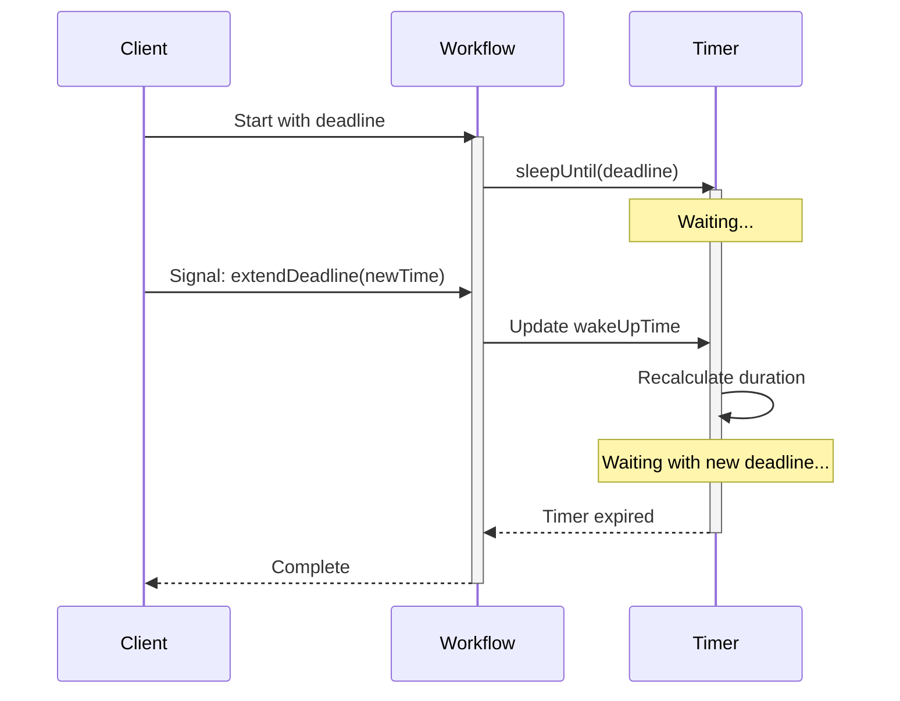

import Tabs from '@theme/Tabs';
import TabItem from '@theme/TabItem';

## Overview

The Updatable / Debounced Timer pattern implements a sleep operation that can be interrupted and dynamically adjusted via Signals.
It enables Workflows to wait for deadlines that can be extended or shortened based on external events, making it suitable for approval processes, SLA management, and time-sensitive business operations.

## Problem

In business processes, you often need Workflows that wait for a deadline (approval timeout, SLA expiration, grace period), allow the deadline to be extended or shortened dynamically, react immediately when the deadline changes, and continue waiting with the new deadline without restarting.

Without an updatable timer, you must use fixed timeouts that cannot be adjusted, cancel and restart Workflows to change deadlines, poll frequently to check for deadline changes, or implement complex state machines to handle timing updates.

## Solution

The Updatable / Debounced Timer uses a blocking wait with both a time limit and an update condition.
When a Signal updates the wake-up time, the condition becomes true, the Workflow recalculates the sleep duration, and blocks again with the new deadline.

Each SDK provides a different mechanism for this:
- **Java**: `Workflow.await(Duration, condition)` returns `false` when the duration expires, or `true` when the condition is met.
- **TypeScript**: `wf.condition(fn, timeout)` returns `false` when the timeout expires, or `true` when the function returns `true`.
- **Python**: `workflow.wait_condition(fn, timeout=duration)` returns normally when the condition is met, or raises `asyncio.TimeoutError` on timeout.
- **Go**: `workflow.NewTimer()` combined with `workflow.NewSelector()` to race a timer against a Signal channel.



The following describes each step in the diagram:

1. The client starts the Workflow with an initial deadline.
2. The Workflow calls `sleepUntil(deadline)`, which blocks until the deadline.
3. The client sends a Signal to extend the deadline.
4. The timer recalculates the remaining duration based on the new deadline and continues waiting.
5. When the timer expires, the Workflow completes.

The core of the pattern is a reusable timer helper that loops on a blocking wait, recalculating the sleep duration each time the wake-up time is updated:

<Tabs groupId="language" queryString>
<TabItem value="python" label="Python" default>

```python
# updatable_timer.py
import asyncio
from datetime import timedelta
from temporalio import workflow


class UpdatableTimer:
    def __init__(self, wake_up_time: float) -> None:
        self._wake_up_time = wake_up_time
        self._wake_up_time_updated = False

    async def sleep_until(self, wake_up_time: float) -> None:
        self._wake_up_time = wake_up_time
        while True:
            self._wake_up_time_updated = False
            sleep_secs = self._wake_up_time - workflow.time()
            try:
                await workflow.wait_condition(
                    lambda: self._wake_up_time_updated,
                    timeout=timedelta(seconds=max(sleep_secs, 0)),
                )
                # Condition met: wake-up time was updated, loop to recalculate
            except asyncio.TimeoutError:
                break  # Timer expired

    def update_wake_up_time(self, wake_up_time: float) -> None:
        self._wake_up_time = wake_up_time
        self._wake_up_time_updated = True  # Unblocks wait_condition

    @property
    def wake_up_time(self) -> float:
        return self._wake_up_time
```

</TabItem>
<TabItem value="go" label="Go">

```go
// updatable_timer.go
func sleepUntil(ctx workflow.Context, wakeUpTime time.Time, wakeUpChannel workflow.ReceiveChannel) error {
    for {
        timerCtx, cancelTimer := workflow.WithCancel(ctx)
        duration := wakeUpTime.Sub(workflow.Now(ctx))
        if duration <= 0 {
            cancelTimer()
            break
        }
        timer := workflow.NewTimer(timerCtx, duration)

        selector := workflow.NewSelector(ctx)
        timerFired := false

        selector.AddFuture(timer, func(f workflow.Future) {
            timerFired = true
        })

        selector.AddReceive(wakeUpChannel, func(c workflow.ReceiveChannel, more bool) {
            c.Receive(ctx, &wakeUpTime)
            // Cancel the current timer so it can be recreated with the new deadline
            cancelTimer()
        })

        selector.Select(ctx)

        if timerFired {
            break // Timer expired
        }
        // Signal received with new wakeUpTime, loop to recalculate
    }
    return nil
}
```

</TabItem>
<TabItem value="java" label="Java">

```java
// UpdatableTimer.java
public class UpdatableTimer {
  private long wakeUpTime;
  private boolean wakeUpTimeUpdated;

  public void sleepUntil(long wakeUpTime) {
    this.wakeUpTime = wakeUpTime;
    while (true) {
      wakeUpTimeUpdated = false;
      Duration sleepInterval = Duration.ofMillis(this.wakeUpTime - Workflow.currentTimeMillis());
      if (!Workflow.await(sleepInterval, () -> wakeUpTimeUpdated)) {
        break; // Timer expired
      }
      // Timer was updated, loop to recalculate
    }
  }

  public void updateWakeUpTime(long wakeUpTime) {
    this.wakeUpTime = wakeUpTime;
    this.wakeUpTimeUpdated = true; // Unblocks await
  }
}
```

</TabItem>
<TabItem value="typescript" label="TypeScript">

```typescript
// updatable-timer.ts
import * as wf from '@temporalio/workflow';

export class UpdatableTimer implements PromiseLike<void> {
  deadlineUpdated = false;
  #deadline: number;

  constructor(deadline: number) {
    this.#deadline = deadline;
  }

  private async run(): Promise<void> {
    while (true) {
      this.deadlineUpdated = false;
      if (
        !(await wf.condition(
          () => this.deadlineUpdated,
          this.#deadline - Date.now(),
        ))
      ) {
        break; // Timer expired
      }
      // Timer was updated, loop to recalculate
    }
  }

  then<TResult1 = void, TResult2 = never>(
    onfulfilled?: (value: void) => TResult1 | PromiseLike<TResult1>,
    onrejected?: (reason: any) => TResult2 | PromiseLike<TResult2>,
  ): PromiseLike<TResult1 | TResult2> {
    return this.run().then(onfulfilled, onrejected);
  }

  set deadline(value: number) {
    this.#deadline = value;
    this.deadlineUpdated = true;
  }

  get deadline(): number {
    return this.#deadline;
  }
}
```

</TabItem>
</Tabs>

In Java and TypeScript, the `sleepUntil` method calculates the sleep interval and calls a blocking wait with both a duration and a condition.
If the duration expires first, the wait returns `false` (Java/TypeScript) or raises `asyncio.TimeoutError` (Python), and the timer completes.
If the update flag is set via a Signal, the condition becomes true, the wait unblocks, and the loop recalculates the interval with the new deadline.
In Go, a `Selector` races a `Timer` against a Signal channel; when the Signal arrives, the current timer is cancelled and a new one is created with the updated deadline.

## Implementation

### Basic approval Workflow

The following implementation combines the updatable timer with an approval flag.
The Workflow waits for either an approval Signal or the deadline to expire:

<Tabs groupId="language" queryString>
<TabItem value="python" label="Python" default>

```python
# workflows.py
import asyncio
from datetime import timedelta
from temporalio import workflow


@workflow.defn
class ApprovalWorkflow:
    def __init__(self) -> None:
        self._approved = False
        self._status = "PENDING"

    @workflow.run
    async def run(self, approval_deadline: float) -> None:
        timeout_secs = approval_deadline - workflow.time()
        try:
            await workflow.wait_condition(
                lambda: self._approved,
                timeout=timedelta(seconds=max(timeout_secs, 0)),
            )
            self._status = "APPROVED"
        except asyncio.TimeoutError:
            self._status = "REJECTED"

    @workflow.signal
    def approve(self) -> None:
        self._approved = True

    @workflow.query
    def get_status(self) -> str:
        return self._status
```

</TabItem>
<TabItem value="go" label="Go">

```go
// workflow.go
func ApprovalWorkflow(ctx workflow.Context, approvalDeadline time.Time) (string, error) {
    logger := workflow.GetLogger(ctx)
    status := "PENDING"
    approved := false

    // Listen for the approve signal in a goroutine
    workflow.Go(ctx, func(ctx workflow.Context) {
        ch := workflow.GetSignalChannel(ctx, "approve")
        ch.Receive(ctx, nil)
        approved = true
    })

    // Wait for approval or timeout
    duration := approvalDeadline.Sub(workflow.Now(ctx))
    ok, _ := workflow.AwaitWithTimeout(ctx, duration, func() bool {
        return approved
    })

    if ok {
        status = "APPROVED"
    } else {
        status = "REJECTED"
    }

    logger.Info("Approval workflow completed", "status", status)
    return status, nil
}
```

</TabItem>
<TabItem value="java" label="Java">

```java
// ApprovalWorkflowImpl.java
@WorkflowInterface
public interface ApprovalWorkflow {
  @WorkflowMethod
  void execute(long approvalDeadline);

  @SignalMethod
  void extendDeadline(long newDeadline);

  @SignalMethod
  void approve();

  @QueryMethod
  String getStatus();
}

public class ApprovalWorkflowImpl implements ApprovalWorkflow {
  private UpdatableTimer timer = new UpdatableTimer();
  private boolean approved = false;
  private String status = "PENDING";

  @Override
  public void execute(long approvalDeadline) {
    Workflow.await(
        Duration.ofMillis(approvalDeadline - Workflow.currentTimeMillis()),
        () -> approved);

    if (approved) {
      status = "APPROVED";
    } else {
      status = "REJECTED";
    }
  }

  @Override
  public void extendDeadline(long newDeadline) {
    timer.updateWakeUpTime(newDeadline);
  }

  @Override
  public void approve() {
    approved = true;
  }

  @Override
  public String getStatus() {
    return status;
  }
}
```

</TabItem>
<TabItem value="typescript" label="TypeScript">

```typescript
// workflows.ts
import * as wf from '@temporalio/workflow';

export const extendDeadlineSignal = wf.defineSignal<[number]>('extendDeadline');
export const approveSignal = wf.defineSignal('approve');
export const getStatusQuery = wf.defineQuery<string>('getStatus');

export async function approvalWorkflow(approvalDeadline: number): Promise<void> {
  let approved = false;
  let status = 'PENDING';

  wf.setHandler(approveSignal, () => {
    approved = true;
  });

  wf.setHandler(getStatusQuery, () => status);

  // Wait for approval or deadline expiration
  const approvedBeforeDeadline = await wf.condition(
    () => approved,
    approvalDeadline - Date.now(),
  );

  status = approvedBeforeDeadline ? 'APPROVED' : 'REJECTED';
}
```

</TabItem>
</Tabs>

The Workflow waits with both a deadline duration and a condition that checks the `approved` flag.
If the `approve` Signal arrives before the deadline, the condition becomes true and the Workflow sets the status to APPROVED.
If the deadline expires first, the Workflow sets the status to REJECTED.

### Multiple deadline extensions

The following implementation uses the `UpdatableTimer` directly to support multiple deadline extensions.
The Workflow blocks on the timer helper and checks the approval flag after the timer completes:

<Tabs groupId="language" queryString>
<TabItem value="python" label="Python" default>

```python
# workflows.py
from temporalio import workflow
from .updatable_timer import UpdatableTimer


@workflow.defn
class MultiExtensionApprovalWorkflow:
    def __init__(self) -> None:
        self._timer = UpdatableTimer(0)
        self._approved = False
        self._rejected = False

    @workflow.run
    async def run(self, initial_deadline: float) -> None:
        await self._timer.sleep_until(initial_deadline)

        if not self._approved:
            self._rejected = True

    @workflow.signal
    def extend_deadline(self, new_deadline: float) -> None:
        if not self._approved and not self._rejected:
            self._timer.update_wake_up_time(new_deadline)

    @workflow.signal
    def approve(self) -> None:
        self._approved = True
```

</TabItem>
<TabItem value="go" label="Go">

```go
// workflow.go
func MultiExtensionApprovalWorkflow(ctx workflow.Context, initialDeadline time.Time) (string, error) {
    approved := false
    rejected := false
    wakeUpTime := initialDeadline
    wakeUpChannel := workflow.NewChannel(ctx)

    // Listen for approval signal
    workflow.Go(ctx, func(ctx workflow.Context) {
        ch := workflow.GetSignalChannel(ctx, "approve")
        ch.Receive(ctx, nil)
        approved = true
    })

    // Listen for deadline extension signals
    workflow.Go(ctx, func(ctx workflow.Context) {
        ch := workflow.GetSignalChannel(ctx, "extendDeadline")
        for {
            var newDeadline time.Time
            ch.Receive(ctx, &newDeadline)
            if !approved && !rejected {
                wakeUpChannel.Send(ctx, newDeadline)
            }
        }
    })

    // Block on the updatable timer
    _ = sleepUntil(ctx, wakeUpTime, wakeUpChannel)

    if !approved {
        rejected = true
    }

    if rejected {
        return "REJECTED", nil
    }
    return "APPROVED", nil
}
```

</TabItem>
<TabItem value="java" label="Java">

```java
// MultiExtensionApprovalWorkflowImpl.java
public class MultiExtensionApprovalWorkflowImpl implements ApprovalWorkflow {
  private UpdatableTimer timer = new UpdatableTimer();
  private boolean approved = false;
  private boolean rejected = false;

  @Override
  public void execute(long initialDeadline) {
    timer.sleepUntil(initialDeadline);

    if (!approved) {
      rejected = true;
    }
  }

  @Override
  public void extendDeadline(long newDeadline) {
    if (!approved && !rejected) {
      timer.updateWakeUpTime(newDeadline);
    }
  }

  @Override
  public void approve() {
    approved = true;
  }
}
```

</TabItem>
<TabItem value="typescript" label="TypeScript">

```typescript
// workflows.ts
import * as wf from '@temporalio/workflow';
import { UpdatableTimer } from './updatable-timer';

export const extendDeadlineSignal = wf.defineSignal<[number]>('extendDeadline');
export const approveSignal = wf.defineSignal('approve');

export async function multiExtensionApprovalWorkflow(
  initialDeadline: number,
): Promise<void> {
  let approved = false;
  let rejected = false;
  const timer = new UpdatableTimer(initialDeadline);

  wf.setHandler(extendDeadlineSignal, (newDeadline: number) => {
    if (!approved && !rejected) {
      timer.deadline = newDeadline;
    }
  });

  wf.setHandler(approveSignal, () => {
    approved = true;
  });

  await timer; // Blocks until the timer expires

  if (!approved) {
    rejected = true;
  }
}
```

</TabItem>
</Tabs>

The `extendDeadline` Signal handler checks that the Workflow has not already been approved or rejected before updating the timer.
Each update unblocks the timer loop, which recalculates the remaining duration and blocks again.

## When to use

The Updatable Timer pattern is a good fit for approval Workflows with deadline extensions, SLA management with grace periods, time-based escalations that can be postponed, auction bidding with extended closing times, and payment grace periods that can be adjusted.

It is not a good fit for fixed timeouts that never change (use a simple sleep), immediate cancellation (use cancellation scopes), or complex scheduling (use Temporal Schedules).

## Benefits and trade-offs

The pattern allows you to adjust deadlines without restarting Workflows.
Changes take effect instantly.
The timer helper is reusable across multiple Workflows.
All timing is based on Workflow time, ensuring replay consistency.
You can Query the current deadline at any time.

The trade-offs to consider are that the pattern requires an external process to send update Signals.
Each timer instance manages one deadline.
Previous deadlines are not tracked (add tracking if needed).
You must calculate absolute timestamps rather than relative durations.

## Comparison with alternatives

| Approach | Dynamic updates | Complexity | Use case |
| :--- | :--- | :--- | :--- |
| Updatable / Debounced Timer | Yes | Medium | Adjustable deadlines |
| Simple sleep | No | Low | Fixed delays |
| Cancellation Scope | Yes (cancel only) | Medium | Abort operations |
| Polling Loop | Yes | High | Frequent checks |

## Best practices

- **Use absolute timestamps.** Store wake-up time as an absolute value (epoch millis in Java/TypeScript, epoch seconds in Python, `time.Time` in Go), not relative durations.
- **Validate updates.** Ensure new deadlines are in the future.
- **Add Queries.** Expose the current deadline via Query methods.
- **Handle edge cases.** Check if the timer already expired before updating.
- **Consider max extensions.** Limit how many times or how far deadlines can be extended.
- **Log changes.** Log each deadline update for observability.
- **Reuse the timer helper.** Extract to a helper class or function for use across Workflows.
- **Combine with conditions.** Use a blocking wait with both time and business conditions.

## Common pitfalls

- **Using time-based conditions without a duration.** A wait without a timeout does not create a timer. The condition is only re-evaluated on state changes (Signals, Activity completions). Always provide a timeout for time-based waits.
- **Expecting the wait to re-evaluate its duration.** The timer duration is set once when the wait is called. Changing the duration variable afterward has no effect. This is why the timer helper loops and recalculates.
- **Not validating new deadlines.** Accepting a deadline in the past causes the timer to expire immediately. Always check that the new deadline is in the future before updating.
- **Accumulating uncancelled timers in Java.** In the Java SDK, `Workflow.await(Duration, condition)` does not automatically cancel its internal timer when the condition is met. Repeated calls in a loop accumulate timers. Wrap in a `CancellationScope` if this is a concern.
- **Not cancelling timers in Go.** In the Go SDK, always cancel the previous timer (via `workflow.WithCancel`) before creating a new one. Uncancelled timers wake up the Workflow unnecessarily, creating extra Worker load.

## Related patterns

- **[Signal with Start](/design-patterns/signal-with-start)**: Receiving external events to modify behavior.
- **[Approval Pattern](/design-patterns/approval)**: Approval Workflows with adjustable deadlines.

## Sample code

- [Java](https://github.com/temporalio/samples-java/tree/main/core/src/main/java/io/temporal/samples/updatabletimer) -- Complete implementation with starter and updater.
- [TypeScript](https://github.com/temporalio/samples-typescript/tree/main/timer-examples) -- Updatable timer with `condition` and `UpdatableTimer` class.
- [Python](https://github.com/temporalio/samples-python/tree/main/updatable_timer) -- Updatable timer with `wait_condition` and helper class.
- [Go](https://github.com/temporalio/samples-go/tree/main/updatabletimer) -- Timer cancellation with Selector, Signal channel, and `WithCancel`.
